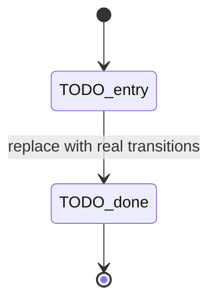

## 🎯 Summary

<!-- Provide a high-level description of what this PR accomplishes and why it is being implemented. Link primary issue/ADR. Call out feature flags / compatibility boundaries. -->

## 🗺️ Architecture / Flow

<!-- REQUIRED — do not delete this section.
     Every PR must include at least one Mermaid **state diagram** (`stateDiagram-v2`)
     that models the control/state transitions this change introduces or touches
     (menus, modes, flags, fail-open/closed paths, regen loops, hook vs interactive, etc.).
     Additional flowcharts (`flowchart TD` / sequence diagrams) are welcome when they
     clarify multi-step pipelines, but they do **not** replace the state diagram.
     Prefer a short legend, closed transition labels, and explicit terminal states.
     Guidance: docs/mermaid_guide.md · docs/mermaidLibrary.md · docs/tui_mermaid_guide.md -->

## 🛠️ Changes Made

<!-- Detail the specific technical changes made in this PR. Group by subsystem/module. Prefer bullets over commit essays. -->

-
-

<!-- DELETE THIS SECTION IF NOT APPLICABLE -->

## 💥 BREAKING CHANGE 💥

<!-- Delete if N/A. Describe the breaking change and the migration path -->

## 📦 Included Changes

<!-- Synced by .github/workflows/pr-included-changes.yml as a collapsible block. -->
<!-- Fallback shape before first sync (matches workflow output): -->

N commits

-

## 🔗 Related Issues

- Closes #
- Resolves #
- <!-- Parent epic / milestone / deferred follow-ups -->

## 📊 SemVer Impact

<!-- Select the appropriate semantic versioning impact of this PR. -->

- [ ] **PATCH** - Bug fixes or internal refactoring with no behavioural changes.
- [ ] **MINOR** - New features added in a backwards-compatible manner.
- [ ] **MAJOR** - Breaking changes that alter existing CLI or API behavior.

**Metadata:**

- **Change Types**: <!-- e.g., feat, fix, docs, refactor, test -->
- **Changelog Groups**: <!-- e.g., Added, Changed, Fixed, Removed -->

## 📡 Telemetry (Opik / Sentry)

<!-- Required when this PR touches generation, hooks, gold, ranking, recover, evals, or observability.
     Delete this entire section if N/A (docs-only, pure CI cosmetic, etc.).
     Field catalogues live on the owning phase issue under the same heading; this PR must not invent
     parallel metrics outside GenerationTelemetry / established eval lanes.
     Boundary: Opik = closed enums/counts/scores; Sentry = failure tags only.
     Never: diffs, commit bodies, guidance free text, sidecar JSON, secrets.
     Promptfoo batch eval is NOT GenerationTelemetry — see ADR-0011 § Phase 8.5. -->

### Field tables

| Field / signal | Sink (Opik `GenerationTelemetry` / Opik eval trace / Sentry tag) | Notes |
| --- | --- | --- |
| <!-- e.g. gold_mode --> | <!-- Opik allowlist / Sentry tag --> | <!-- closed enum / count / bool --> |

### Non-goals

- [ ] No raw diffs, full commit messages, or sidecar payloads in Opik/Sentry
- [ ] No high-cardinality Sentry “metrics” for product funnel (use Opik)
- [ ] No Promptfoo→live-hook field bleed (batch eval stays `sync_promptfoo_to_opik.py`)

### Verification

- [ ] New/changed fields on allowlist + redaction tests (if `GenerationTelemetry`)
- [ ] Owning issue `## 📡 Telemetry` DoD items addressed or explicitly deferred with link

## ⚠️ Risks / Things to Watch

<!-- Optional but recommended for core/security/telemetry PRs. -->

## ✅ Verification

<!-- Ensure the following checks have been completed before requesting a review. -->

- [ ] Verified `hk` git hooks execute successfully and pass upon committing.
- [ ] New and existing unit tests pass locally (`uv run pytest`).
- [ ] No new linting warnings or typing errors (`uv run ruff check .` / `uv run pyright`).
- [ ] Manual testing performed: <!-- Briefly describe how you tested this locally -->
