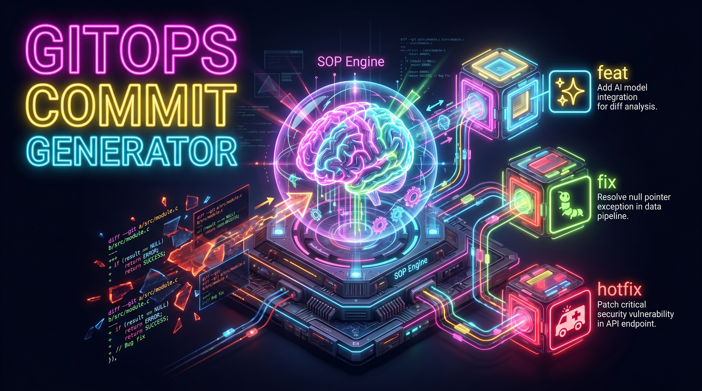
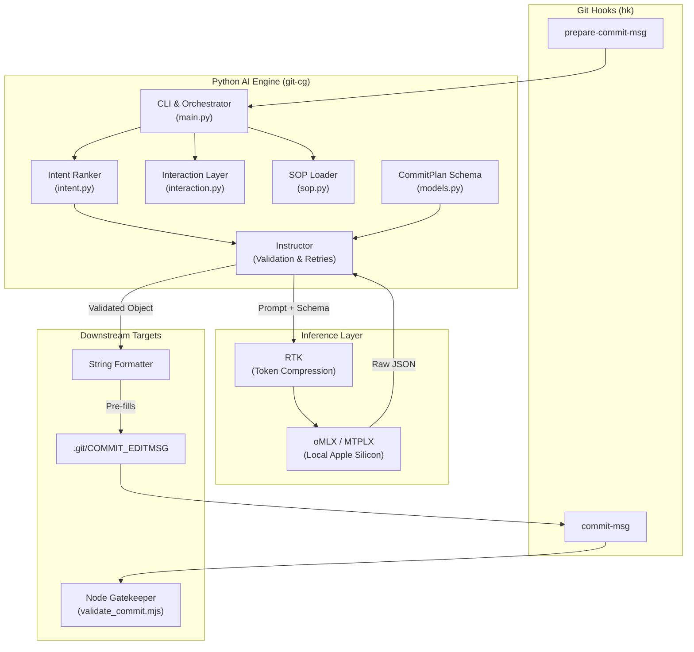

# 🧬 GitOps AI Commit Generator (`git-cg`)



> 🤖 **"The Brain in the Machine"** — A governed, SOP-driven engine for standardized Git history.

[![DeepWiki](https://img.shields.io/badge/DeepWiki-Thomo1318%2FgitCommitGenerator-blue.svg?logo=data:image/png;base64,iVBORw0KGgoAAAANSUhEUgAAACwAAAAyCAYAAAAnWDnqAAAAAXNSR0IArs4c6QAAA05JREFUaEPtmUtyEzEQhtWTQyQLHNak2AB7ZnyXZMEjXMGeK/AIi+QuHrMnbChYY7MIh8g01fJoopFb0uhhEqqcbWTp06/uv1saEDv4O3n3dV60RfP947Mm9/SQc0ICFQgzfc4CYZoTPAswgSJCCUJUnAAoRHOAUOcATwbmVLWdGoH//PB8mnKqScAhsD0kYP3j/Yt5LPQe2KvcXmGvRHcDnpxfL2zOYJ1mFwrryWTz0advv1Ut4CJgf5uhDuDj5eUcAUoahrdY/56ebRWeraTjMt/00Sh3UDtjgHtQNHwcRGOC98BJEAEymycmYcWwOprTgcB6VZ5JK5TAJ+fXGLBm3FDAmn6oPPjR4rKCAoJCal2eAiQp2x0vxTPB3ALO2CRkwmDy5WohzBDwSEFKRwPbknEggCPB/imwrycgxX2NzoMCHhPkDwqYMr9tRcP5qNrMZHkVnOjRMWwLCcr8ohBVb1OMjxLwGCvjTikrsBOiA6fNyCrm8V1rP93iVPpwaE+gO0SsWmPiXB+jikdf6SizrT5qKasx5j8ABbHpFTx+vFXp9EnYQmLx02h1QTTrl6eDqxLnGjporxl3NL3agEvXdT0WmEost648sQOYAeJS9Q7bfUVoMGnjo4AZdUMQku50McDcMWcBPvr0SzbTAFDfvJqwLzgxwATnCgnp4wDl6Aa+Ax283gghmj+vj7feE2KBBRMW3FzOpLOADl0Isb5587h/U4gGvkt5v60Z1VLG8BhYjbzRwyQZemwAd6cCR5/XFWLYZRIMpX39AR0tjaGGiGzLVyhse5C9RKC6ai42ppWPKiBagOvaYk8lO7DajerabOZP46Lby5wKjw1HCRx7p9sVMOWGzb/vA1hwiWc6jm3MvQDTogQkiqIhJV0nBQBTU+3okKCFDy9WwferkHjtxib7t3xIUQtHxnIwtx4mpg26/HfwVNVDb4oI9RHmx5WGelRVlrtiw43zboCLaxv46AZeB3IlTkwouebTr1y2NjSpHz68WNFjHvupy3q8TFn3Hos2IAk4Ju5dCo8B3wP7VPr/FGaKiG+T+v+TQqIrOqMTL1VdWV1DdmcbO8KXBz6esmYWYKPwDL5b5FA1a0hwapHiom0r/cKaoqr+27/XcrS5UwSMbQAAAABJRU5ErkJggg==)](https://deepwiki.com/Thomo1318/gitCommitGenerator)
[](https://github.com/Thomo1318/gitCommitGenerator/releases)
[](https://pypi.org/project/gitcommitgenerator/)
[](https://pypi.org/project/gitcommitgenerator/)
[](https://github.com/Thomo1318/gitCommitGenerator/actions/workflows/docs.yml)
[](https://github.com/Thomo1318/gitCommitGenerator/actions/workflows/security.yml)
[](https://github.com/astral-sh/ruff)
[](https://github.com/Thomo1318/gitCommitGenerator/blob/main/LICENSE)

---

## 📚 Overview

`git-cg` is a high-performance CLI utility designed to bridge the gap between AI-driven automation and strict organizational standards. It analyzes your **staged changes**, consults a **machine-readable SOP**, and generates a **Hybrid Commit** message that is visually clear for humans and mathematically parsable for release engines.

This tool is the core implementation of the **Hybrid Commit Standard**, fusing Gitmoji, Conventional Commits, and Semantic Versioning into a single, automated pipeline.

---

## 🧠 Core Philosophy & Architecture

Traditional Git history is often inconsistent, making it difficult to automate releases or understand changes at a glance. `git-cg` solves this by enforcing a digitized Standard Operating Procedure (SOP) via **Deterministic Structured Data Extraction**.

Instead of relying on brittle prompt engineering, `git-cg` utilizes a **Deterministic Intent Ranker** to extract boolean signals from the git diff and score them against the SOP matrix. It then injects a "Smart Menu" of the top-ranked candidates into the prompt, using the [**Instructor**](https://python.useinstructor.com/) Python library and [**Pydantic**](https://docs.pydantic.dev/) to force the LLM to output a mathematically validated `CommitPlan`.

1. **Gitmoji**: Instant visual recognition of intent (e.g., 🐛 for fixes, ✨ for features).
2. **Conventional Commits (CC)**: Machine-readable semantics that drive automated versioning.
3. **Semantic Versioning (SemVer)**: Mathematical version bumping based on commit taxonomy.

By centralizing these rules in `config/gitops_agent_sop.json`, we ensure that both AI Agents and Human Developers produce identical, high-quality output. If the LLM hallucinates or breaks the 72-character limit constraint, the [Instructor](https://python.useinstructor.com/) validation loop automatically kicks in, feeding the error back to the LLM for a self-correcting retry.

---

## 🏗 System Stack

The engine operates on a modernized, extremely robust toolchain managed seamlessly by [mise](https://mise.jdx.dev) and [just](https://just.systems):

- **Logic Engine**: Python 3.14 (managed via [uv](https://docs.astral.sh/uv/)), leveraging [instructor](https://python.useinstructor.com/) and [pydantic](https://docs.pydantic.dev/).
- **Signal Extraction & Ranking**: Python `intent.py` (extracts diff metrics, normalizes content, and deterministically ranks commit intents).
- **Interaction Layer**: Python `interaction.py` (terminal bell, `/dev/tty` capability checks, and gum-driven interactive review).
- **Validation Engine**: [Node.js](https://nodejs.org/) via `validate_commit.mjs` (acts as a downstream gatekeeper in `commit-msg`).
- **Secrets Orchestration**: `fnox` and `age` for hybrid, zero-plaintext contributor environments.
- **Hook Orchestration**: [hk](https://hk.jdx.dev) (git hook manager).
- **Prompt Compression**: [rtk](https://github.com/rtk-ai/rtk) (reduces LLM context size by up to 90% via structural diff compression).
- **LLM Inference**: Native Apple Silicon serving via [oMLX](https://github.com/jundot/omlx) or [MTPLX](https://github.com/youssofal/mtplx).
- **TUI Runtime**: [gum](https://github.com/charmbracelet/gum) for opt-in terminal-native review.
- **SOP (The Brain)**: `config/gitops_agent_sop.json`.



---

## 🛠 File Role Matrix

| File                           | Layer                  | Role                                                                                                                             |
| :----------------------------- | :--------------------- | :------------------------------------------------------------------------------------------------------------------------------- |
| `src/git_cg/main.py`           | Entry                  | The main Typer CLI that manages orchestration, default non-interactive execution, and opt-in interactive review.                 |
| `src/git_cg/intent.py`         | Classifier             | Deterministic signal extraction, diff normalization, and intent ranking.                                                         |
| `src/git_cg/interaction.py`    | Interaction            | Terminal bell, `/dev/tty` checks, and gum-driven interactive review actions.                                                     |
| `src/git_cg/sop.py`            | Configuration          | Portable SOP loader supporting `.git-cg/sop.json` overrides and packaged wheel data.                                             |
| `src/git_cg/models.py`         | Schema                 | [Pydantic](https://docs.pydantic.dev/) `CommitPlan` models enforcing strict SOP validation, multi-intent rendering, and retries. |
| `src/git_cg/release.py`        | Release                | Parses machine-readable trailers to automate SemVer bumps and grouped changelog generation.                                      |
| `src/git_cg/notifier.py`       | Optional Notifications | Reserved for possible future passive desktop notification use; no longer the critical control path.                              |
| `scripts/validate_commit.mjs`  | Gatekeeper             | The [Node.js](https://nodejs.org/)/[zx](https://github.com/google/zx) script that strictly enforces the 72-char hybrid limit.    |
| `usage.kdl`                    | Interface              | The declarative CLI specification for the [usage](https://usage.jdx.dev/) framework.                                             |
| `config/gitops_agent_sop.json` | Governance             | The "Brain" containing the emoji/CC mapping matrix.                                                                              |
| `hk.pkl`                       | Hooks                  | Centralized definitions for pre-commit and prepare-commit managed by [hk](https://hk.jdx.dev).                                   |
| `mise.toml` & `Brewfile`       | Environment            | Installs and locks the exact OS and runtime binaries managed by [mise](https://mise.jdx.dev).                                    |

---

## ✨ Features

- **[Pydantic](https://docs.pydantic.dev/) Validation**: Absolute structural guarantees using the `CommitPlan` schema. No conversational padding, no wrong emojis.
- **Multi-Intent Split Detection**: Detects unrelated changes in a single diff, generates structured `Included changes:` bodies, and enforces mixed-commit policies (`strict`, `warn`, `split_prompt`).
- **Machine-Readable Trailers**: Automatically appends `SemVer-Impact` and `Change-Types` trailers so release automation never relies on brittle regex.
- **Dual-Mode Execution**: `git-cg` runs non-interactively by default for unattended and CI/CD-safe use, while `git-cg -i` enables opt-in terminal review.
- **Terminal-Native Interactive Review**: Uses [gum](https://github.com/charmbracelet/gum) with `/dev/tty` for `Commit`, `Edit`, `Regenerate`, `Add issue reference`, and `Cancel` actions without relying on desktop notifications.
- **Self-Healing Automation**: [Instructor](https://python.useinstructor.com/)'s automatic retry loops catch hallucinations before they ever touch your Git tree.
- **Ultra-low Latency**: Optimized for sub-second inference using local [rtk](https://github.com/rtk-ai/rtk) token compression and [uv](https://docs.astral.sh/uv/) execution.
- **Local First**: Designed to natively communicate with locally hosted models on Apple Silicon ([oMLX](https://github.com/jundot/omlx) / [MTPLX](https://github.com/youssofal/mtplx)).
- **Spec-Driven**: Uses the [usage](https://usage.jdx.dev/) standard for automated autocompletion and help generation.
- **Safe Dry-Runs**: Validate AI output before modifying your git message file.

---

## 🚀 Installation & Provisioning

This project is completely declarative. Tools are managed by [mise](https://mise.jdx.dev), native apps by [brew](https://brew.sh), and hooks by [hk](https://hk.jdx.dev).

1. **Install Runtime Dependencies**:

   ```bash
   mise install
   ```

   _(Installs [Python](https://python.org/), [uv](https://docs.astral.sh/uv/), [Node.js](https://nodejs.org/), [just](https://just.systems), [usage](https://usage.jdx.dev/), [hk](https://hk.jdx.dev), [pkl](https://pkl-lang.org/), [rtk](https://github.com/rtk-ai/rtk), and [gum](https://github.com/charmbracelet/gum))_

2. **Install Inference Engines**:

   ```bash
   brew bundle
   ```

   _(Installs [oMLX](https://github.com/jundot/omlx) and [MTPLX](https://github.com/youssofal/mtplx) for local AI hosting)_

3. **Install Git Hooks**:

   ```bash
   hk install
   ```

4. **Verify Environment**:

   ```bash
   just test
   ```

### Configuration & Secrets

`git-cg` uses `fnox` to securely orchestrate secrets. If you are not using `fnox` and 1Password, you must provide the necessary API keys via a `.env` file or environment variables:

- **OpenAI / Custom API Keys**: Export `OPENAI_API_KEY`, `OMLX_API_KEY`, or `MTPLX_API_KEY` depending on your selected engine.
- **Hugging Face Token**: If you are using local models via oMLX or MTPLX, you may need a Hugging Face token to download gated models without rate limits. You can generate one at [huggingface.co/settings/tokens](https://huggingface.co/settings/tokens) and store it in your environment.
- **Local Model Storage**: You can configure where local models are stored to save disk space on your primary drive by setting the standard caching environment variables for your engine (e.g., `HF_HOME`).

---

## 🛠 Usage

You can use `git-cg` in two modes.

### Default non-interactive mode

Run:

```bash
git-cg
```

This generates a commit message from your staged changes and applies the commit automatically without opening a review UI. This mode is intended to remain safe for unattended, automated, and CI/CD-style workflows.

### Interactive review mode

Run:

```bash
git-cg -i
```

This generates the commit message, writes it first, emits a passive terminal bell, and then — when `/dev/tty` is available — opens an opt-in terminal-native [gum](https://github.com/charmbracelet/gum) review menu with actions for:

- `Commit`
- `Edit`
- `Regenerate`
- `Add issue reference`
- `Cancel`

Structured issue references support:

- `Resolves`
- `Refs`
- `Closes`
- `Fixes`

You can attach multiple issue references by selecting `Add issue reference` repeatedly during review.

The review preview also shows a compact current issue-reference status line so you can confirm whether references are attached without mentally re-parsing the full commit body.

Exact duplicate references are treated as no-ops, and re-adding the same issue number with a different verb is rejected in this phase to avoid ambiguous semantics. Remove/replace issue-reference UX remains deferred.

Structured issue references render above machine-readable trailers. Example:

```markdown
🥅 fix(main): add exception handling for AI generation

Explain the why and how.

Included changes:
- 📝 docs(readme): document review flow

Resolves #80
Refs #81
SemVer-Impact: PATCH
Change-Types: fix, docs
Changelog-Groups: Bug Fixes, Documentation
```

If no terminal device is available, the tool degrades cleanly and completes without trying to open the TUI.

### Hook-driven usage

If you stage files and run:

```bash
git commit
```

the `prepare-commit-msg` hook can still invoke `git-cg` to generate and inject a commit message into `.git/COMMIT_EDITMSG`. Hook-driven operation remains conservative and does not require a TUI by default.

If you wish to explore the CLI options:

```bash
git-cg --help
```

### The Standard: Hybrid Commits

All messages generated or validated by this engine follow the format:
`<emoji> <cc_type>(<scope>): <subject>`

**Example Output:**

```markdown
♻️ refactor(core): centralize SOP loading for hook portability

Introduce a portable SOP loader with a resolution precedence chain for explicit environment overrides.

Included changes:

- ♻️ refactor(sop): add centralized portable SOP loader
- 🦺 fix(cli): add strict mode for CI while keeping hooks fail-soft
- 📦 build(package): ship SOP data in the wheel

Refs #80
SemVer-Impact: PATCH
Change-Types: refactor, fix, build
Changelog-Groups: Changed, Fixed, Miscellaneous
```

#### Gitmoji Reference Matrix

| Emoji | Code                          | Description                                                  |  CC Type   | SemVer Impact | Changelog Group |
| :---: | :---------------------------- | :----------------------------------------------------------- | :--------: | :-----------: | :-------------- |
|  🎨   | `:art:`                       | Improve structure/format of the code                         |  `style`   |     NONE      | Changed         |
|  ⚡️   | `:zap:`                       | Improve performance                                          |   `perf`   |     PATCH     | Changed         |
|  🔥   | `:fire:`                      | Remove code or files                                         | `refactor` |     PATCH     | Removed         |
|  🐛   | `:bug:`                       | Fix a bug                                                    |   `fix`    |     PATCH     | Fixed           |
|  🚑   | `:ambulance:`                 | Critical hotfix                                              |   `fix`    |     PATCH     | Fixed           |
|  ✨   | `:sparkles:`                  | Introduce new features                                       |   `feat`   |     MINOR     | Added           |
|  📝   | `:memo:`                      | Add or update documentation                                  |   `docs`   |     NONE      | Miscellaneous   |
|  🚀   | `:rocket:`                    | Deploy stuff                                                 |  `chore`   |     NONE      | Miscellaneous   |
|  💄   | `:lipstick:`                  | Add or update the UI and style files                         |  `style`   |     PATCH     | Changed         |
|  🎉   | `:tada:`                      | Begin a project                                              |   `init`   |     NONE      | Miscellaneous   |
|  ✅   | `:white_check_mark:`          | Add, update, or pass tests                                   |   `test`   |     NONE      | Miscellaneous   |
|  🔒️   | `:lock:`                      | Fix security or privacy issues                               |   `fix`    |     PATCH     | Security        |
|  🔐   | `:closed_lock_with_key:`      | Add or update secrets                                        |  `chore`   |     PATCH     | Security        |
|  🔖   | `:bookmark:`                  | Release/Version tags                                         | `release`  |     NONE      | Miscellaneous   |
|  🚨   | `:rotating_light:`            | Fix compiler/linter warnings                                 | `refactor` |     PATCH     | Changed         |
|  🚧   | `:construction:`              | Work in progress                                             |  `chore`   |     NONE      | Miscellaneous   |
|  💚   | `:green_heart:`               | Fix CI Build                                                 |    `ci`    |     NONE      | Miscellaneous   |
|  ⬇️   | `:arrow_down:`                | Downgrade dependencies                                       |  `build`   |     PATCH     | Changed         |
|  ⬆️   | `:arrow_up:`                  | Upgrade dependencies                                         |  `build`   |     PATCH     | Changed         |
|  📌   | `:pushpin:`                   | Pin dependencies to specific versions                        |  `build`   |     PATCH     | Changed         |
|  👷   | `:construction_worker:`       | Add or update CI build system                                |    `ci`    |     NONE      | Miscellaneous   |
|  📈   | `:chart_with_upwards_trend:`  | Add or update analytics or track code                        |   `feat`   |     MINOR     | Added           |
|  ♻️   | `:recycle:`                   | Refactor code                                                | `refactor` |     PATCH     | Changed         |
|  ➕   | `:heavy_plus_sign:`           | Add a dependency                                             |  `build`   |     PATCH     | Changed         |
|  ➖   | `:heavy_minus_sign:`          | Remove a dependency                                          |  `build`   |     PATCH     | Changed         |
|  🔧   | `:wrench:`                    | Add or update configuration files                            |  `chore`   |     NONE      | Miscellaneous   |
|  🔨   | `:hammer:`                    | Add or update development scripts                            |  `chore`   |     NONE      | Miscellaneous   |
|  🌐   | `:globe_with_meridians:`      | Internationalization and localization                        |   `feat`   |     MINOR     | Added           |
|  ✏️   | `:pencil2:`                   | Fix typos                                                    |   `docs`   |     NONE      | Miscellaneous   |
|  💩   | `:poop:`                      | Write bad code that needs to be improved                     | `refactor` |     NONE      | Miscellaneous   |
|  ⏪   | `:rewind:`                    | Revert changes                                               |  `revert`  |     PATCH     | Changed         |
|  🔀   | `:twisted_rightwards_arrows:` | Merge branches                                               |  `chore`   |     NONE      | Miscellaneous   |
|  📦   | `:package:`                   | Add or update compiled files or packages                     |  `build`   |     PATCH     | Changed         |
|  👽️   | `:alien:`                     | Update code due to external API changes                      | `refactor` |     PATCH     | Changed         |
|  🚚   | `:truck:`                     | Move or rename resources                                     | `refactor` |     NONE      | Changed         |
|  📄   | `:page_facing_up:`            | Add or update license                                        |   `docs`   |     NONE      | Miscellaneous   |
|  💥   | `:boom:`                      | Introduce breaking changes                                   |   `feat`   |     MAJOR     | Changed         |
|  🍱   | `:bento:`                     | Add or update assets                                         |  `chore`   |     PATCH     | Added           |
|  ♿️   | `:wheelchair:`                | Improve accessibility                                        |   `feat`   |     PATCH     | Changed         |
|  💡   | `:bulb:`                      | Add or update comments in source code                        |   `docs`   |     NONE      | Miscellaneous   |
|  🍻   | `:beers:`                     | Write code drunkenly                                         | `refactor` |     NONE      | Miscellaneous   |
|  💬   | `:speech_balloon:`            | Add or update text and literals                              |  `style`   |     PATCH     | Changed         |
|  🗃️   | `:card_file_box:`             | Perform database related changes                             |   `feat`   |     PATCH     | Changed         |
|  🔊   | `:loud_sound:`                | Add or update logs                                           |  `chore`   |     NONE      | Miscellaneous   |
|  🔇   | `:mute:`                      | Remove logs                                                  |  `chore`   |     NONE      | Miscellaneous   |
|  👥   | `:busts_in_silhouette:`       | Add or update contributor(s)                                 |  `chore`   |     NONE      | Miscellaneous   |
|  🚸   | `:children_crossing:`         | Improve user experience/usability                            |   `feat`   |     PATCH     | Changed         |
|  🏗️   | `:building_construction:`     | Make architectural changes                                   | `refactor` |     MAJOR     | Changed         |
|  📱   | `:iphone:`                    | Work on responsive design                                    |   `feat`   |     PATCH     | Changed         |
|  🤡   | `:clown_face:`                | Mock things                                                  |   `test`   |     NONE      | Miscellaneous   |
|  🥚   | `:egg:`                       | Add or update an Easter egg                                  |   `feat`   |     PATCH     | Added           |
|  🙈   | `:see_no_evil:`               | Add or update a .gitignore file                              |  `chore`   |     NONE      | Miscellaneous   |
|  📸   | `:camera_flash:`              | Add or update snapshots                                      |   `test`   |     NONE      | Miscellaneous   |
|  ⚗️   | `:alembic:`                   | Perform experiments                                          |   `feat`   |     PATCH     | Changed         |
|  🔍   | `:mag:`                       | Improve SEO                                                  |   `feat`   |     PATCH     | Changed         |
|  🏷️   | `:label:`                     | Add or update types                                          | `refactor` |     PATCH     | Changed         |
|  🌱   | `:seedling:`                  | Add or update seed files                                     |  `chore`   |     NONE      | Miscellaneous   |
|  🚩   | `:triangular_flag_on_post:`   | Add, update, or remove feature flags                         |   `feat`   |     MINOR     | Added           |
|  🥅   | `:goal_net:`                  | Catch errors                                                 |   `fix`    |     PATCH     | Fixed           |
|  💫   | `:dizzy:`                     | Add or update animations and transitions                     |   `feat`   |     PATCH     | Changed         |
|  🗑️   | `:wastebasket:`               | Deprecate code that needs to be cleaned up                   | `refactor` |     PATCH     | Deprecated      |
|  🛂   | `:passport_control:`          | Work on code related to authorization, roles and permissions |   `feat`   |     MINOR     | Security        |
|  🩹   | `:adhesive_bandage:`          | Simple fix for a non-critical issue                          |   `fix`    |     PATCH     | Fixed           |
|  🧐   | `:monocle_face:`              | Data exploration/inspection                                  |  `chore`   |     NONE      | Miscellaneous   |
|  ⚰️   | `:coffin:`                    | Remove dead code                                             | `refactor` |     PATCH     | Removed         |
|  🧪   | `:test_tube:`                 | Add a failing test                                           |   `test`   |     NONE      | Miscellaneous   |
|  👔   | `:necktie:`                   | Add or update business logic                                 |   `feat`   |     MINOR     | Added           |
|  🩺   | `:stethoscope:`               | Add or update healthcheck                                    |   `feat`   |     PATCH     | Added           |
|  🧱   | `:bricks:`                    | Infrastructure related changes                               |    `ci`    |     PATCH     | Changed         |
|  🧑‍💻   | `:technologist:`              | Improve developer experience                                 |  `chore`   |     NONE      | Miscellaneous   |
|  💸   | `:money_with_wings:`          | Add sponsorships or money related infrastructure             |   `feat`   |     MINOR     | Added           |
|  🧵   | `:thread:`                    | Add or update code related to multithreading or concurrency  | `refactor` |     MINOR     | Changed         |
|  🦺   | `:safety_vest:`               | Add or update code related to validation                     |   `fix`    |     PATCH     | Changed         |
|  ✈️   | `:airplane:`                  | Improve offline support                                      |   `feat`   |     MINOR     | Added           |
|  🦖   | `:t-rex:`                     | Code that adds backwards compatibility                       |   `fix`    |     PATCH     | Changed         |

---

## Contributing

We welcome community contributions! Please review the open issues on our [GitHub Tracker](https://github.com/Thomo1318/gitCommitGenerator/issues).

## Development

Instructions for setting up the local development environment will be added soon.

---

## 🏆 Acknowledgements & Open Source Licenses

This project heavily leverages the following open-source tools. We extend our immense gratitude to their creators and communities:

| Tool                                                            | License             | Description                               |
| :-------------------------------------------------------------- | :------------------ | :---------------------------------------- |
| **[mise](https://mise.jdx.dev)**                                | MIT                 | Environment and Toolchain Manager         |
| **[usage](https://usage.jdx.dev/)**                             | MIT                 | Standardized CLI Specifications           |
| **[hk](https://hk.jdx.dev)**                                    | MIT                 | Deterministic Git Hook Management         |
| **[oMLX](https://github.com/jundot/omlx)**                      | Apache-2.0          | High-performance Apple Silicon LLM Server |
| **[MTPLX](https://github.com/youssofal/mtplx)**                 | Apache-2.0          | Native MTP Speculative Decoding Inference |
| **[rtk](https://github.com/rtk-ai/rtk)**                        | MIT                 | LLM Token Compression Proxy               |
| **[uv](https://docs.astral.sh/uv/)**                            | MIT / Apache-2.0    | Extremely fast Python package manager     |
| **[Instructor](https://python.useinstructor.com/)**             | MIT                 | Structured extraction library for LLMs    |
| **[Pydantic](https://docs.pydantic.dev/)**                      | MIT                 | Data validation library for Python        |
| **[just](https://just.systems)**                                | CC0                 | Command runner for project tasks          |
| **[pkl](https://pkl-lang.org/)**                                | Apple Public Source | Embeddable configuration language         |
| **[zx](https://github.com/google/zx)**                          | Apache-2.0          | Modern Bash scripting for Node.js         |
| **[fnox](https://github.com/jdx/fnox)**                         | MIT                 | Hybrid secrets orchestration              |
| **[age](https://github.com/FiloSottile/age)**                   | BSD-3-Clause        | Simple, modern, secure file encryption    |
| **[gitleaks](https://github.com/gitleaks/gitleaks)**            | MIT                 | Fast pre-commit secret scanner            |
| **[TruffleHog](https://github.com/trufflesecurity/trufflehog)** | AGPL-3.0            | Deep git history secret verification      |
| **[hatchling](https://hatch.pypa.io/)**                         | MIT                 | Modern, extensible Python build backend   |
| **[alerter](https://github.com/vjeantet/alerter)**              | MIT                 | macOS interactive desktop notifications   |
| **[gum](https://github.com/charmbracelet/gum)**                 | MIT                 | Terminal-native interactive review UI     |

---

## 📄 License

MIT © 2026
