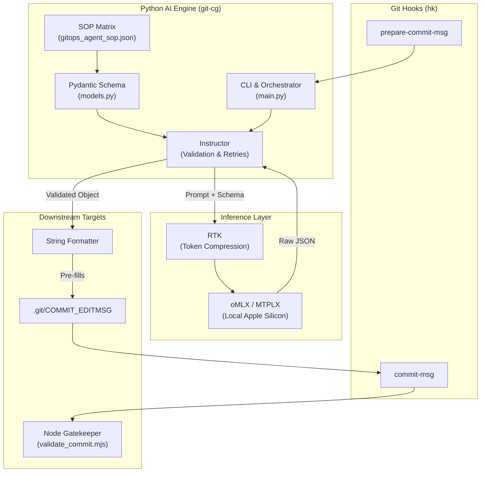

# 🧬 GitOps AI Commit Generator (`git-cg`)


> 🤖 **"The Brain in the Machine"** — A governed, SOP-driven engine for standardized Git history.

---

## 📚 Overview

`git-cg` is a high-performance CLI utility designed to bridge the gap between AI-driven automation and strict organizational standards. It analyzes your **staged changes**, consults a **machine-readable SOP**, and generates a **Hybrid Commit** message that is visually clear for humans and mathematically parsable for release engines.

This tool is the core implementation of the **Hybrid Commit Standard**, fusing Gitmoji, Conventional Commits, and Semantic Versioning into a single, automated pipeline.

---

## 🧠 Core Philosophy & Architecture

Traditional Git history is often inconsistent, making it difficult to automate releases or understand changes at a glance. `git-cg` solves this by enforcing a digitized Standard Operating Procedure (SOP) via **Deterministic Structured Data Extraction**.

Instead of relying on brittle prompt engineering, `git-cg` uses the [**Instructor**](https://python.useinstructor.com/) Python library and [**Pydantic**](https://docs.pydantic.dev/) to force the LLM to output mathematically validated JSON matching the `Commit` schema.

1. **Gitmoji**: Instant visual recognition of intent (e.g., 🐛 for fixes, ✨ for features).
2. **Conventional Commits (CC)**: Machine-readable semantics that drive automated versioning.
3. **Semantic Versioning (SemVer)**: Mathematical version bumping based on commit taxonomy.

By centralizing these rules in `config/gitops_agent_sop.json`, we ensure that both AI Agents and Human Developers produce identical, high-quality output. If the LLM hallucinates or breaks the 72-character limit constraint, the [Instructor](https://python.useinstructor.com/) validation loop automatically kicks in, feeding the error back to the LLM for a self-correcting retry.

---

## 🏗 System Stack

The engine operates on a modernized, extremely robust toolchain managed seamlessly by [mise](https://mise.jdx.dev) and [just](https://just.systems):

- **Logic Engine**: Python 3.12 (managed via [uv](https://docs.astral.sh/uv/)), leveraging [instructor](https://python.useinstructor.com/) and [pydantic](https://docs.pydantic.dev/).
- **Validation Engine**: [Node.js](https://nodejs.org/) via `validate_commit.mjs` (acts as the absolute final gatekeeper in `commit-msg`).
- **Hook Orchestration**: [hk](https://hk.jdx.dev) (git hook manager).
- **Prompt Compression**: [rtk](https://github.com/rtk-ai/rtk) (reduces LLM context size by up to 90% via structural diff compression).
- **LLM Inference**: Native Apple Silicon serving via [oMLX](https://github.com/jundot/omlx) or [MTPLX](https://github.com/youssofal/mtplx).
- **SOP (The Brain)**: `config/gitops_agent_sop.json`.



---

## 🛠 File Role Matrix

| File                           | Layer       | Role                                                                                                                          |
| :----------------------------- | :---------- | :---------------------------------------------------------------------------------------------------------------------------- |
| `src/git_cg/main.py`           | Entry       | The main Typer CLI that reads the diff and initiates generation.                                                              |
| `src/git_cg/models.py`         | Schema      | [Pydantic](https://docs.pydantic.dev/) models enforcing strict SOP validation and retry logic.                                |
| `scripts/validate_commit.mjs`  | Gatekeeper  | The [Node.js](https://nodejs.org/)/[zx](https://github.com/google/zx) script that strictly enforces the 72-char hybrid limit. |
| `usage.kdl`                    | Interface   | The declarative CLI specification for the [usage](https://usage.jdx.dev/) framework.                                          |
| `config/gitops_agent_sop.json` | Governance  | The "Brain" containing the emoji/CC mapping matrix.                                                                           |
| `hk.pkl`                       | Hooks       | Centralized definitions for pre-commit, prepare-commit managed by [hk](https://hk.jdx.dev).                                   |
| `mise.toml` & `Brewfile`       | Environment | Installs and locks the exact OS and runtime binaries managed by [mise](https://mise.jdx.dev).                                 |

---

## ✨ Features

- **[Pydantic](https://docs.pydantic.dev/) Validation**: Absolute structural guarantees for commit messages. No conversational padding, no wrong emojis.
- **Self-Healing Automation**: [Instructor](https://python.useinstructor.com/)'s automatic retry loops catch hallucinations before they ever touch your Git tree.
- **Ultra-low Latency**: Optimized for sub-second inference using local [rtk](https://github.com/rtk-ai/rtk) token compression and [uv](https://docs.astral.sh/uv/) execution.
- **Local First**: Designed to natively communicate with locally hosted models on Apple Silicon ([oMLX](https://github.com/jundot/omlx) / [MTPLX](https://github.com/youssofal/mtplx)).
- **Spec-Driven**: Uses the [usage](https://usage.jdx.dev/) standard for automated autocompletion and help generation.
- **Safe Dry-Runs**: Validate AI output before modifying your git message file.

---

## 🚀 Installation & Provisioning

This project is completely declarative. Tools are managed by [mise](https://mise.jdx.dev), native apps by [brew](https://brew.sh), and hooks by [hk](https://hk.jdx.dev).

1. **Install Runtime Dependencies**:

   ```bash
   mise install
   ```

   _(Installs [Python](https://python.org/), [uv](https://docs.astral.sh/uv/), [Node.js](https://nodejs.org/), [just](https://just.systems), [usage](https://usage.jdx.dev/), [hk](https://hk.jdx.dev), [pkl](https://pkl-lang.org/), and [rtk](https://github.com/rtk-ai/rtk))_

2. **Install Inference Engines**:

   ```bash
   brew bundle
   ```

   _(Installs [oMLX](https://github.com/jundot/omlx) and [MTPLX](https://github.com/youssofal/mtplx) for local AI hosting)_

3. **Install Git Hooks**:

   ```bash
   hk install
   ```

4. **Verify Environment**:
   ```bash
   just test
   ```

---

## 🛠 Usage

You don't need to learn new commands. Once installed, simply stage your files and run:

```bash
git commit
```

The `prepare-commit-msg` hook will instantly activate `git-cg`, compress the diff using [rtk](https://github.com/rtk-ai/rtk), send it to your local LLM, mathematically validate the output using [Pydantic](https://docs.pydantic.dev/), and inject it into your commit file.

If you wish to explore the CLI options:

```bash
git-cg --help
```

### The Standard: Hybrid Commits

All messages generated or validated by this engine follow the format:
`<emoji> <cc_type>(<scope>): <subject>`

**Example Output:**
`✨ feat(auth): implement OAuth2 login`

#### Gitmoji Reference Matrix

| Emoji | Code                          | Description                                                  |  CC Type   | SemVer Impact | Changelog Group |
| :---: | :---------------------------- | :----------------------------------------------------------- | :--------: | :-----------: | :-------------- |
|  🎨   | `:art:`                       | Improve structure/format of the code                         |  `style`   |     NONE      | Changed         |
|  ⚡️   | `:zap:`                       | Improve performance                                          |   `perf`   |     PATCH     | Changed         |
|  🔥   | `:fire:`                      | Remove code or files                                         | `refactor` |     PATCH     | Removed         |
|  🐛   | `:bug:`                       | Fix a bug                                                    |   `fix`    |     PATCH     | Fixed           |
|  🚑   | `:ambulance:`                 | Critical hotfix                                              |   `fix`    |     PATCH     | Fixed           |
|  ✨   | `:sparkles:`                  | Introduce new features                                       |   `feat`   |     MINOR     | Added           |
|  📝   | `:memo:`                      | Add or update documentation                                  |   `docs`   |     NONE      | Miscellaneous   |
|  🚀   | `:rocket:`                    | Deploy stuff                                                 |  `chore`   |     NONE      | Miscellaneous   |
|  💄   | `:lipstick:`                  | Add or update the UI and style files                         |  `style`   |     PATCH     | Changed         |
|  🎉   | `:tada:`                      | Begin a project                                              |   `init`   |     NONE      | Miscellaneous   |
|  ✅   | `:white_check_mark:`          | Add, update, or pass tests                                   |   `test`   |     NONE      | Miscellaneous   |
|  🔒️   | `:lock:`                      | Fix security or privacy issues                               |   `fix`    |     PATCH     | Security        |
|  🔐   | `:closed_lock_with_key:`      | Add or update secrets                                        |  `chore`   |     PATCH     | Security        |
|  🔖   | `:bookmark:`                  | Release/Version tags                                         | `release`  |     NONE      | Miscellaneous   |
|  🚨   | `:rotating_light:`            | Fix compiler/linter warnings                                 | `refactor` |     PATCH     | Changed         |
|  🚧   | `:construction:`              | Work in progress                                             |  `chore`   |     NONE      | Miscellaneous   |
|  💚   | `:green_heart:`               | Fix CI Build                                                 |    `ci`    |     NONE      | Miscellaneous   |
|  ⬇️   | `:arrow_down:`                | Downgrade dependencies                                       |  `build`   |     PATCH     | Changed         |
|  ⬆️   | `:arrow_up:`                  | Upgrade dependencies                                         |  `build`   |     PATCH     | Changed         |
|  📌   | `:pushpin:`                   | Pin dependencies to specific versions                        |  `build`   |     PATCH     | Changed         |
|  👷   | `:construction_worker:`       | Add or update CI build system                                |    `ci`    |     NONE      | Miscellaneous   |
|  📈   | `:chart_with_upwards_trend:`  | Add or update analytics or track code                        |   `feat`   |     MINOR     | Added           |
|  ♻️   | `:recycle:`                   | Refactor code                                                | `refactor` |     PATCH     | Changed         |
|  ➕   | `:heavy_plus_sign:`           | Add a dependency                                             |  `build`   |     PATCH     | Changed         |
|  ➖   | `:heavy_minus_sign:`          | Remove a dependency                                          |  `build`   |     PATCH     | Changed         |
|  🔧   | `:wrench:`                    | Add or update configuration files                            |  `chore`   |     NONE      | Miscellaneous   |
|  🔨   | `:hammer:`                    | Add or update development scripts                            |  `chore`   |     NONE      | Miscellaneous   |
|  🌐   | `:globe_with_meridians:`      | Internationalization and localization                        |   `feat`   |     MINOR     | Added           |
|  ✏️   | `:pencil2:`                   | Fix typos                                                    |   `docs`   |     NONE      | Miscellaneous   |
|  💩   | `:poop:`                      | Write bad code that needs to be improved                     | `refactor` |     NONE      | Miscellaneous   |
|  ⏪   | `:rewind:`                    | Revert changes                                               |  `revert`  |     PATCH     | Changed         |
|  🔀   | `:twisted_rightwards_arrows:` | Merge branches                                               |  `chore`   |     NONE      | Miscellaneous   |
|  📦   | `:package:`                   | Add or update compiled files or packages                     |  `build`   |     PATCH     | Changed         |
|  👽️   | `:alien:`                     | Update code due to external API changes                      | `refactor` |     PATCH     | Changed         |
|  🚚   | `:truck:`                     | Move or rename resources                                     | `refactor` |     NONE      | Changed         |
|  📄   | `:page_facing_up:`            | Add or update license                                        |   `docs`   |     NONE      | Miscellaneous   |
|  💥   | `:boom:`                      | Introduce breaking changes                                   |   `feat`   |     MAJOR     | Changed         |
|  🍱   | `:bento:`                     | Add or update assets                                         |  `chore`   |     PATCH     | Added           |
|  ♿️   | `:wheelchair:`                | Improve accessibility                                        |   `feat`   |     PATCH     | Changed         |
|  💡   | `:bulb:`                      | Add or update comments in source code                        |   `docs`   |     NONE      | Miscellaneous   |
|  🍻   | `:beers:`                     | Write code drunkenly                                         | `refactor` |     NONE      | Miscellaneous   |
|  💬   | `:speech_balloon:`            | Add or update text and literals                              |  `style`   |     PATCH     | Changed         |
|  🗃️   | `:card_file_box:`             | Perform database related changes                             |   `feat`   |     PATCH     | Changed         |
|  🔊   | `:loud_sound:`                | Add or update logs                                           |  `chore`   |     NONE      | Miscellaneous   |
|  🔇   | `:mute:`                      | Remove logs                                                  |  `chore`   |     NONE      | Miscellaneous   |
|  👥   | `:busts_in_silhouette:`       | Add or update contributor(s)                                 |  `chore`   |     NONE      | Miscellaneous   |
|  🚸   | `:children_crossing:`         | Improve user experience/usability                            |   `feat`   |     PATCH     | Changed         |
|  🏗️   | `:building_construction:`     | Make architectural changes                                   | `refactor` |     MAJOR     | Changed         |
|  📱   | `:iphone:`                    | Work on responsive design                                    |   `feat`   |     PATCH     | Changed         |
|  🤡   | `:clown_face:`                | Mock things                                                  |   `test`   |     NONE      | Miscellaneous   |
|  🥚   | `:egg:`                       | Add or update an easter egg                                  |   `feat`   |     PATCH     | Added           |
|  🙈   | `:see_no_evil:`               | Add or update a .gitignore file                              |  `chore`   |     NONE      | Miscellaneous   |
|  📸   | `:camera_flash:`              | Add or update snapshots                                      |   `test`   |     NONE      | Miscellaneous   |
|  ⚗️   | `:alembic:`                   | Perform experiments                                          |   `feat`   |     PATCH     | Changed         |
|  🔍   | `:mag:`                       | Improve SEO                                                  |   `feat`   |     PATCH     | Changed         |
|  🏷️   | `:label:`                     | Add or update types                                          | `refactor` |     PATCH     | Changed         |
|  🌱   | `:seedling:`                  | Add or update seed files                                     |  `chore`   |     NONE      | Miscellaneous   |
|  🚩   | `:triangular_flag_on_post:`   | Add, update, or remove feature flags                         |   `feat`   |     MINOR     | Added           |
|  🥅   | `:goal_net:`                  | Catch errors                                                 |   `fix`    |     PATCH     | Fixed           |
|  💫   | `:dizzy:`                     | Add or update animations and transitions                     |   `feat`   |     PATCH     | Changed         |
|  🗑️   | `:wastebasket:`               | Deprecate code that needs to be cleaned up                   | `refactor` |     PATCH     | Deprecated      |
|  🛂   | `:passport_control:`          | Work on code related to authorization, roles and permissions |   `feat`   |     MINOR     | Security        |
|  🩹   | `:adhesive_bandage:`          | Simple fix for a non-critical issue                          |   `fix`    |     PATCH     | Fixed           |
|  🧐   | `:monocle_face:`              | Data exploration/inspection                                  |  `chore`   |     NONE      | Miscellaneous   |
|  ⚰️   | `:coffin:`                    | Remove dead code                                             | `refactor` |     PATCH     | Removed         |
|  🧪   | `:test_tube:`                 | Add a failing test                                           |   `test`   |     NONE      | Miscellaneous   |
|  👔   | `:necktie:`                   | Add or update business logic                                 |   `feat`   |     MINOR     | Added           |
|  🩺   | `:stethoscope:`               | Add or update healthcheck                                    |   `feat`   |     PATCH     | Added           |
|  🧱   | `:bricks:`                    | Infrastructure related changes                               |    `ci`    |     PATCH     | Changed         |
|  🧑‍💻   | `:technologist:`              | Improve developer experience                                 |  `chore`   |     NONE      | Miscellaneous   |
|  💸   | `:money_with_wings:`          | Add sponsorships or money related infrastructure             |   `feat`   |     MINOR     | Added           |
|  🧵   | `:thread:`                    | Add or update code related to multithreading or concurrency  | `refactor` |     MINOR     | Changed         |
|  🦺   | `:safety_vest:`               | Add or update code related to validation                     |   `fix`    |     PATCH     | Changed         |
|  ✈️   | `:airplane:`                  | Improve offline support                                      |   `feat`   |     MINOR     | Added           |
|  🦖   | `:t-rex:`                     | Code that adds backwards compatibility                       |   `fix`    |     PATCH     | Changed         |

---

## ROADMAP:

- [ ] Do a complete analysis to confirm that no secrets are hardcoded into the project, if they are found I need to determine how to handle them and only then publish this to a public repo.
- [ ] Index the project using DeepWiki then include the DeepWiki badge to automate the updates. Provide a link to the DeepWiki Page.
- [ ] Automate project `repomix` generation and provide a link to it in the README.md
- [ ] Determine if the current state of the project now warrants a migration from `instructor` to `PydanticAI` since adding changelog, tag and release functionality. This could be a major refactor so it needs to be carefully considered.
- [ ] Create llms.txt and llms-full.txt files
- [ ] Ensure this is portable so anyone could use it without having my specific system setup, e.g. 1Password for secrets management, etc. This may need to be handled with a configuration system/file.
- [ ] Update documentation
- [ ] Document that MTPLX has alternate install methods e.g. `python3 -m pip install -U mtplx` or `uv tool install mtplx`. This should be provided as an option for users who prefer it over the default installation method which is the brewfile included with the tool.
- [ ] Add formatting/support for multiple changes within the one commit message - i.e. when you make multiple changes across different files, add a separate line for each change
- [ ] Add a confirm dialog before the commit is applied
- [ ] Create a standardized test suite
- [ ] Create a TUI using go charm and bubble tea for the commit generator
- [ ] Implement Automated Semver
- [ ] Version injection
- [ ] Release automation
- [ ] Changelog generation
- [ ] AI model download that works with both [oMLX](https://github.com/jundot/omlx) and [RTK](https://github.com/rtk-ai/rtk)
- [ ] Allow user to select AI model
- [ ] Allow other AI backends (Gemini, Claude, Codex, etc.)
- [ ] Allow git hooks (pre-commit, prepare-commit-msg, commit-msg) to be installed globally
- [ ] Integrate [hk](https://hk.jdx.dev) into the project
- [ ] Fix the git hooks to work with hk
- [ ] Add bash, fish, and zsh completion for git-cg
- [ ] Update install file
- [ ] Fix the installation process
- [ ] Add JJ support
- [ ] Explore options for the TUI to also be a CLI.
- [ ] Explore integration of [communique](https://github.com/jdx/communique)
- [ ] Add a dry run option to the TUI
- [ ] Add a dry run option to the CLI
- [ ] Update the SOP matrix with new emojis and commit types
- [ ] Create an Antigravity/VS Code extension
- [ ] Create Agent skills that can be automatically installed into their respective locations depending on AI selected
- [ ] Explore adding support for or migrating to using PydanticAI for structure enforcement and generation
- [ ]

---

## 🏆 Acknowledgements & Open Source Licenses

This project heavily leverages the following open-source tools. We extend our immense gratitude to their creators and communities:

| Tool                                                | License             | Description                               |
| :-------------------------------------------------- | :------------------ | :---------------------------------------- |
| **[mise](https://mise.jdx.dev)**                    | MIT                 | Environment and Toolchain Manager         |
| **[usage](https://usage.jdx.dev/)**                 | MIT                 | Standardized CLI Specifications           |
| **[hk](https://hk.jdx.dev)**                        | MIT                 | Deterministic Git Hook Management         |
| **[oMLX](https://github.com/jundot/omlx)**          | Apache-2.0          | High-performance Apple Silicon LLM Server |
| **[MTPLX](https://github.com/youssofal/mtplx)**     | Apache-2.0          | Native MTP Speculative Decoding Inference |
| **[rtk](https://github.com/rtk-ai/rtk)**            | MIT                 | LLM Token Compression Proxy               |
| **[uv](https://docs.astral.sh/uv/)**                | MIT / Apache-2.0    | Extremely fast Python package manager     |
| **[Instructor](https://python.useinstructor.com/)** | MIT                 | Structured extraction library for LLMs    |
| **[Pydantic](https://docs.pydantic.dev/)**          | MIT                 | Data validation library for Python        |
| **[just](https://just.systems)**                    | CC0                 | Command runner for project tasks          |
| **[pkl](https://pkl-lang.org/)**                    | Apple Public Source | Embeddable configuration language         |
| **[zx](https://github.com/google/zx)**              | Apache-2.0          | Modern Bash scripting for Node.js         |

---

## 📄 License

MIT © 2026
