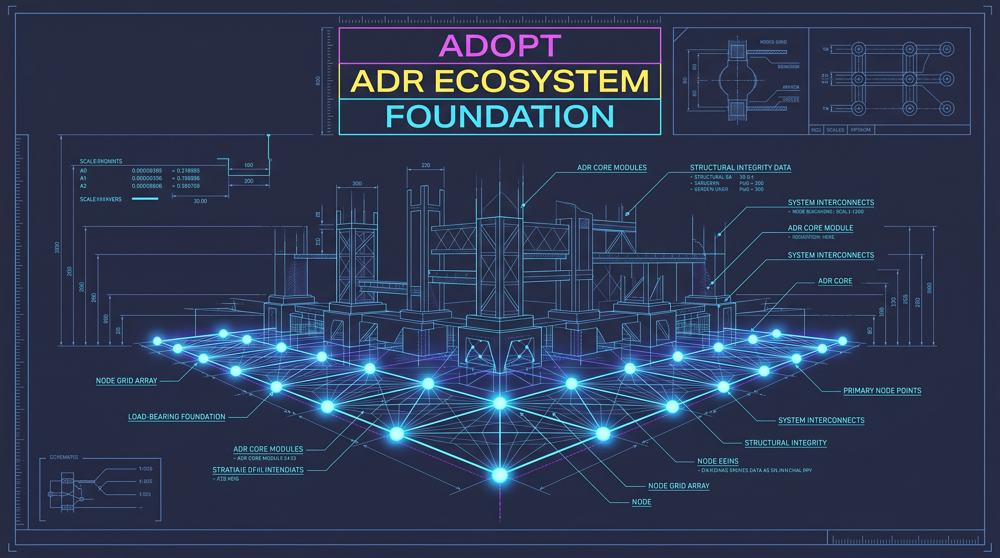

<!-- 🎨 HEADER IMAGE PROMPT & FILENAME
A hyper-detailed, photorealistic cyberpunk macro-photography shot of a massive foundational structure, glowing nodes forming a solid, impenetrable base. Liquid cooling tubes, neon cyan and magenta rim lighting, extreme depth of field. The words "ADR Ecosystem" are constructed from heavy, distressed metal and glowing neon tubes, physically mounted into the machinery, feeling completely integrated into the scene. 8k, Unreal Engine 5 render style, volumetric smoke. PURE TECHNICAL GRAPHIC. NO mobile phone UI, NO status bars, NO device frames or bounding boxes. Wide aspect ratio, designed for high-fidelity technical documentation.

📋 Target Filename: adr-0001-adopt-adr-ecosystem.jpeg
-->
<div align="center">

</div>

# ADR-0001: Adopt the MacSetup ADR Ecosystem

```yaml
adr_number: "0001"
title: "Adopt the MacSetup ADR Ecosystem"
status: "Accepted"
version: "v1.0.0"
date: "2026-06-07"
created: "2026-06-07 11:50:00"
modified: "2026-06-07 11:50:00"
risk_level: "Low"
reversibility: "High"
security_scope: "Project"
tags: ["documentation", "adr", "architecture", "ecosystem"]
supersedes: []
superseded_by: []
```

## 1. Introduction and Goals

This Architectural Decision Record (ADR) formalizes the decision to adopt the ADR tracking ecosystem from the `MacSetup` project to govern the `gitCommitGenerator` project's architecture and decisions. 

As the project scales and more tooling, integrations, and architectural patterns are established, there is a clear need for a disciplined, reviewable history of why technical choices were made. 

### Core Goals
- Establish a formal, reviewable methodology for capturing architectural decisions.
- Maintain consistency across projects by adopting the existing, proven `MacSetup` ADR ecosystem.
- Implement an append-only lifecycle pattern for ADRs where subsequent changes are captured as new sections rather than overwriting historical context.

---

## 2. Architecture Constraints

- **Consistency**: Must adhere strictly to the YAML-front-matter structured templates.
- **Visuals**: Must include predefined markdown image links and technical visual generation prompts.
- **Append-Only**: Existing text inside an ADR is never overwritten. Updates are added as new chronologically ordered sections at the bottom, bumping the ADR version.

---

## 3. Context and Scope

The project needs a standard way of recording major architectural changes, such as adopting new security tools, dependency management frameworks, or operational pipelines. Without this, future maintainers lack context on the constraints and alternatives considered during critical implementation stages.

---

## 4. Solution Strategy

We will adopt the full `MacSetup` ADR ecosystem.
- The templates, scripts, and governance files are copied to `config/ADR` and `.gitignore`d.
- Generated ADRs will reside in `docs/ADRs/` and will be committed to the repository.
- Decisions will follow the append-only modification model established in `MacSetup` ADR 0062.

---

## 5. Consequences

- **Pros**: 
  - Standardized decision logging.
  - Highly detailed historical context.
  - Consistent presentation through high-fidelity header images.
- **Cons**: 
  - Slight overhead when making new architectural decisions.

---

## CHANGELOG

- v1.0.0 (2026-06-07 11:50:00): Initial drafting and finalization of the decision to adopt the ADR ecosystem and append-only update methodology.
