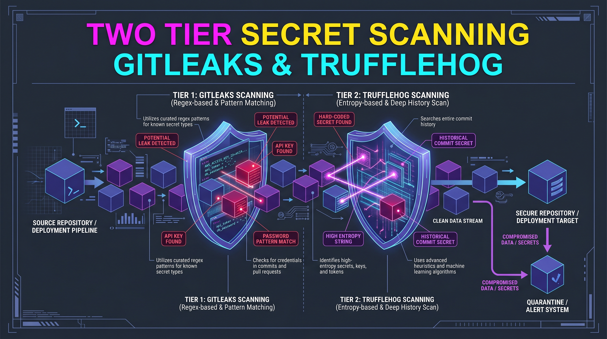

<!-- 🎨 HEADER IMAGE PROMPT & FILENAME
An awe-inspiring, hyper-realistic macro shot of a massive, two-tiered security shield made of dark titanium. Glowing laser scanning lines systematically sweep across a stream of floating data blocks. The words "Secret Scanner" are heavily embossed directly into the upper titanium chassis of the shield, backlit with glowing magenta neon that feels physically integrated into the machinery. Cinematic lighting, deep shadows with vibrant neon cyan and electric blue accents, volumetric dust particles. 8k resolution, octane render, architectural precision. PURE TECHNICAL GRAPHIC. NO mobile phone UI, NO status bars, NO device frames or bounding boxes. Wide aspect ratio, designed for high-fidelity technical documentation.

📋 Target Filename: adr-0002-adopt-gitleaks-and-trufflehog.jpeg
-->



# ADR-0002: Adopt Gitleaks and TruffleHog for Two-Tier Secret Scanning

```yaml
adr_number: "0002"
title: "Adopt Gitleaks and TruffleHog for Two-Tier Secret Scanning"
status: "Accepted"
version: "v1.4.0"
date: "2026-06-07"
created: "2026-06-07 12:00:00"
modified: "2026-07-21 19:01:45"
risk_level: "High"
reversibility: "Low"
security_scope: "Project"
tags: ["security", "secrets", "gitleaks", "trufflehog", "cyclonedx", "sbom"]
supersedes: []
superseded_by: []
```

## 1. Introduction and Goals

This Architectural Decision Record (ADR) formalises the decision to adopt a two-tier secret scanning strategy utilizing **Gitleaks** and **TruffleHog** for the `gitCommitGenerator` project.

As this project is intended to be a public repository, preventing credential leakage is paramount. While commercial solutions like GitGuardian and Snyk are available, a hard constraint for this project is that all tooling must be free, open-source, and highly portable for other developers.

### Core Goals

- Prevent accidental secret commits to the repository.
- Ensure all security tooling is free, open-source, and does not require paid subscriptions.
- Guarantee that any other developer can run the same security stack locally without excessive configuration overhead.

---

## 2. Architecture Constraints

- **No Paid Tiers**: The solution cannot rely on paid tiers or forced cloud subscriptions.
- **Portability**: The tools must be installable via `mise` and declared in `mise.toml` to guarantee any developer can easily replicate the security environment.
- **Performance**: Pre-commit checks must be fast enough not to disrupt the local development loop.

---

## 3. Context and Scope

We evaluated three major options: GitGuardian, Snyk, and a self-hosted/open-source approach (Gitleaks + TruffleHog).

- **GitGuardian / Snyk**: Both provide excellent secret scanning but push heavily towards their paid/cloud SaaS tiers. While free tiers exist, they introduce friction and potential account requirements for external contributors.
- **Gitleaks**: Exceptionally fast, regex-based scanner, perfect for pre-commit hooks.
- **TruffleHog**: Deep active verification scanner. Slower but highly accurate, making it ideal for CI/CD pipelines.

---

## 4. Solution Strategy

We are implementing a **Two-Tier Secret Scanning Strategy**:

### Tier 1: Local Prevention (Gitleaks)

- **Tool**: Gitleaks
- **Role**: Pre-commit hook.
- **Reasoning**: Its regex-based engine is blazing fast, providing immediate feedback to the developer before a commit is even created.

### Tier 2: Deep Verification (TruffleHog)

- **Tool**: TruffleHog
- **Role**: CI/CD Pipeline step.
- **Reasoning**: TruffleHog actively verifies found secrets against provider APIs (e.g., checking if an AWS key is actually active). This is slower but provides an ultimate safety net before code is merged into `main`.

Both tools are explicitly declared in the project's `mise.toml` to ensure they are automatically installed for any contributor.

---

## 5. Consequences

- **Pros**:
  - 100% free and open-source.
  - Zero vendor lock-in.
  - Highly portable local setup using `mise`.
  - Perfect balance of speed (Gitleaks locally) and thoroughness (TruffleHog in CI).
- **Cons**:
  - Requires maintaining two separate tools.
  - May require tuning `.gitleaksignore` for false positives.

---

## II. Update 1: Replacement of Snyk with Native GitHub Security Tooling and Addition of Codecov (v1.1.0)

During the continuous evolution of our CI pipeline, it was determined that Snyk—previously utilized as a pre-commit hook and a CI check—enforces severe execution limits on its free tier, even for public repositories (often flagging "private test limits" incorrectly or via shared Webhook usage). This frequently blocked valid Pull Requests and hindered developer momentum.

To address this, Snyk has been entirely removed from both the local `hk.pkl` hooks and the CI workflows. In its place, we have adopted fully native and genuinely free GitHub tooling to handle SAST and SCA workloads without compromising scan quality.

### Adopted Alternatives

1. **GitHub CodeQL (SAST)**:
   - **Role**: Replaces `snyk code test`.
   - **Reasoning**: CodeQL is an industry-leading semantic analysis engine that compiles Python to trace deep vulnerabilities. It is 100% free and unlimited for open-source repositories natively inside GitHub Actions.
2. **Dependabot (SCA)**:
   - **Role**: Replaces Snyk's dependency scanning.
   - **Reasoning**: Natively integrated into GitHub, Dependabot is completely free for all repositories. It automatically scans dependencies and opens Pull Requests to address vulnerabilities without external quota limitations.

### Addition of Codecov

While configuring the CI pipeline, **Codecov** was also integrated to handle test coverage reporting. Codecov provides free, unmetered coverage analytics for public open-source repositories.

- **Tokenless Support**: As verified by proof provided for this project, no token is needed for our public repositories to upload coverage metrics, drastically simplifying secrets management for external contributors while delivering robust visual coverage metrics directly on Pull Requests.

### References

- [GitHub CodeQL for Open Source](https://docs.github.com/en/code-security/code-scanning/introduction-to-code-scanning/about-code-scanning)
- [Dependabot Documentation](https://docs.github.com/en/code-security/dependabot)
- [Codecov Public Repositories Documentation](https://docs.codecov.com/docs/adding-the-codecov-token)

---

## III. Update 2: Proposed Consolidation of Secret Scanning to BetterLeaks (v1.2.0)

As the project scales, maintaining two disparate tools for local prevention (Gitleaks) and CI verification (TruffleHog) could introduce configuration drift and duplicated efforts when tuning false positives.

To streamline the secret scanning architecture, we plan to migrate from the two-tier Gitleaks/TruffleHog setup to **BetterLeaks**.

### Rationale

- **Unified Tooling**: BetterLeaks would act as an all-in-one "next-gen secret scanner" that combines the fast, regex-based scanning capabilities needed for local pre-commit hooks with the active verification capabilities required in CI pipelines.
- **Simplified Configuration**: Relying on a single `betterleaks.toml` configuration would reduce overhead, preventing the need to synchronise a `.gitleaksignore` file and TruffleHog's equivalent.
- **Portability Maintained**: BetterLeaks would be seamlessly integrated into `mise.toml` and local pre-commit hooks (`hk.pkl`), retaining the original portability constraint of the project.

### References

- [BetterLeaks GitHub Repository](https://github.com/betterleaks/betterleaks)

---

## IV. Update 3: The Anchore Security Ecosystem (Syft, Grype, and Grant) (v1.3.0)

As part of our holistic approach to supply chain security, we have transitioned our SBOM, vulnerability scanning, and license compliance pipeline to utilize the complete Anchore ecosystem: **Syft**, **Grype**, and **Grant**.

### Rationale

- **Multi-Language Support**: While our backend is Python (managed via `uv`), the interactive TUI layer relies on Go (`gum` / Charmbracelet). The previously adopted `cyclonedx-py` generator was blind to compiled Go binaries and `go.mod`.
- **Zero-Friction Integration**: Syft seamlessly scans both Python lockfiles and compiled Go binaries without requiring complex build environments, simultaneously outputting both CycloneDX and Syft JSON formats.
- **Vulnerability Scanning Integration**: Grype directly consumes the SBOMs generated by Syft, providing an instant, local, and CI-friendly vulnerability assessment.
- **License Compliance Verification**: Grant perfectly rounds out the ecosystem by verifying the licenses of all detected dependencies directly against the Syft SBOM, ensuring open-source compliance without requiring an extra scanner.
- **Proven CI Pipeline**: The complete trio has been proven to execute reliably in both GitHub Actions and local `act` environments using direct binary downloads, avoiding dependency on potentially unmaintained third-party GitHub Actions.
- **SBOM Tool Comparison**: See the [SBOM Tool Comparison](../supportingDocumentation/sbomToolComparison.md) for the detailed technical breakdown between `syft`, `cdxgen`, and `sbom-tool` that led to this decision.

### References

- [Syft GitHub Repository](https://github.com/anchore/syft)
- [Grype GitHub Repository](https://github.com/anchore/grype)
- [Grant GitHub Repository](https://github.com/anchore/grant)

---

---

## V. Update 4: betterleaks-local / TruffleHog-CI pin posture (v1.4.0)

> Append-only clarification for Issue #170. Historical gitleaks text above is preserved.

### Current posture

| Layer                   | Tool                                    | Notes                                                                                 |
| ----------------------- | --------------------------------------- | ------------------------------------------------------------------------------------- |
| Local pre-commit (fast) | **betterleaks** via `hk.pkl` + mise pin | Staged-path secrets scan; not a substitute for deep verification                      |
| Local deep scan (opt.)  | **TruffleHog CLI** via mise             | Same OSS engine as CI; free/portable; no cloud account; see invocation below          |
| CI secrets (deep)       | **TruffleHog** GitHub Action            | Action commit **SHA-pinned** + scanner **version** pinned; per-event base/head ranges |
| SBOM / vuln / license   | **Syft / Grype / Grant** via mise       | Exact versions in `mise.toml`; no `curl \| sh` installers in CI                       |
| Coverage upload         | **Codecov** OIDC                        | Same-repo `use_oidc: true`; fork PRs skip upload                                      |

### Local TruffleHog CLI (portability)

CI remains the authoritative deep scan (GitHub Action). Contributors can reproduce the same **open-source** TruffleHog engine locally without cloud accounts or paid subscriptions:

```bash
# Project pin lives in mise.toml (trufflehog = "3.95.9"); install with the toolchain:
mise install

# Repo-local deep scan (verified findings only; mirrors CI extra_args posture)
trufflehog git file://"$PWD" --only-verified
```

Notes:

- Local CLI and CI Action both run **TruffleHog OSS**; CI pins Action SHA + `version: "3.95.9"`.
- Prefer matching the CI scanner version (`3.95.9`) when installing the CLI so local/CI findings stay comparable.
- `betterleaks` stays the **fast pre-commit** gate; TruffleHog remains the **deep** verifier (CI always; local optional).

### Pin bar

- Third-party Actions touched by security/CI workflows use **full commit SHAs**
- Scanner **payload** versions are pinned independently of Action tags (TruffleHog `version:` input)
- Floating `@main` / tool `latest` is rejected for TruffleHog and the Anchore trio in CI

### References

- Issue #170 — Codecov PR signal, hk CI parity, and pipeline hardening
- [hk configuration](https://hk.jdx.dev/configuration.html)
- [TruffleHog GitHub Action](https://github.com/trufflesecurity/trufflehog)

---

## CHANGELOG

- v1.4.0 (2026-07-21): Documented betterleaks-local / TruffleHog-CI dual posture, local mise-managed TruffleHog CLI portability path, Action+payload pin bar, mise-pinned Anchore tools, and Codecov same-repo OIDC (Issue #170).
- v1.0.0 (2026-06-07 12:00:00): Initial drafting and finalization of the two-tier secret scanning strategy using Gitleaks and TruffleHog.
- v1.1.0 (2026-06-18): Replaced Snyk with GitHub CodeQL and Dependabot to resolve execution limits; documented the addition of tokenless Codecov for coverage metrics.
- v1.2.0 (2026-06-18): Proposed the future migration from Gitleaks and TruffleHog to BetterLeaks for unified secret scanning and active verification.
- v1.3.0 (2026-07-02 20:47:00): Added the Anchore Security Ecosystem (Syft, Grype, and Grant) for automated SBOM generation, vulnerability scanning, and license compliance within the CI pipeline.
