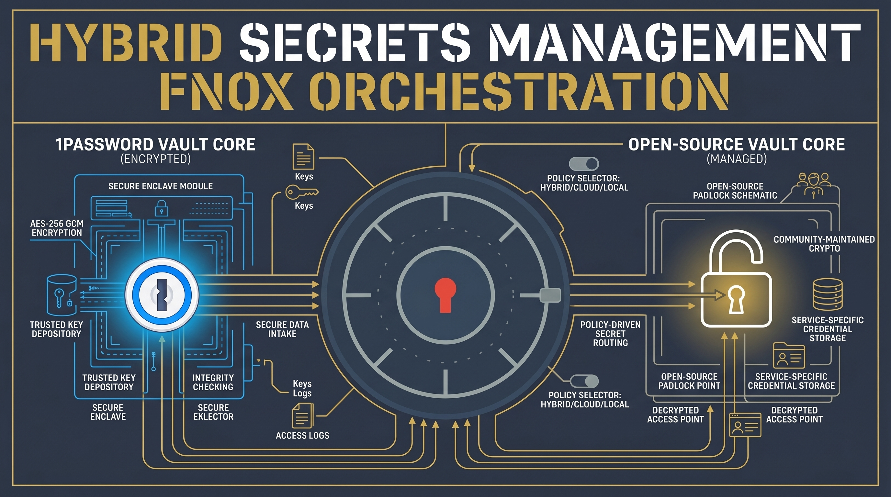

<!-- 🎨 HEADER IMAGE PROMPT & FILENAME
[USE PROVIDED REFERENCE IMAGE FOR THE FNOX LOGO]
A hyper-detailed, photorealistic macro-photography shot of a massive vault door styled with a dark slate blue (#2d3548) and metallic gold (#d4af37) color palette. Perfectly incorporate the provided fnox logo reference image (the dark navy blue dial with concentric rings and a red keyhole) as the central locking mechanism of the vault. Make the logo appear physically constructed into the door, with realistic metallic textures and a subtly glowing bright red keyhole. Emblazoned across the metal casing next to the dial in "Black Ops One" stencil-style typography is the word "fnox", glowing subtly with a soft metallic gold light. Cinematic lighting, extreme depth of field, volumetric dust particles. 8k, Unreal Engine 5 render style, architectural precision. PURE TECHNICAL GRAPHIC. NO mobile phone UI, NO status bars, NO device frames or bounding boxes. Wide aspect ratio, designed for high-fidelity technical documentation.

📋 Target Filename: adr-0003-adopt-fnox-for-secrets-management.jpeg
-->
<div align="center">

</div>

# ADR-0003: Adopt fnox for Hybrid Secrets Management

```yaml
adr_number: "0003"
title: "Adopt fnox for Hybrid Secrets Management"
status: "Accepted"
version: "v1.0.0"
date: "2026-06-07"
created: "2026-06-07 12:10:00"
modified: "2026-06-07 12:10:00"
risk_level: "Medium"
reversibility: "High"
security_scope: "Project"
tags: ["security", "secrets", "fnox", "1password", "age"]
supersedes: []
superseded_by: []
```

## 1. Introduction and Goals

This Architectural Decision Record (ADR) formalizes the decision to adopt `fnox` as the primary secrets management and orchestration tool for the `gitCommitGenerator` project.

While 1Password is currently used for local development, mandating a commercial subscription for open-source contributors is an unacceptable constraint. We need a solution that enables the primary developer to continue using 1Password seamlessly while providing a free, secure fallback for contributors.

### Core Goals
- Establish a secure, version-controllable mechanism for production secrets.
- Allow 1Password to be used by those who have it (improving local DX).
- Provide a free, open-source fallback encryption method (`age`) for developers who do not have a 1Password subscription.
- Ensure tight integration with the existing `jdx` ecosystem (`mise`).

---

## 2. Architecture Constraints

- **No Contributor Paywalls**: Open-source contributors must not be forced to buy a commercial product to run the project.
- **Ecosystem Alignment**: The tool should integrate cleanly with `mise` (the project's chosen task/dependency runner).
- **Security**: Secrets must be strongly encrypted if committed to the repository.

---

## 3. Context and Scope

We evaluated `Dotenvx` and `fnox`:
- **Dotenvx**: Excellent for managing `.env` files across environments with public-key cryptography. However, it requires a slight paradigm shift and doesn't natively integrate with 1Password's CLI for automatic, local decryption without exporting values.
- **fnox**: A secrets manager built by `jdx` (the creator of `mise` and `hk`). It natively supports multiple backends, including 1Password. Crucially, it allows falling back to `age` (a simple, modern, and secure file encryption tool) for those without 1Password.

---

## 4. Solution Strategy

We will adopt **fnox** for managing secrets in this project.

### Implementation Details
1. **Primary Backend (1Password)**: Configured in `fnox` to allow the primary maintainer to use their existing 1Password CLI session to decrypt and inject secrets dynamically.
2. **Fallback Backend (`age`)**: Configured as the fallback mechanism. Open-source contributors will be provided with an `age` identity (or can generate their own for specific environments) to decrypt the secrets, which are securely encrypted and checked into the repository.
3. **Integration**: `fnox` will be declared in the project's `mise.toml` alongside `age` and `1password-cli` to guarantee the tooling is portable and instantly available to anyone cloning the repository.

---

## 5. Consequences

- **Pros**: 
  - Solves the open-source contributor paywall problem elegantly.
  - Maintainer doesn't have to abandon their preferred 1Password workflow.
  - Native, seamless integration with `mise`.
- **Cons**: 
  - Requires configuring and managing multiple backends within `fnox`.
  - Contributors still need to manage an `age` key securely if they need access to specific encrypted environments.

---

## 6. References

### fnox
- [fnox's DeepWiki](https://deepwiki.com/jdx/fnox)
- [fnox's Official Documentation](https://fnox.jdx.dev/)
- [fnox's GitHub](https://github.com/jdx/fnox)

### Dotenvx
- [Dotenvx's DeepWiki](https://deepwiki.com/dotenvx/dotenvx)
- [Dotenvx's Official Documentation](https://dotenvx.com/docs/introduction)
- [Dotenvx's GitHub](https://github.com/dotenvx/dotenvx)

---

## CHANGELOG

- v1.0.0 (2026-06-07 12:10:00): Initial drafting and finalization of the decision to adopt fnox for hybrid secrets management.
