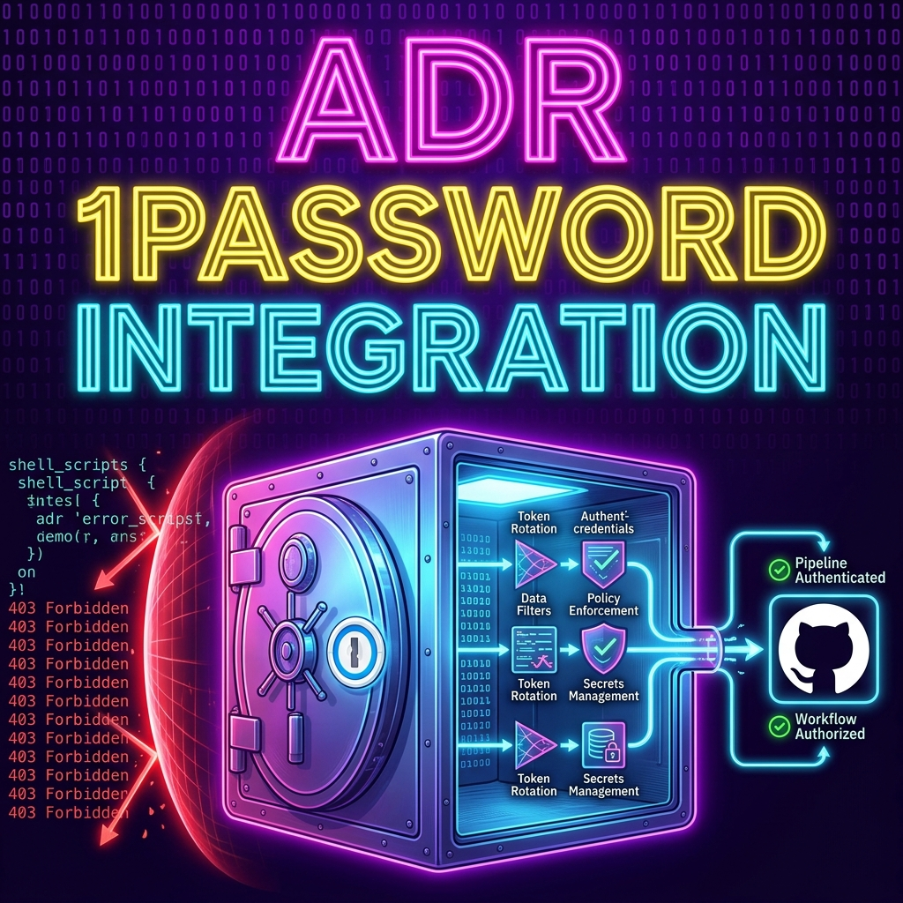
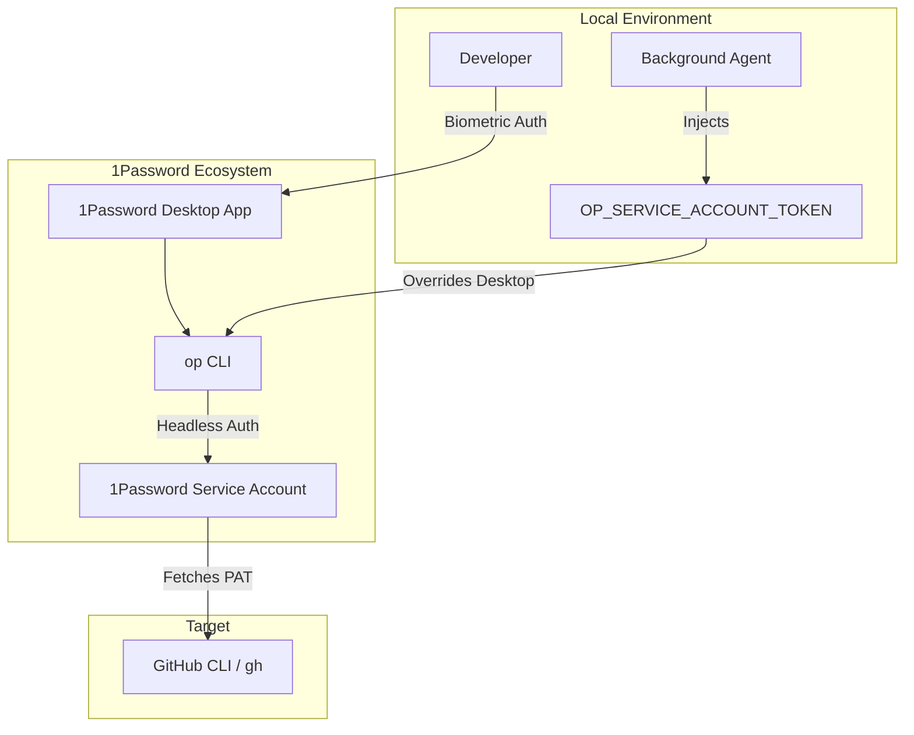
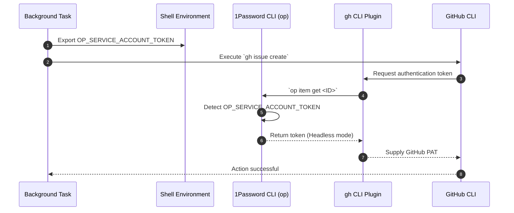

<!-- 🎨 HEADER IMAGE PROMPT & FILENAME
> A high-fidelity, highly detailed technical infographic. At the top center, a massive three-tier stylized heading reads 'ADR', '1PASSWORD', and 'INTEGRATION'. Each line uses a retro-tech multiline layered font with high-intensity neon glows: 'ADR' in hot magenta, '1PASSWORD' in electric yellow, and 'INTEGRATION' in electric cyan. The heading is framed by glowing deep electric purple binary code.
>
> Below the heading, a glowing, hermetically sealed vault with a 1Password logo. Outside the vault, chaotic shell scripts and '403 Forbidden' texts are blocked by a glowing red energy shield. Inside the vault, pristine streams of token data flow perfectly through geometric filters to a GitHub icon.
>
> PURE TECHNICAL GRAPHIC. NO mobile phone UI, NO status bars, NO battery icons, NO X buttons, NO device frames or bounding boxes. Wide aspect ratio, designed for document embedding.

📋 Target Filename: adr-0004-1password-service-account-integration.png
-->



# ADR-0004: 1Password Service Account Integration

```yaml
adr_number: "0004"
title: "1Password Service Account Integration"
status: "Superseded"
version: "v1.1.1"
date: "2026-06-08"
created: "2026-06-08T00:00:00"
modified: "2026-06-08T16:58:00"
risk_level: "Medium"
reversibility: "High"
security_scope: "Authentication"
tags: ["1password", "secrets", "github-cli", "troubleshooting"]
supersedes: []
superseded_by: ["0006"]
```

## 1. Introduction and Goals

The `gitCommitGenerator` (git-cg) relies on the GitHub CLI (`gh`) for remote repository interactions (e.g., creating issues, PRs). To enforce a zero-plaintext security model, the project fetches API tokens dynamically from 1Password via `op` CLI.

The primary goals are:

1. **Zero-Plaintext Security**: Ensure no GitHub PATs or other secrets are stored on disk.
2. **Stateless Automation**: Enable background agents and scripts to fetch tokens without requiring interactive biometric prompts.

## 2. Architecture Constraints

- **Execution Context Strictness**: Background tasks and AI agents lack an interactive TTY for biometric authentication, requiring headless operation.
- **Scope Isolation**: We must adhere to the principle of least privilege, restricting the token access to a specific 1Password vault (`Dev`) to limit blast radius in case of compromise.

## 3. Context and Scope

We encountered a critical incident where background tasks or AI agents attempting to use the `gh` CLI were repeatedly blocked with `(403) (Forbidden), You aren't authorized to access this resource`, despite the local user having an active `op signin` session.

The problem stems from the environment variable `OP_SERVICE_ACCOUNT_TOKEN`. When `OP_SERVICE_ACCOUNT_TOKEN` is present in the shell environment, the 1Password CLI (`op`) **completely bypasses the desktop app session integration**. It runs exclusively within the scope of that Service Account. If the Service Account only has access to a specific vault (e.g., `Dev`), but a tool's 1Password plugin (e.g., `~/.config/op/plugins/gh.json`) points to a different vault, the plugin will fail to fetch the token and throw a `403 Forbidden`.

## 4. Solution Strategy

**Mandate the scoped use of the 1Password Service Account for automated scripts.**

1. **Beta CLI Requirement**: Ensure the `1Password-cli` "BETA VERSION" is used globally or injected locally, as the required development environment features rely on this version.
2. **Environment UUID Isolation**: Target the specific `gitCommitGenerator` environment UUID (`ce3a5m2atri7cxq7mdvofergt4`) to restrict secret fetch access.
3. **Environment Injection**: Introduce `OP_SERVICE_ACCOUNT_TOKEN` via `mise.toml` or `.env` execution wrappers (`scripts/with_1p_env.sh`) for headless scripts.
4. **Plugin Alignment**: Standardize the configuration of 1Password CLI plugins (e.g. `gh.json`) to explicitly reference the `Dev` vault and the correct `item_id` accessible by the Service Account.
5. **Troubleshooting Playbook**: Establish clear validation steps to rapidly diagnose `403` errors arising from shell overrides.

## 5. Building Block View



## 6. Runtime & Deployment View



## 7. Cross-cutting Concepts

- **Environment Override**: Standard environment variable prioritization completely overrides desktop GUI integration.
- **Stateless Execution**: The Service Account architecture ensures scripts are fully deterministic and repeatable across different machines or CI environments without manual login states.

## 8. Impact Radius (Cause, Change, Effect)

### 1. `scripts/with_1p_env.sh`

- **Cause**: Background tasks need a stateless way to access 1Password without biometric prompts.
- **Change**: Introduce `OP_SERVICE_ACCOUNT_TOKEN` injection wrapper.
- **Effect**: 1Password operations within automated scripts now execute headlessly, overriding Desktop integration.

### 2. `~/.config/op/plugins/gh.json`

- **Cause**: The Service Account is tightly scoped and lacks access to personal or default vaults.
- **Change**: Plugin `vault_id` and `item_id` must explicitly target the `Dev` vault.
- **Effect**: If the plugin configuration drifts, CLI commands like `gh` will fail with `403 Forbidden`.

## 9. Consequences

- **Pros**:
  - Automated scripts do not rely on the user's local biometric session to execute.
  - Zero plaintext keys are stored on the disk.
- **Cons**:
  - The Service Account execution model can silently override local desktop integration, leading to confusing `403` errors if plugin configs are not aligned with the Service Account's vault access.

## 10. Verification Plan

### Automated Verification

- [ ] Execute background scripts using `with_1p_env.sh` and confirm they successfully interact with GitHub without blocking for biometrics.

### Manual Verification

- [ ] Export `OP_SERVICE_ACCOUNT_TOKEN` locally in a terminal.
- [ ] Run `gh auth status`.
- [ ] Confirm successful authentication via the service account token.
- [ ] Verify `op vault list` only displays the authorized vaults (e.g. `Dev`).

## 11. Review / Revisit Criteria

Revisit this architecture if 1Password introduces a newer, more robust headless authentication primitive that does not globally override desktop integration via a single environment variable, or if we migrate away from GitHub CLI plugins to a different secrets manager.

## 12. Rollback Strategy

1. Remove `OP_SERVICE_ACCOUNT_TOKEN` from `mise.toml` and `.env` files.
2. Delete `scripts/with_1p_env.sh`.
3. Return to relying on the interactive 1Password desktop application.

## 13. Troubleshooting Procedures

If CLI plugins (like `gh`) throw `403 Forbidden` errors during execution:

1. **Verify Shell Environment**: Check if `OP_SERVICE_ACCOUNT_TOKEN` is exported in the shell. If it is, `op` is restricted strictly to the service account's vaults, overriding the desktop app.
   ```bash
   echo $OP_SERVICE_ACCOUNT_TOKEN
   ```
2. **Verify Vault Access**: Ensure the service account has access to the vault containing the required token.
   ```bash
   op vault list
   op item list --vault="Dev"
   ```
3. **Validate Plugin Configuration**: Check the plugin configuration to ensure `vault_id` and `item_id` point to an accessible vault for the Service Account.
   ```bash
   cat ~/.config/op/plugins/gh.json
   ```
   If it points to a wrong vault, manually update `~/.config/op/plugins/gh.json` or clear and re-initialize the plugin interactively.
4. **Verify Token Scopes**: Ensure the token itself has the required scopes for the requested action.

## 14. Governance Follow-up

- **Antigravity rule assessment**: Ensure any new agents or tools operating on this repository are aware of the `OP_SERVICE_ACCOUNT_TOKEN` override behavior.
- **Affected rule**: Authentication and Secret Injection Protocols.

## CHANGELOG


- v1.0.0 (2026-06-08T00:00:00): Initial Draft created.
- v1.1.0 (2026-06-08T12:00:00): Expanded to full ADR template standard (-vvv) with Mermaid diagrams, full Impact Radius, and Verification plans.
- v1.1.1 (2026-06-26): Structural formatting, metadata conversion, and heading standardizations.

<!-- ## Supporting Visual Aids

### Visual Aid Selection Rationale

- **Primary data shape or explanatory need**: System topology and authentication flow override.
- **Chosen visual aid**: Mermaid Flowchart and Sequence Diagram.
- **Why this visual aid was chosen**: Clearly illustrates the divergence between interactive biometric authentication and the headless environment-variable override.
-->
