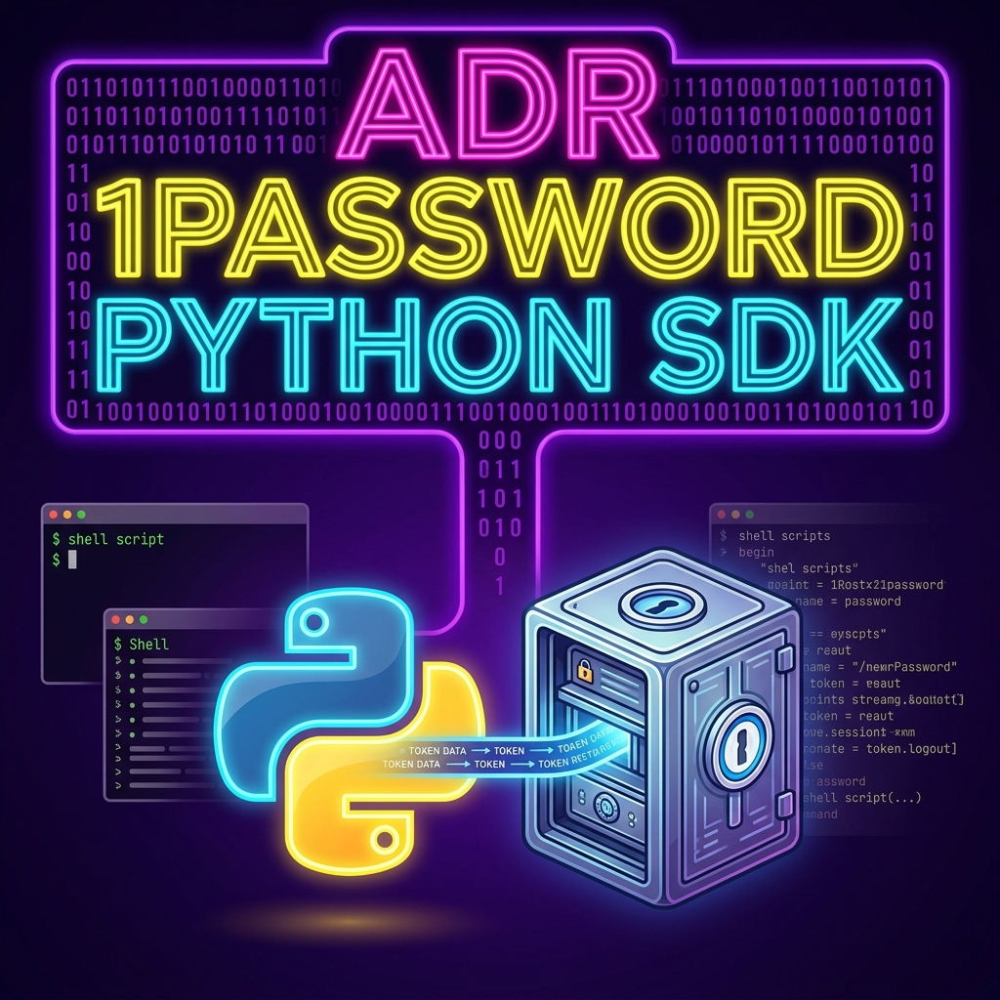
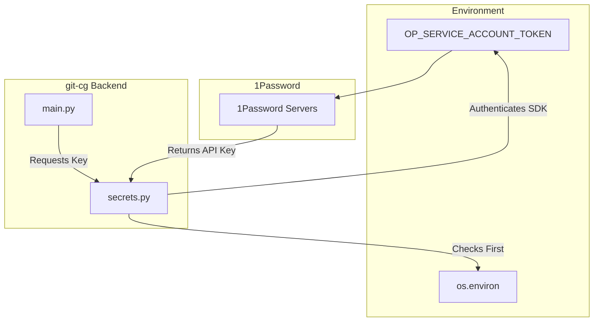
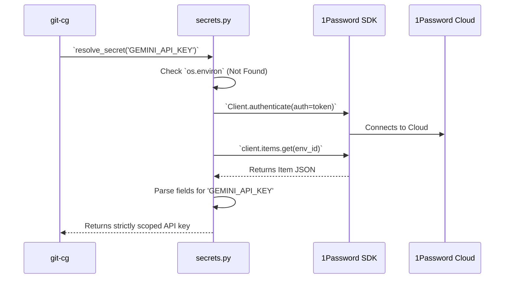

<!-- 🎨 HEADER IMAGE PROMPT & FILENAME
> A high-fidelity, highly detailed technical infographic. At the top center, a massive three-tier stylized heading reads 'ADR', '1PASSWORD', and 'PYTHON SDK'. Each line uses a retro-tech multiline layered font with high-intensity neon glows: 'ADR' in hot magenta, '1PASSWORD' in electric yellow, and 'PYTHON SDK' in electric cyan. The heading is framed by glowing deep electric purple binary code.
>
> Below the heading, a glowing Python logo intertwines seamlessly with a 1Password vault. Pristine streams of token data flow directly from the vault into the Python core, bypassing external terminal screens and shell scripts which are shown fading away into the background.
>
> PURE TECHNICAL GRAPHIC. NO mobile phone UI, NO status bars, NO battery icons, NO X buttons, NO device frames or bounding boxes. Wide aspect ratio, designed for document embedding.

📋 Target Filename: adr-0006-1password-python-sdk-migration.png
-->



# ADR-0006: 1Password Python SDK Migration

```yaml
adr_number: "0006"
title: "1Password Python SDK Migration"
status: "Implemented"
version: "v1.0.1"
date: "2026-06-08"
created: "2026-06-08T16:55:00"
modified: "2026-06-08T16:55:00"
risk_level: "Low"
reversibility: "High"
security_scope: "Authentication"
tags: ["1password", "sdk", "python", "secrets"]
supersedes: ["0004"]
superseded_by: []
```

## 1. Introduction and Goals

To fetch API keys required by `gitCommitGenerator`, we previously relied on injecting secrets into the environment via the `op environment read` CLI wrapper (`with_1p_env.sh`) utilizing a Service Account Token.

This ADR migrates the project to natively utilize the **1Password Python SDK** (`onepassword-sdk`), eliminating brittle shell wrappers.

The primary goals are:

1. **Native Secret Resolution**: Embed secret fetching directly within the Python runtime rather than mutating the host shell environment.
2. **Eliminate Subprocess Overrides**: Prevent the global `OP_SERVICE_ACCOUNT_TOKEN` environment variable from bleeding into sub-processes (like `gh` CLI plugins), which resulted in `403 Forbidden` errors due to differing vault scopes.

## 2. Architecture Constraints

- **Token Injection Requirements**: The SDK still requires the Service Account token (`OP_SERVICE_ACCOUNT_TOKEN`), but it is consumed directly by the `onepassword.Client` rather than globally mutating `op` CLI behaviour.
- **Fallback Scenarios**: Standard environment variables (`os.environ`) should continue to take precedence over the 1Password SDK, allowing CI/CD pipelines to function identically without needing 1Password Service Accounts if secrets are provided directly.

## 3. Context and Scope

The previous implementation (documented in `ADR-0004`) was flawed because exporting `OP_SERVICE_ACCOUNT_TOKEN` globally forces the 1Password CLI (`op`) to bypass the user's interactive biometric session. This broke any sub-processes (e.g., `gh issue create`) that depended on the interactive `op` session to fetch tokens from vaults the Service Account didn't have access to.

## 4. Solution Strategy

**Integrate the 1Password Python SDK for programmatic secret resolution.**

1. Add `onepassword-sdk` as a core dependency.
2. Create a centralized `secrets.py` module to encapsulate the SDK logic.
3. Remove `scripts/with_1p_env.sh` and any reliance on the `op environment read` beta feature.
4. Initialize the `onepassword.Client` natively in Python.

## 5. Building Block View



## 6. Runtime & Deployment View



## 7. Cross-cutting Concepts

- **State Isolation**: The Python script is now decoupled from the system `op` CLI context, ensuring standard desktop flows are unaffected.
- **Error Safety**: The SDK failure cases (e.g., lack of token or network issues) gracefully fall back to missing values without crashing the tool, mimicking `os.environ.get()` behaviour.

## 8. Impact Radius (Cause, Change, Effect)

### 1. `scripts/with_1p_env.sh`

- **Cause**: Replaced by native SDK logic.
- **Change**: Deleted entirely.
- **Effect**: Simplified `mise.toml` tasks and simplified local execution.

### 2. `src/git_cg/secrets.py`

- **Cause**: Need a unified entry point for secret resolution.
- **Change**: New module created to wrap SDK client logic.
- **Effect**: Secrets are safely retrieved without polluting `os.environ`.

## 9. Consequences

- **Pros**:
  - Solves the `403 Forbidden` issues natively by preserving `op` CLI behaviour for sub-processes.
  - Removes the dependency on `1Password-cli` "BETA VERSION" locally for developers.
  - Increases cross-platform robustness.
- **Cons**:
  - Introduces a new pip dependency (`onepassword-sdk`).

## 10. Verification Plan

### Automated Verification

- Ensure tests correctly resolve standard `os.environ` keys without invoking the SDK.

### Manual Verification

- Run `git commit` via `git-cg`. Confirm successful extraction of secrets from the specified 1Password Environment UUID.
- Verify `gh` commands executed via the system (if any) succeed normally.

## 11. Review / Revisit Criteria

Revisit if 1Password introduces a more stable way to inject environments into isolated child processes via standard configurations without bleeding context globally.

## 12. Rollback Strategy

1. Remove `onepassword-sdk` from `pyproject.toml`.
2. Delete `src/git_cg/secrets.py`.
3. Restore `with_1p_env.sh` and revert `main.py` back to standard `os.environ.get()` calls.

## 13. Governance Follow-up

- **Antigravity rule assessment**: The `1Password SDK` is now the canonical method for extracting secrets in Python tools within this ecosystem.

## CHANGELOG


- v1.0.0 (2026-06-08T16:55:00): Initial Draft created.
- v1.0.1 (2026-06-26): Structural formatting, metadata conversion, and heading standardizations.

<!-- ## Supporting Visual Aids

### Visual Aid Selection Rationale

- **Chosen visual aid**: Mermaid Flowchart and Sequence Diagram.
- **Why this visual aid was chosen**: Clearly demonstrates the SDK resolving directly to 1Password cloud without intercepting or utilizing the system `op` binaries.
-->
