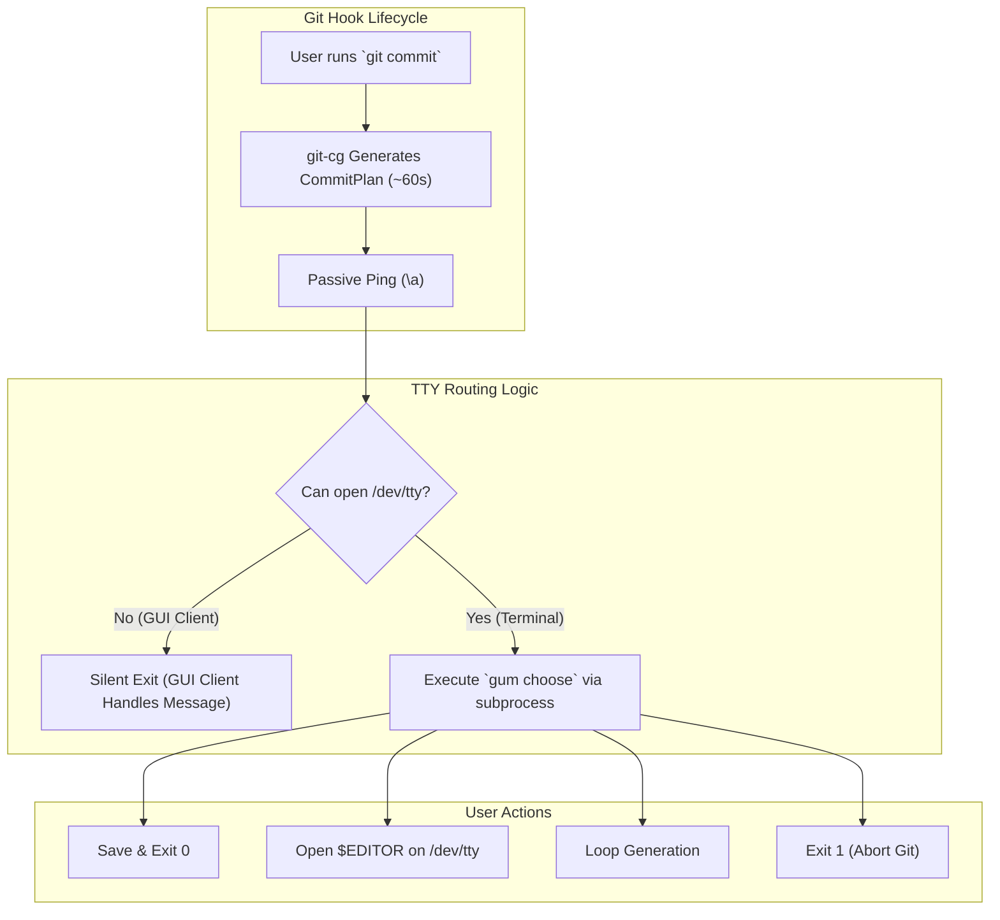
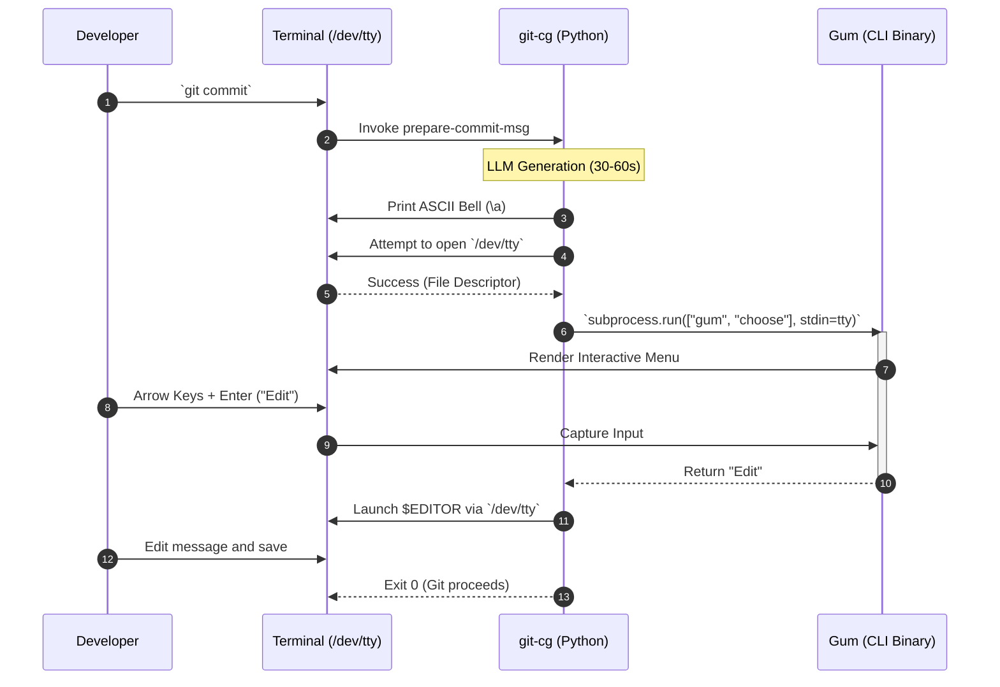
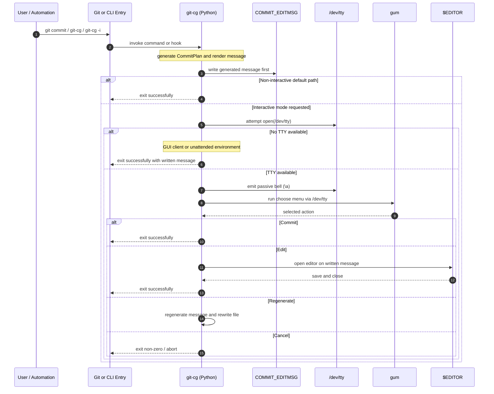

<!-- 🎨 HEADER IMAGE PROMPT & FILENAME
A high-fidelity, photorealistic cyberpunk macro-photography shot of a sleek, glowing holographic terminal interface projecting from a mechanical keyboard. The terminal displays a vibrant, neon magenta and cyan selection menu with the options hovering in mid-air. In the background, out of focus, a dusty, obsolete mechanical alarm bell (representing the old alerter) is disconnected and cast aside. Liquid cooling tubes and fiber optic cables route directly into the keyboard. Cinematic lighting, deep shadows with electric blue accents, volumetric smoke. 8k resolution, octane render, architectural precision. PURE TECHNICAL GRAPHIC. NO mobile phone UI, NO status bars, NO device frames or bounding boxes. Wide aspect ratio, designed for high-fidelity technical documentation.

📋 Target Filename: adr-0007-gum-terminal-native-tui.jpeg
-->
<div align="center">

</div>

# ADR-0007: Integrate Gum for Terminal-Native Git Hook TUI

```yaml
adr_number: "0007"
title: "Integrate Gum for Terminal-Native Git Hook TUI"
status: "Proposed"
version: "v1.1.1"
date: "2026-06-09"
created: "2026-06-09 10:00:00"
modified: "2026-06-09 11:45:00"
risk_level: "Medium"
reversibility: "High"
security_scope: "Local Operations"
tags: ["tui", "gum", "git-hooks", "ux", "python", "charmbracelet"]
supersedes: []
superseded_by: []
```

## 1. Introduction and Goals

The `gitCommitGenerator` (`git-cg`) utility executes a local LLM generation process during the `prepare-commit-msg` Git hook. Because this generation takes 30-90 seconds, users require a notification upon completion and an interactive menu to decide how to proceed (Commit, Edit, Regenerate, Cancel).

The initial proposal utilized `vjeantet/alerter`, a macOS GUI notification tool with interactive buttons. However, relying on GUI notifications to control a terminal-based Git hook introduces critical user experience and system stability flaws (specifically, deadlocks during "Do Not Disturb" modes).

This ADR mandates replacing the GUI-based `alerter` with **`gum`** (a highly polished CLI utility built on the Charmbracelet Bubble Tea framework) to provide a terminal-native, keyboard-centric User Interface (TUI).

The primary goals are:

1. **Eliminate Deadlocks**: Prevent Git from hanging indefinitely when macOS Focus modes suppress notifications.
2. **Keyboard-Centric UX**: Keep the developer's hands on the keyboard, eliminating the context switch of grabbing a mouse to click a desktop notification.
3. **Graceful Degradation**: Ensure the hook falls back silently and safely when invoked by GUI Git clients (e.g., VS Code, Tower) where a terminal TTY is unavailable.

## 2. Architecture Constraints

- **Git Hook Execution Context**: The TUI must operate within the restrictive environment of a Git hook, where standard input (`stdin`) is often detached from the user's keyboard. The solution must explicitly route to `/dev/tty`.
- **Language Barrier**: `git-cg` is a Python application. We cannot write custom Go code (Bubble Tea) without introducing massive multi-language compilation complexity. The TUI must be callable as an external binary.
- **Ecosystem Alignment**: The tool must be easily provisioned via the existing `mise` toolchain without requiring manual downloads or `sudo` installations.

## 3. Context and Scope

The previous integration with `alerter` exposed several anti-patterns for CLI development:

- **The DND Deadlock**: macOS Focus modes swallow `alerter` notifications into the sidebar. Because `alerter` was configured with `--timeout 0`, the Python script hung forever waiting for a click, locking the `.git/index.lock` file and breaking the repository until manually intervened.
- **Focus Loss**: Clicking "Edit" on a macOS notification does not bring the terminal back into focus, leaving the user confused as `$EDITOR` (`nano`/`vim`) opens invisibly in the background.

We need a solution that notifies the user without blocking (a passive ping), and then presents the decision matrix exactly where the user initiated the command: inside the terminal.

## 4. Solution Strategy

We will adopt a **Terminal-Native TUI + Passive Ping** architecture using `gum`:

1. **Passive Ping**: Instead of a blocking GUI alert, `git-cg` will print the ASCII bell character (`\a`). This natively bounces the terminal dock icon or plays the system ping sound, notifying the user that the 60-second generation is complete without locking the process.
2. **Environment (TTY) Check**: `git-cg` will attempt to open `/dev/tty`. If this fails (indicating the commit was triggered by a GUI Git client without an interactive terminal), the script will gracefully exit, allowing the GUI client to display the generated message in its native input box.
3. **Gum TUI**: If `/dev/tty` is available, `git-cg` will call `subprocess.run(["gum", "choose", ...], stdin=tty)`. `gum` is a pre-compiled Go binary built with Bubble Tea that renders a gorgeous, arrow-key navigable menu directly in the terminal.
4. **Toolchain Integration**: `gum` will be added to `mise.toml` (`gum = "latest"`), ensuring it is automatically provisioned for all developers.

## 5. Building Block View



## 6. Runtime & Deployment View



## 7. Cross-cutting Concepts

- **Composability**: By using `gum` instead of writing native Bubble Tea Go code, we maintain our pure Python architecture while still leveraging Charmbracelet's premium UX.
- **Portability**: Unlike `alerter`, which relies on proprietary macOS `UNUserNotificationCenter` APIs, `gum` is cross-platform. If `git-cg` is ever ported to Linux, the TUI will function identically without code changes.
- **Safe Degradation**: The explicit `/dev/tty` check ensures that GUI Git users are never frozen by an invisible terminal prompt awaiting input.

## 8. Supporting Visual Aids

### Visual Aid Selection Rationale

- **Primary data shape or explanatory need**: System topology for execution routing and a timeline of the user interaction loop.
- **Chosen visual aid**: Mermaid Flowchart and Sequence Diagram.
- **Why this visual aid was chosen**: The flowchart clearly delineates the critical fork in execution logic (TTY vs No TTY). The sequence diagram illustrates how control is passed between Python, the external `gum` binary, and the user's terminal to circumvent standard Git hook limitations.

## 9. Impact Radius (Cause, Change, Effect)

| Component | Change | Effect |
| :--- | :--- | :--- |
| `src/git_cg/notifier.py` | Deleted / Deprecated | Removal of the brittle `vjeantet/alerter` subprocess logic. |
| `src/git_cg/main.py` | Added `/dev/tty` check and `gum` invocation | Centralizes the user interaction loop natively within the orchestrator script. |
| `mise.toml` | Added `gum = "latest"` | Guarantees the binary is present in the environment before the hook fires. |
| Developer Workflow | Shifts from Mouse to Keyboard | Faster context-switching; terminal never loses focus when opening `$EDITOR`. |

## 10. Consequences

### Positive

- **Zero Deadlocks**: "Do Not Disturb" mode no longer hangs the repository.
- **Superior UX**: Keeps the developer in the terminal, utilizing fast arrow-key navigation.
- **Correct Editor Focus**: When selecting "Edit", `nano` or `vim` opens instantly in the foreground because the terminal never lost focus.

### Negative

- **Missed Notifications**: If the developer walks away from their desk and misses the audio/visual terminal bell, there is no persistent desktop notification waiting for them (though the terminal will safely wait indefinitely for their input).

## 11. Verification Plan

- [ ] **Terminal Test**: Execute `git commit` from a standard terminal (Ghostty/iTerm). Verify the bell sounds, `gum` renders correctly, and arrow keys function.
- [ ] **Editor Test**: Select "Edit" in `gum` and verify `$EDITOR` opens seamlessly on `/dev/tty`.
- [ ] **GUI Client Test**: Execute a commit from VS Code's source control panel. Verify `git-cg` exits silently and the generated message populates the VS Code input box without hanging.
- [ ] **DND Test**: Turn on macOS "Do Not Disturb" and ensure the commit process still executes and prompts via `gum` without issues.

## 12. Review / Revisit Criteria

Revisit this architectural decision if a native Python library (such as `Textual` or `rich.prompt`) is determined to be lighter weight or more performant than executing the external `gum` binary, or if `gum` introduces breaking changes to its subprocess output formatting.

## 13. Rollback Strategy

1. Remove `gum` from `mise.toml`.
2. Revert `src/git_cg/main.py` to either silently accept the commit without a prompt, or utilize a basic Python `input()` (routed through `/dev/tty`) as a primitive fallback.
3. Do not roll back to `alerter` due to the proven system deadlock risks.

## 14. Implementation Findings

_(To be populated post-implementation)_

## 15. Governance Follow-up

- Update `usage.kdl` or internal project documentation to reflect the new dependency on `gum`.
- Ensure `hk.pkl` logic correctly scopes terminal execution requirements.

## 16. Links & References

- [Charmbracelet Gum Documentation](https://github.com/charmbracelet/gum)
- [Git Hooks and /dev/tty Constraints](https://git-scm.com/docs/githooks)
- [vjeantet/alerter](https://github.com/vjeantet/alerter)

---

## II. Refinement 1: Dual-Mode Terminal Interaction Strategy (v1.1.0)

Following architectural review of the original gum proposal, the solution has been refined substantially. The first version of this ADR correctly identified that `alerter` was the wrong control surface for a Git hook, and it correctly moved the interaction back toward the terminal. However, the initial form of that decision still framed the terminal interaction as though it should become the dominant runtime path for all commit operations.

That is not the best implementation.

The more correct model is a **dual-mode strategy** in which terminal-native TUI interaction is available as a feature of the tool, but never becomes a requirement for successful operation. This refinement preserves the original usability goals while also protecting non-interactive execution paths such as CI/CD, scripted automation, GUI Git clients, and straightforward one-shot command use.

In practical terms, the architectural decision is now sharpened as follows:

1. **`gum` remains the preferred TUI implementation technology.** The project should still use `gum` rather than direct Bubble Tea, because `gum` preserves the Python architecture, avoids introducing a Go build-and-release subsystem, and aligns cleanly with `mise`-managed binary provisioning.
2. **The TUI is an opt-in interaction layer, not a mandatory gate.** The tool must remain fully usable in unattended, scripted, and CI/CD contexts.
3. **The non-interactive path remains first-class.** The tool must be able to generate, write, and complete a commit without any user intervention when that behavior is desired.
4. **Interactive behavior should be explicit.** A mode such as `git-cg -i` is both valid and desirable because it makes the presence of an interactive review step intentional instead of implicit.
5. **The hook path must remain conservative and safe.** A `prepare-commit-msg` hook should not become dependent on a TUI in order to succeed.

This refinement does not invalidate the original ADR. Rather, it clarifies the operational contract and prevents the project from accidentally replacing one brittle interaction assumption (`alerter`) with another overly broad one (always-open gum interaction).

### 1. Architectural Catalyst for the Refinement

The catalyst for this refinement is the recognition that the project has two equally legitimate operating modes, and the original text gave too much weight to only one of them.

`git-cg` is not merely a local convenience wrapper for interactive terminal use. It is also:

- a Git hook participant
- a candidate for unattended execution
- a tool that must remain usable from GUI Git clients
- a workflow component that may be exercised by scripts, automation, or CI/CD-like environments

If the architecture were to force the TUI into the primary execution path, it would introduce a new category of failure:

- missing TTY
- hidden interactivity in automation
- blocked pipelines
- inconsistent behavior between terminal and GUI contexts

That is unacceptable.

The TUI therefore has to be framed as a **mode**, not as the universal control surface.

### 2. Refined Governing Decision

The project will adopt a **dual-mode interaction architecture** with the following governing contract:

#### Mode A: Non-Interactive Default Mode

This is the default path for automation safety and operational simplicity.

Expected behavior:

- the tool generates the commit message
- writes the generated content to the appropriate commit message file
- completes without requiring any user interaction
- remains safe for:
  - CI/CD
  - scripts
  - GUI Git clients
  - ordinary "run it and finish" local workflows

This mode supports the user's desired behavior that if a user simply runs `git-cg`, the tool can complete its work and apply the commit without any additional prompt or UI requirement.

#### Mode B: Interactive Terminal Mode

This is the opt-in enhanced experience.

Expected behavior:

- invoked explicitly through an interaction flag such as `git-cg -i`
- only engages the TUI if a real terminal can be accessed
- presents the generated commit for review
- offers terminal-native choices such as:
  - Commit
  - Edit
  - Regenerate
  - Cancel

This preserves the premium terminal-native experience without imposing it on workflows that do not want it.

### 3. Why `git-cg -i` is the Correct Interactive Contract

The proposed explicit interactive flag is more than a convenience. It is good architecture.

It solves several design problems simultaneously:

#### A. It separates **capability** from **assumption**

Without an explicit interaction flag, the runtime has to guess whether the user wants review or unattended completion. That leads to ambiguous behavior and fragile heuristics.

With `-i`, the user has declared intent.

#### B. It preserves CI/CD and automation semantics

An unattended environment should not be vulnerable to a TUI appearing because a TTY happened to be present. The default must remain non-interactive.

#### C. It makes hook behavior safer

Git hooks are execution contexts with unusual I/O characteristics. By keeping interactivity explicit, the hook path remains predictable.

#### D. It creates a clean future command model

The command surface can evolve cleanly:

- `git-cg` → unattended/default execution
- `git-cg -i` → interactive human review
- future explicit orchestration modes can be added later without overloading the hook path

### 4. TTY Handling: `/dev/tty` as the Authoritative Capability Check

The earlier ADR correctly identified that a Git hook cannot rely on ordinary standard input semantics. That principle remains correct and should be hardened further.

The authoritative capability test for interaction is not `isatty()` alone. It is the ability to open `/dev/tty`.

This distinction matters because:

- hooks may have detached or redirected standard streams
- shell environments may partially preserve terminal semantics in inconsistent ways
- stdout being a TTY does not guarantee stdin is suitable for interaction
- GUI contexts may not have an accessible terminal device at all

Therefore the runtime rule should be:

- **If `/dev/tty` can be opened**: interactive terminal flow is possible.
- **If `/dev/tty` cannot be opened**: interactive terminal flow is not possible, and the tool must continue safely in non-interactive mode.

This rule is more deterministic, more portable, and easier to reason about than loosely combining `isatty()` checks with assumptions about process ancestry.

### 5. Refined Role of `gum`

The original ADR was directionally correct in choosing `gum`, but the implementation details require sharpening.

#### What `gum` should be used for

`gum` should be used as the **terminal decision surface** in explicit interactive mode.

That means:

- reviewing generated commit text
- selecting an action from a constrained list
- supporting keyboard-first navigation
- preserving the premium Charmbracelet interaction style without adding a Go codebase

#### What `gum` should not be used for

`gum` should not be used as:

- a mandatory control point for every execution path
- a hidden prompt injected into unattended flows
- a replacement for careful execution-mode design

#### Why `gum` still beats direct Bubble Tea

The rationale remains unchanged and should be made explicit:

- Bubble Tea is a framework, not a drop-in integration artifact.
- Using Bubble Tea directly would require:
  - writing Go code
  - maintaining a second language in the project
  - managing build and release pipelines for that binary
  - defining an IPC contract between Python and Go
- `gum` already packages the Bubble Tea experience into a composable CLI tool.

That makes `gum` the correct tactical choice for this project phase.

### 6. Refined Notification Strategy

The original ADR moved from interactive desktop notifications to a passive bell. That move remains correct, but the refined architecture should state the notification contract more explicitly.

#### Primary passive notification

The terminal bell (`\a`) remains the preferred primary completion signal.

Advantages:

- non-blocking
- terminal-native
- no GUI dependency
- no risk of waiting forever on macOS notification policy

#### Alerter retention

The project should **retain `alerter` for possible future use**, but no longer as a commit-control surface.

That means `alerter` may later serve as:

- optional passive desktop notification
- optional short-lived completion banner
- optional configurable signal for local desktop-centric workflows

But it must not again become the blocking mechanism that determines whether a commit can complete.

This is an important refinement to the original ADR, which framed notifier removal too aggressively. The actual decision is not "delete `alerter` everywhere." The actual decision is "remove `alerter` from the critical decision path."

### 7. Refined Runtime Model

The runtime model should now be understood as follows.

#### Non-Interactive Path

1. Generate commit content.
2. Write commit content to the commit message target.
3. Exit successfully without waiting for any terminal or GUI interaction.

This path exists to protect:

- CI/CD
- automation
- GUI client compatibility
- simple local command usage

#### Interactive Path

1. Generate commit content.
2. Write commit content to the commit message target.
3. Emit passive bell.
4. Attempt to open `/dev/tty`.
5. If `/dev/tty` is available, render terminal review and run `gum choose`.
6. Route the selected action.

This preserves review without sacrificing safety.

#### Why the write should happen before the interaction

This is a subtle but important refinement.

Writing the generated message before the interactive choice yields several architectural benefits:

- GUI clients already receive the generated message even when no terminal interaction is possible.
- The commit message file remains the authoritative working draft.
- Editing behavior becomes simpler because `$EDITOR` works against an already-populated file.
- Non-interactive and interactive modes share the same write path rather than diverging unnecessarily.

### 8. Module Boundary Refinement

The original gum proposal was discussed mostly in terms of replacing one subprocess call with another. That is too implementation-local and not a clean architecture boundary.

A stronger design is to isolate interaction concerns into a dedicated module.

Examples of acceptable boundaries:

- `src/git_cg/interaction.py`
- `src/git_cg/ui.py`

Responsibilities of that layer would include:

- passive bell emission
- `/dev/tty` capability testing
- gum invocation
- action normalization
- interaction fallback decisions

This produces a better design because:

- `main.py` stays focused on orchestration, not terminal UI plumbing
- future changes to the UI layer remain localized
- `alerter` can be retained as an optional passive notifier without tangling runtime logic
- later migration to Textual or richer TUI patterns becomes easier if ever needed

### 9. Split-Policy and Sequential Multi-Commit Orchestration

The user's requirement that if the agent identifies a split-worthy situation it should complete the two commits sequentially is valid in principle, but it must be scoped with care.

This capability should be recognized as a **future orchestration feature**, not silently assumed to be the default behavior of the `prepare-commit-msg` hook.

#### Why the distinction matters

A hook is a poor place to perform hidden multi-commit orchestration because:

- it is nested inside an existing Git operation
- it does not naturally own the full staging lifecycle
- it increases rollback complexity
- it creates a much larger surprise factor for the user

#### Refined position

The ADR should therefore record:

- sequential split commits are a desirable future feature
- they are most appropriate for an **explicit `git-cg` command-mode orchestration path**
- they should not be treated as invisible default hook behavior without a separate implementation decision

This still preserves the idea in the architectural record without prematurely hard-coding a high-risk automation step into the hook path.

### 10. Revised Building-Block Implications

The refined decision changes the building-block responsibilities slightly.

| Component | Refined Role | Architectural Effect |
| :--- | :--- | :--- |
| `src/git_cg/main.py` | Orchestrates mode selection, generation, write path, and action routing | Prevents terminal UI logic from overwhelming the orchestration layer |
| `src/git_cg/interaction.py` or equivalent | Handles terminal interaction, `/dev/tty`, gum execution, and passive signaling | Encapsulates volatile I/O and TUI behavior |
| `src/git_cg/notifier.py` | Retained only if repurposed for optional passive desktop signaling | Removes GUI notifications from the critical path while preserving future utility |
| `mise.toml` | Adds and provisions `gum` | Keeps TUI dependency declarative and reproducible |
| hook path | Remains safe and non-interactive by default | Preserves compatibility with unattended and GUI-driven workflows |
| explicit CLI path | Gains opt-in enhanced review mode | Enables premium UX without forcing it on all users |

#### Updated Building Block View (Refined)

```mermaid
flowchart TD
    subgraph Entry_Surfaces["Entry Surfaces"]
        Hook["`git commit`\nprepare-commit-msg hook"]
        CLI["`git-cg`\ndefault mode"]
        CLII["`git-cg -i`\ninteractive mode"]
    end

    subgraph Core_Orchestrator["Core Orchestrator"]
        Main["main.py\nmode selection + orchestration"]
        Engine["commit generation engine\nranker + CommitPlan + renderer"]
        MsgFile["COMMIT_EDITMSG\nwritten first"]
    end

    subgraph Interaction_Layer["Interaction Layer"]
        TTY{"Can open /dev/tty?"}
        Bell["Passive bell\n`\\a`"]
        UI["interaction.py / ui.py\nTTY routing + action normalization"]
        Gum["gum choose\nterminal-native menu"]
        Editor["$EDITOR\non same terminal"]
    end

    subgraph Optional_Desktop_Signals["Optional Desktop Signals"]
        Alerter["alerter\npassive-only future use"]
    end

    Hook --> Main
    CLI --> Main
    CLII --> Main

    Main --> Engine --> MsgFile
    Main --> TTY

    TTY -- "No" --> Main
    Main -- "non-interactive complete" --> Done["Exit successfully"]

    TTY -- "Yes, and interactive requested" --> Bell --> UI --> Gum
    Gum -->|Commit| Done
    Gum -->|Edit| Editor --> Done
    Gum -->|Regenerate| Main
    Gum -->|Cancel| Abort["Exit non-zero / abort"]

    Alerter -. optional passive signal only .-> UI
```

#### Updated Runtime & Deployment View (Refined)



### 11. Refined Consequences

#### Positive

- Preserves full CI/CD and automation compatibility.
- Prevents the TUI from becoming a new mandatory blocking dependency.
- Keeps the premium Charmbracelet terminal experience available when explicitly desired.
- Aligns the tool with both interactive and unattended usage patterns.
- Makes future growth toward richer orchestration cleaner.

#### Negative

- Adds a dual-mode runtime model, which is conceptually more complex than a single-path design.
- Requires more careful documentation so users understand the difference between default and interactive operation.
- Defers the most ambitious split-into-multiple-real-commits behavior rather than solving it immediately.

These tradeoffs are acceptable and preferable to overloading the hook path with too much invisible behavior.

### 12. Refined Verification Expectations

The original verification plan should be understood as necessary but incomplete. Under the refined dual-mode architecture, the project must ultimately verify at least the following scenarios:

- `git-cg` completes non-interactively and cleanly.
- `git-cg -i` opens a gum-driven terminal review menu when `/dev/tty` is available.
- `git-cg -i` degrades cleanly when `/dev/tty` is unavailable.
- hook-driven usage remains safe in GUI clients.
- passive bell signaling does not block completion.
- `Edit` remains terminal-native and opens the editor against the already-written commit file.
- optional future passive notifier behavior does not reintroduce lifecycle coupling.

### 13. Refined Governance Follow-up

This refinement creates several governance consequences that should be tracked explicitly.

- The README and CLI usage documentation must distinguish clearly between default and interactive modes.
- The tool should not be documented as though the TUI is universally part of every commit flow.
- Any future implementation of sequential split commits must be recorded as a new ADR refinement or follow-on ADR, because it alters commit orchestration semantics in a substantial way.
- Any repurposing of `alerter` must preserve the rule that desktop notifications are informational only, not blocking control surfaces.

### 14. Final Refined Decision Statement

The decision is no longer simply "replace alerter with gum."

The refined decision is:

> `git-cg` will adopt a dual-mode interaction architecture in which non-interactive execution remains the default and safest path, while `gum` provides an opt-in terminal-native interactive review experience for explicit human-in-the-loop workflows. `/dev/tty` will be treated as the authoritative capability check for interactivity. `alerter` may remain available in the future only as a passive notification mechanism and must not again become part of the critical commit decision path.

That is the more correct, more durable, and more operationally safe form of the architecture.

## CHANGELOG

- v1.0.0 (2026-06-09 10:00:00): Proposed migration from `alerter` to `gum` for terminal-native interaction.
- v1.1.0 (2026-06-09 11:30:00): Added a refined dual-mode interaction strategy preserving non-interactive CI/CD-safe execution as the default path, redefining `gum` as an opt-in terminal-native review feature, retaining `alerter` only for possible future passive notification use, and scoping sequential split-commit orchestration as a future explicit command-mode capability rather than default hook behavior.
- v1.1.1 (2026-06-09 11:45:00): Added refined Building Block View and Runtime & Deployment View diagrams to the refinement section without replacing the original diagrams, preserving full ADR history while documenting the updated dual-mode architecture.
