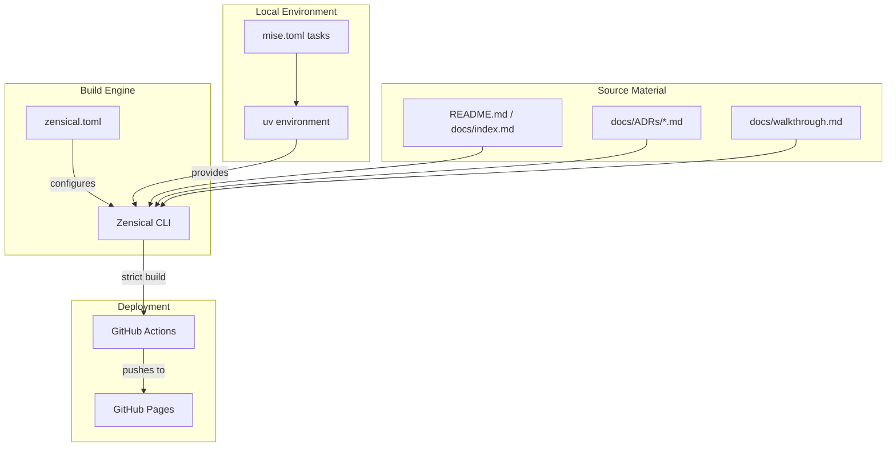
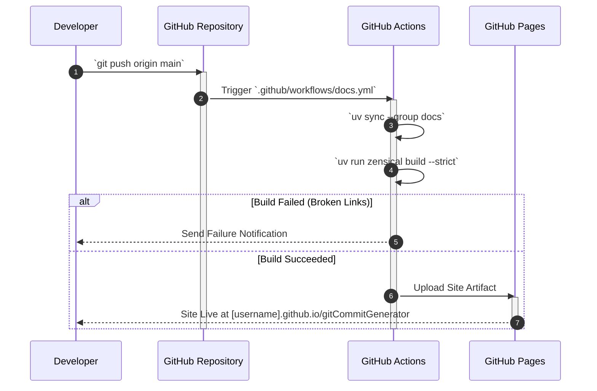

# ADR-0008: Zensical Documentation Integration

<!-- 🎨 HEADER IMAGE PROMPT & FILENAME
A hyper-detailed, architectural rendering of a futuristic, glowing digital library. In the center, a massive, suspended crystalline monolith containing thousands of perfectly organized, glowing data-slates. The word "Zensical" is heavily engraved directly into the obsidian floor of the library, glowing with intense cyan and indigo neon light. Intricate holographic projections of documentation structures float in the air around the monolith. Cinematic lighting, deep shadows with vibrant neon cyan and deep indigo accents, volumetric dust particles. 8k resolution, octane render, architectural precision. PURE TECHNICAL GRAPHIC. NO mobile phone UI, NO status bars, NO device frames or bounding boxes. Wide aspect ratio, designed for high-fidelity technical documentation.

📋 Target Filename: adr-0008-zensical-integration.webp
-->
<div align="center">

</div>

```yaml
adr_number: "0008"
title: "Zensical Documentation Integration"
status: "Implemented"
version: "v1.0.0"
date: "2026-06-09"
created: "2026-06-09 23:00:00"
modified: "2026-06-09 23:00:00"
risk_level: "Low"
reversibility: "High"
security_scope: "None"
tags:
  [
    "zensical",
    "documentation",
    "mkdocs",
    "github-pages",
    "static-site-generator",
  ]
supersedes: []
superseded_by: []
```

## 1. Introduction and Goals

Historically, the `gitCommitGenerator` documentation was fragmented, relying on a standalone `README.md` and a flat directory of markdown files (e.g., ADRs, agent handoffs, codebase reviews). There was no centralized, high-performance static site generator (SSG) to compile these documents into an easily navigable web interface.

This ADR documents the integration of **Zensical**—a blazing-fast, Rust-core, MkDocs-compatible documentation engine—as the official SSG for the project. The setup leverages the existing "Pitchfork" design aesthetic (Indigo/Cyan) and establishes a dual-mode workflow: local preview capabilities via `mise` and automated CI/CD deployment to GitHub Pages.

The primary goals are:

1. **Centralized Knowledge Base**: Unify all documentation artifacts (Walkthroughs, Agent Handoffs, ADRs) under a single navigable site.
2. **High-Performance Builds**: Use Zensical for instantaneous local rebuilds and strict link validation.
3. **Automated Publishing**: Implement a zero-touch deployment pipeline to GitHub Pages.

## 2. Architecture Constraints

- **Strict Link Validation**: The build process must run with the `--strict` flag (`zensical build --strict`). Any broken internal links must intentionally fail the build to prevent dead links in production.
- **Ecosystem Synchronization**: The integration must reside natively within the `uv` Python ecosystem, managed as a dedicated dependency group (`docs`), to prevent global environment pollution.
- **Aesthetic Consistency**: The output must adhere strictly to the established "Pitchfork" aesthetic constraints (Modern variant, Indigo primary, Cyan accent, dark-mode first).

## 3. Context and Scope

The previous documentation approach lacked structure, making it difficult for developers and autonomous agents to locate authoritative architectural decisions (ADRs) or usage guides. Adopting an SSG solves the discoverability issue but introduces the risk of link rot if not rigorously validated.

Zensical was chosen over standard MkDocs due to its Rust-powered speed and compatibility with the `mkdocs-material` plugin ecosystem, allowing us to maintain high-fidelity aesthetics without sacrificing performance.

## 4. Solution Strategy

**Implement Zensical as the authoritative SSG and integrate it into the CI/CD pipeline.**

1. **Dependency Injection**: Add `zensical`, `pymdown-extensions`, and `markdown` to the `pyproject.toml` under a dedicated `docs` group. This ensures the environment remains reproducible via `uv sync --group docs`.
2. **Configuration (`zensical.toml`)**: Author a declarative configuration file at the repository root. Map the navigation tree to surface critical documents (Home, Usage, Walkthrough, Agent Handoff, Internal Governance) and apply the Pitchfork theme.
3. **Local Tasks (`mise.toml`)**: Abstract the underlying `uv run zensical` commands into ergonomic `mise` tasks (`docs:build` and `docs:serve`) for frictionless local development.
4. **CI/CD Automation**: Provision a GitHub Actions workflow (`.github/workflows/docs.yml`) that triggers on pushes to the `main` branch, builds the site strictly, and deploys the artifact to GitHub Pages.
5. **Artifact Cleansing**: Relocate legacy, unmaintained review files (e.g., `projectReviewOLD`, `CODEBASE_REVIEW.md`) to an `archive/` directory so they are ignored by the strict compiler, preventing false-positive build failures.

## 5. Building Block View



## 6. Runtime & Deployment View



## 7. Cross-cutting Concepts

- **Strict Validation as Governance**: Enforcing `--strict` during the build phase natively prevents technical debt from accumulating in the form of orphaned documents or dead relative links.
- **Separation of Concerns**: By defining Zensical strictly in the `docs` dependency group, the core application runtime remains lightweight and unburdened by SSG dependencies.

---

## 8. Supporting Visual Aids

### Visual Aid Selection Rationale

- **Primary data shape or explanatory need**: System topology showing the flow of markdown files into the published site, and a sequence diagram detailing the automated deployment logic.
- **Chosen visual aid**: Mermaid Flowchart and Sequence Diagram.
- **Why this visual aid was chosen**: The flowchart succinctly maps the relationship between the configuration files, the Python environment, and the source markdown. The sequence diagram effectively models the fail-safe strict build process within GitHub Actions.

---

## 9. Impact Radius (Cause, Change, Effect)

### 1. `pyproject.toml`

- **Cause**: Requirement for reproducible, isolated installation of the documentation engine.
- **Change**: Appended the `[dependency-groups] docs` block.
- **Effect**: Developers can now install Zensical predictably via `uv sync --group docs`.

### 2. `zensical.toml`

- **Cause**: Introduction of the new SSG requires configuration.
- **Change**: New configuration file created at the repository root.
- **Effect**: Defines the site navigation, visual theme, and strict compilation rules.

### 3. `.github/workflows/docs.yml`

- **Cause**: Need for zero-touch deployment.
- **Change**: New GitHub Actions pipeline created.
- **Effect**: The `main` branch automatically deploys high-fidelity documentation to GitHub Pages.

### 4. `archive/` Directory

- **Cause**: Zensical's strict compilation threw fatal errors on dead links within legacy review files.
- **Change**: Moved `docs/projectReviewOLD`, `docs/projectReview1`, and `docs/CODEBASE_REVIEW.md` into `archive/`.
- **Effect**: The documentation root is sanitized, allowing the CI/CD pipeline to pass.

---

## 10. Consequences

- **Pros**:
  - **Professional Polish**: The project now boasts a highly readable, searchable, and aesthetically pleasing documentation hub.
  - **Confidence**: Strict link validation ensures the documentation is inherently trustworthy.
  - **Zero Maintenance Deployment**: Merging to `main` automatically updates the live site.
- **Cons**:
  - **Strictness Overhead**: Moving files or renaming headers requires careful updating of internal links; otherwise, the CI build will fail.
  - **Toolchain Expansion**: Introduces another tool (`zensical`) that developers must install (via `uv`) if they wish to preview docs locally.

---

## 11. Verification Plan

### Automated Verification

- [x] Ensure `uv sync --group docs` installs Zensical successfully.
- [x] Execute `uv run zensical build --strict` and verify it exits with code 0 ("No issues found").
- [ ] Monitor the initial GitHub Actions run upon the next push to `main` to confirm the Pages deployment succeeds.

### Manual Verification

- [x] Run `mise run docs:serve` locally and manually browse the resulting site on `localhost:8000` to verify the Pitchfork theme and navigation structure.

---

## 12. Review / Revisit Criteria

- If `zensical` introduces breaking changes that conflict with the standard MkDocs plugin ecosystem, evaluate migrating back to standard `mkdocs-material`.
- As the volume of ADRs grows, revisit the navigation structure in `zensical.toml` to ensure the sidebar remains easily scannable.

---

## 13. Rollback Strategy

1. Delete `zensical.toml` and `.github/workflows/docs.yml`.
2. Remove the `docs` dependency group from `pyproject.toml` and run `uv lock`.
3. Move the contents of `archive/` back into `docs/` if the legacy reviews are still required.
4. Delete the `docs:build` and `docs:serve` tasks from `mise.toml`.

---

## 14. Implementation Findings / Audit Findings

During the initial rollout, executing `zensical build --strict` failed immediately due to unresolvable links inside `docs/projectReviewOLD/CODEBASE_REVIEW.md` and related files. Because these were historical, point-in-time review artifacts rather than living documentation, the decision was made to quarantine them in an `archive/` directory at the repository root rather than investing time in fixing the dead links. This successfully unblocked the strict compiler.

---

## 15. Governance Follow-up

- **Antigravity rule assessment**: A new project-level rule should be established to enforce the usage of `zensical build --strict` before committing documentation changes, ensuring CI pipelines are not broken by careless link modifications.
- **Affected rule**: A potential new rule governing Documentation Standards.

---

## CHANGELOG

- v1.0.0 (2026-06-09 23:00:00): Initial Implemented ADR generated.
