<!-- 🎨 HEADER IMAGE PROMPT & FILENAME
A hyper-detailed, photorealistic cyberpunk technical schematic showing two massive illuminated data rivers converging into a central arbitration core. The left river is labeled "Deterministic Intent Ranking" in electric cyan and consists of rigid geometric packets, matrices, scores, and signal markers flowing through hard-edged channels. The right river is labeled "Guided Regeneration" in hot magenta and consists of human-authored directive fragments, terminal prompts, and adaptive steering glyphs flowing through softer but still highly structured channels. At the center sits a towering chrome-and-obsidian reconciliation engine with rotating glass rings, score dials, and branching decision gates. Around it float visual overlays of ranked candidate lists, prompt frames, override lanes, and policy matrices. Deep black background, volumetric haze, precise architectural lighting, neon cyan/magenta/amber accents, octane-render precision, no device frames, no phone UI, no status bars, pure technical graphic, wide aspect ratio, designed for high-fidelity architectural documentation.

📋 Target Filename: adr-0009-intent-ranking-guided-regeneration-reconciliation.jpeg
-->
<div align="center">

</div>

# ADR-0009: Reconcile Deterministic Intent Ranking with Guided Regeneration

```yaml
adr_number: "0009"
title: "Reconcile Deterministic Intent Ranking with Guided Regeneration"
status: "Accepted"
version: "v1.5.0"
date: "2026-06-11"
created: "2026-06-11 16:10:00"
modified: "2026-06-12 10:20:00"
risk_level: "High"
reversibility: "High"
security_scope: "Local Operations & Source Control"
tags:
  [
    "git-cg",
    "intent-ranking",
    "regeneration",
    "prompting",
    "llm",
    "sop",
    "tui",
    "decision-analysis",
  ]
supersedes: []
superseded_by: []
```

> [!IMPORTANT]
> This ADR intentionally does **not** record a final selected solution yet. It is an architectural analysis record for one of the most significant core operating behaviors in the application: how deterministic intent ranking, prompt framing, and user-authored regeneration guidance should be reconciled. The implementation-plan section is intentionally deferred until a solution is selected after review.

## 1. Introduction and Goals

The `gitCommitGenerator` (`git-cg`) utility does not operate as a naive "diff in, commit message out" wrapper around an LLM. One of its most important core operating properties is that it performs a deterministic pre-analysis of the staged diff before it asks the model to produce a structured `CommitPlan`. That deterministic analysis is then used to frame the model's decision space with ranked candidates drawn from the SOP matrix.

This architecture is a major strength of the system. It improves consistency, constrains randomness, enables testability, and prevents many obviously wrong commit classifications.

However, the system has now evolved to include an interactive review flow with explicit **guided regeneration**. The user can review the generated commit, detect that its framing is wrong or incomplete, and provide short steering feedback such as:

- `This is a feature, not a fix.`
- `Focus on the user-facing behavior rather than the internal validation details.`
- `Use scope tui.`
- `Keep the subject shorter.`

That introduces a new architectural problem:

- the deterministic ranking layer may strongly bias the model toward one interpretation
- the human regeneration guidance may explicitly correct that interpretation
- the system currently lacks a clearly governed reconciliation policy between those two authorities

This ADR exists to analyze that problem rigorously before a solution is selected and implemented.

The primary goals of this ADR are:

1. **Document the current ranking-and-prompting architecture precisely**, including how the deterministic shortlist is created and how the model is framed during generation.
2. **Preserve what is good about the current system**, rather than discarding deterministic ranking simply because a new pressure point has emerged.
3. **Identify the exact point of conflict** between deterministic intent ranking and user-authored regeneration guidance.
4. **Present multiple serious solution options**, each with sufficient architectural detail, strengths, weaknesses, integration surface, and extensibility analysis to support an informed decision.
5. **Delay implementation commitment** until the solution is explicitly chosen after review.

## 2. Architecture Constraints

Any acceptable solution must satisfy the following constraints.

- **Deterministic ranking remains a first-class asset**. The system must not regress into a fully unconstrained "let the model decide everything" architecture.
- **User-authored regeneration guidance must matter**. The system must not pretend to accept guidance while leaving the deterministic shortlist effectively unchallengeable.
- **The final commit output must remain machine-readable**. Human guidance must never leak into trailers or become hidden metadata in the final commit body.
- **Interactive review must stay understandable**. The TUI must not become a chat interface or an opaque state machine that hides what is currently influencing regeneration.
- **The architecture must remain testable**. The chosen approach must preserve or improve determinism and unit-test coverage rather than collapsing key decisions into untraceable prompt behavior.
- **Latency matters**. Commit generation occurs in a developer workflow. Any solution that significantly increases runtime or prompt complexity must justify that cost.
- **The system must remain extensible**. The chosen solution will likely influence future work such as split-commit logic, stronger steering controls, scope overrides, and deeper prompt instrumentation.
- **The solution must integrate cleanly with existing review metadata**. Issue references, guided regeneration, and future review-state enrichments must be able to coexist coherently.

## 3. Context and Scope

This ADR is directly related to the current `git-cg` architecture and specifically intersects with the gum-driven interactive review flow documented in ADR-0007.

The scope of this ADR includes:

- deterministic diff signal extraction
- SOP matrix scoring and ranking
- candidate shortlist construction
- prompt framing strategy
- regeneration guidance injection
- interaction between deterministic classification and human-authored steering

The scope does **not** yet include:

- final implementation details for a selected solution
- an implementation roadmap for code changes
- a migration plan to another model orchestration framework
- changes to the final rendered commit message contract

This ADR is therefore an **analysis-and-decision-support ADR**, not yet a final implementation ADR.

## 4. Solution Strategy and Decision Posture

The decision posture for this ADR is intentionally different from a typical "choose now" architecture document.

At this stage, the correct move is **not** to prematurely select one option. The correct move is to:

1. document the current architecture precisely
2. identify where the conflict actually arises
3. enumerate serious solution families
4. compare them rigorously
5. defer the implementation-plan section until the user explicitly selects a direction

That is appropriate here because this behavior sits at the core of the application's operating model. A casual or under-analysed solution would risk undermining the tool's strongest architectural feature: deterministic, governed commit classification.

## 5. Building Block View: Current-State Generation Pipeline

The current system is best understood as a layered architecture in which deterministic classification precedes model synthesis.

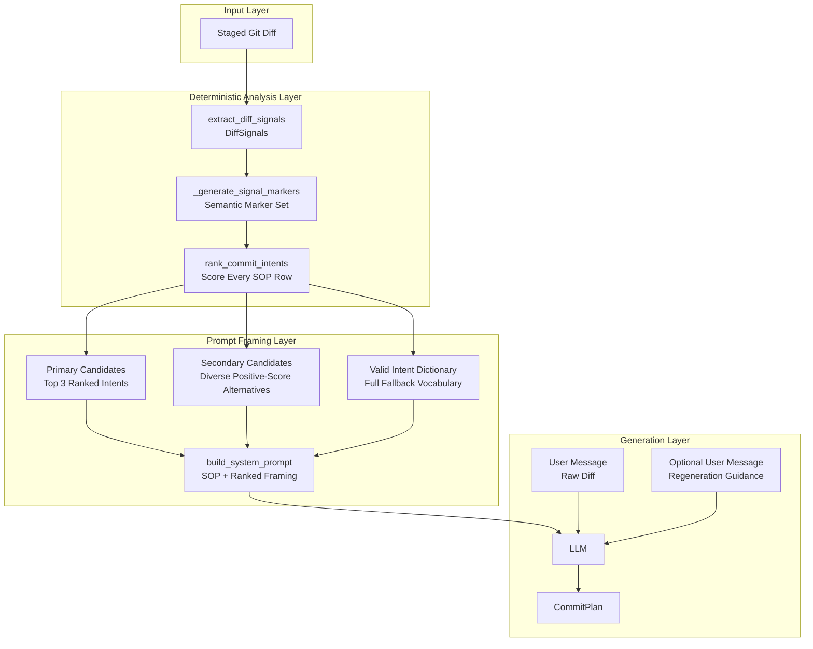
```mermaid
flowchart TD
    subgraph Input Layer
        Diff["Staged Git Diff"]
    end

    subgraph Deterministic Analysis Layer
        Signals["extract_diff_signals\nDiffSignals"]
        Markers["_generate_signal_markers\nSemantic Marker Set"]
        Rank["rank_commit_intents\nScore Every SOP Row"]
    end

    subgraph Prompt Framing Layer
        Primary["Primary Candidates\nTop 3 Ranked Intents"]
        Secondary["Secondary Candidates\nDiverse Positive-Score Alternatives"]
        Dictionary["Valid Intent Dictionary\nFull Fallback Vocabulary"]
        Prompt["build_system_prompt\nSOP + Ranked Framing"]
    end

    subgraph Generation Layer
        UserDiff["User Message\nRaw Diff"]
        Guidance["Optional User Message\nRegeneration Guidance"]
        LLM["LLM"]
        Plan["CommitPlan"]
    end

    Diff --> Signals --> Markers --> Rank
    Rank --> Primary
    Rank --> Secondary
    Rank --> Dictionary
    Primary --> Prompt
    Secondary --> Prompt
    Dictionary --> Prompt
    Prompt --> LLM
    UserDiff --> LLM
    Guidance --> LLM
    LLM --> Plan
```

This diagram captures the crucial fact that regeneration guidance currently enters **after** the deterministic shortlist is already formed.

## 6. Runtime & Conflict View: Where Tension Appears During Regeneration

The conflict is not abstract. It appears in the runtime interaction loop.

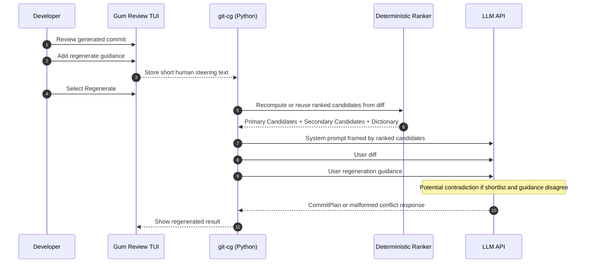
```mermaid
sequenceDiagram
    autonumber
    participant User as Developer
    participant TUI as Gum Review TUI
    participant CG as git-cg (Python)
    participant Rank as Deterministic Ranker
    participant LLM as LLM API

    User->>TUI: Review generated commit
    User->>TUI: Add regenerate guidance
    TUI-->>CG: Store short human steering text
    User->>TUI: Select Regenerate
    CG->>Rank: Recompute or reuse ranked candidates from diff
    Rank-->>CG: Primary Candidates + Secondary Candidates + Dictionary
    CG->>LLM: System prompt framed by ranked candidates
    CG->>LLM: User diff
    CG->>LLM: User regeneration guidance
    Note over LLM: Potential contradiction if shortlist and guidance disagree
    LLM-->>CG: CommitPlan or malformed conflict response
    CG-->>TUI: Show regenerated result
```

The architectural tension sits in the note shown in the diagram:

- the ranker may strongly imply one intent family
- the user may explicitly say that framing is wrong
- the model is then asked to resolve the contradiction inside the prompt itself

That is the point that needs a disciplined solution.

## 7. Cross-cutting Concepts

Several cross-cutting concepts matter across every proposed solution.

### Determinism

The ranker is one of the strongest structural assets in the current architecture. It turns a diff into explicit, testable, reviewable signals.

### Human authority

Guided regeneration introduces a second authority into the system. It is not as broad as free-form editing, but it is stronger than a blind retry.

### Prompt geometry

The model does not merely see information. It sees information inside a hierarchy of instructions and authority cues. That prompt geometry determines whether contradictory context is handled cleanly or awkwardly.

### Traceability

Whatever solution is chosen should make it possible to explain:

- why an intent was favored
- why guidance overrode or did not override deterministic ranking
- how a regenerate path differed from the original generation path

### Extensibility

This decision will likely affect future work such as:

- split-commit orchestration
- richer review-state metadata
- scope steering
- explanation surfaces in the TUI
- guided retries for semver and changelog grouping

## 8. Supporting Visual Aids

### Visual Aid Selection Rationale

- **Primary data shape or explanatory need**: ranked candidate flow, runtime contradiction, and multi-option architectural comparison.
- **Chosen visual aids**: Mermaid flowcharts, sequence diagrams, and matrix comparison tables.
- **Why these visual aids were chosen**: this problem is not just a single topology problem. It involves layered decision flow, runtime interaction, and tradeoff comparison across multiple architectural options.
- **Alternative aids considered**: C4-style diagrams were considered but rejected because the decision boundary here is less about service containers and more about arbitration logic, prompt flow, and metadata reconciliation.

### Supporting Visuals and Generated Artifacts

- **Reference source**: `visualAidQuickReference.md`
- **Chosen method**: Mermaid + Markdown comparison tables
- **Generated artifact path(s)**: Embedded in this ADR in Sections 5, 6, 10, 11, 12, 13, and 14

## 9. Current Logic Analysis

This section records the current behavior precisely and forms the analytical baseline for all solution comparisons.

### 9.1 Exactly how current ranking-and-prompting behaves

#### Step 1: The system extracts deterministic diff signals

The function `extract_diff_signals` converts the raw staged diff into a `DiffSignals` object containing boolean markers such as:

- `touches_docs`
- `touches_tests`
- `touches_ci`
- `touches_build`
- `touches_hooks`
- `touches_security`
- `adds_files`
- `deletes_files`
- `moves_or_renames_files`
- `adds_public_api`
- `changes_architecture`
- `validation_added`
- `error_handling_added`
- `logging_changed`
- `only_docs`
- `only_tests`
- `only_dependency_changes`

It also records file lists, evidence strings, and diff-size metrics.

This stage is fully deterministic.

#### Step 2: The signal layer is translated into semantic markers

The `_generate_signal_markers` step turns the boolean signal set into marker tokens such as:

- `docs_only`
- `tests_added`
- `files_added`
- `new_user_facing_capability`
- `exception_handling_added`
- `validation_added`
- `git_hook_configuration`
- `package_metadata_only`
- `security_vulnerability_fixed`

Those markers are the bridge between the raw diff analysis and the SOP matrix rows.

#### Step 3: Every SOP matrix row is scored

The `rank_commit_intents` function scores every row in the matrix using:

- a base score from priority and specificity
- positive signal matches
- negative signal matches
- hard-veto penalties

Current scoring behavior:

- base score:
  - priority multiplied by 0.4
  - plus specificity multiplied by 0.1
- each positive-signal match:
  - plus 20
- each negative-signal match:
  - minus 30
- hard-veto penalties:
  - docs-only against non-docs intent groups: minus 100
  - tests-only against non-tests intent groups: minus 100
  - dependency-only against non-build/package intent groups: minus 100

The resulting rows are sorted by:

- score descending
- then priority descending
- then specificity descending

#### Step 4: The prompt builder creates a framed decision space

The `build_system_prompt` function then assembles:

- SOP specifications and standards
- workflow context
- ranked candidate summaries

It presents the model with three framed candidate groups:

- **Primary Candidates**:
  - top 3 ranked intents
- **Secondary Candidates**:
  - up to 3 positive-score, group-diverse alternatives
- **Valid Intent Dictionary**:
  - the full legal vocabulary from the matrix

This means the model is not deciding from raw diff alone.
It is deciding inside a strongly curated intent frame.

#### Step 5: The model receives the diff separately

The diff itself is sent as a user message.

Under the current guided-regeneration implementation, optional regeneration guidance is also sent separately as a user message.

So the model sees:

- a system prompt framed by deterministic ranking
- the raw diff
- optional regeneration guidance

#### Step 6: The prompt strongly frames shortlist authority

The prompt language strongly implies that:

- the primary intent should come from the Primary Candidates
- secondary intents should come from the Secondary Candidates
- the Valid Intent Dictionary is a fallback vocabulary

This matters because it shapes the model's sense of what counts as a legitimate choice.

#### Step 7: The shortlist is strong, but not absolutely enforced

The model is strongly biased toward the shortlist, but it is not absolutely trapped by it.

Because the final model output is validated against the matrix rather than the shortlist itself, the model can still choose an intent that was not displayed in the top 3 if it decides to.

That flexibility is useful, but it also means the architecture relies on prompt discipline rather than strict primary-choice enforcement.

### 9.2 What is currently good about the architecture

There is a great deal that is good about the current design.

#### A. It reduces randomness

The model is not reasoning from an unconstrained blank slate. That materially reduces drift.

#### B. It is testable

The ranker and signal extraction layer are deterministic and unit-testable.

#### C. It prevents obviously wrong outcomes

The hard-veto rules are valuable and prevent frequent nonsense classifications.

#### D. It separates concerns well

The architecture currently separates:

- deterministic classification hints
- model synthesis
- Python-owned review metadata

That is a strong design quality.

#### E. It supports mixed-commit analysis better than raw prompting

Primary and secondary candidate framing improves multi-intent commit reasoning.

#### F. The valid dictionary fallback provides resilience

The system is not completely brittle if the top shortlist is slightly wrong.

### 9.3 Where the conflict with regeneration guidance arises

This is the central analytical problem.

#### A. Guidance enters too late in the decision process

The ranker runs before guidance meaningfully affects candidate selection.

That means the deterministic shortlist is already formed before the human correction enters the loop.

#### B. The model can receive contradictory authorities

On regenerate, the model may effectively be told:

- the deterministic shortlist says one thing
- the human guidance says another

That is not a clean authority model.

#### C. The prompt overstates shortlist authority

The current prompt language strongly suggests that the primary choice should come from the Primary Candidates.

If the human guidance points elsewhere, the model must internally reconcile conflicting instructions.

#### D. The valid dictionary is not a clean regenerate-time override mechanism

The dictionary exists, but it is not presented as a clearly sanctioned override lane for guidance-driven correction.

#### E. The deterministic ranker is strong but still heuristic

The ranker is good, but not omniscient.

Awkward diffs, misleading filenames, tiny changes, or user-authored intent can expose the limits of heuristic ranking.

#### F. There is no explicit precedence model

The architecture currently does not clearly define whether, during regenerate:

- deterministic ranking wins
- human guidance wins
- or the two must be reconciled through a governed policy layer

That missing precedence model is the core design gap.

## 10. Solution A: Guidance-Aware Alternative Candidate Lane

### 10.1 Concept

This solution preserves the current deterministic ranking system exactly as it is, but adds a new regenerate-only candidate lane.

Under this design, regenerate mode would present the model with two distinct candidate structures:

- **Base Primary Candidates**:
  - the existing top-ranked deterministic shortlist
- **Guidance-Aligned Alternatives**:
  - candidates selected from the full matrix using lightweight guidance interpretation

The prompt would explicitly authorize the model to choose the primary intent from the alternative lane when the human guidance clearly conflicts with the deterministic shortlist.

### 10.2 How it works

1. compute deterministic ranking exactly as today
2. parse lightweight guidance hints
3. use those hints to generate a separate regenerate-only alternative set
4. prompt the model with both:
   - deterministic shortlist
   - guidance-aligned alternatives
5. explicitly state the override rule in the regenerate prompt

### 10.3 Visual Aid: Alternative Candidate Lane

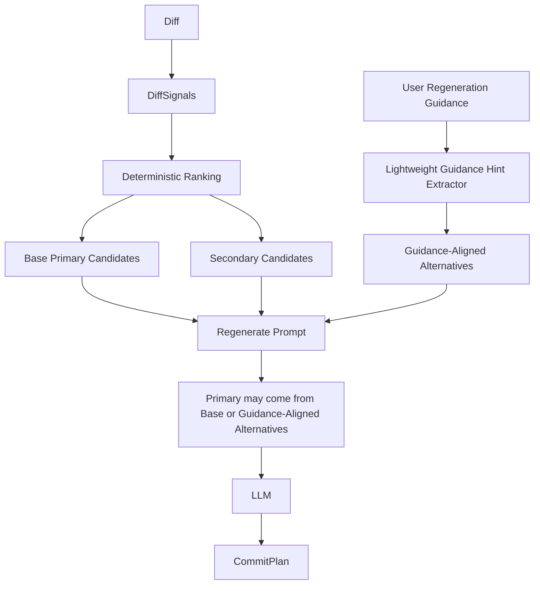
```mermaid
flowchart TD
    Diff["Diff"] --> Signals["DiffSignals"]
    Signals --> Rank["Deterministic Ranking"]
    Rank --> Base["Base Primary Candidates"]
    Rank --> Secondary["Secondary Candidates"]

    Guidance["User Regeneration Guidance"] --> HintA["Lightweight Guidance Hint Extractor"]
    HintA --> Alt["Guidance-Aligned Alternatives"]

    Base --> PromptA["Regenerate Prompt"]
    Secondary --> PromptA
    Alt --> PromptA

    PromptA --> RuleA["Primary may come from Base or Guidance-Aligned Alternatives"]
    RuleA --> LLM_A["LLM"]
    LLM_A --> PlanA["CommitPlan"]
```

### 10.4 Strengths

- minimal disruption to the current ranker
- preserves determinism in the baseline path
- introduces an explicit override lane rather than leaving the model to improvise one
- easier to implement than full re-ranking
- lower risk for the first release cycle after adoption

### 10.5 Weaknesses

- the architecture still carries two authority lanes rather than one reconciled ranking
- guidance alignment still relies on some heuristic interpretation
- prompt complexity increases because the model sees more candidate groupings
- the underlying scoring model remains unchanged, so regenerate mode can still feel like a patched overlay rather than a unified system

### 10.6 Unique Features

- clean separation between baseline ranking and human correction lane
- explicit authorization of primary override without discarding the deterministic shortlist

### 10.7 Extensibility and Integration

This solution integrates cleanly with:

- existing `ReviewState`
- current gum review flow
- issue-reference review metadata
- current deterministic tests

It integrates less cleanly with future ambitions such as:

- deeper structured steering
- guidance-aware re-ranking
- transparent precedence analytics

because it preserves a split-lane architecture rather than a single reconciled scoring model.

## 11. Solution B: Guidance-Aware Re-ranking

### 11.1 Concept

This solution treats regeneration guidance as an input to the ranking layer itself.

Instead of adding a second candidate lane, it adjusts the ranking during regenerate so that the shortlist shown to the model is already guidance-aware.

In other words:

- the deterministic ranker remains
- but regenerate mode adds a guidance-to-score adjustment layer before candidate selection

### 11.2 How it works

1. compute normal diff signals
2. parse regeneration guidance into structured steering hints
3. adjust ranking scores before shortlist selection
4. generate a new regenerate-specific top-ranked shortlist
5. prompt the model using that reconciled shortlist only

### 11.3 Visual Aid: Guidance-Aware Re-ranking Pipeline

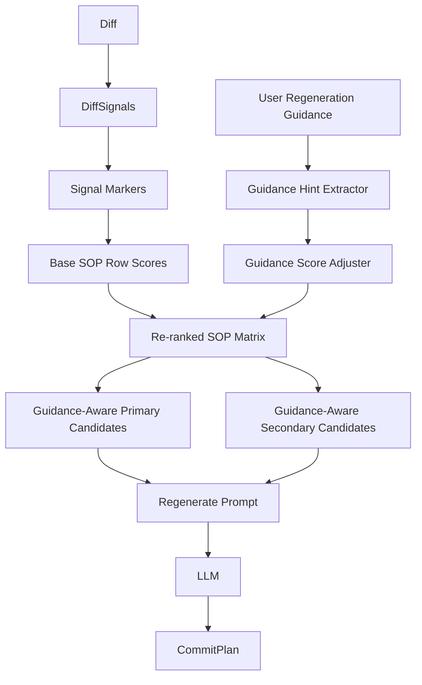
```mermaid
flowchart TD
    DiffB["Diff"] --> SignalsB["DiffSignals"]
    SignalsB --> MarkersB["Signal Markers"]
    MarkersB --> BaseScoresB["Base SOP Row Scores"]

    GuidanceB["User Regeneration Guidance"] --> HintB["Guidance Hint Extractor"]
    HintB --> AdjustB["Guidance Score Adjuster"]

    BaseScoresB --> ReRankB["Re-ranked SOP Matrix"]
    AdjustB --> ReRankB

    ReRankB --> PrimaryB["Guidance-Aware Primary Candidates"]
    ReRankB --> SecondaryB["Guidance-Aware Secondary Candidates"]
    PrimaryB --> PromptB["Regenerate Prompt"]
    SecondaryB --> PromptB
    PromptB --> LLM_B["LLM"]
    LLM_B --> PlanB["CommitPlan"]
```

### 11.4 Strengths

- presents one coherent shortlist rather than competing authority lanes
- makes regenerate mode much more deterministic
- reduces contradiction inside the prompt itself
- gives human guidance meaningful structural influence rather than only rhetorical influence

### 11.5 Weaknesses

- more engineering complexity than Solution A
- requires a reliable guidance-hint extraction layer
- risk of overfitting the ranker to user phrasing if not carefully bounded
- hard-veto interactions become more subtle and must be governed explicitly

### 11.6 Unique Features

- single authoritative regenerate-time shortlist
- strongest structural integration between human steering and deterministic ranking

### 11.7 Extensibility and Integration

This solution integrates very well with future work such as:

- richer steering controls
- scope preferences
- semver steering
- audit logging of why shortlist order changed
- future ranker introspection in the TUI

It also has a larger blast radius because it directly affects the ranking core and therefore touches more fundamental system behavior.

## 12. Solution C: Structured Steering Controls

### 12.1 Concept

This solution reduces the architectural burden on free-text guidance by adding structured steering controls.

Instead of primarily relying on natural-language text such as:

- this is a feature, not a test

users would supply structured regeneration metadata such as:

- preferred primary type
- discouraged type
- preferred scope
- shorter subject requested
- more user-facing emphasis

A free-text field may still exist, but the system would prefer structured steering data wherever possible.

### 12.2 How it works

1. add explicit structured steering controls to the review UI
2. store structured steering metadata in `ReviewState`
3. use those structured fields to influence ranking or prompt shaping
4. optionally retain a free-text note field as secondary context

### 12.3 Visual Aid: Structured Steering Model

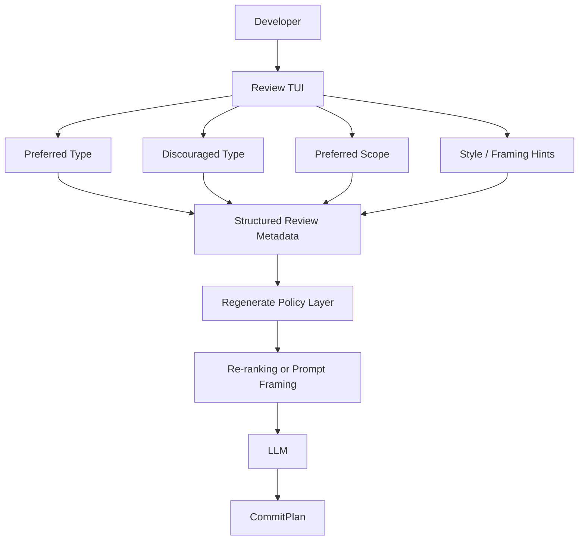
```mermaid
flowchart TD
    UserC["Developer"] --> TUIC["Review TUI"]
    TUIC --> TypeC["Preferred Type"]
    TUIC --> DiscourageC["Discouraged Type"]
    TUIC --> ScopeC["Preferred Scope"]
    TUIC --> StyleC["Style / Framing Hints"]

    TypeC --> StateC["Structured Review Metadata"]
    DiscourageC --> StateC
    ScopeC --> StateC
    StyleC --> StateC

    StateC --> PolicyC["Regenerate Policy Layer"]
    PolicyC --> RankOrPromptC["Re-ranking or Prompt Framing"]
    RankOrPromptC --> LLM_C["LLM"]
    LLM_C --> PlanC["CommitPlan"]
```

### 12.4 Strengths

- much more deterministic than free-text guidance alone
- easier to test and reason about
- easier to integrate into ranking policies
- reduces ambiguity and model over-interpretation

### 12.5 Weaknesses

- larger UX surface area
- higher interaction cost for users
- less flexible than plain free text
- can feel over-engineered for simple cases

### 12.6 Unique Features

- strongest explicit contract between user steering and system behavior
- easiest option to explain to future contributors and testers

### 12.7 Extensibility and Integration

This solution is highly extensible.

It integrates well with:

- deterministic ranking
- future split-commit steering
- TUI-state visualization
- audit logs
- regression tests

It integrates less elegantly with very lightweight casual workflows where users only want to type one short sentence and move on.

## 13. Solution D: Hybrid Reconciliation Layer

### 13.1 Concept

This solution combines the strongest parts of the earlier options.

It keeps:

- the existing deterministic ranker
- free-text regeneration guidance

But it also adds:

- a lightweight structured hint extraction layer
- a regenerate-only reconciliation policy
- guidance-aligned alternatives or targeted score adjustments where appropriate

This means the free-text guidance is not treated as raw prompt prose only. Instead, it is partially normalized into controlled steering hints which then participate in a governed reconciliation step.

### 13.2 How it works

1. compute normal deterministic ranking
2. parse a small, safe subset of guidance hints from the free-text guidance
3. feed those hints into a reconciliation layer
4. generate either:
   - guidance-aware alternatives
   - or limited score adjustments
5. present the model with a cleaner regenerate-time decision frame
6. preserve the rest of the architecture unchanged

### 13.3 Visual Aid: Hybrid Reconciliation Layer

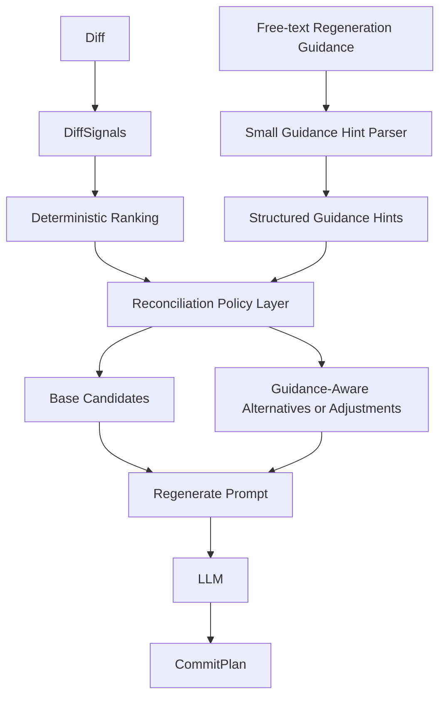
```mermaid
flowchart TD
    DiffD["Diff"] --> SignalsD["DiffSignals"]
    SignalsD --> RankD["Deterministic Ranking"]

    GuidanceD["Free-text Regeneration Guidance"] --> ParseD["Small Guidance Hint Parser"]
    ParseD --> HintsD["Structured Guidance Hints"]

    RankD --> ReconD["Reconciliation Policy Layer"]
    HintsD --> ReconD

    ReconD --> BaseD["Base Candidates"]
    ReconD --> AltOrAdjustD["Guidance-Aware Alternatives or Adjustments"]

    BaseD --> PromptD["Regenerate Prompt"]
    AltOrAdjustD --> PromptD
    PromptD --> LLM_D["LLM"]
    LLM_D --> PlanD["CommitPlan"]
```

### 13.4 Strengths

- preserves the current architecture's strongest parts
- acknowledges that free-text guidance alone is not enough
- gives human steering a governed structural role
- avoids the full UX overhead of fully structured steering
- offers the best balance between safety, flexibility, and extensibility

### 13.5 Weaknesses

- more complex than Solution A
- not as purely deterministic as full structured steering
- requires disciplined design of the hint parser so it stays small and predictable
- easier to get conceptually right than to implement perfectly on the first pass

### 13.6 Unique Features

- combines prompt-level flexibility with structural reconciliation
- allows the system to evolve gradually without throwing away the existing ranking core

### 13.7 Extensibility and Integration

This solution integrates well with both the current system and future expansion.

It provides a path toward:

- richer structured steering later
- guidance-aware rescoring later
- better explanation surfaces later

without requiring that all of that be implemented immediately.

## 14. Comparative Evaluation of All Solutions

This section compares the solutions across the major decision dimensions that matter for this project.

### 14.1 High-Level Comparison Matrix

| Dimension                           | Solution A: Alternative Lane | Solution B: Re-ranking | Solution C: Structured Steering | Solution D: Hybrid Reconciliation |
| :---------------------------------- | :--------------------------- | :--------------------- | :------------------------------ | :-------------------------------- |
| Preserves existing ranker           | Strongly                     | Partially              | Strongly                        | Strongly                          |
| Lets guidance matter structurally   | Moderately                   | Strongly               | Strongly                        | Strongly                          |
| Prompt contradiction reduction      | Moderate                     | Strong                 | Strong                          | Strong                            |
| Engineering complexity              | Low to Medium                | Medium to High         | Medium to High                  | Medium                            |
| UX simplicity                       | High                         | High                   | Medium to Low                   | Medium                            |
| Determinism                         | Moderate                     | Strong                 | Very Strong                     | Strong                            |
| Testability                         | Moderate                     | Strong                 | Very Strong                     | Strong                            |
| Extensibility                       | Moderate                     | Strong                 | Very Strong                     | Very Strong                       |
| Release safety                      | Strong                       | Moderate               | Moderate                        | Strong                            |
| Long-term architectural cleanliness | Moderate                     | Strong                 | Strong                          | Very Strong                       |

### 14.2 Strengths and Weaknesses Summary Table

| Solution | Primary Strength                                    | Primary Weakness                   | Unique Feature                                                               |
| :------- | :-------------------------------------------------- | :--------------------------------- | :--------------------------------------------------------------------------- |
| A        | Safest incremental change                           | Keeps two authority lanes alive    | Explicit override lane without rewriting ranker                              |
| B        | Single coherent regenerate shortlist                | More invasive ranking change       | Best pure ranking-level reconciliation                                       |
| C        | Maximum determinism and explainability              | Heaviest UX footprint              | Explicit steering contract instead of fuzzy text                             |
| D        | Best balance across safety, flexibility, and growth | Requires disciplined hybrid design | Reconciles free text with structural policy without overbuilding immediately |

### 14.3 Integration Surface Comparison

| Integration Surface       | A               | B                           | C                       | D                  |
| :------------------------ | :-------------- | :-------------------------- | :---------------------- | :----------------- |
| Current gum review UI     | Minimal change  | Minimal UI change           | Significant UI change   | Moderate UI change |
| `ReviewState`             | Small extension | Small to moderate extension | Moderate extension      | Moderate extension |
| `intent.py` ranking core  | Minimal         | Significant                 | Optional to significant | Moderate           |
| Prompt construction       | Moderate        | Moderate                    | Moderate                | Moderate           |
| Test suite                | Moderate growth | Significant growth          | Significant growth      | Significant growth |
| Future split-commit logic | Adequate        | Strong                      | Strong                  | Very Strong        |
| Future scope steering     | Adequate        | Strong                      | Very Strong             | Very Strong        |

### 14.4 Extensibility Analysis

#### Solution A extensibility

Good for:

- immediate reliability improvements
- preserving the current architecture with small adjustments

Less good for:

- future formal steering models
- deep auditability of why regenerate changed the shortlist

#### Solution B extensibility

Good for:

- making regenerate a first-class ranking mode
- future analytical instrumentation

Less good for:

- low-risk incremental adoption if the release schedule is tight

#### Solution C extensibility

Good for:

- future governance-heavy steering
- explicit user controls
- deterministic explanations

Less good for:

- maintaining a very lightweight TUI workflow

#### Solution D extensibility

Good for:

- phased evolution
- preserving the current free-text UX while structurally improving it
- future migration toward more explicit steering controls if needed

Less good for:

- teams that want the cleanest possible single-paradigm solution immediately

### 14.5 Which solution is best at what

| Need                                     | Best-Fit Solution |
| :--------------------------------------- | :---------------- |
| safest short-term change                 | Solution A        |
| strongest pure regenerate-time coherence | Solution B        |
| strongest determinism and testability    | Solution C        |
| best balanced long-term direction        | Solution D        |

## 15. Potential Impact Radius Across the Solution Space

Because no solution has been selected yet, the impact radius is described across the option space rather than as a final implementation scope.

| Component                      | Potential Change                                                                    | Effect Across the Solution Space                                                                                                            |
| :----------------------------- | :---------------------------------------------------------------------------------- | :------------------------------------------------------------------------------------------------------------------------------------------ |
| `src/git_cg/intent.py`         | Guidance-aware reconciliation or rescoring logic                                    | Most affected by Solutions B and D; lightly affected or untouched by A; optionally affected by C depending on steering implementation depth |
| `src/git_cg/main.py`           | Review-state metadata, regenerate orchestration, prompt-building, precedence policy | Affected by all solutions                                                                                                                   |
| `src/git_cg/interaction.py`    | Additional TUI presentation, steering entry points, visibility of influence state   | Lightly affected by A and B; more affected by C and D                                                                                       |
| `config/gitops_agent_sop.json` | Potential future support for richer intent metadata or steering categories          | Possibly unaffected initially, but more likely to evolve under B, C, and D                                                                  |
| `tests/`                       | New deterministic tests around reconciliation and precedence                        | Affected by all solutions                                                                                                                   |
| `README.md`                    | User-facing regenerate behavior and explanation of steering semantics               | Affected by all solutions                                                                                                                   |
| ADR-0007                       | Cross-reference with gum review mechanics                                           | Contextual reference only; no immediate supersession required                                                                               |

## 16. Consequences

Because no solution is yet selected, this section records the consequences of the current posture and of the decision being deferred.

### Positive Consequences of Deferral

- prevents premature commitment on a core architectural behavior
- creates a durable comparison record for future review
- forces solution quality to be explicit rather than implicit
- reduces the risk of treating prompt edits as architecture when the real problem is precedence and reconciliation

### Negative Consequences of Deferral

- guided regeneration remains conceptually incomplete until the reconciliation model is chosen
- the current regenerate path should not yet be considered final or heavily relied upon
- implementation work must pause or remain narrowly scoped until authority and precedence policy are agreed

### Common Risk Across All Candidate Solutions

Every solution must guard against one common failure mode:

- letting the model resolve authority conflicts implicitly inside free-form generation instead of resolving them explicitly in the architecture

That is the principal anti-pattern this ADR is trying to avoid.

## 17. Verification and Evaluation Plan

Before choosing a solution, the following evaluation criteria should be used.

### 17.1 Core evaluation questions

- Can the user correct a misframed classification without manual editing?
- Is the correction path deterministic enough to test confidently?
- Does the regenerate path remain explainable to a future maintainer?
- Does the chosen solution preserve the value of deterministic ranking?
- Does the chosen solution avoid turning the TUI into a chat system?

### 17.2 Evaluation scenarios

The chosen solution should eventually be tested against scenarios like:

- guidance confirms the ranker
- guidance mildly nudges framing
- guidance directly contradicts the top-ranked intent
- guidance contradicts a hard-veto-like context
- guidance coexists with issue-reference metadata
- repeated regenerate cycles remain stable and understandable

### 17.3 Success criteria for the eventual implementation

The eventual solution should be judged successful if it can demonstrate:

- clearer regenerate-time precedence
- fewer malformed or contradictory regenerate outputs
- better user control over framing
- preserved machine-readable final commit output
- maintained or improved test coverage and architectural explainability

## 18. Review / Revisit Criteria

This ADR must be revisited when one of the following occurs:

- a solution is selected for implementation
- experience shows that free-text regenerate guidance is insufficient without structural steering
- future split-commit logic requires deeper integration with the intent-ranking layer
- prompt-only reconciliation proves too brittle for sustained use
- structured steering controls become necessary to maintain reliability

## 19. Rollback Strategy

No runtime architecture change is being finalized by this ADR revision yet.

Therefore, rollback is currently simple:

- no code rollback is required for the ADR itself
- if later solution drafts are appended and rejected, they can be superseded by a later ADR revision or companion ADR
- the current system remains the baseline until a chosen solution is explicitly adopted and implemented

## 20. Governance Follow-up

- The user will review this ADR and select one solution, request modifications, or request deeper explanation.
- Once a solution is selected, this ADR will be extended with a final implementation-plan section rather than forcing a second analytical ADR unless scope expands materially.
- If the selected solution materially alters the operating contract of ADR-0007’s guided review model, ADR-0007 should receive a cross-reference note or refinement linkage rather than being silently bypassed.

## 21. Implementation Plan Placeholder

Implementation planning is intentionally deferred.

This section will be populated only after:

- the user selects a solution
- the chosen solution is confirmed after review

The future implementation-plan section should include at minimum:

- exact touched files
- deterministic rollback strategy
- validation plan
- manual TUI verification plan
- migration or compatibility notes for existing regenerate behavior

## 22. Links & References

- ADR-0007: Integrate Gum for Terminal-Native Git Hook TUI
- Arc42 Documentation: https://docs.arc42.org/home/
- Arc42 Quality Standards: https://quality.arc42.org/

---

## II. Refinement 1: Architectural Review, Critical Findings, and Solution E (v1.1.0)

Following the initial publication of this ADR, a comprehensive architectural review was conducted against the live codebase. That review read and analysed the full source of the ranking, prompt-construction, generation, review-state, and interaction modules, as well as the SOP matrix and existing test suite. The review identified two critical codebase-level findings not surfaced in the original analysis, structural problems in each of the four proposed solutions, a root-cause prompt-authority problem that all four solutions fail to address, and a fifth solution that directly targets that root cause.

This refinement is appended in full. No original content has been modified or removed.

### 1. Critical Codebase Finding: Dead `regeneration_guidance` Parameter in `build_system_prompt`

The original analysis correctly identifies in Section 9.3.A that "guidance enters too late in the decision process." However, it does not surface a concrete code-level defect that makes the problem materially worse than described.

In `src/git_cg/main.py`, the function `build_system_prompt` accepts `regeneration_guidance` as a parameter:

```python
def build_system_prompt(
    diff_output: str,
    verbose: bool = False,
    regeneration_guidance: str | None = None,  # ← accepted
) -> str:
```

But the parameter is **never referenced** in the function body. It is completely dead code. The function builds the system prompt entirely from the diff and SOP matrix, ignoring the guidance.

Meanwhile, in the regeneration loop, the caller passes guidance to this function on every iteration:

```python
system_prompt = build_system_prompt(
    diff_output,
    verbose,
    regeneration_guidance=regeneration_guidance,  # ← passed but unused
)
```

This suggests the developer intended the system prompt to be influenced by guidance, but the implementation was never completed.

#### Impact

This means that on regenerate:

1. The system prompt is rebuilt identically to the first-generation pass — same ranked candidates, same authority framing, same shortlist.
2. Guidance only enters via `build_generation_messages` as a trailing user message.
3. The model sees a system prompt that strongly frames the shortlist, followed by a weak "by the way, the user said…" user message.

This is architecturally worse than the original analysis acknowledges. The system prompt does not just bias the model — it is **structurally immutable** across regeneration cycles. The guidance has zero influence on candidate framing, prompt authority cues, or shortlist presentation.

> **Any selected solution must start by fixing this dead parameter.** Even Solution A (the most conservative) requires the system prompt to acknowledge the regeneration context.

### 2. Critical Codebase Finding: Redundant System Prompt Reconstruction

The `while True` loop in `_run_commit_generation` calls `build_system_prompt` on every regeneration iteration. Since the diff does not change between iterations and `regeneration_guidance` is unused by the function, this produces the **identical system prompt every time**.

This means:

- Latency is wasted on redundant diff signal extraction and ranking on every retry.
- The system prompt is never guidance-conditioned even though the loop structure implies it should be.

If any solution adjusts the system prompt based on guidance (Solutions B, D, and the proposed Solution E below), this loop placement is correct but the implementation must actually consume the guidance parameter.

### 3. Problem Analysis: Solution A (Guidance-Aware Alternative Candidate Lane)

#### Problem A.1: Undefined hint extraction scope

The original analysis says "lightweight guidance interpretation" will produce "guidance-aligned alternatives" but does not define how free text like `"Focus on the user-facing behavior"` maps to SOP matrix rows. Without a concrete mapping strategy, this is a fuzzy hand-wave. What if the user says something that does not map to any matrix row?

#### Problem A.2: Three-lane prompt is cognitively heavy for the model

Presenting Primary Candidates, Secondary Candidates, *and* Guidance-Aligned Alternatives in a single prompt gives the model three separate authority channels. LLMs are sensitive to prompt structure — adding a third lane makes the conflict *more* ambiguous, not less. The model must now navigate: "Which of these three lists takes precedence?" That is harder to govern than two.

#### Problem A.3: No defined override semantics

The original analysis says the prompt "explicitly authorize\[s\] the model to choose the primary intent from the alternative lane when the human guidance clearly conflicts." But who determines "clearly conflicts"? The model itself. That means the final arbiter is still the model's free-form interpretation, which is exactly the anti-pattern this ADR says it wants to avoid.

#### Problem A.4: Stale lanes on repeated regeneration

On repeated regeneration with evolving guidance (for example, first cycle: "this is a feature", second cycle: "actually, scope should be tui"), the alternative lane from the first cycle's hint is stale but the original shortlist is also stale relative to the new guidance. The architecture does not define how stale alternative lanes are cleared or replaced.

### 4. Problem Analysis: Solution B (Guidance-Aware Re-ranking)

#### Problem B.1: Score adjustment without guardrails can produce degenerate rankings

If the guidance says "this is a feature, not a fix," and the hint extractor applies a large positive boost to `feat`-group rows and a negative penalty to `fix`-group rows, the adjusted ranking can easily overpower hard-veto logic. Example: user says "this is a feature" on a docs-only diff. Without careful interaction with hard-veto rules, the re-ranker could surface `feature_addition` despite the `only_docs` hard veto.

#### Problem B.2: Testing explosion

The current ranker is deterministic because its inputs are `(DiffSignals, matrix)`. Adding guidance as a third input creates a combinatorial explosion of test cases. The original analysis acknowledges "significant test growth" but understates the magnitude: tests are needed for every combination of (signal state × guidance hint × veto interaction).

#### Problem B.3: Guidance-to-score mapping is a hidden model

Converting free-text guidance into score deltas is itself a classification problem. If done with keyword matching, it is brittle and limited. If done with an LLM call, it adds latency and non-determinism to what was the deterministic layer — destroying one of the architecture's greatest strengths.

#### Problem B.4: Guidance may target non-rankable attributes

Guidance like "keep the subject shorter" or "more user-facing emphasis" does not map to any SOP matrix row or signal. Re-ranking can only address intent classification. Solution B has no mechanism for non-classification guidance.

### 5. Problem Analysis: Solution C (Structured Steering Controls)

#### Problem C.1: Misaligned with the primary use case

The ADR's own examples of regeneration guidance include:

- `"Focus on the user-facing behavior rather than the internal validation details."`
- `"Keep the subject shorter."`

These are framing and style instructions that do not decompose cleanly into structured fields like "preferred type" or "preferred scope." Structured controls solve the easy cases (type override, scope override) but leave the hard cases (framing, emphasis, tone) unaddressed.

#### Problem C.2: UX friction kills adoption

The whole value of regeneration guidance is speed — the user notices a problem, types a sentence, and retries. Asking them to navigate multiple structured menus (select preferred type, select discouraged type, select preferred scope, select style hints) is dramatically slower. In a commit-generation workflow where the user is often making dozens of commits per day, this friction compounds.

#### Problem C.3: Structured fields proliferate

Once structured controls are added, there is no natural stopping point. What about "preferred emoji"? "Preferred changelog group"? "Preferred semver impact"? Each additional field increases UI complexity and testing surface without proportional benefit.

#### Problem C.4: Still requires a reconciliation policy

Even with structured fields, a policy is still needed for what happens when the structured steering conflicts with the deterministic ranking. "User says preferred type is `feat`, but the `only_docs` hard veto is active" — the core problem identified in Section 9.3 (missing precedence model) applies equally to Solution C.

### 6. Problem Analysis: Solution D (Hybrid Reconciliation Layer)

#### Problem D.1: Underspecified reconciliation policy

The original analysis says "a reconciliation policy" but never defines what reconciliation actually means. Does it mean: (a) guidance always wins over ranking? (b) ranking wins unless guidance explicitly overrides? (c) a weighted merge? (d) hard vetoes remain inviolate? The reconciliation policy *is* the solution. Without it, Solution D is a design placeholder, not an actionable architecture.

#### Problem D.2: "Small guidance hint parser" scope creep risk

The original analysis says the hint parser must "stay small and predictable." But any parser that handles the full range of natural-language guidance (type corrections, scope overrides, framing adjustments, style hints) is not small. There is an inherent tension between "parse a small, safe subset" and "make guidance actually matter." If the parser is too narrow, most guidance is just passed through as raw prompt text, and the system is back to the status quo.

#### Problem D.3: Ambiguity between alternatives and score adjustments

Solution D says it generates "either guidance-aware alternatives or limited score adjustments." But these are architecturally different approaches (Solution A vs Solution B). Saying "do whichever is appropriate" defers the core design question rather than answering it.

#### Problem D.4: Inherited weakness from Solution A's override semantics

When the reconciliation layer produces "guidance-aware alternatives," the model still needs prompt-level authority cues to know whether to prefer the base candidates or the alternatives. The same "who decides 'clearly conflicts'?" problem applies.

### 7. Root Cause: The Prompt Authority Hierarchy Is Inverted

All four solutions focus on candidate selection — which intents to show the model. But the actual conflict is not about which candidates appear. It is about **how the prompt tells the model to weight competing authorities**.

The current system prompt text in `build_system_prompt` reads:

```
"Select the primary intent from the Primary Candidates."
```

And the candidate framing states:

```
"Based on deterministic analysis of the git diff, here is your Smart Menu of commit intents.
 Select the primary intent from the Primary Candidates."
```

This language asserts **absolute authority** for the shortlist. There is no conditional softening for regenerate mode, no explicit instruction about how to reconcile the user's guidance with the shortlist, and no defined hierarchy between system-level candidate framing and user-level guidance.

Meanwhile, regeneration guidance enters via `build_generation_messages` as a user message:

```
"Regeneration guidance for this retry only: {regeneration_guidance}

 Use this guidance to improve framing and emphasis, but do not treat it as final commit content."
```

This framing explicitly subordinates guidance ("improve framing and emphasis") while the system prompt absolutely commands shortlist adherence ("Select the primary intent from the Primary Candidates").

**The authority hierarchy is inverted.** During regeneration, the human correction should be the dominant signal — the user has explicitly rejected the model's first output. But the prompt geometry gives the system-level shortlist higher authority than the user-level correction. This means even a perfectly curated alternative candidate lane (Solution A) or re-ranked shortlist (Solution B) can be undermined by the prompt's own authority framing.

This problem exists independently of candidate selection strategy. It must be addressed by any viable solution.

### 8. Solution E: Prompt Geometry Reauthorization with Guidance-Conditioned System Prompt

#### 8.1 Concept

Instead of treating candidate selection and prompt authority as separate problems, Solution E tackles the root cause: the system prompt must structurally change during regeneration to reflect the shifted authority model.

The core insight: on first generation, the deterministic shortlist should have high authority. On regeneration, the user's correction is the dominant signal and the prompt must reauthorize accordingly.

#### 8.2 How it works

1. **First-generation path**: unchanged. `build_system_prompt` produces the current ranked-candidate framing with strong shortlist authority.

2. **Regeneration path**: `build_system_prompt` receives the guidance and produces a **structurally different system prompt** that:
    - Still includes the deterministic shortlist (preserving the ranking's value as context)
    - **Downgrades shortlist authority** from "select from these" to "these were the initial candidates based on diff analysis"
    - **Elevates user guidance** to an explicit, governed override instruction within the system prompt itself (not as a trailing user message)
    - Adds an explicit precedence rule: "The developer has reviewed the initial result and provided correction guidance. Their guidance takes precedence over the initial ranking for intent selection. However, the following hard constraints remain inviolate: \[hard-veto rules\]."

3. **Hard vetoes remain inviolate**: The reauthorization does not override hard vetoes. If the user says "this is a feature" on a docs-only diff, the system prompt explicitly states that `only_docs` hard-veto constraints still apply. This prevents degenerate outcomes.

4. **Guidance enters the system prompt, not just user messages**: The guidance text is moved from a trailing user message into a structured section within the system prompt, giving it higher authority in the model's instruction hierarchy. The trailing user message is removed or reduced to a brief reference.

5. **Prompt template selection, not hint parsing**: Rather than trying to parse guidance into structured hints, Solution E uses the guidance text verbatim inside a different prompt template. No NLP classification, no keyword matching, no fragile hint extraction. The model interprets the guidance — but within a prompt structure that correctly governs authority.

#### 8.3 Visual Aid: Prompt Geometry Reauthorization Pipeline

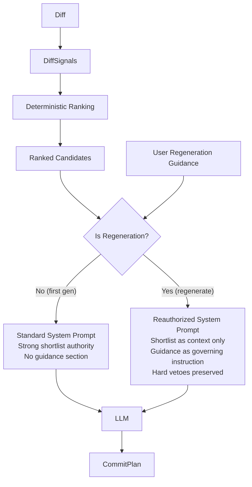
```mermaid
flowchart TD
    DiffE["Diff"] --> SignalsE["DiffSignals"]
    SignalsE --> RankE["Deterministic Ranking"]

    RankE --> BaseE["Ranked Candidates"]
    GuidanceE["User Regeneration Guidance"]

    BaseE --> BranchE{"Is Regeneration?"}
    GuidanceE --> BranchE

    BranchE -- "No (first gen)" --> PromptFirstE["Standard System Prompt\nStrong shortlist authority\nNo guidance section"]
    BranchE -- "Yes (regenerate)" --> PromptRegenE["Reauthorized System Prompt\nShortlist as context only\nGuidance as governing instruction\nHard vetoes preserved"]

    PromptFirstE --> LLM_E["LLM"]
    PromptRegenE --> LLM_E
    LLM_E --> PlanE["CommitPlan"]
```

#### 8.4 Strengths

| Strength | Detail |
| :--- | :--- |
| Fixes the root cause | Addresses the inverted authority hierarchy directly, rather than working around it with candidate manipulation |
| No hint parsing required | Guidance enters verbatim — no NLP, no keyword matching, no classification fragility |
| Minimal ranker impact | The ranker is completely unchanged; its output is reused but presented differently |
| Handles all guidance types | Works equally well for type corrections ("this is a feature"), framing corrections ("focus on user-facing behavior"), and style corrections ("keep it shorter") because it does not try to decompose guidance into structured fields |
| Preserves hard vetoes | Explicit hard-veto preservation in the reauthorized prompt prevents degenerate outcomes |
| Low prompt complexity | Two clearly distinct prompt templates (first-gen vs regenerate) rather than three candidate lanes or complex scoring |
| Testable | Prompt template selection is deterministic (regeneration_guidance is present or absent). The prompt text itself can be golden-tested |
| Fixes the dead-parameter bug | Requires `build_system_prompt` to actually consume `regeneration_guidance` |

#### 8.5 Weaknesses

| Weakness | Detail |
| :--- | :--- |
| Model interpretation of guidance remains unconstrained | The model still decides how to apply guidance. Solution E governs authority structure but not interpretation |
| Prompt design is sensitive | The reauthorized prompt template must be carefully written. Poor wording could cause the model to over-correct or ignore the shortlist entirely |
| Not as deterministic as full structured steering (Solution C) | Free-text guidance is inherently less predictable than structured fields |
| Requires maintaining two prompt templates | First-gen and regenerate prompt paths diverge, adding a maintenance surface |

#### 8.6 Unique Features

- Directly addresses the prompt authority inversion that all four original solutions leave unresolved.
- Uses the guidance text verbatim inside a governed prompt template rather than attempting to parse, classify, or decompose it.
- Combines naturally with any of the other solutions as a prerequisite layer.

#### 8.7 Extensibility and Integration

| Integration Surface | Impact |
| :--- | :--- |
| Current gum review UI | None — guidance entry is unchanged |
| `ReviewState` | None — already stores `regeneration_guidance` |
| `intent.py` ranking core | None — completely untouched |
| `build_system_prompt` | Moderate — branches on presence of guidance to select prompt template |
| `build_generation_messages` | Small — guidance no longer added as a trailing user message (or reduced to a brief reference) |
| Test suite | Moderate — new golden tests for regenerate prompt template; existing tests unchanged |
| Future structured steering | Excellent — Solution E can evolve to accept structured hints in addition to free-text guidance; the reauthorized prompt template can incorporate both |
| Future split-commit logic | Good — the dual-template approach is orthogonal to split-commit orchestration |

### 9. Why Solution E Is Missing from the Original Analysis

The original analysis frames the problem as a **candidate selection conflict**: which intents should appear in the shortlist, and how should guidance influence selection? That framing leads naturally to Solutions A–D, which all manipulate candidates.

But the actual conflict is at the **prompt authority level**. Even with perfect candidate selection, if the prompt tells the model "select from these ranked candidates" in the system prompt and then whispers "but the user said otherwise" in a trailing user message, the model will usually defer to the system-level framing. The problem is not which candidates are shown — it is which authority the prompt tells the model to obey.

### 10. Revised Comparative Evaluation of All Solutions (Including Solution E)

This section provides a revised version of the original Section 14 comparison matrix, expanded to include Solution E.

#### 10.1 High-Level Comparison Matrix (Revised)

| Dimension | A: Alt. Lane | B: Re-ranking | C: Structured Steering | D: Hybrid Reconciliation | E: Prompt Reauthorization |
| :--- | :--- | :--- | :--- | :--- | :--- |
| Preserves existing ranker | Strongly | Partially | Strongly | Strongly | Completely |
| Lets guidance matter structurally | Moderately | Strongly | Strongly | Strongly | Very Strongly |
| Prompt contradiction reduction | Moderate | Strong | Strong | Strong | Very Strong |
| Engineering complexity | Low–Medium | Medium–High | Medium–High | Medium | Low–Medium |
| UX simplicity | High | High | Medium–Low | Medium | High |
| Determinism | Moderate | Strong | Very Strong | Strong | Moderate–Strong |
| Testability | Moderate | Strong | Very Strong | Strong | Strong |
| Extensibility | Moderate | Strong | Very Strong | Very Strong | Very Strong |
| Release safety | Strong | Moderate | Moderate | Strong | Strong |
| Long-term architectural cleanliness | Moderate | Strong | Strong | Very Strong | Strong |
| Handles non-classification guidance | Weak | Weak | Moderate | Moderate | Strong |
| Addresses prompt authority conflict | No | No | Partially | Partially | Yes |

#### 10.2 Strengths and Weaknesses Summary (Revised)

| Solution | Primary Strength | Primary Weakness | Unique Feature |
| :--- | :--- | :--- | :--- |
| A | Safest incremental change | Keeps two authority lanes alive; three-lane prompt is cognitively heavy for models | Explicit override lane without rewriting ranker |
| B | Single coherent regenerate shortlist | Guidance-to-score mapping is itself a classification problem; can conflict with hard vetoes | Best pure ranking-level reconciliation |
| C | Maximum determinism and explainability | Heaviest UX footprint; does not address framing/style guidance | Explicit steering contract instead of fuzzy text |
| D | Best balance across safety, flexibility, and growth | Reconciliation policy is undefined; hint parser scope is ambiguous | Reconciles free text with structural policy |
| E | Directly fixes the prompt authority inversion that causes the actual conflict | Model interpretation of guidance remains unconstrained | Reauthorized prompt template gives guidance structural dominance without modifying the ranker |

#### 10.3 Integration Surface Comparison (Revised)

| Integration Surface | A | B | C | D | E |
| :--- | :--- | :--- | :--- | :--- | :--- |
| Current gum review UI | Minimal | Minimal | Significant | Moderate | None |
| `ReviewState` | Small extension | Small–moderate | Moderate | Moderate | None |
| `intent.py` ranking core | Minimal | Significant | Optional–significant | Moderate | None |
| Prompt construction | Moderate | Moderate | Moderate | Moderate | Moderate |
| Test suite | Moderate growth | Significant growth | Significant growth | Significant growth | Moderate growth |
| Future split-commit logic | Adequate | Strong | Strong | Very Strong | Good |
| Future scope steering | Adequate | Strong | Very Strong | Very Strong | Strong |

#### 10.4 Which Solution Is Best at What (Revised)

| Need | Best-Fit Solution |
| :--- | :--- |
| Safest short-term change | Solution A |
| Strongest pure regenerate-time coherence | Solution B |
| Strongest determinism and testability | Solution C |
| Best balanced long-term direction | Solution D or E (depending on whether reconciliation policy definition or prompt authority is prioritized) |
| Directly addresses the prompt authority inversion | Solution E |
| Lowest engineering complexity with highest impact | Solution E |
| Handles non-classification guidance (style, framing, emphasis) | Solution E |

### 11. Composability Note

Solutions are not mutually exclusive. The strongest practical architecture may be **E combined with elements of B or D**:

- **E** fixes the prompt authority inversion immediately (low cost, high impact).
- **B** (guidance-aware re-ranking) or **D** (hybrid reconciliation) can be layered on later to also adjust the shortlist.
- **C** (structured steering) can be added as an optional upgrade path when the user base demands more explicit control.

The key insight is that **fixing the prompt authority structure (E) is a prerequisite for any of the other solutions to work correctly**. Even a perfectly re-ranked shortlist (B) will be undermined if the prompt still tells the model to treat the shortlist as absolute authority and the user's correction as secondary advice.

### 12. Recommendations

#### 12.1 Immediate (Before Any Solution Is Selected)

1. **Fix the dead `regeneration_guidance` parameter** in `build_system_prompt`. Either remove it (if the intent is to keep guidance purely in user messages) or wire it up. The current state is a maintenance trap and a source of false confidence.

2. **Add a code-level comment** in the regeneration loop explicitly documenting the current guidance flow so future developers do not assume the system prompt is guidance-aware.

#### 12.2 For Solution Selection

3. **Evaluate Solution E as the primary approach** because it:
    - Has the lowest blast radius (no ranker changes, no UI changes, no new data models)
    - Directly addresses the root cause (prompt authority inversion)
    - Is compatible with layering B/C/D on top later
    - Handles the full range of guidance types (not just classification corrections)

4. **If Solution E alone feels insufficient**, combine it with Solution D's reconciliation policy concept. Use E for prompt authority and D for the cases where guidance should also influence candidate ordering. But define the reconciliation policy concretely — do not defer it.

5. **Regardless of which solution is selected**, the hard-veto interaction must be explicitly designed. Every solution assumes the user's guidance is reasonable, but users will inevitably say things like "this is a feature" on a docs-only diff. The system must handle that gracefully without producing degenerate output.

#### 12.3 For the ADR Document Itself

6. **Section 9.3 should be cross-referenced with this refinement** to connect the architectural problem to the specific code-level defects that make it worse.

7. **Section 17.2 (evaluation scenarios) should add**: "guidance targets a non-classification attribute (for example, 'keep it shorter', 'more user-facing emphasis')" — this scenario reveals a blind spot in Solutions A, B, and to some degree C.

### 13. Revised Verification Expectations

The evaluation scenarios from Section 17.2 should be expanded to include the following additional cases:

- guidance targets a non-classification attribute (framing, emphasis, style, length)
- guidance contradicts an `only_docs` or `only_tests` hard veto
- the user provides two successive rounds of evolving guidance (evolving guidance stability)
- the system prompt template selection is itself deterministic and golden-testable
- the model's output under reauthorized prompt framing does not systematically ignore the shortlist entirely

### 14. Refinement-Specific Governance

- This refinement does not alter the decision posture of the original ADR. No solution is being selected here.
- The original four solutions remain valid candidates. Solution E is proposed as an additional candidate.
- Any eventual implementation must address the dead-parameter finding (Section 1 above) regardless of which solution is chosen.
- If Solution E is selected, the implementation must carefully design the reauthorized prompt template and subject it to adversarial testing before deployment.

## III. Refinement 2: Solution F, Solution G, and Comprehensive Comparison (v1.2.0)

Following further analysis of the architectural boundaries of guided regeneration, this refinement introduces two additional solutions (Solution F and Solution G) to address weaknesses in the previous proposals, and provides a unified comparative evaluation.

### 1. Solution F: Deterministic Regex-Directives with Menu Masking (Python-Driven Override)

#### 1.1 Concept
Instead of relying on the LLM to interpret that the user's free-text guidance should override the primary intent, or requiring complex score manipulation in the ranking layer, Solution F pre-processes the user's free-text guidance using high-confidence regular expressions to extract explicit intent overrides (e.g., `"this is a feature"`, `"make it a fix"`, `"docs only"`).

If a directive is matched, the Python layer **masks (prunes) the candidate menu** before constructing the system prompt. It overrides the shortlisted Primary Candidates, pinning them directly to the user's requested intent.

#### 1.2 How it works
1. **Pre-processing**: The Python layer runs regular expressions against `regeneration_guidance` to extract intent overrides (e.g., `cc_type:feat`, `cc_type:fix`, `cc_type:docs`, etc.).
2. **Veto Validation**: Before applying the override, the Python layer evaluates it against deterministic hard-veto rules. If the override contradicts a veto (e.g., forcing a feature on a docs-only diff), the system warns the user in the TUI ("Cannot override to feat on a docs-only change") or enforces the veto.
3. **Menu Masking**: If validation passes, the system prompt's candidate menu is dynamically restricted (masked). The primary candidate slot is filled only with the user-selected intent family.
4. **Style Pass-through**: Non-intent steering (e.g., "keep it shorter") is passed verbatim to the prompt.

#### 1.3 Visual Aid: Regex-Directives and Menu Masking Pipeline
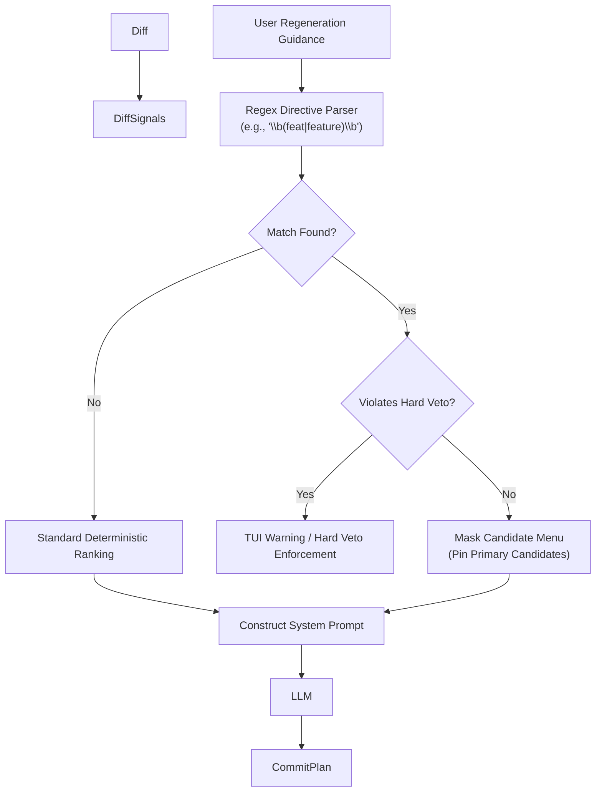
```mermaid
flowchart TD
    DiffF["Diff"] --> SignalsF["DiffSignals"]
    GuidanceF["User Regeneration Guidance"] --> ParseF["Regex Directive Parser\n(e.g., '\\b(feat|feature)\\b')"]
    ParseF --> MatchF{"Match Found?"}
    
    MatchF -- "Yes" --> VetoF{"Violates Hard Veto?"}
    MatchF -- "No" --> RankF["Standard Deterministic Ranking"]
    
    VetoF -- "Yes" --> WarnF["TUI Warning / Hard Veto Enforcement"]
    VetoF -- "No" --> MaskF["Mask Candidate Menu\n(Pin Primary Candidates)"]
    
    RankF --> PromptF["Construct System Prompt"]
    MaskF --> PromptF
    
    PromptF --> LLM_F["LLM"]
    LLM_F --> PlanF["CommitPlan"]
```

#### 1.4 Strengths
- **Zero Prompt Contradiction**: The model cannot select a forbidden intent type because the menu is pruned before prompt assembly.
- **Low Latency & Cost**: Uses local regex engines instead of upstream LLM classification.
- **Frictionless UX**: The user continues to type free-text (avoiding Solution C's menu fatigue) but gains the determinism of structured steering.
- **Safe Vetoes**: Vetoes are verified locally in Python, protecting codebase integrity.

#### 1.5 Weaknesses
- **Pattern Maintenance**: Requires maintaining regular expressions matching common user phrasing.
- **Brittleness**: Fallbacks to Solution E's prompt reauthorization are needed if the user enters ambiguous phrasing.

---

### 2. Solution G: Cumulative Steering Stack & Multi-turn Context Preservation

#### 2.1 Concept
Commit message refinement is often iterative. A user might regenerate, see the result, and add additional instructions (e.g., first "this is a refactor", then "keep it shorter"). In the current architecture, the `ReviewState` only stores a single guidance string, which is overwritten on each turn. 

Solution G introduces a **Cumulative Steering Stack** inside `ReviewState`. The history of steering instructions is preserved, and the system prompt is injected with both the steering history and the previous `CommitPlan` to prevent generation "jitter."

#### 2.2 How it works
1. **Steering Stack**: `ReviewState` maintains a list of historical guidance strings (e.g., `["refactor the internal engine", "keep subject short"]`).
2. **Context-Diffing**: The prompt includes the previous output: `"Here is the previous CommitPlan generated: [Previous Plan]. The developer has provided the following additional correction: [New Instruction]. Adjust the plan accordingly, but preserve other details to avoid jitter."`
3. **Precedence rules**: Prompt template states: "Directives are ordered chronologically. The most recent instructions take precedence over earlier ones, and user instructions take precedence over initial deterministic rankings."

#### 2.3 Visual Aid: Cumulative Steering Stack
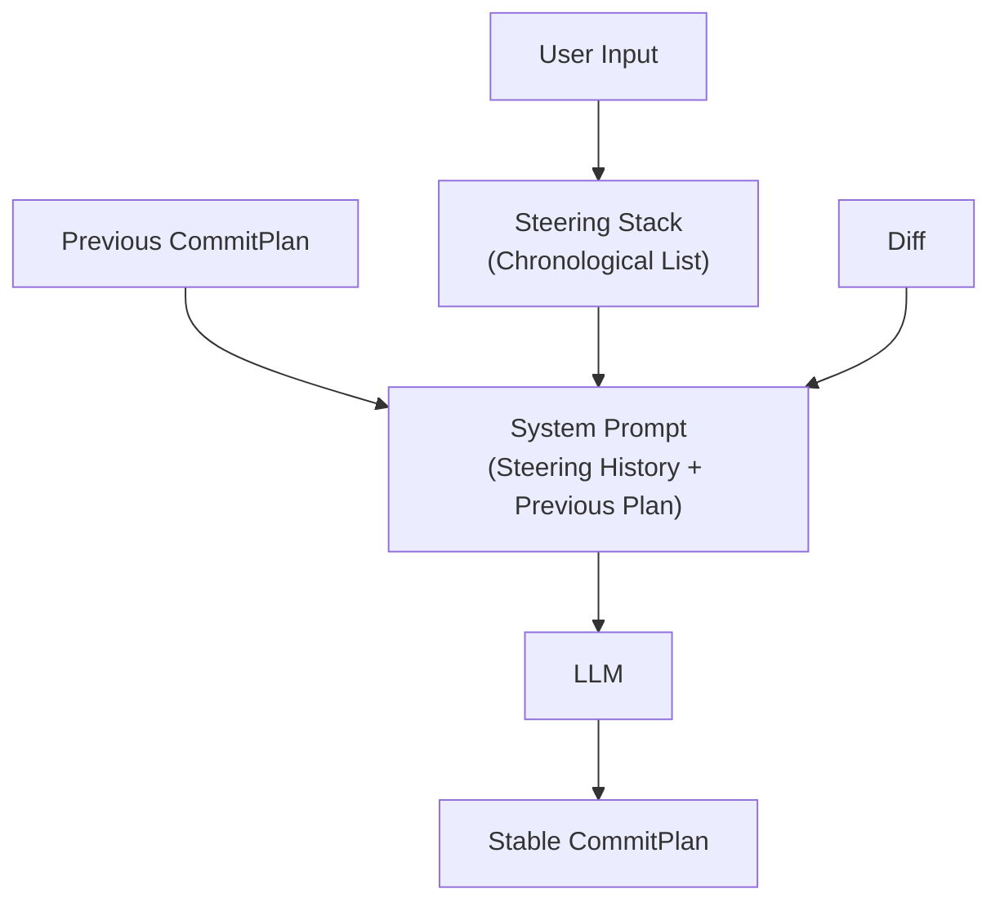
```mermaid
flowchart TD
    UserG["User Input"] --> StackG["Steering Stack\n(Chronological List)"]
    PrevG["Previous CommitPlan"] --> PromptG["System Prompt\n(Steering History + Previous Plan)"]
    StackG --> PromptG
    DiffG["Diff"] --> PromptG
    
    PromptG --> LLM_G["LLM"]
    LLM_G --> PlanG["Stable CommitPlan"]
```

#### 2.4 Strengths
- **Eliminates Jitter**: Passing the previous `CommitPlan` ensures the model modifies only the requested parts (e.g., changing the type without rewriting a perfectly good body summary).
- **Supports Iteration**: The developer does not need to re-type previous guidance instructions.
- **Auditable History**: The complete steering trajectory is preserved in tracing tools (e.g., Opik).

#### 2.5 Weaknesses
- **Token Inflation**: Prompts grow larger on each regeneration iteration.
- **Context Pollution**: Old, conflicting guidance in the stack can confuse the LLM if not carefully managed or cleared.

---

### 3. Comprehensive Comparative Evaluation of All Solutions (A-G)

This section updates the comparison matrices to evaluate Solutions A-G.

#### 3.1 High-Level Comparison Matrix (Revised)

| Dimension | A | B | C | D | E | F | G |
| :--- | :--- | :--- | :--- | :--- | :--- | :--- | :--- |
| Preserves existing ranker | Strongly | Partially | Strongly | Strongly | Completely | Completely | Completely |
| Lets guidance matter | Moderately | Strongly | Strongly | Strongly | Very Strongly | Absolutely | Very Strongly |
| Prompt contradiction reduction | Moderate | Strong | Strong | Strong | Very Strong | Complete | Very Strong |
| Engineering complexity | Low–Med | Med–High | Med–High | Medium | Low–Med | Medium | Medium |
| UX simplicity | High | High | Med–Low | Medium | High | High | High |
| Determinism | Moderate | Strong | Very Strong | Strong | Med–Strong | Very Strong | Moderate |
| Testability | Moderate | Strong | Very Strong | Strong | Strong | Very Strong | Moderate |
| Extensibility | Moderate | Strong | Very Strong | Very Strong | Very Strong | Very Strong | Very Strong |
| Release safety | Strong | Moderate | Moderate | Strong | Strong | Very Strong | Strong |
| Long-term cleanliness | Moderate | Strong | Strong | Very Strong | Strong | Strong | Very Strong |
| Handles non-classification | Weak | Weak | Moderate | Moderate | Strong | Weak | Strong |
| Addresses authority conflict | No | No | Partially | Partially | Yes | Yes | Yes |

*Note on Solutions: A: Alternative Lane, B: Re-ranking, C: Structured Steering, D: Hybrid Reconciliation, E: Prompt Reauthorization, F: Regex-Directives with Masking, G: Cumulative Steering Stack.*

#### 3.2 Strengths and Weaknesses Summary (Revised)

| Solution | Primary Strength | Primary Weakness | Unique Feature |
| :--- | :--- | :--- | :--- |
| A | Safest incremental change | Keeps two authority lanes alive; cognitively heavy prompt | Override lane without ranker modification |
| B | Single coherent regenerate shortlist | Score-to-guidance mapping is brittle; can conflict with vetoes | Best pure ranking rescoring |
| C | Maximum determinism and explainability | Heavy UX footprint; menu fatigue | Explicit steering contract |
| D | Best balance across safety and flexibility | Reconciliation policy is undefined; parser scope is ambiguous | Reconciles free text with structural policy |
| E | Fixes the prompt authority inversion | LLM interpretation of guidance is unconstrained | Reauthorized prompt template |
| F | Complete elimination of prompt conflict for intents | Brittle regex rules; needs fallback for styling guidance | Deterministic Python-driven menu masking |
| G | Prevents description/body jitter across retries | Prompt grows larger with each turn; token inflation | Cumulative context diffing |

---

### 4. Composability and Recommendations

Solutions E, F, and G are highly complementary and represent the optimal target architecture when combined.

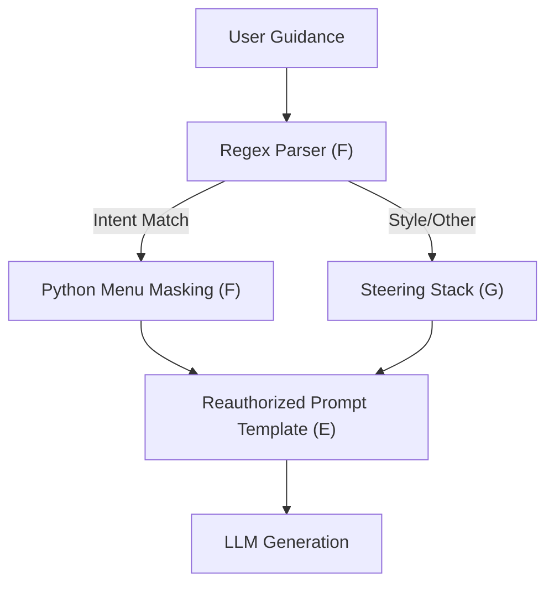
```mermaid
flowchart TD
    Guidance["User Guidance"] --> ParseF["Regex Parser (F)"]
    ParseF -- "Intent Match" --> Mask["Python Menu Masking (F)"]
    ParseF -- "Style/Other" --> Stack["Steering Stack (G)"]
    
    Mask --> Prompt["Reauthorized Prompt Template (E)"]
    Stack --> Prompt
    
    Prompt --> LLM["LLM Generation"]
```

#### Recommended Phase Implementation
1. **Phase 1 (Immediate - Fix Dead Code)**: Fix the dead `regeneration_guidance` parameter in `build_system_prompt` and wire it up to allow prompt adjustments.
2. **Phase 2 (Baseline Reauthorization - Solution E)**: Implement Solution E to ensure that during regeneration, the prompt template changes to subordinate the shortlist and elevate the user's text guidance.
3. **Phase 3 (Deterministic Masking - Solution F)**: Add a local regex-based directive parser in Python. If a clear intent override is detected (e.g., "feat", "fix"), mask the menu and execute pre-flight veto checks in Python before calling the LLM.
4. **Phase 4 (Anti-Jitter Stack - Solution G)**: Store previous `CommitPlan` responses in `ReviewState` and pass them during regeneration to ensure stable, incremental updates.

---


---

## IV. Refinement 3: Deep Architectural Review, Systemic Corrections, and Solution H (v1.3.0)

Following the earlier solution analysis, a further full-project architectural review was conducted against the live `git-cg` codebase, the current ADR set, the SOP matrix, the review-loop implementation, the release parser, the test suite, and the user-facing documentation surfaces.

This update does not replace or rewrite any earlier analysis. Instead, it appends a deeper corrective review that tightens the problem statement, identifies several additional system-level defects that materially affect the solution space, and introduces a new target-state architecture — **Solution H** — because the existing options A-G still do not fully separate semantic intent reconciliation from linguistic regeneration.

The most important conclusion from this review is that the architectural problem is now best understood as **three distinct but coupled problems**, not one:

* **Authority reconciliation**: Which source should dominate during regenerate — the deterministic shortlist, the user's steering text, or a governed combination?
* **Semantic ownership**: Which parts of the final `CommitPlan` should be owned by Python and the SOP matrix, and which parts should remain model-generated?
* **Regeneration stability**: How should repeated regenerate cycles avoid unnecessary jitter, semantic drift, and prompt-state pollution?

Earlier sections identify parts of this well, especially around prompt authority inversion. However, the live codebase shows that the underlying contract is looser than the ADR currently assumes, and that looseness changes how the solution set should be evaluated.

### 1. Review Scope and Evidence Base

This appended review was grounded in direct reading of the following project artifacts:

* `docs/ADRs/0009-reconcile-deterministic-intent-ranking-with-guided-regeneration.md`
* `docs/ADRs/0007-Integrate-gum-for-terminalnative-git-hook-tui.md`
* `src/git_cg/main.py`
* `src/git_cg/intent.py`
* `src/git_cg/interaction.py`
* `src/git_cg/models.py`
* `src/git_cg/sop.py`
* `src/git_cg/release.py`
* `src/git_cg/notifier.py`
* `config/gitops_agent_sop.json`
* `tests/test_main.py`
* `tests/test_regeneration_guidance.py`
* `tests/test_ranker.py`
* `tests/test_intent.py`
* `tests/test_sop.py`
* `README.md`
* `docs/index.md`
* `usage.kdl`

The review remained read-only at analysis time and was focused on architectural behavior, semantic correctness, downstream safety, testability, and governance alignment rather than implementation cosmetics.

### 2. Additional Validated Findings from the Live Codebase

The earlier refinements already captured two important defects:

* the dead `regeneration_guidance` parameter in `build_system_prompt`
* redundant regenerate-time prompt rebuilding that produces the same ranking frame on each retry

Those findings remain correct. The deeper review below extends them.

#### 2.1 Incomplete SOP Canonicalization in `CommitIntent`

The current `CommitIntent.validate_and_correct_matrix` logic in `src/git_cg/models.py` partially enforces the SOP matrix, but not completely.

What it currently does well:

* canonicalizes `gitmoji`
* coerces `cc_type` when it does not match the resolved matrix row
* falls back to a default row when the intent is completely unknown

What it does **not** currently canonicalize for matched rows:

* `semver_impact`
* `changelog_group`

That means the model can return a valid `intent_id` while still drifting on matrix-owned metadata that should be deterministic. This is not a minor issue. It affects one of the core promises of the application: that release classification and changelog grouping derive from the exact selected SOP rows rather than broad language-model approximations.

This finding changes the solution evaluation posture substantially. A regenerate architecture that appears to produce the "right" intent could still leak semantically incorrect metadata into downstream release automation if Python does not fully own matrix-derived fields.

#### 2.2 Silent Fallback to `:wrench:` Masks Model Failure

When the model emits an unknown intent, `CommitIntent.validate_and_correct_matrix` currently falls back to the `:wrench:` row (or first available row if that is unavailable).

This is operationally convenient, but architecturally risky for a core operating function because it converts semantic model failure into a superficially valid output without surfacing that failure clearly.

Consequences include:

* bad model behavior can appear successful in the review loop
* regenerate strategies may look more reliable than they really are because Python silently normalizes the result into a generic chore/config path
* commit history quality may degrade under the appearance of resilience

A fail-soft fallback can be acceptable for non-critical metadata. It is much less acceptable when the fallback can change the apparent primary semantic meaning of the commit.

#### 2.3 "Hard Vetoes" Are Not Actually Hard Constraints

The ADR repeatedly and understandably refers to docs-only, tests-only, and dependency-only exclusions as hard vetoes.

In the actual ranker (`src/git_cg/intent.py`), these are implemented as `-100` score penalties, not explicit disallowed-intent constraints.

That difference matters.

A score penalty is still heuristic. It is not an invariant.

This means that several proposed solutions — especially those that rely on prompt wording such as "hard vetoes remain inviolate" — are stronger in prose than in implementation reality. If the architecture intends certain cases to be impossible rather than merely discouraged, the system needs an explicit constraint model such as `allowed_intents` or `disallowed_intents`, not just rank penalties.

#### 2.4 No Previous-Plan Anchor Means Every Regenerate Is a Full Rewrite

The regenerate loop currently passes:

* the diff
* the rebuilt system prompt
* the optional current guidance string

It does **not** pass:

* the previous `CommitPlan`
* the previous rendered commit message
* an explicit delta or keep-stable instruction grounded in concrete prior state

This means every regenerate attempt is effectively a fresh full re-synthesis, not an incremental correction. That is the real source of jitter.

This finding partially validates the intuition behind Solution G, but it also reveals that a raw "guidance history stack" is not the correct primary fix. The first missing artifact is not a transcript. It is a stable semantic and textual anchor.

#### 2.5 Prompt-Level Surface Constraints Are Under-Enforced

The prompt in `build_system_prompt` instructs the model to keep the primary description under 50 characters and the full header under 72 characters.

However, deterministic enforcement remains weaker than the prose suggests.

The schema currently does not strongly constrain:

* primary description length
* scope length
* regenerate-time style or compression deltas

There is downstream validation via the commit gatekeeper, but that is not the same thing as strong upstream contract enforcement. This matters because several guidance examples in the ADR are about wording and brevity rather than intent selection.

A solution architecture that claims to support style guidance should not rely exclusively on prompt obedience when the system already positions itself as a governed and validated engine.

#### 2.6 Release Parsing Amplifies Semantic Drift

The regeneration problem is not isolated to the review loop.

`src/git_cg/release.py` prefers the `SemVer-Impact` trailer when present, which is good. But if that trailer is absent or malformed, the parser falls back to broader header inference logic.

That fallback is inherently less trustworthy because multiple SOP rows can share the same broad `cc_type` while carrying different release semantics.

For example:

* `feat` rows can imply `PATCH`, `MINOR`, or `MAJOR`
* `refactor` rows can imply `PATCH`, `MINOR`, or `MAJOR`

So any regenerate solution that leaves semantic ownership too loose can create downstream release ambiguity, even if the review loop appears acceptable.

#### 2.7 The SOP Matrix Is Richer Than the Marker Vocabulary Feeding It

The `gitops_agent_sop.json` matrix contains a broad vocabulary of positive and negative signals, many of which are more semantically specific than the current `_generate_signal_markers` implementation in `src/git_cg/intent.py` can emit.

That creates a practical precision ceiling:

* the matrix appears more expressive than the current ranker input actually is
* some fine-grained distinctions exist on paper but not as consistently reachable ranking signals
* guidance-aware rescoring options built on top of this layer inherit that ceiling unless the signal vocabulary is expanded or a new constraint model is introduced

This does not invalidate deterministic ranking. It does mean that several solution descriptions slightly overestimate how much semantic precision the current ranker can provide before regenerate-time reconciliation even begins.

#### 2.8 Documentation and Interface Drift Are Already Emerging

The wider project review also found governance drift:

* `README.md` documents the richer interactive review action set including issue references and regenerate guidance
* `docs/index.md` still documents the older narrower action set
* `usage.kdl` does not accurately reflect the current CLI surface

This is not the root architectural bug, but it is evidence that the regeneration system now spans more surfaces than the ADR comparison currently acknowledges.

### 3. Reframed Root Problem

After integrating the earlier refinements and the additional findings above, the underlying problem is more accurately stated as follows:

> The current regenerate architecture asks a single model call to simultaneously reconcile deterministic ranking, user corrections, and natural-language rewriting, while Python still under-owns some matrix-derived semantics and the system lacks a stable previous-plan anchor.

This produces three distinct failure modes.

#### 3.1 Authority failure

The prompt tells the model to respect ranked candidates while user guidance arrives later as a weaker signal.

#### 3.2 Semantic-ownership failure

Even when intent selection appears correct, matrix-derived metadata is not fully canonicalized by Python.

#### 3.3 Stability failure

Repeated regenerate cycles have no strong anchor and therefore rewrite more than the user actually asked to change.

These three problems should not be evaluated as though one mechanism will naturally solve them all.

### 4. Reassessment of Solutions A-G

A major improvement needed in the ADR is to stop treating A-G as though they are all the same kind of thing.

They are not.

Some are prompt-layer interventions. Some are ranking interventions. Some are UI or state-management ideas. Some are umbrella categories. They are partially composable rather than strictly mutually exclusive.

#### 4.1 A-G Reclassified by Primary Architectural Layer

| Solution | Primary Layer | Best Contribution | Why It Is Not Sufficient Alone |
| :--- | :--- | :--- | :--- |
| A | Candidate presentation | Makes override lanes explicit | Leaves arbitration to the model and increases prompt complexity |
| B | Ranking | Produces one regenerate-specific shortlist | Cannot naturally address style/framing guidance and depends on a hidden guidance classifier |
| C | UI/control input | Makes explicit steering deterministic | Adds UX friction and still needs a deeper precedence policy |
| D | Policy umbrella | Correctly senses that multiple mechanisms are needed | Too underspecified to be selected as written |
| E | Prompt authority | Directly fixes the current inverted authority hierarchy | Does not by itself fix semantic ownership or regenerate stability |
| F | Deterministic override extraction | Handles explicit semantic corrections with high confidence | Limited coverage and weak for framing/length guidance |
| G | Iteration state | Recognizes that repeated regenerate cycles need memory | A raw cumulative stack is too noisy and too token-heavy |

This reframing matters because it changes how the comparison should be read.

* **E** is best understood as a **prerequisite authority correction layer**.
* **F** is best understood as a **bounded deterministic directive accelerator**.
* **G** is best understood as an **iteration-state concern**, not a complete architecture.
* **D** should be rewritten as a real precedence policy if it is to remain a candidate.

#### 4.2 Focused Review of Solution A

Solution A remains a viable incremental stopgap, but it should no longer be positioned as a serious long-term target architecture.

Key concerns:

* it increases the number of authority surfaces in the prompt
* it still asks the model to decide whether conflict is clear enough to justify the alternate lane
* it does very little for non-semantic guidance such as emphasis, brevity, or stability

If retained at all, Solution A should be explicitly framed as a transitional overlay and paired with E-style prompt reauthorization.

#### 4.3 Focused Review of Solution B

Solution B remains the strongest option among the original A-D if the only problem were regenerate-time semantic shortlist coherence.

However, it is weaker than it first appears because:

* free-text guidance must still be normalized into score changes somehow
* those score changes are themselves a hidden classifier
* style and framing guidance do not naturally belong in ranking
* the current marker vocabulary already limits how expressive ranking can be

If B is pursued, it should be constrained to high-confidence structured or semi-structured directive inputs rather than broad free-text reinterpretation.

#### 4.4 Focused Review of Solution C

Solution C is still valuable, but mostly as an optional control-plane enhancement rather than the primary answer.

It is best for:

* explicit primary-type overrides
* explicit discouraged types
* scope preferences
* future governance-heavy workflows

It is much less good for:

* compact natural-language framing corrections
* fast low-friction review-loop steering
* minimizing UI surface area for common cases

The strongest role for C is likely later-stage optional augmentation, not first-line architecture.

#### 4.5 Focused Review of Solution D

Solution D correctly points toward composability, but as written it remains too vague to be selected responsibly.

If D is kept in the ADR, it should be rewritten as an explicit policy definition that answers:

* what wins first: hard constraint, user directive, or ranker?
* which kinds of guidance are eligible for structural transformation?
* when are alternatives used versus score adjustments?
* what remains model-interpreted versus Python-resolved?

Without those answers, D is more a category label than a solution.

#### 4.6 Focused Review of Solution E

Solution E is the strongest near-term improvement and should be treated as the minimum prerequisite for any credible regenerate architecture.

Why it is strong:

* it fixes the current authority inversion directly
* it has low blast radius
* it preserves the existing ranker
* it supports broad natural guidance better than rank-only strategies

Why it is still incomplete:

* it does not separate semantic decisions from linguistic rewriting
* it does not create a stable previous-plan anchor
* it depends on the model to interpret guidance correctly
* it assumes a stronger constraint model than the codebase currently has

The corrected way to position E is:

> necessary, high-impact, low-risk, but not the final architecture on its own.

#### 4.7 Focused Review of Solution F

Solution F is useful, but only if it remains tightly bounded.

It is strongest for phrases like:

* `this is a feature`
* `make it a fix`
* `use scope tui`

It becomes weak or brittle for phrases like:

* `focus on user-facing behavior`
* `keep the subject shorter`
* `do not overemphasize internals`

So F should not be described as a full elimination of prompt conflict. It is better described as deterministic pre-resolution for high-confidence semantic directives, with clean fallback to E-style prompt behavior when ambiguous.

#### 4.8 Focused Review of Solution G

Solution G is the most conceptually over-extended proposal in the current ADR.

Its core observation is correct:

* regenerate needs memory and stability

But the proposed raw cumulative steering stack is not the best embodiment of that insight.

Why the current G shape is risky:

* prompts grow with each iteration
* old steering text becomes stale but still consumes authority and context
* history accumulation is not the same thing as active resolved state

A better evolution of G would keep:

* the previous `CommitPlan`
* the active resolved steering state
* the latest residual free-text note

and would **not** replay the full steering transcript by default.

### 5. Solution H: Locked Semantic Contract with Selective Delta Regeneration

The review identified a missing solution family that is materially stronger than the existing set because it separates semantic resolution from natural-language re-rendering.

That missing solution is documented here as **Solution H**.

#### 5.1 Core Concept

Instead of asking a single regenerate prompt to do all of the following at once:

* reinterpret the diff
* arbitrate between ranking and guidance
* choose the semantic intent bundle
* rewrite the description and body
* preserve any useful earlier wording

Solution H splits regenerate into two governed concerns:

1. **semantic contract resolution**
2. **linguistic delta rendering**

Python becomes the owner of the semantic contract, while the model remains responsible for high-quality natural-language rendering within that contract.

#### 5.2 Governing Rules

Under Solution H, the system should operate under the following rules.

* The ranker still runs and still matters.
* Prompt authority is still corrected using E-style reauthorization during regenerate.
* High-confidence explicit directives may still be extracted using a bounded F-style parser.
* Matrix-derived fields must be owned by Python once an `intent_id` is accepted.
* Regenerate must distinguish between:
    * semantic correction
    * framing correction
    * style/length correction
* The previous accepted `CommitPlan` becomes the primary anchor for regenerate stability.
* Hard constraints must become explicit constraint sets rather than merely score penalties if the system intends them to be inviolate.

#### 5.3 Proposed Internal Model

A clean implementation shape for Solution H would introduce three internal state objects.

##### A. `GenerationContext`

Contains deterministic context derived from the diff and SOP:

* `diff_signals`
* `ranked_intents`
* `allowed_intents` / `disallowed_intents`
* cached candidate summaries

##### B. `RegenerationState`

Contains review-loop steering state:

* previous `CommitPlan`
* active normalized directives
* latest free-text residual note
* optional scope preference

##### C. `ResolvedCommitContract`

Contains the semantic contract for the next render:

* primary `intent_id`
* secondary `intent_id`s
* canonicalized `gitmoji`
* canonicalized `cc_type`
* canonicalized `semver_impact`
* canonicalized `changelog_group`
* locked or mutable fields for scope/description/body depending on the regenerate request

#### 5.4 Visual Aid: Solution H Pipeline

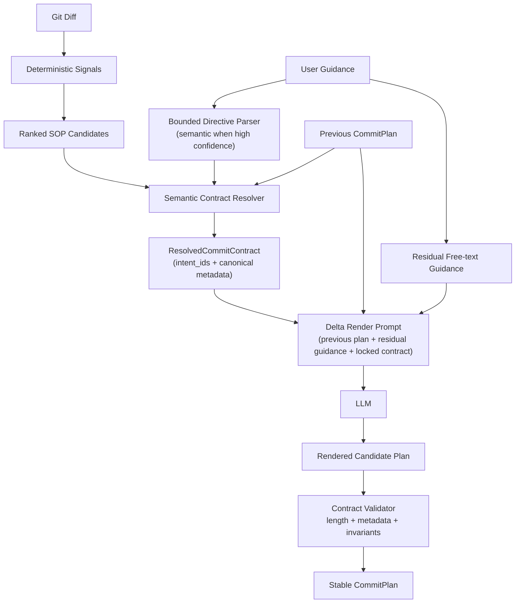
```mermaid
flowchart TD
    DiffH["Git Diff"] --> SignalsH["Deterministic Signals"]
    SignalsH --> RankH["Ranked SOP Candidates"]

    GuidanceH["User Guidance"] --> ParseH["Bounded Directive Parser\n(semantic when high confidence)"]
    GuidanceH --> ResidualH["Residual Free-text Guidance"]

    PrevPlanH["Previous CommitPlan"] --> ReconH["Semantic Contract Resolver"]
    RankH --> ReconH
    ParseH --> ReconH

    ReconH --> ContractH["ResolvedCommitContract\n(intent_ids + canonical metadata)"]
    ContractH --> PromptH["Delta Render Prompt\n(previous plan + residual guidance + locked contract)"]
    ResidualH --> PromptH
    PrevPlanH --> PromptH

    PromptH --> LLM_H["LLM"]
    LLM_H --> CandidatePlanH["Rendered Candidate Plan"]
    CandidatePlanH --> ValidateH["Contract Validator\nlength + metadata + invariants"]
    ValidateH --> FinalPlanH["Stable CommitPlan"]
```

#### 5.5 Visual Aid: Regenerate-Time Delta Sequence

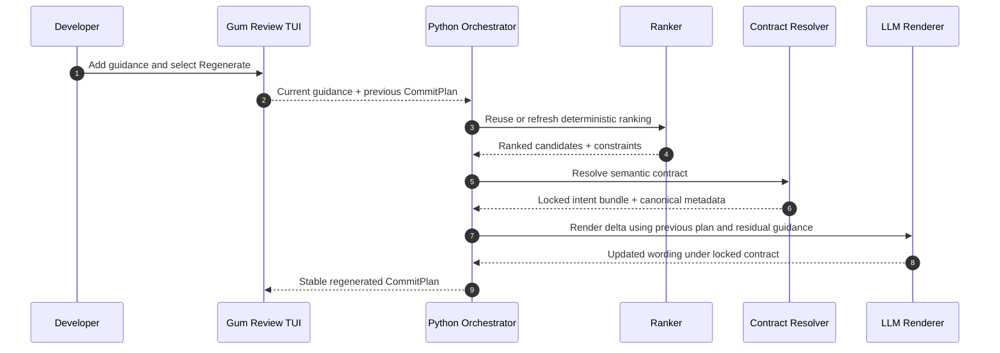
```mermaid
sequenceDiagram
    autonumber
    participant User as Developer
    participant TUI as Gum Review TUI
    participant PY as Python Orchestrator
    participant R as Ranker
    participant C as Contract Resolver
    participant LLM as LLM Renderer

    User->>TUI: Add guidance and select Regenerate
    TUI-->>PY: Current guidance + previous CommitPlan
    PY->>R: Reuse or refresh deterministic ranking
    R-->>PY: Ranked candidates + constraints
    PY->>C: Resolve semantic contract
    C-->>PY: Locked intent bundle + canonical metadata
    PY->>LLM: Render delta using previous plan and residual guidance
    LLM-->>PY: Updated wording under locked contract
    PY-->>TUI: Stable regenerated CommitPlan
```

#### 5.6 Why Solution H Is Stronger Than A-G

Solution H directly addresses the missing separation in the current ADR.

It distinguishes:

* **who decides meaning** from **who decides wording**
* **what may change** from **what must remain stable**
* **semantic override handling** from **stylistic refinement handling**

That makes it materially stronger for:

* repeated regeneration stability
* downstream release safety
* deterministic tests
* integrating E, F, and a refined G without collapsing them into one prompt hack

#### 5.7 Strengths

| Strength | Detail |
| :--- | :--- |
| Separates semantics from phrasing | Intent reconciliation no longer has to be solved inside the same prompt that rewrites prose |
| Improves stability | Previous-plan anchoring and locked semantic contracts reduce regenerate jitter |
| Improves release safety | Python can fully canonicalize matrix-owned metadata once intent IDs are resolved |
| Composes with E and F | Prompt reauthorization and high-confidence directive extraction still remain useful layers |
| Makes testing clearer | Contract resolution, delta rendering, and final validation can be tested separately |
| Better matches guidance reality | Semantic corrections, framing instructions, and length requests no longer need to be forced through one mechanism |

#### 5.8 Weaknesses

| Weakness | Detail |
| :--- | :--- |
| Higher engineering cost | Requires new internal state models and clearer phase separation |
| Larger migration surface | Touches more of the core generation pipeline than E alone |
| Possible extra LLM round | Some regenerate paths may benefit from or require an additional render-focused call |
| Requires stricter contract design | Hard constraints and matrix ownership must be made explicit rather than implied |

#### 5.9 Integration Surface and Impact Radius

| Component | Required Change | Effect |
| :--- | :--- | :--- |
| `src/git_cg/models.py` | Fully canonicalize matrix-owned metadata from resolved `intent_id`s | Eliminates semantic drift in release-critical fields |
| `src/git_cg/main.py` | Split semantic resolution from delta rendering; add previous-plan anchoring | Makes regenerate incremental rather than fully stateless |
| `src/git_cg/intent.py` | Optionally expose explicit allowed/disallowed constraint sets | Converts pseudo-vetoes into real architecture when desired |
| `src/git_cg/interaction.py` | Continue collecting guidance, but later surface normalized directive state if adopted | Keeps TUI understandable while supporting richer steering |
| `tests/` | Add contract-resolution, delta-render, and invariant tests | Expands confidence beyond prompt-only behavior |
| `README.md` and docs | Explain semantic vs stylistic regenerate behavior once implemented | Prevents user confusion about what regenerate is allowed to change |

### 6. Supplemental Comparative Evaluation of All Solutions (A-H)

This subsection is intended to improve the earlier comparison by adding missing dimensions.

#### 6.1 Expanded Comparison Matrix

| Dimension | A | B | C | D | E | F | G | H |
| :--- | :--- | :--- | :--- | :--- | :--- | :--- | :--- | :--- |
| Fixes prompt authority inversion | Weak | Weak | Moderate | Moderate | Strong | Moderate | Weak | Strong |
| Deterministic semantic override handling | Weak | Moderate | Strong | Moderate | Weak | Strong | Weak | Very Strong |
| Handles framing and emphasis guidance | Weak | Weak | Moderate | Moderate | Strong | Weak | Moderate | Strong |
| Handles style and length guidance | Weak | Weak | Moderate | Weak | Strong | Weak | Moderate | Strong |
| Stability across repeated regenerate cycles | Weak | Moderate | Moderate | Moderate | Moderate | Moderate | Moderate | Very Strong |
| Preserves existing ranker value | Strong | Partial | Strong | Strong | Complete | Complete | Complete | Strong |
| Protects release metadata integrity | Weak | Moderate | Moderate | Moderate | Moderate | Moderate | Weak | Strong |
| Testability as a governed system | Moderate | Strong | Very Strong | Moderate | Strong | Strong | Moderate | Very Strong |
| Suitable as a final target architecture on its own | No | No | No | Not as written | No | No | No | Yes |

#### 6.2 Best-Fit Interpretation of the Solution Space

| Need | Best Fit |
| :--- | :--- |
| Lowest-blast-radius immediate correction | E |
| Deterministic handling of explicit type/scope phrases | F |
| Optional explicit steering UI for power users | C |
| Strongest regenerate-specific shortlist coherence | B |
| Better multi-turn stability without semantic drift | H |
| Best long-term target architecture | H |

#### 6.3 Corrected Reading of Composability

The earlier ADR already moved in this direction, but the project review makes it clearer:

* **E** should be treated as a prerequisite layer.
* **F** should be treated as a bounded accelerator layer.
* **G** should be refined into an active-state-and-previous-plan layer rather than a transcript stack.
* **H** is the first solution that can realistically act as the long-term target architecture because it separates contract resolution from textual rendering.

### 7. Recommended Decision Posture and Phased Path

No final implementation is being selected in this appended update. However, the review supports a much clearer recommendation posture.

#### 7.1 Mandatory prerequisites regardless of selected solution

Before any solution is treated as complete, the system should address the following baseline defects:

* fully wire up or remove the dead `regeneration_guidance` parameter
* canonicalize all matrix-owned fields in Python once an `intent_id` is resolved
* stop calling score penalties "hard vetoes" unless they become explicit constraints
* add a previous-plan anchor to regenerate-time behavior
* tighten subject/description invariants where the project claims deterministic governance
* add tests that cover semantic stability and release metadata correctness, not just prompt shape

#### 7.2 Strongest near-term path

The strongest near-term path is:

1. **E first** — correct authority at the prompt layer
2. **bounded F second** — deterministically handle explicit type/scope corrections
3. **refined G elements third** — preserve previous-plan stability without transcript accumulation

This path has the best ratio of safety to implementation effort.

#### 7.3 Strongest long-term path

The strongest long-term path is:

* move from E + bounded F + refined G toward **H**

That is the point at which regenerate becomes a properly governed, multi-stage architectural behavior rather than a single increasingly burdened prompt.

### 8. Underlying System Changes Required

This review concludes that the underlying system does require change beyond prompt wording.

The two most important changes are:

#### 8.1 Python must own SOP-derived semantics

Once an `intent_id` is selected, Python should own:

* `gitmoji`
* `cc_type`
* `semver_impact`
* `changelog_group`

The model should not remain the final authority for those fields.

#### 8.2 Regenerate must distinguish semantic edits from stylistic edits

The current regenerate path treats every correction as if it should reopen the whole generation problem.

That is the wrong shape for a core operating function.

A semantic correction such as `this is a feature` and a style correction such as `keep the subject shorter` are not the same class of instruction and should not be processed through the exact same decision path.

### 9. Expanded Verification Expectations

The verification section in the ADR should be considered incomplete without the following additional expectations.

* guidance that changes semantic type but should preserve most body content
* guidance that changes scope only
* guidance that changes emphasis only
* guidance that changes wording length only
* repeated regenerate cycles with evolving guidance but stable prior-plan preservation
* docs-only/tests-only/dependency-only cases under explicit override attempts
* matrix canonicalization tests that prove `semver_impact` and `changelog_group` cannot drift once `intent_id` is accepted
* release-parser tests proving malformed or missing trailers do not silently reinterpret semantically distinct rows as equivalent broad `cc_type` classes
* documentation-sync checks to keep README, docs, and CLI surface descriptions aligned

### 10. Governance Follow-up from the Review

This deeper review creates several follow-up obligations for the ADR and broader project governance:

* the comparative evaluation should stop framing A-G as strict peers
* Solution D should be rewritten if it is to remain in the candidate set
* Solution G should be narrowed from transcript accumulation to active-state anchoring
* README, `docs/index.md`, and `usage.kdl` should be kept aligned with the actual review-loop behavior
* any implementation that changes regenerate semantics should be explicitly tested against downstream release parsing, not only review-loop behavior

### 11. References Used for This Update

* `docs/ADRs/0009-reconcile-deterministic-intent-ranking-with-guided-regeneration.md`
* `docs/ADRs/0007-Integrate-gum-for-terminalnative-git-hook-tui.md`
* `src/git_cg/main.py`
* `src/git_cg/intent.py`
* `src/git_cg/models.py`
* `src/git_cg/interaction.py`
* `src/git_cg/release.py`
* `config/gitops_agent_sop.json`
* `tests/test_main.py`
* `tests/test_regeneration_guidance.py`
* `tests/test_ranker.py`
* `tests/test_intent.py`
* `README.md`
* `docs/index.md`
* `usage.kdl`


## V. Refinement 4: Structural Pass, Review Ingestion, Final Preferred Solution Selection, and Implementation Plan (v1.4.0)

This update advances ADR-0009 from an analytical comparison record to a selected target architecture record while preserving full append-only history. No prior sections are deleted, rewritten, or renumbered. Instead, this update performs four explicit actions:

1. records the structural pass findings against the current ADR body
2. ingests and synthesizes the reviews now preserved across Sections II, III, and IV
3. selects the final preferred solution
4. appends the concrete implementation-plan appendix for the selected architecture

### 1. Structural Pass Results

#### 1.1 Formatting and Heading Consistency Findings

The structural pass finds that ADR-0009 is acceptable and internally coherent under the project's append-only ADR style.

| Area | Structural Finding | Action Taken |
| :--- | :--- | :--- |
| Header prompt and predicted asset link | Present and correctly placed at the top of the ADR | Preserved unchanged |
| YAML metadata block | Complete and consistent with project ADR style | Updated only to reflect the newly selected preferred solution and current version |
| Base section numbering | Sections 1-22 remain internally consistent | Preserved unchanged |
| Append-only refinement headings | Sections II, III, IV are historically coherent and intentionally layered | Preserved unchanged |
| Mixed numbering model | The ADR now uses a deliberate two-tier structure: original numbered body plus append-only Roman-numeral updates | Confirmed as acceptable; no retroactive renumbering performed |
| Visual-aid coverage | Present in the base body and in solution-specific appendices | Preserved and extended |
| Earlier decision-deferral language | Historically accurate for earlier versions of the ADR | Superseded by this update rather than rewritten |

#### 1.2 Structural Pass Conclusion

The ADR does not require destructive restructuring. The current shape is valid because the project treats refinements and updates as a preserved historical record rather than a periodically rewritten monolithic document. That governance choice is especially appropriate here because the solution space evolved materially from A-D to A-H, and preserving that reasoning history is important.

### 2. Review Ingestion and Synthesis

This section ingests the cumulative review corpus now present inside ADR-0009 and converts it into a single synthesized decision basis.

#### 2.1 Ingested Findings from the Original Analysis (Sections 1-22)

The original body correctly established the following baseline facts:

* deterministic ranking is one of the strongest architectural assets in the application
* the current generation flow is not blank-slate prompting; it is a pre-framed, SOP-mediated decision system
* regeneration guidance introduces a second authority into the generation path
* the core unaddressed problem was the lack of a clear precedence model between deterministic shortlist authority and user-authored correction guidance
* Solutions A-D were valuable first-stage explorations, but they were not yet sufficient to close the entire problem cleanly

#### 2.2 Ingested Findings from Refinement 1 (Solution E Review)

Refinement 1 introduced the first major correction to the framing of the problem.

The most important findings ingested from Section II are:

* the authority hierarchy was inverted during regenerate-time prompting
* the model was receiving ranked system-level framing with stronger authority than the user correction that should dominate regenerate mode
* Solution E correctly identified prompt reauthorization as a prerequisite layer
* prompt authority correction is necessary, but not sufficient, because it fixes who should dominate but not what exactly should be locked, rewritten, or preserved

This review materially improved the ADR by establishing that candidate selection alone is not the whole problem.

#### 2.3 Ingested Findings from Refinement 2 (Solutions F and G)

Refinement 2 added two more useful but bounded ideas.

The most important findings ingested from Section III are:

* Solution F is valuable when the user guidance contains a high-confidence semantic directive that can be extracted deterministically in Python
* Solution F is not broad enough to handle style, framing, or emphasis guidance on its own
* Solution G correctly recognized that regenerate needs memory and state continuity
* the strongest surviving part of G is not full transcript accumulation but rather active-state preservation and stable previous-plan anchoring

This review materially improved the ADR by separating deterministic directive handling from open-ended free-text interpretation and by clarifying that regenerate stability requires remembered state.

#### 2.4 Ingested Findings from Update 3 (Solution H Review)

Update 3 provided the decisive deep review of the live codebase and is the most important review layer for final selection.

The most important findings ingested from Section IV are:

* Python does not yet fully own all matrix-derived semantics once an `intent_id` is accepted
* so-called hard vetoes are still implemented as score penalties rather than real explicit constraint sets
* regenerate currently lacks a stable previous-plan anchor and therefore behaves like repeated full rewrites rather than controlled deltas
* release parsing amplifies semantic drift when matrix-owned metadata is not fully canonicalized upstream
* the current solution set before H still failed to cleanly separate semantic resolution from linguistic rendering
* Solution H is the first solution that explicitly splits semantic contract resolution from selective natural-language delta rendering

This review materially changed the decision posture by demonstrating that the final target architecture must be stronger than prompt-only correction, stronger than shortlist-only manipulation, and stronger than transcript accumulation.

#### 2.5 Synthesized Decision Basis

After ingesting all preserved review layers, the following synthesized requirements are now non-negotiable:

* prompt authority must be corrected during regeneration
* Python must own SOP-derived semantics once semantic intent is resolved
* explicit directive handling should be deterministic when high confidence exists
* regenerate must preserve a stable previous-plan anchor
* semantic corrections and stylistic corrections must not be treated as the same class of operation
* release safety and downstream parser integrity must be protected by design, not left to prompt obedience alone

### 3. Final Preferred Solution Selection

#### 3.1 Preferred Solution Statement

**Solution H is now selected as the final preferred solution for adoption.**

More precisely:

> `git-cg` will adopt **Solution H: Locked Semantic Contract with Selective Delta Regeneration** as the target regenerate architecture. Solution E, bounded aspects of Solution F, and the surviving active-state insight from Solution G are not retained as parallel end-state alternatives. They are incorporated as enabling sublayers inside the Solution H implementation.

This is the correct selection.

#### 3.2 Why Solution H Is the Best Implementation to Adopt

Solution H is preferred because it is the first solution in the ADR that simultaneously addresses all three architectural problems identified across the review history:

1. **Authority reconciliation**
2. **Semantic ownership**
3. **Regeneration stability**

The earlier solutions each solve only part of the problem:

* **A** improves candidate presentation but does not truly resolve authority or stability
* **B** improves shortlist coherence but still overloads ranking with responsibilities that include style and framing
* **C** improves determinism but at substantial UX cost and without fully addressing broad free-text steering
* **D** correctly gestures toward composability but remains too underspecified to implement safely as written
* **E** is a mandatory prerequisite because it corrects prompt authority, but by itself it does not create a semantic contract or previous-plan anchoring model
* **F** is highly valuable for bounded deterministic semantic directives, but is too narrow to stand alone
* **G** surfaced the need for regenerate memory, but transcript accumulation is not the correct final shape

Only **H**:

* separates semantic contract resolution from wording regeneration
* allows Python to own release-critical metadata deterministically
* supports prompt reauthorization as a sublayer rather than the whole solution
* allows bounded deterministic directives without forcing all guidance through rigid menus
* turns regenerate into controlled delta production instead of full semantic re-synthesis on every retry

#### 3.3 Decision Posture Toward Prior Solutions

The selected architecture should now be interpreted as follows:

| Prior Solution | Final Role After Selection |
| :--- | :--- |
| A | Historical exploration only; not selected |
| B | Useful reference for future ranking refinements, but not the selected target architecture |
| C | Optional future control-plane augmentation, not the primary path |
| D | Superseded conceptually by the clearer composition model inside H |
| E | Mandatory prerequisite sublayer inside H |
| F | Bounded deterministic accelerator sublayer inside H |
| G | Narrowed into active-state / previous-plan anchoring inside H |
| H | Selected final preferred architecture |

### 4. Selected Architecture Composition

Solution H should not be read as an isolated replacement block. It is a composed architecture that intentionally absorbs the strongest validated insights from the later review set.

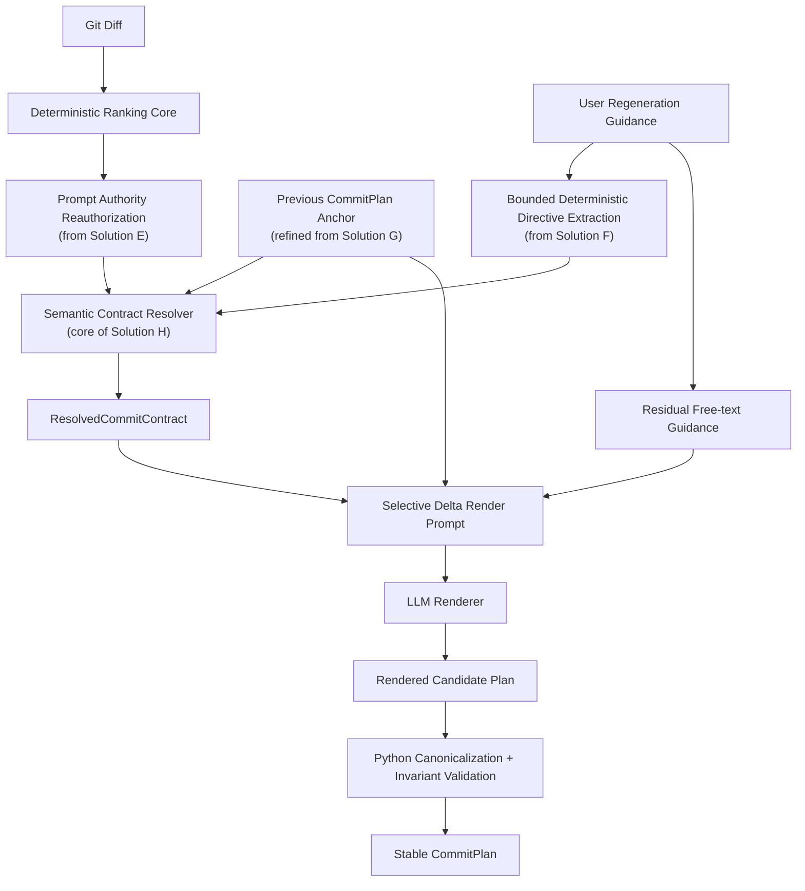
```mermaid
flowchart TD
    Diff["Git Diff"] --> Rank["Deterministic Ranking Core"]
    Guidance["User Regeneration Guidance"] --> FLayer["Bounded Deterministic Directive Extraction
(from Solution F)"]
    Guidance --> Residual["Residual Free-text Guidance"]
    PrevPlan["Previous CommitPlan Anchor
(refined from Solution G)"] --> Resolver
    Rank --> Reauth["Prompt Authority Reauthorization
(from Solution E)"]
    Reauth --> Resolver["Semantic Contract Resolver
(core of Solution H)"]
    FLayer --> Resolver
    Residual --> DeltaPrompt["Selective Delta Render Prompt"]
    Resolver --> Contract["ResolvedCommitContract"]
    Contract --> DeltaPrompt
    PrevPlan --> DeltaPrompt
    DeltaPrompt --> LLM["LLM Renderer"]
    LLM --> Candidate["Rendered Candidate Plan"]
    Candidate --> Canon["Python Canonicalization + Invariant Validation"]
    Canon --> Final["Stable CommitPlan"]
```

#### 4.1 Selected Architecture Summary

The final preferred architecture therefore consists of six layers:

1. **Deterministic diff analysis and ranking**
2. **Prompt authority reauthorization during regenerate**
3. **Bounded deterministic semantic directive extraction**
4. **Semantic contract resolution owned by Python**
5. **Selective delta rendering for mutable language fields**
6. **Final Python-side canonicalization and invariant enforcement**

This is the minimum architecture that fully matches the cumulative review findings.

### 5. Concrete Implementation-Plan Appendix for Solution H

This section intentionally converts the selected architecture into a concrete implementation plan while preserving all prior analytical history unchanged.

#### 5.1 Implementation Principles

The implementation must follow these principles:

* preserve the current working generation path until the new path is fully verified
* land prerequisite safety fixes before deeper regenerate changes
* keep Python in charge of semantic ownership and contract enforcement
* add new modules for reconciliation logic rather than burying all complexity in `main.py`
* keep the TUI comprehensible; do not transform it into a chat system
* phase rollout so each milestone is reversible

#### 5.2 Proposed Internal Types and Modules

The selected implementation should introduce explicit internal types rather than letting regenerate semantics remain implicit.

| Proposed Type / Module | Purpose |
| :--- | :--- |
| `GenerationContext` | Carries deterministic diff signals, ranked intents, and explicit allowed/disallowed constraints |
| `RegenerationDirectives` | Stores bounded high-confidence directives extracted from guidance, such as preferred type or preferred scope when confidently detected |
| `RegenerationState` | Stores previous `CommitPlan`, active directives, residual guidance, and review-loop stability state |
| `ResolvedCommitContract` | Represents the Python-owned semantic contract for the next render, including locked intent ids and canonicalized matrix-derived metadata |
| `src/git_cg/regeneration.py` | New module containing contract resolution, directive extraction, and delta-render request assembly |

The implementation should keep `CommitPlan` as the model-facing schema but should stop using it as the only state artifact in regenerate mode.

#### 5.3 File-by-File Implementation Plan

##### A. `src/git_cg/models.py`

Planned changes:

* fully canonicalize matrix-owned fields after `intent_id` resolution for matched rows:
    * `gitmoji`
    * `cc_type`
    * `semver_impact`
    * `changelog_group`
* add stronger invariant enforcement for:
    * primary description length
    * optional scope length constraints if adopted
* ensure the model cannot silently drift on release-critical metadata once Python accepts the semantic contract

Reason:

This is required to make Solution H real. Without it, semantic ownership remains partially with the model.

Rollback:

* revert canonicalization expansion and keep current partial behavior

##### B. `src/git_cg/intent.py`

Planned changes:

* preserve existing ranking behavior as the baseline analysis engine
* add an explicit constraint export layer, for example:
    * `allowed_intent_ids`
    * `disallowed_intent_ids`
    * `constraint_reasons`
* stop treating `only_docs`, `only_tests`, and `only_dependency_changes` purely as score penalties when the architecture intends them to be governing constraints in regenerate mode
* keep scoring and constraint generation separate so tests can distinguish ranking hints from hard constraints

Reason:

Solution H needs a real semantic contract boundary, not merely a ranked suggestion list.

Rollback:

* preserve ranking-only behavior and remove explicit constraint export

##### C. `src/git_cg/regeneration.py` (new)

Planned changes:

* introduce the new regenerate-specific orchestration layer in a dedicated module
* implement:
    * bounded deterministic directive extraction
    * residual free-text separation
    * previous-plan anchoring logic
    * semantic contract resolution
    * selective delta-render prompt assembly
* keep this logic out of `main.py` as much as possible

Reason:

This functionality is now significant enough to deserve first-class architectural isolation.

Rollback:

* remove the module and restore all regenerate orchestration to the prior `main.py` path

##### D. `src/git_cg/main.py`

Planned changes:

* integrate the new `GenerationContext`, `RegenerationState`, and `ResolvedCommitContract` flow
* replace the current regenerate path that behaves like repeated full re-synthesis
* implement dual generation modes:
    * initial full generation
    * regenerate-time semantic resolution plus delta rendering
* make prompt template selection explicit:
    * first generation template
    * regenerate template with authority reauthorization
* route bounded deterministic directives into the semantic resolver before the LLM render call
* remove dead or misleading regenerate plumbing once the new path is live

Reason:

`main.py` remains the orchestrator and must own lifecycle transitions between first-generation and regenerate-time modes.

Rollback:

* fall back to the E-only prompt path while leaving the new regeneration module disabled

##### E. `src/git_cg/interaction.py`

Planned changes:

* preserve the existing guidance input path
* add optional preview-state display for normalized active directives if and when that becomes useful
* ensure the TUI remains explicit about:
    * raw guidance
    * current issue references
    * whether guidance has been structurally normalized into active directives
* avoid transcript-style UI expansion

Reason:

The UI should remain lightweight but honest about what state is currently shaping regenerate.

Rollback:

* keep only raw guidance display and remove any directive-state presentation

##### F. `src/git_cg/release.py`

Planned changes:

* review release parser assumptions against the new canonicalized metadata guarantees
* add regression tests proving that canonicalized `semver_impact` and `changelog_group` remain authoritative
* ensure malformed or absent trailers cannot silently erase distinctions that Python now owns upstream

Reason:

Solution H is partially justified by downstream release safety. That must be verified, not assumed.

Rollback:

* keep the existing release parser but retain new tests to expose ambiguity risks

##### G. Tests

Planned new or expanded test areas:

* `tests/test_regeneration_guidance.py`
    * active directive extraction and residual guidance separation
* `tests/test_main.py`
    * prompt template branching and regenerate orchestration
* new `tests/test_regeneration_contract.py`
    * semantic contract resolution and locked field behavior
* new `tests/test_regeneration_delta_render.py`
    * mutable vs locked field handling across repeated regenerate cycles
* `tests/test_intent.py`
    * explicit constraint export and pseudo-veto replacement behavior
* `tests/test_release.py` or equivalent release-path tests
    * release-safety regressions under canonicalized metadata

Reason:

This is a core operating function and requires explicit test partitioning rather than only prompt-shape tests.

##### H. Documentation Surfaces

Planned changes:

* `README.md`
* `docs/index.md`
* `usage.kdl`
* possibly ADR-0007 cross-reference notes

Documentation updates must explain:

* semantic corrections vs stylistic corrections
* why regenerate is no longer a full rewrite path
* what remains user-visible in the TUI

#### 5.4 Phased Execution Roadmap

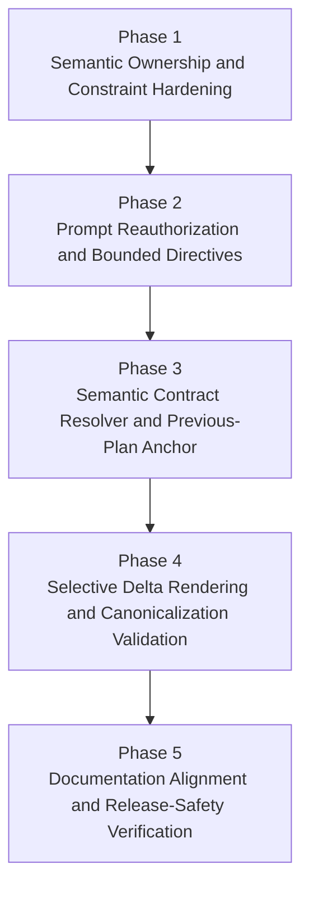
```mermaid
flowchart TD
    P1["Phase 1
Semantic Ownership and Constraint Hardening"] --> P2["Phase 2
Prompt Reauthorization and Bounded Directives"]
    P2 --> P3["Phase 3
Semantic Contract Resolver and Previous-Plan Anchor"]
    P3 --> P4["Phase 4
Selective Delta Rendering and Canonicalization Validation"]
    P4 --> P5["Phase 5
Documentation Alignment and Release-Safety Verification"]
```

##### Phase 1: Semantic Ownership and Constraint Hardening

Scope:

* expand Python-side matrix canonicalization
* add explicit constraint export in the ranking layer
* stop relying on penalty language where constraints are intended to be hard

Acceptance checkpoint:

* Python owns all matrix-derived metadata once `intent_id` is resolved
* ranking hints and hard constraints are clearly separated in code and tests

Rollback checkpoint:

* revert to ranking-only interpretation while keeping new tests as documentation of expected future behavior

##### Phase 2: Prompt Reauthorization and Bounded Directives

Scope:

* implement E-style regenerate-time prompt reauthorization
* add bounded F-style directive extraction for high-confidence type/scope phrases
* preserve fallback to residual free-text guidance when the directive parser is not confident

Acceptance checkpoint:

* regenerate no longer presents the user correction as subordinate to the deterministic shortlist
* explicit type/scope corrections are handled deterministically when confidence is high

Rollback checkpoint:

* disable directive extraction and keep only prompt reauthorization

##### Phase 3: Semantic Contract Resolver and Previous-Plan Anchor

Scope:

* introduce `GenerationContext`, `RegenerationState`, and `ResolvedCommitContract`
* preserve previous-plan state across regenerate cycles
* resolve what is locked vs mutable before the render call

Acceptance checkpoint:

* regenerate has a stable previous-plan anchor
* semantic changes and style-only changes no longer force the same full rewrite behavior

Rollback checkpoint:

* fall back to E-style prompt reauthorization with previous-plan anchoring disabled

##### Phase 4: Selective Delta Rendering and Canonicalization Validation

Scope:

* implement the render-focused LLM call under the locked semantic contract
* validate that mutable fields can change while locked fields remain invariant
* validate canonicalized release metadata after render

Acceptance checkpoint:

* repeated regenerate cycles show materially reduced jitter
* release-critical metadata cannot drift once contract resolution completes

Rollback checkpoint:

* preserve contract resolution but route regenerate back to broader full-plan generation until delta rendering is stable

##### Phase 5: Documentation Alignment and Release-Safety Verification

Scope:

* align README, docs index, and CLI/help surfaces
* add release-parser and trailer invariance tests
* verify the selected architecture against the scenarios identified in the ADR reviews

Acceptance checkpoint:

* docs match behavior
* release safety is demonstrated by explicit tests
* TUI behavior is explainable to users and maintainers

#### 5.5 Verification Plan for the Selected Solution

The selected implementation must verify at least the following scenario families.

##### Semantic correction scenarios

* `this is a feature, not a test`
* `make this a fix`
* `use scope tui`
* docs-only/tests-only/dependency-only diffs under explicit override attempts

##### Stylistic correction scenarios

* `keep the subject shorter`
* `focus on user-facing behavior`
* `do not overemphasize internals`

##### Stability scenarios

* repeated regenerate cycles with no semantic change request
* repeated regenerate cycles with evolving style requests
* repeated regenerate cycles after a semantic correction has already been accepted

##### Release-safety scenarios

* canonicalized `semver_impact` and `changelog_group` do not drift once the contract is resolved
* malformed or missing trailers do not erase semantically distinct release behavior

##### Documentation and UX scenarios

* README and docs remain aligned with the actual TUI
* guidance, issue references, and active directives coexist intelligibly in review state

#### 5.6 Rollback Strategy for the Selected Solution

If the Solution H rollout proves unstable, rollback should occur by phase boundary rather than as one all-or-nothing event.

| Rollback Level | Action |
| :--- | :--- |
| Level 1 | Disable selective delta rendering and keep contract resolution only |
| Level 2 | Disable contract resolution and preserve only E-style prompt reauthorization |
| Level 3 | Disable bounded directive extraction and fall back to raw guidance text only |
| Level 4 | Revert regenerate to the current broad full-generation path while keeping canonicalization fixes |

This phased rollback design is important because the selected architecture has a larger blast radius than prompt-only changes.

### 6. Governance Follow-up from the Selection

The following governance actions now follow from the selection of Solution H.

* ADR-0009 should now be treated as the governing architecture record for regenerate-time intent reconciliation and semantic ownership.
* ADR-0007 should remain the governing record for gum review mechanics and review-state UX, but it should later receive a cross-reference note acknowledging that regenerate semantics are now governed primarily by ADR-0009.
* Solution D should no longer be described in future project discussions as the likely best long-term direction; that role now belongs to H.
* Solution E should be explicitly documented as a prerequisite layer inside H, not as the final target architecture.
* Future enhancements such as richer steering controls should be evaluated as optional augmentations to H rather than as replacements for it.

### 7. Final Refinement 4 Decision Statement

The decision is no longer merely that guided regeneration needs better prompt authority or better candidate presentation.

The selected decision is:

> `git-cg` will adopt **Solution H: Locked Semantic Contract with Selective Delta Regeneration** as the final preferred regenerate architecture. The implementation will preserve deterministic diff ranking as the baseline analytical layer, use prompt reauthorization during regenerate, apply bounded deterministic semantic directives when confidence is high, anchor regenerate against the previous accepted `CommitPlan`, and move semantic ownership of SOP-derived metadata decisively into Python before the LLM is asked to produce textual deltas.

That is the correct architecture to adopt for a core operating function of the application.


## VI. Refinement 5: Document Normalization, Delivery Topology, Milestone Definition, and Direct Execution Plan (v1.5.0)

This refinement performs three categories of work:

1. normalizes the ADR stylistically so that solution headings and appended refinement headings are consistent across the full preserved history
2. records the delivery topology needed to implement the selected architecture safely
3. translates the selected Solution H appendix into a direct execution plan for repository work, issue topology, milestone management, and release completion

### 1. Document-wide Stylistic Normalization

This refinement intentionally exercises the granted permission to alter prior document wording where the change is purely stylistic and improves internal consistency without changing architectural meaning.

#### 1.1 Normalization Actions Applied

| Area | Prior State | Normalized State |
| :--- | :--- | :--- |
| Appended section naming | Mixed use of `Refinement` and `Update` | All append-only layers now use `Refinement` consistently |
| Solution headings in later refinements | Mixed use of `Proposed Solution X` and `Solution X` | All solution headings now use the normalized `Solution A-H` form |
| Selected-solution phrasing | Mixed references to proposed and selected states | Solution H is now consistently readable as the selected architecture while prior analytical intent is preserved |
| Changelog wording | Reflected prior mixed heading names | Updated to reflect the normalized heading set |

#### 1.2 Normalization Conclusion

The ADR now reads more consistently from beginning to end while still preserving the chronological evolution of the solution space. The content history remains intact; only stylistic inconsistencies in solution naming and refinement heading labels were normalized.

### 2. Additional Work Items That Must Be Included

The following work items were not fully captured in the earlier implementation appendix and should be treated as required delivery items before the selected architecture can be considered complete.

#### 2.1 Missing Delivery Items

* explicit disposition of the current Issue #83 branch and prototype code path
* creation of a new implementation umbrella issue and child issues for the selected architecture
* branch and worktree strategy for a multi-PR rollout
* explicit docs-synchronization work across:
    * `README.md`
    * `docs/index.md`
    * `usage.kdl`
* explicit release-parser and trailer-invariance test work for the selected semantic-ownership model
* explicit cross-reference follow-up for ADR-0007 once Solution H implementation lands
* explicit milestone definition covering issue closure, PR merge state, tag creation, and first release completion
* explicit cleanup decision for unrelated working-tree items before implementation begins, including:
    * `TODO.md`
    * `test.txt`
    * `vizvibe.mmd`

#### 2.2 Why These Items Matter

These are not peripheral housekeeping items. They materially affect delivery safety, issue traceability, milestone closure, and release readiness. Because the selected architecture is now a core operating function, the delivery envelope must be governed as tightly as the runtime behavior itself.

### 3. Issue, Branch, and Worktree Strategy

#### 3.1 Recommendation

The Solution H implementation **should not continue as code work on the existing branch** `✨feat(tui)-add-guided-regeneration-feedback-to-gum-interactive-review-flow` and **should not remain scoped only to Issue #83**.

That branch and issue were appropriate for the earlier guided-regeneration feature and exploratory review-loop work. They are no longer the right scope boundary for the selected architecture because Solution H now includes:

* prompt authority correction
* deterministic semantic directive handling
* semantic contract resolution
* previous-plan anchoring
* selective delta rendering
* matrix canonicalization
* release-safety validation
* documentation synchronization
* milestone and release closure work

That is materially larger than the original Issue #83 scope.

#### 3.2 Delivery Topology Decision

The recommended delivery topology is:

* keep Issue #83 as the originating guided-regeneration issue and include it in the milestone
* create a **new umbrella implementation issue** for Solution H
* create **child issues** or explicitly linked follow-up issues for each major implementation workstream
* create a **new dedicated worktree** for the Solution H implementation program
* create **one branch per workstream / PR** inside that worktree strategy

This is the safest and cleanest operating model.

#### 3.3 Delivery Topology Visual Aid

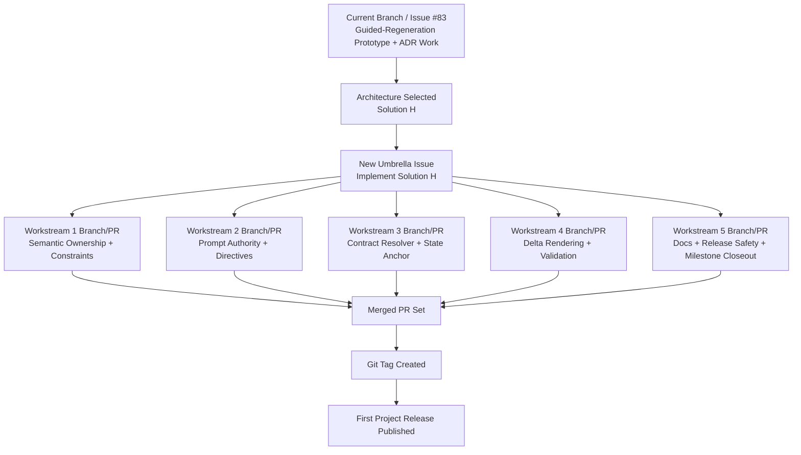
```mermaid
flowchart TD
    Current["Current Branch / Issue #83
Guided-Regeneration Prototype + ADR Work"] --> Decision["Architecture Selected
Solution H"]
    Decision --> Umbrella["New Umbrella Issue
Implement Solution H"]
    Umbrella --> W1["Workstream 1 Branch/PR
Semantic Ownership + Constraints"]
    Umbrella --> W2["Workstream 2 Branch/PR
Prompt Authority + Directives"]
    Umbrella --> W3["Workstream 3 Branch/PR
Contract Resolver + State Anchor"]
    Umbrella --> W4["Workstream 4 Branch/PR
Delta Rendering + Validation"]
    Umbrella --> W5["Workstream 5 Branch/PR
Docs + Release Safety + Milestone Closeout"]
    W1 --> Merge["Merged PR Set"]
    W2 --> Merge
    W3 --> Merge
    W4 --> Merge
    W5 --> Merge
    Merge --> Tag["Git Tag Created"]
    Tag --> Release["First Project Release Published"]
```

#### 3.4 Practical Branch / Worktree Guidance

Recommended path:

1. preserve or finish the ADR/documentation work on the current branch
2. create a new worktree for Solution H implementation
3. open a new umbrella issue and child issues
4. create one focused implementation branch per workstream
5. merge in dependency order

This avoids mixing prototype guided-regeneration work with the final selected architecture rollout.

### 4. Refined Implementation Plan by File

This section tightens the earlier file-by-file appendix by converting it into explicit repository work packages.

#### 4.1 Work Package A: Semantic Ownership Foundation

Files:

* `src/git_cg/models.py`
* `src/git_cg/intent.py`
* `tests/test_intent.py`
* `tests/test_ranker.py`
* new constraint-focused tests as needed

Objectives:

* canonicalize all matrix-owned fields once `intent_id` is resolved
* expose explicit allowed/disallowed constraint sets rather than relying only on score penalties
* preserve current ranker behavior as baseline while separating hints from constraints

#### 4.2 Work Package B: Prompt Authority and Bounded Directives

Files:

* `src/git_cg/main.py`
* `src/git_cg/interaction.py`
* `tests/test_main.py`
* `tests/test_regeneration_guidance.py`

Objectives:

* implement E-style regenerate prompt reauthorization
* implement bounded F-style directive extraction for high-confidence type/scope steering
* preserve residual free-text guidance when deterministic extraction is not confident

#### 4.3 Work Package C: Semantic Contract Resolver and Previous-Plan Anchor

Files:

* new `src/git_cg/regeneration.py`
* `src/git_cg/main.py`
* new `tests/test_regeneration_contract.py`
* new state-anchoring tests

Objectives:

* introduce `GenerationContext`, `RegenerationState`, and `ResolvedCommitContract`
* preserve previous accepted `CommitPlan` as the regenerate-time anchor
* define locked vs mutable fields prior to render-time prompting

#### 4.4 Work Package D: Selective Delta Rendering and Invariant Validation

Files:

* new `src/git_cg/regeneration.py`
* `src/git_cg/main.py`
* `src/git_cg/models.py`
* new `tests/test_regeneration_delta_render.py`

Objectives:

* replace broad full regenerate rewrites with selective delta rendering
* enforce invariants after render
* ensure locked semantic fields cannot drift during style-only rewrites

#### 4.5 Work Package E: Release Safety, Documentation, and Delivery Closure

Files:

* `src/git_cg/release.py`
* `README.md`
* `docs/index.md`
* `usage.kdl`
* `docs/ADRs/0007-Integrate-gum-for-terminalnative-git-hook-tui.md`
* release-path tests such as `tests/test_release.py` or equivalent

Objectives:

* validate downstream release behavior under canonicalized metadata
* align all user-facing documentation surfaces with the selected architecture
* add ADR cross-reference follow-up
* prepare milestone and release closure artifacts

### 5. Execution Checklist with Per-file Acceptance Criteria and Rollback Checkpoints

#### 5.1 Checklist Table

| Work Package | File / Surface | Planned Work | Acceptance Criteria | Rollback Checkpoint |
| :--- | :--- | :--- | :--- | :--- |
| A | `src/git_cg/models.py` | Canonicalize all matrix-owned fields from `intent_id` | `gitmoji`, `cc_type`, `semver_impact`, and `changelog_group` cannot drift after resolution | Revert to prior canonicalization while retaining tests documenting target behavior |
| A | `src/git_cg/intent.py` | Export explicit constraints in addition to ranked scores | docs-only/tests-only/dependency-only invariants are available as real constraint outputs | Disable constraint export and preserve score-only ranking |
| A | tests | Add canonicalization and constraint tests | failing cases are caught before regenerate integration | Remove only new tests if package must be partially rolled back |
| B | `src/git_cg/main.py` | Add regenerate prompt reauthorization | regenerate prompt clearly elevates user correction above baseline shortlist where permitted | Disable reauthorized template and fall back to current regenerate path |
| B | `src/git_cg/interaction.py` | Surface directive-aware guidance state if needed | UI remains understandable and does not become chat-like | Remove directive display and preserve raw guidance only |
| B | tests | Add prompt-branching and directive tests | deterministic prompt branching is golden-testable | Revert prompt tests if reauthorization is disabled |
| C | new `src/git_cg/regeneration.py` | Introduce resolver and state-anchor logic | resolver deterministically produces a `ResolvedCommitContract` and preserves previous-plan anchor | Remove module and fall back to `main.py` orchestration |
| C | `src/git_cg/main.py` | Integrate previous-plan anchoring | repeated regenerate cycles preserve stable semantic anchors | Disable anchor path and revert to stateless regenerate |
| D | regeneration render path | Implement selective delta rendering | style-only corrections do not rewrite locked semantic fields | Disable delta rendering and use full regenerate while keeping contract logic |
| D | validation layer | Enforce post-render invariants | rendered output respects locked/mutable split | Drop delta validation and revert to full-plan validation only |
| E | `src/git_cg/release.py` | Add release-safety regression coverage | canonicalized metadata remains authoritative downstream | Revert parser changes while keeping tests exposing gaps |
| E | docs surfaces | Sync README, docs index, and CLI help | docs match actual runtime behavior | Revert doc surfaces independently if code lands first |
| E | ADR follow-up | Add ADR-0007 cross-reference note | architecture governance remains coherent across ADRs | Remove note without affecting runtime code |

#### 5.2 Execution Rule

A work package is not complete until:

* acceptance criteria are met
* rollback checkpoint is documented and still viable
* tests for that package pass

### 6. Direct Translation of the ADR Appendix into the Code Execution Plan

This section converts the selected architecture into the exact recommended implementation program.

#### 6.1 Recommended PR Sequence

| PR Sequence | Scope | Expected Outcome | Issue Mapping |
| :--- | :--- | :--- | :--- |
| PR-1 | Semantic ownership foundation | Python owns matrix-derived semantics and explicit constraint export exists | New child issue 1 |
| PR-2 | Prompt reauthorization and bounded directives | Regenerate authority is corrected; explicit semantic directives handled deterministically when safe | New child issue 2 |
| PR-3 | Contract resolver and previous-plan anchor | Regenerate gains stable semantic anchoring and contract resolution | New child issue 3 |
| PR-4 | Selective delta rendering and invariant enforcement | Regenerate becomes delta-oriented rather than full-rewrite oriented | New child issue 4 |
| PR-5 | Release safety, docs sync, ADR cross-reference, milestone closeout | Release parser is validated, docs match behavior, milestone can close cleanly | New child issue 5 |

#### 6.2 Dependency Order

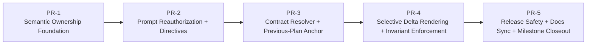
```mermaid
flowchart LR
    PR1["PR-1
Semantic Ownership Foundation"] --> PR2["PR-2
Prompt Reauthorization + Directives"]
    PR2 --> PR3["PR-3
Contract Resolver + Previous-Plan Anchor"]
    PR3 --> PR4["PR-4
Selective Delta Rendering + Invariant Enforcement"]
    PR4 --> PR5["PR-5
Release Safety + Docs Sync + Milestone Closeout"]
```

#### 6.3 Why This Sequence Is Correct

* PR-1 creates the semantic ownership foundation that every later regenerate path depends on
* PR-2 fixes authority inversion and introduces bounded deterministic steering
* PR-3 creates the new architectural state layer that makes regenerate stable
* PR-4 turns the architecture into the selected delta-based runtime model
* PR-5 closes the downstream release and documentation obligations required for milestone completion

### 7. Milestone Definition and Creation Guidance

#### 7.1 Recommendation

Define a new GitHub milestone for this architecture program rather than relying on Issue #83 alone.

Recommended milestone title:

* **First Release - Solution H Integration**

Recommended milestone description:

* Implements the selected Solution H regenerate architecture, closes the original guided-regeneration issue chain including Issue #83, merges all required PRs, validates release safety, creates the first project tag, and publishes the first release.

#### 7.2 Milestone Issue Topology

The milestone should contain:

* Issue #83
* one new umbrella issue for Solution H implementation
* child issues for each PR/work package
* any follow-up doc or release-safety issues if split out separately

#### 7.3 Milestone Creation Guidance

Recommended steps:

1. create the milestone in GitHub with the title above
2. add Issue #83 to the milestone
3. create a new umbrella issue titled along the lines of:
    * Implement Solution H regenerate architecture
4. create child issues mapped to PR-1 through PR-5
5. attach all related PRs to the milestone
6. close the milestone only after all completion criteria are met

#### 7.4 Milestone Completion Criteria

The milestone should only be marked complete when all of the following are true:

* all relevant PRs have been merged
* all associated issues are resolved or explicitly closed
* a Git tag has been created
* the first project release has been published
* Issue #83 is closed as part of the completed delivery chain

### 8. Final Refinement 5 Delivery Decision Statement

The delivery decision is now:

> The selected Solution H architecture will be delivered as a new umbrella implementation program rather than as a continuation of the current Issue #83 branch alone. ADR-0009 is now stylistically normalized across the full preserved history, Solution H remains the final selected architecture, no new Solution I is required, and repository execution should proceed through a milestone-governed multi-issue, multi-branch, worktree-friendly rollout that ends only when all related PRs are merged, Issue #83 is resolved through the milestone, a Git tag exists, and the first project release has been published.

That is the correct delivery topology for the selected architecture.

## CHANGELOG

- v1.0.0 (2026-06-11 16:10:00): Created ADR-0009 as a solution-analysis ADR for deterministic intent ranking, prompt framing, and guided-regeneration reconciliation, with no final solution selected yet and with detailed current-state analysis, multi-option diagrams, and a comparative decision matrix.
- v1.1.0 (2026-06-11 22:30:00): Appended Refinement 1 containing a full architectural review identifying two critical codebase findings (dead `regeneration_guidance` parameter in `build_system_prompt`, redundant system prompt reconstruction), structural problem analysis of all four proposed solutions, identification of the prompt authority hierarchy inversion as the root cause, Solution E (Prompt Geometry Reauthorization with Guidance-Conditioned System Prompt), revised Section 14 comparative evaluation matrices including Solution E, composability analysis, and recommended next steps.
- v1.2.0 (2026-06-11 22:45:00): Appended Refinement 2 proposing Solution F (Deterministic Regex-Directives with Menu Masking) and Solution G (Cumulative Steering Stack & Multi-turn Context Preservation), with revised comparison matrices, composability flow, and structured recommendations.
- v1.3.0 (2026-06-12 08:14:55): Appended Refinement 3 containing a deeper live-codebase architectural review, additional validated findings on incomplete SOP canonicalization, pseudo-veto constraints, regenerate instability, and release-safety implications, plus Solution H (Locked Semantic Contract with Selective Delta Regeneration), new supporting diagrams, and an expanded comparative evaluation across Solutions A-H.
- v1.4.0 (2026-06-12 09:35:00): Appended Refinement 4 recording a structural pass of ADR-0009, ingesting the cumulative review corpus from Sections II-IV, selecting Solution H as the final preferred architecture, and adding a concrete append-only implementation-plan appendix that turns Solution H into a phased, file-by-file execution roadmap without rewriting prior history.
- v1.5.0 (2026-06-12 10:20:00): Performed a document-wide stylistic normalization of append-only refinement headings and all Solution A-H references, preserved full prior history while aligning heading consistency, expanded the selected Solution H delivery topology to include branch/worktree guidance, added missing delivery work items, added a direct repository execution plan and per-file execution checklist, and defined the milestone model required to close the implementation program, Issue #83, the tag, and the first release.
