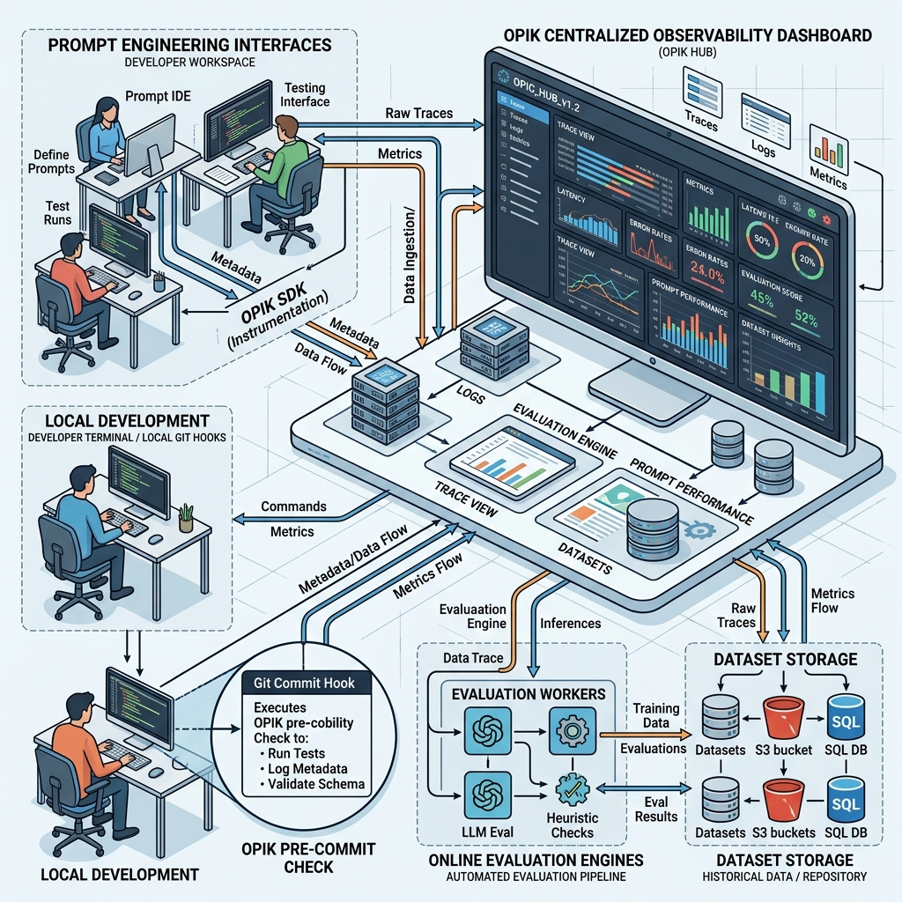

# ADR-0010: Integrate Opik Ecosystem & Telemetry Pipeline

<!-- 🎨 HEADER IMAGE PROMPT & FILENAME
[Prompt Text: A sprawling technical diagram showing a centralized Opik observability dashboard connected to various nodes including prompt engineering interfaces, online evaluation engines, dataset storage, and local terminal git hooks.]

📋 Target Filename: adr-0010-opik-ecosystem.png
-->


```yaml
adr_number: "0010"
title: "Integrate Opik Ecosystem & Telemetry Pipeline"
status: "Implemented"
version: "v1.3.0"
date: "2026-06-14"
created: "2026-06-14 00:00:00"
modified: "2026-08-01 15:30:00"
risk_level: "Medium"
reversibility: "High"
security_scope: "Low (Data sanitization required for secret leaking)"
tags:
  [
    "telemetry",
    "opik",
    "dataset",
    "llm",
    "evaluation",
    "prompt-management"
  ]
supersedes: []
superseded_by: []
```

## Related Plans

- **Opik evaluation harness (living SSOT):** [`docs/plans/opik-evaluation-harness.md`](../plans/opik-evaluation-harness.md) — design + implementation plan for #217 (S0–S7). This ADR remains the telemetry/ecosystem decision record; the plan is the executable harness SSOT.

## Catalyst

As our reliance on LLMs for git commit generation grows, we are shifting from a static execution model to a continuous improvement lifecycle. Currently, our AI integration is a "fire-and-forget" mechanism: we generate a message and lose all visibility into its performance, user adjustments, and long-term efficacy. 

We need an "umbrella" strategy to fully adopt the Opik Ecosystem. This is not just about capturing data for fine-tuning our agent; it is about establishing a robust framework for Prompt Management, Automated Online Evaluations, Experiment Benchmarking, and sophisticated Data Storage. 

## 1. Improvements to Existing Code (Telemetry Capture)

Our current Opik integration blindly logs the initial AI generation and stops. It misses interactive user edits (`git-cg -i`), standard terminal editor modifications (VIM/Nano), and explicit commit cancellations.

### The Solution: Multi-Stage Telemetry
We will use Git's native hooks combined with Python's `difflib` to track the entire commit lifecycle.
- **`prepare-commit-msg` Hook (Generation):** `git-cg` executes, triggering the existing `@opik.track` decorators. **We will not move this start-logging point**; it initiates immediately upon execution. We simply extract the active `trace_id` and write it alongside the `raw_diff` to an ephemeral state file.
- **`commit-msg` Hook (Finalization & Editor Agnosticism):** A new `telemetry.py` script intercepts the final text as the user exits their editor. Because Git handles pausing for the editor (whether `micro`, `vim`, or a GUI), our script natively supports any configured `$EDITOR`. It simply reads the finalised `COMMIT_EDITMSG`.
  - If the commit is aborted, it logs a `cancelled` feedback score.
  - If accepted, it calculates a similarity ratio to categorise the edit (`ai_accepted`, `ai_edited_minor`, `ai_edited_major`) and inserts the pair into the `git-cg-corpus` dataset.
  - If the commit bypassed AI entirely (no state file), it tracks it as a `manual_commit`.

### The Git Worktree Safety Mechanism
When operating in a `git worktree`, the `.git` path at the root of the project is a text file, not a directory. **We strictly advise against copying the main `.git` directory contents to the worktree.** Copying `.git` breaks the shared object database architecture that makes worktrees function.
**Solution:** All file writing (like `.git/GIT_CG_OPIK_STATE.json` and `.git/COMMIT_EDITMSG`) will utilize the standard output of `git rev-parse --git-dir`. In a worktree, this command natively routes to `/path/to/main/repo/.git/worktrees/<branch>/`, safely encapsulating our telemetry state without interfering with standard git mechanics.

## 2. Comprehensive Opik Platform Utilization

Beyond basic data capture, we will systematically configure and integrate Opik's advanced platform features, building upon the existing workspace configuration:

### Existing Configurations to Leverage
- **Environments:** `production`, `staging`, and `development`.
- **AI Providers:** Explore configuring the `Ollama` provider to run automated evaluations locally, preserving privacy and reducing costs.
- **Feedback Definitions:** Utilize and expand upon the 5 existing definitions (`Overall quality`, `Type correctness`, `Scope correctness`, `Accuracy`, `User feedback`).
- **Annotation Queues:** Utilize the existing "Human Commit Message Review" queue, which evaluates traces against the diff for Accuracy, Scope, Type, and Overall Quality.

### Development Phase
- **Prompt Library:** Migrate our static system prompts and templates into Opik's Prompt Management Dashboard. `git-cg` will fetch the active prompt version via the Opik SDK at runtime, enabling seamless A/B testing.
- **Agent Playground & Prompt Playground:** Test alternate models and prompt iterations natively within the Opik UI before deploying to `git-cg`.
- **Optimisation Runs:** Automatically iterate and refine our system prompts based on collected dataset metrics.

### Evaluation Phase
- **Test Suites & Experiments:** Integrate Opik's Pytest evaluation framework into GitHub Actions. When generation logic changes, CI will run an Opik Experiment against our existing golden datasets to prevent regressions.
- **Datasets & Annotation Queues:** Build upon the existing dataset framework by routing poorly performing traces (e.g., heavily edited commits) to human Annotation Queues for manual review and dataset correction.

### Production Phase
- **Online Evaluation:** Setup automated, asynchronous LLM-as-a-judge scoring on live traffic to constantly monitor hallucination rates, conciseness, and conventional commit adherence.
- **Custom Dashboards & Latency Analysis:** Build dashboards tracking p50/p99 latency, trace counts, and error rates. 
  *Note: Recent 60-day metrics show a p99 latency of 2094.8s. We must use these metrics to differentiate between interactive GUI/TUI hangs (where the user leaves the terminal open) versus legitimate LLM API request timeouts.*
- **Thread Feedback Scores:** Tag individual spans with granular user-acceptance feedback (`ai_edited_major`, `ai_accepted`).

## 3. Potential Uses for Collected Data

The data we harvest natively across all user interactions serves multiple vital functions:
- **Agent Self-Improvement:** Providing the agent with historical context on *what the user usually edits*. 
- **Model Benchmarking:** Comparing the success rate (`ratio == 1.0`) of `OMLX` vs `MTPLX` vs `GPT-4o` on our specific codebase.
- **Framework Benchmarking:** Testing different chunking/diff-compression strategies (e.g., `rtk` vs standard diff) and observing which yields higher human acceptance.
- **Prompt Optimisation:** Using Opik's prompt optimizer to automatically refine our generation instructions based on the delta between `generated_commit` and `final_commit`.

## 4. External Tool Utilization

The datasets hosted in Opik can be exported and consumed by external toolchains:
- **Model Fine-Tuning:** Exporting the `git-cg-corpus` as JSONL to fine-tune an open-weight model (like LLaMA-3 or Mistral) specifically for our project's conventional commit standards.
- **Analytics Dashboards:** Exporting telemetry metrics to Grafana or Datadog for team-wide visibility on AI adoption and time-saved metrics.

## 5. Best Solutions for Storing the Collected Data

- **Remote Storage (Primary):** The Opik Cloud Platform serves as our primary remote data warehouse. It natively supports the relational requirements of Traces, Spans, Feedback Scores, and Datasets.
- **Local Storage (Ephemeral State):** The file `GIT_CG_OPIK_STATE.json` residing dynamically in `$(git rev-parse --git-dir)` serves as our local, ephemeral glue between disconnected Git hooks. It is strictly temporary and cleaned up on commit completion.
- **Local Fallback (Optional):** If Opik Cloud is unreachable or offline mode is requested, `telemetry.py` can append dataset entries to a local `.git_cg_archive.jsonl` file for deferred syncing.

## 6. How the Data Can Be Used by the Agent While Working

The telemetry dataset isn't just for offline training; it can inform live inference:
- **Dynamic Few-Shot Prompting:** Before `git-cg` queries the LLM, it can hit the Opik API (or a local cache) to fetch 3 recent commits the user manually authored (`manual_commit`) or heavily edited (`ai_edited_major`). These are dynamically injected into the system prompt as stylistic few-shot examples, allowing the agent to continuously adapt to the user's evolving tone and preferences.

## 7. Methods for Reviewing Metrics (Online Evaluations)

Currently, our metrics review is manual. We will deploy **Automated Online Evaluations**:
- **LLM-as-a-Judge:** We will configure Opik asynchronous evaluators. Every time a trace is logged, an Opik-hosted LLM judge will score the `generated_commit` on:
  - **Adherence to Conventional Commits:** (1 to 5 scale)
  - **Hallucination Detection:** (Did it mention files not in the diff?)
  - **Conciseness Score:** (Is the message overly verbose?)
- **Heuristic Evaluators:** Simple Python regex evaluators running asynchronously to ensure the message title is `< 72 chars`.
- **Review Workflow:** The team lead can review the Opik Dashboard weekly, filtering for Traces where the LLM Judge scored `Conciseness < 3` and the User Feedback was `ai_edited_major`, instantly identifying the worst-performing edge cases.

## 8. Rejected Alternatives & Design Decisions

During the architectural design phase, several alternatives were proposed and explicitly rejected to ensure robustness and native Git compatibility:

1. **Copying `.git` Directory Contents for Worktree Compatibility:**
   - *Proposal:* To handle telemetry state files inside git worktrees (where `.git` is a file pointer, not a directory), it was proposed to copy the main `.git` directory contents into the worktree.
   - *Decision:* **REJECTED.** Copying `.git` contents breaks the fundamental shared object database architecture of worktrees, leading to corruption and synchronization failures. 
   - *Chosen Solution:* We use `git rev-parse --git-dir`, which natively resolves the pointer and safely returns `/path/to/main/repo/.git/worktrees/<branch>/` without any file duplication.

2. **Parsing `$EDITOR` or Writing Custom Editor-Detection Logic:**
   - *Proposal:* Because users edit commit messages in various editors (`micro`, `vim`, `nano`, VS Code), it was proposed to check `$EDITOR` to determine how to track final edits and cancellations.
   - *Decision:* **REJECTED.** Wrapping the editor creates brittle code that breaks with GUI editors. 
   - *Chosen Solution:* Git natively handles pausing the terminal and launching whichever editor the user has configured. By hooking into the `commit-msg` git hook (which Git fires *after* the editor completes), our script is perfectly editor-agnostic. We simply read the finalised `.git/COMMIT_EDITMSG` file.

3. **Moving the Opik `start-logging` Point:**
   - *Proposal:* It was suggested that we might need to move the Opik initialization point later in the script to tie it to the telemetry hook.
   - *Decision:* **REJECTED.** The order of initiation matters. `git-cg` must start logging as soon as it is executed to capture all latency and context. 
   - *Chosen Solution:* The existing `@opik.track` decorators remain entirely untouched. To link the early generation phase with the later `commit-msg` phase, we simply extract the active `trace_id` from the context (`opik_context.get_current_trace_data().id`) and persist it.

4. **End-to-End Git Repository Benchmarks:**
   - *Proposal:* Running E2E benchmarks by creating temporary Git repositories, performing file operations, and timing the entire hook execution.
   - *Decision:* **REJECTED.** File system and network latency poison the core inference metrics.
   - *Chosen Solution:* Use Opik Datasets + `scripts/run_model_benchmark.py` to directly evaluate the underlying prompt chain against fixed, curated diffs.

5. **Immediate Agent Optimizer SDK Integration:**
   - *Proposal:* Integrate Opik's Prompt Optimizer SDK immediately to mathematically tune our prompts (DSPy style).
   - *Decision:* **REJECTED.** The optimizer requires a robust, human-verified dataset of inputs and perfect outputs. Implementing it before we have telemetry data is putting the cart before the horse.
   - *Chosen Solution:* Gather telemetry via the Two-Point Trace first, then revisit optimisation in V2.

6. **Purely Probabilistic (LLM-as-a-Judge) Telemetry:**
   - *Proposal:* Use GEval prompts to check if the generated message followed the conventional commits format.
   - *Decision:* **REJECTED.** Evals answer "How good is this?" while Audits answer "Does this provably comply?". Relying on LLMs for deterministic validation is unfit for compliance and computationally wasteful.
   - *Chosen Solution:* Two-layer evaluation. A fast, synchronous `DeterministicScoreCard` runs inside the `commit-msg` hook as a pre-condition for dataset promotion, followed by asynchronous offline GEvals for subjective alignment and conciseness.

7. **Single-Point Edit Capture (The "Edit Window Timing" Flaw):**
   - *Proposal:* Try to capture edits by waiting inside the `prepare-commit-msg` hook or running a blocking loop.
   - *Decision:* **REJECTED.** Git hands off control to the terminal editor. A blocking loop causes TUI lockups, and attempting to read the file immediately misses user edits that happen inside VIM.
   - *Chosen Solution:* The Two-Point Trace architecture. Hook 1 (`prepare-commit-msg`) generates and writes state. Hook 2 (`commit-msg`) runs *after* the editor closes, capturing the final absolute truth.

---

## I. Update 1: Telemetry Pipeline Bug Fixes & Instructor Parsing (v1.1.0)

During the initial deployment of the Two-Point Telemetry Trace, we encountered and resolved the following integration edge cases:

### Python Variable Scoping (`UnboundLocalError`)
Attempting to `import subprocess` deep inside the `_run_commit_generation` function caused Python to hoist the variable and shadow the global `subprocess` module. This triggered an `UnboundLocalError` when `subprocess.check_output` was called earlier in the same function block. This was resolved by removing the localised `import subprocess` in favor of the existing global import.

### Instructor Parsing Fallback on Local Models (Migrating from MD_JSON to JSON)
The local `MTPLX` model successfully generated JSON adhering to the `CommitPlan` schema, but the inference backend initially fell back to emitting raw text due to parsing errors with native tool calls. Instructor, configured in standard `TOOLS` mode, failed to parse this fallback text and incorrectly threw an error indicating multiple tool calls. 

We initially attempted to use `instructor.Mode.MD_JSON` to instruct the model to wrap its JSON in markdown code blocks (` ```json `), allowing Instructor's regex extractor to safely ignore any preceding `<think>` blocks. However, the model explicitly refused to use markdown backticks (fearing they were the cause of previous errors) and instead output raw JSON. This broke `MD_JSON`'s regex parsing, causing it to fall back to the raw string which still began with `<think>`, resulting in a Pydantic `Invalid JSON: key must be a string` error.

**Resolution:** We migrated the `instructor` client from `MD_JSON` back to strict `instructor.Mode.JSON` to force a raw JSON response. To circumvent the Pydantic `<think>` block validation failure, we implemented a monkeypatch on the `openai_client.chat.completions.create` method. This patch intercepts the model's raw string output, automatically splits it at `</think>`, and strips the reasoning block entirely *before* Instructor attempts to parse the payload. This ensures a perfectly compliant JSON structure for local reasoning models like `mtplx` and `omlx`.


## II. Update 2: LLMOps Stack Augmentation (Opik + Promptfoo + OpenLLMetry) (v1.2.0)

After successfully deploying the Two-Point Telemetry Trace to Opik, we conducted a Tier-1 comparative analysis of LLMOps platforms (Opik, Langfuse, Promptfoo, MLflow, Phoenix, etc.) to determine if we should replace Opik or augment it.

### The Decision: Augment Opik
We decided to **keep Opik** as our incumbent unified dashboard. It provides excellent dataset management, trace visualization, and a robust Python SDK. However, we identified two critical gaps in our CI/CD and instrumentation architecture that required complementary tools. We are adopting **Stack A (Opik + Promptfoo + OpenLLMetry)** to close these gaps.

### 1. Vendor-Neutral Instrumentation (OpenLLMetry)
- **The Problem:** We are currently using Opik's proprietary `@opik.track` decorators. This creates vendor lock-in; migrating to another platform would require rewriting all telemetry code.
- **The Solution:** We will migrate our instrumentation to **OpenLLMetry** (`traceloop-sdk`). OpenLLMetry generates standard OpenTelemetry (OTel) traces. Opik natively ingests OTel. This allows us to keep Opik as our dashboard while ensuring our codebase remains 100% vendor-neutral.

### 2. CI/CD Evaluation & Red-Teaming (Promptfoo)
- **The Problem:** Opik excels at runtime observability and dataset management, but we need a robust, automated "gate" in our GitHub Actions Pull Requests to catch regressions, jailbreaks, and PII leaks before code merges.
- **The Solution:** We will integrate **Promptfoo** into our CI pipeline. Promptfoo is a stateless, CLI-first testing engine that excels at automated red-teaming and prompt assertion testing. 
- **Self-Hosting Strategy:** Because we are utilizing a local 35B model (via oMLX/MTPLX), Promptfoo will be executed via a **Self-Hosted GitHub Actions Runner** on the developer's Mac. This allows the CI job to hit `localhost:8080` instantly, securely, and at zero cost.
- **Batch eval sync:** Offline Promptfoo runs are synced to Opik via `scripts/sync_promptfoo_to_opik.py` (trace name `promptfoo_eval`). This is **not** the two-point commit `GenerationTelemetry` path. Boundary and optional enrichments: **ADR-0011 § Phase 8.5 (Promptfoo evaluation & metrics boundary)**.

### 3. Application Crash Reporting (Sentry SDK)
- **The Problem:** Opik and OpenLLMetry are focused on AI/LLM tracing (prompts, tokens, latency, generation quality). However, if the `git-cg` application itself crashes due to a standard Python exception (e.g., `UnboundLocalError`, `FileNotFoundError`), these traces may drop or fail to capture the underlying stack trace properly.
- **The Solution:** We will integrate the **Sentry SDK** specifically for application-level crash reporting and error tracking. Sentry will catch unhandled exceptions in the CLI execution and provide deep stack traces, separating application bugs from LLM inference issues.

## CHANGELOG


- v1.1.0 (2026-06-15): Resolved UnboundLocalError and Instructor parsing fallback issues during initial telemetry pipeline deployment.
- v1.2.0 (2026-06-16): Added LLMOps Stack Augmentation strategy (Opik + Promptfoo + OpenLLMetry).
- v1.2.1 (2026-06-26): Structural formatting, metadata conversion, and heading standardizations.
- v1.3.0 (2026-06-26): Marked status as Implemented following successful E2E Sentry and Opik integration.
- v1.3.1 (2026-07-31): Cross-link Promptfoo→Opik batch sync vs two-point commit telemetry (see ADR-0011 § 8.5).

<!-- ## Supporting Visual Aids -->
