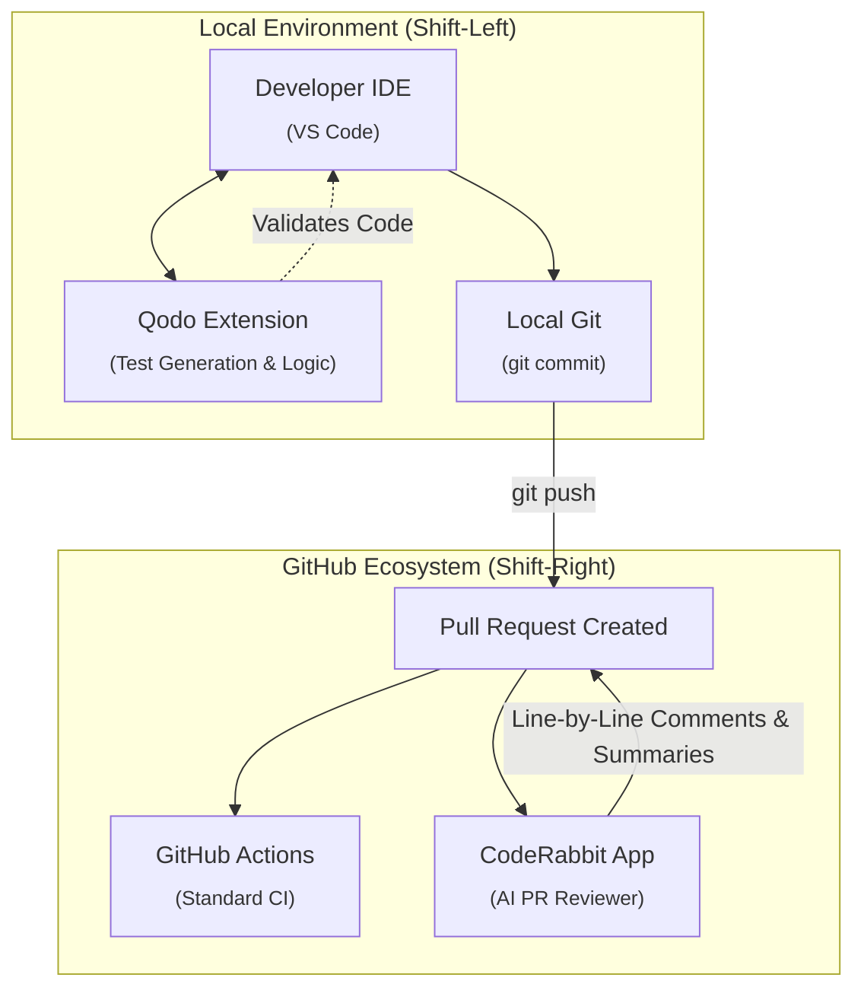
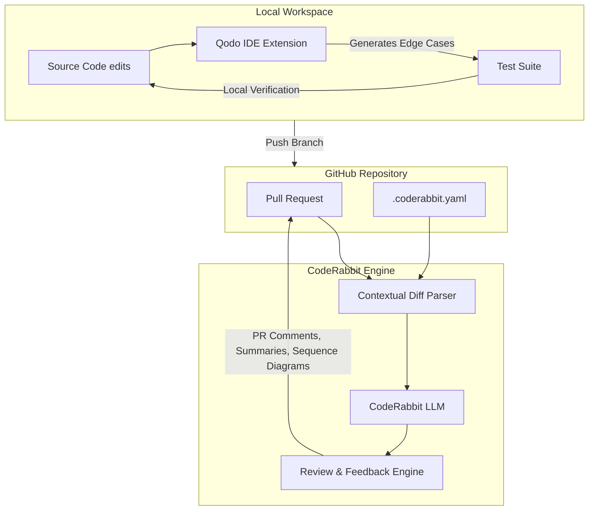
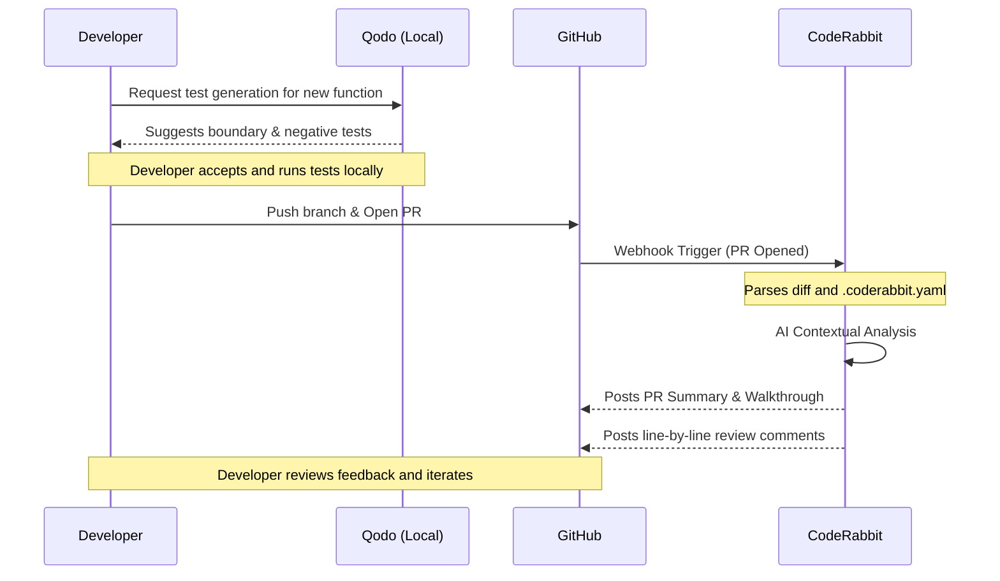

<!-- 🎨 HEADER IMAGE PROMPT & FILENAME
A highly detailed cyberpunk architectural schematic showing a two-tier AI code review system. On the left, a developer's local IDE (represented by glowing neon blue code blocks) integrates with Qodo for real-time test generation. Data flows via a central hub to the right side, representing a GitHub Pull Request environment (neon purple and orange) where the CodeRabbit AI agent is performing deep semantic reviews, analyzing a network of code dependencies. Glowing digital nodes, wireframes, and data packets flowing through separate channels. Dark void background. Pure technical graphic, no UI elements, wide aspect ratio. Designed for high-fidelity technical documentation.

📋 Target Filename: adr-0012-coderabbit-and-qodo.webp
-->


# ADR-0012: Adopt CodeRabbit and Qodo for AI-Augmented Quality Gates

```yaml
adr_number: "0012"
title: "Adopt CodeRabbit and Qodo for AI-Augmented Quality Gates"
status: "Proposed"
version: "v1.0.0"
date: "2026-06-18"
created: "2026-06-18 10:00:00"
modified: "2026-06-18 10:00:00"
risk_level: "Medium"
reversibility: "High"
security_scope: "Local Operations & Source Control"
tags:
  [
    "code-review",
    "ai",
    "coderabbit",
    "qodo",
    "testing",
    "quality-gates",
    "pull-requests",
  ]
supersedes: []
superseded_by: []
```

## 📖 User Guide: AI Quality Gate Operations

> [!IMPORTANT]
> **Two-Tier AI Governance:** This project utilizes an interconnected, two-tier AI quality assurance process.
>
> 1. **Qodo (Local / Shift-Left)**: Used natively within the IDE (VS Code / JetBrains). Focuses on _generative_ assistance—producing exhaustive edge-case tests, refactoring suggestions, and local semantic context _before_ a commit is even created.
> 2. **CodeRabbit (CI/CD / Shift-Right)**: Operates entirely within the GitHub Pull Request lifecycle. Focuses on _evaluative_ assistance—detecting logical bugs, security vulnerabilities, and architectural drift across the full scope of a PR before merge.
>
> **Do NOT rely solely on one tier.** They are complementary. Qodo prevents bugs from leaving your machine; CodeRabbit prevents bugs from entering the main branch.

## 1. Introduction and Goals

This Architectural Decision Record (ADR) documents the integration of two distinct, AI-driven platforms—**CodeRabbit** and **Qodo** (formerly CodiumAI)—into our continuous integration and local development workflows.

The primary catalysts for this change were:

1. **Review Bottlenecks and Fatigue**: Human code reviews are prone to "rubber-stamping" when PRs are large or complex. Subtle logical errors or edge-cases often slip through to the main branch.
2. **Test Coverage Gaps**: Developers consistently lack the time and contextual bandwidth to write exhaustive test suites that cover edge cases, boundary conditions, and negative paths.
3. **Delayed Feedback Loops**: Identifying architectural drift or logic flaws exclusively during CI/CD checks or human review wastes developer time and extends PR cycle times.

The goal is to deeply augment our development lifecycle with specialized AI tooling: Qodo acting as a local, real-time co-pilot for test generation and logic validation, and CodeRabbit acting as an autonomous, asynchronous reviewer on every Pull Request.

## 2. Architecture Constraints

- **Source Code Privacy**: CodeRabbit will only be authorized for specific repositories. We must rely on CodeRabbit's SOC2 compliance and zero-retention policies for parsed code.
- **Local Overhead**: Qodo IDE plugins must not introduce severe latency or memory bloat to the developer's local environment.
- **Non-Blocking CI**: CodeRabbit reviews must execute asynchronously. While CodeRabbit provides actionable feedback, it must _not_ act as a hard CI blocker (i.e., failing the build automatically) unless explicitly configured for severe security vulnerabilities. Human oversight retains final merge authority.

## 3. Context and Scope

Our evaluation of AI-augmented development tools highlighted a clear dichotomy in the market: tools that excel at _generative_ tasks within the IDE (like GitHub Copilot and Qodo) and tools that excel at _evaluative_ and _contextual_ tasks at the repository level (like CodeRabbit and Qodo Merge).

We recognized that relying solely on a generic LLM chat interface requires immense prompting overhead from the developer. We needed purpose-built platforms.

- **Qodo** provides a highly structured approach to test-driven development. It parses local files and intelligently proposes boundary tests and behavioral coverage that developers often miss.
- **CodeRabbit** natively understands the GitHub PR lifecycle. It provides line-by-line comments, generates comprehensive PR summaries (alleviating the burden of writing manual release notes), and traces data flow across multiple files in a diff, identifying issues that static analysis tools miss.

By pairing these tools, we establish a robust "Shift-Left" (Qodo) and "Shift-Right" (CodeRabbit) quality perimeter.

## 4. Solution Strategy

The implementation follows a strategic, two-phase deployment across our development environments:

1. **Phase 1: Qodo IDE Integration (Local)**: Mandate the installation of the Qodo IDE extension for all core contributors. Configure local workspaces to utilize Qodo for test generation before executing local `git commit` commands.
2. **Phase 2: CodeRabbit CI Integration (Repository)**: Install the CodeRabbit GitHub App on the target repositories. Configure `.coderabbit.yaml` to tailor the AI's persona, establish review strictness, and ignore autogenerated files (e.g., package lockfiles or specific binaries).

## 5. Building Block View

### 5.1 Planned End-State Building Block View

The proposed ecosystem utilizes a two-tier approach, separating local generation from remote evaluation:



### 5.2 Deep-Dive Architecture



## 6. Runtime & Deployment View

### 6.1 Planned End-State Runtime Sequence

In this sequence, a developer leverages Qodo locally before pushing, and CodeRabbit reviews the resultant PR.



## 7. Cross-cutting Concepts

### Network & Security

- **CodeRabbit Access**: CodeRabbit requires access to the GitHub repository via an installed GitHub App. It operates strictly on a webhook basis, analyzing diffs and contextual files.
- **Data Retention**: We rely on standard Enterprise terms for zero-day retention of parsed source code by the LLM providers powering CodeRabbit and Qodo.

### Development Workflow

- **Configurability**: CodeRabbit's behavior is dictated by a `.coderabbit.yaml` file in the repository root. This allows us to tune the chattiness, disable certain review categories (like nitpicks), and set custom system instructions.

## 8. Supporting Visual Aids

### Visual Aid Selection Rationale

- **Primary data shape or explanatory need**: Understanding the separation of concerns between local test generation (Qodo) and remote PR review (CodeRabbit).
- **Chosen visual aid**: Mermaid Flowchart and Sequence Diagram.
- **Why this visual aid was chosen**: It explicitly maps out the "Shift-Left" and "Shift-Right" paradigms, proving that the tools do not overlap or conflict.
- **Alternative aids considered**: A bulleted list would fail to show the temporal sequence of the developer journey from local IDE to GitHub PR.

### Supporting Visuals and Generated Artifacts

- **Reference source**: `visualAidQuickReference.md`
- **Chosen method**: Mermaid
- **Generated artifact path(s)**: Embedded above in Sections 5 and 6. Target header image: `../assets/adr-0012-coderabbit-and-qodo.webp`

## 9. Impact Radius (Cause, Change, Effect)

### Phase 1: Local Test Generation (Qodo)

- **Cause**: Developers struggle to manually identify and write exhaustive test cases for complex logic paths.
- **Change**: Integration of Qodo into the local IDE.
- **Effect**: Increased test coverage, fewer unhandled edge cases, and a reduction in the cognitive load required to bootstrap unit tests.

### Phase 2: Autonomous PR Reviews (CodeRabbit)

- **Cause**: Human code reviews are delayed and often miss deep logical flaws across large diffs.
- **Change**: Installation of CodeRabbit GitHub App.
- **Effect**: Every PR receives an instantaneous, comprehensive review, complete with sequence diagrams and architectural summaries, significantly accelerating the merge lifecycle.

## 10. Consequences

- **Pros**:
  - Eliminates "rubber-stamp" code reviews by providing a rigorous first-pass analysis.
  - Automatically generates high-quality PR descriptions and release notes.
  - Accelerates test-driven development through intelligent IDE generation.
- **Cons**:
  - Adds dependency on external AI services for core quality gates.
  - Potential for "AI noise" if CodeRabbit is not properly tuned via `.coderabbit.yaml`, leading to developer fatigue from nitpicky comments.

## 11. Verification Plan

### Automated Verification

- [ ] **Structural Validation**: Execute `python3 config/ADR/src/adr_ecosystem/verify_adr.py docs/ADRs/0012-adopt-coderabbit-and-qodo.md`.

### Manual Verification

- [ ] **Qodo Setup**: Install Qodo in the IDE and generate a test suite for a complex Python function. Verify the tests pass and cover edge cases.
- [ ] **CodeRabbit Integration**: Open a test PR containing intentional logical flaws. Verify that CodeRabbit automatically comments on the PR, identifies the flaws, and generates a cohesive summary.

## 12. Review / Revisit Criteria

- This decision should be revisited in 90 days. We must assess if CodeRabbit's feedback remains actionable or if it is generating too much noise. If noise is high, we will refine `.coderabbit.yaml` to disable non-critical review categories.

## 13. Rollback Strategy

1. **Remove CodeRabbit**: Uninstall the CodeRabbit GitHub App from the organization/repository and delete `.coderabbit.yaml`.
2. **Remove Qodo**: Instruct developers to uninstall the Qodo IDE extension.

## 14. Implementation Findings

_(To be populated as integration is completed)_

## 15. Governance Follow-up

All work within this project must strictly adhere to the following governance and documentation standards for Milestones, Issues, and Pull Requests:

1. **Gitmoji Alignment**: All Issue titles and PR titles must use the appropriate Gitmoji prefix and conventional commit scoping.
2. **Configuration as Code**: CodeRabbit configuration must be checked into version control via `.coderabbit.yaml`.

## 16. Links & References

- [CodeRabbit Documentation](https://coderabbit.ai/docs)
- [Qodo Documentation](https://qodo.ai/docs)

## CHANGELOG

- **v1.0.0 (2026-06-18)**: Initial proposal for CodeRabbit and Qodo integration.
