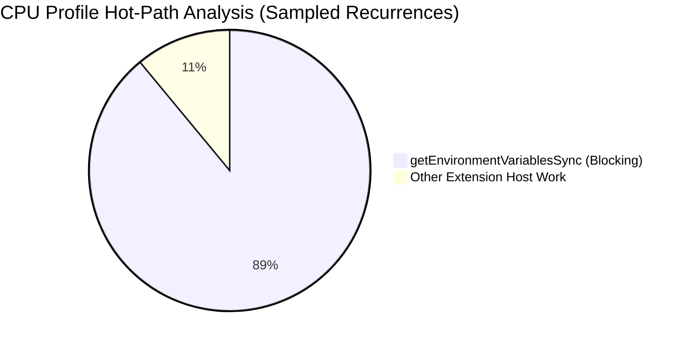
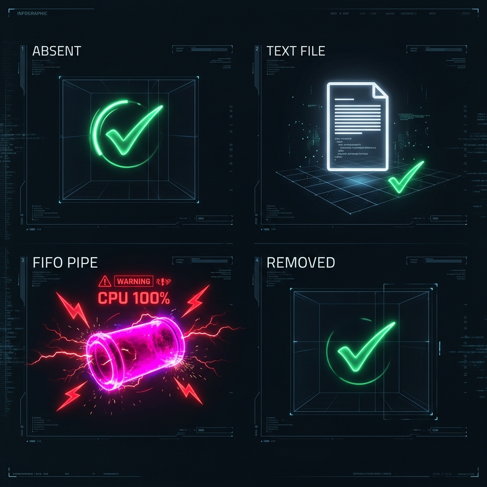
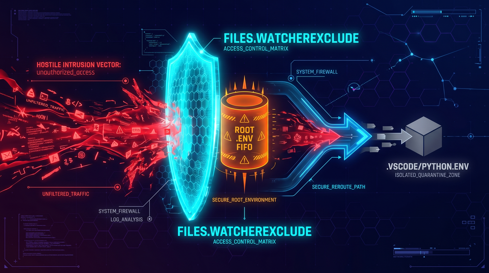
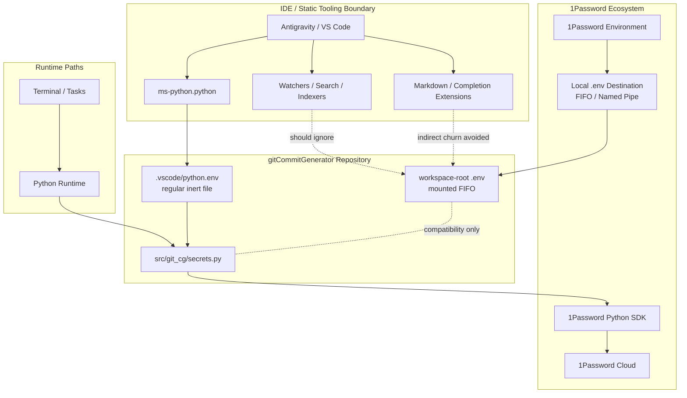
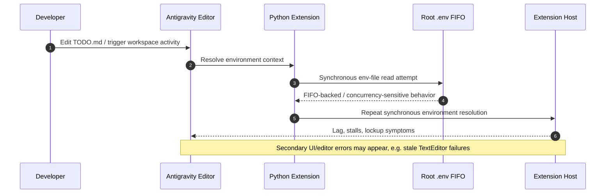
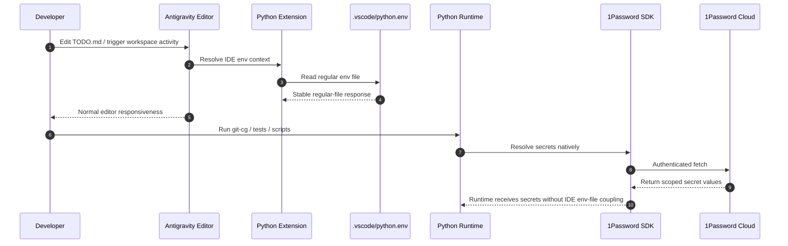
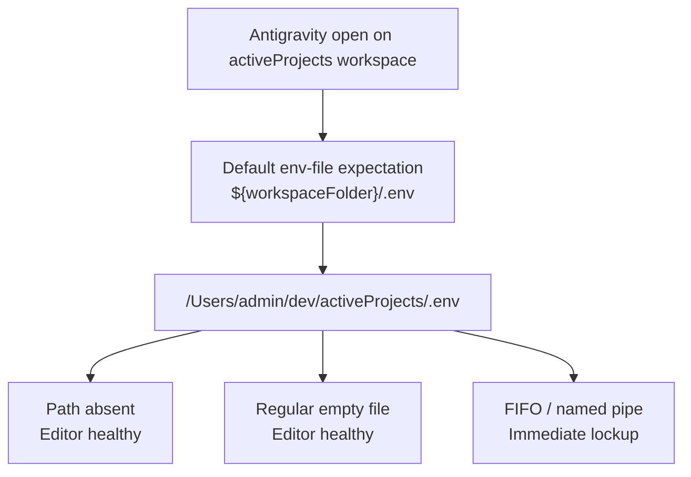

<!-- 🎨 HEADER IMAGE PROMPT & FILENAME
A high-fidelity, highly detailed cyberpunk technical infographic. At the top center, a massive three-tier stylized heading reads 'ADR', 'IDE BOUNDARY', and '1PASSWORD ENV'. Each line uses a retro-tech multilayer neon font with distinct glows: 'ADR' in hot magenta, 'IDE BOUNDARY' in electric yellow, and '1PASSWORD ENV' in electric cyan. Below the heading, the scene is split into two architecture lanes. On the left, a glowing 1Password vault emits a mounted '.env' file represented as a luminous UNIX named pipe / FIFO conduit entering a project workspace root. Around it, file watchers, editor tabs, and extension-host circuitry pulse aggressively in red and orange to represent event-loop contention. On the right, a clean green lane labeled 'Python SDK Runtime' reads secrets directly from a cloud-connected 1Password channel, bypassing the mounted FIFO entirely. Between the lanes, a hard architectural firewall labeled 'STATIC TOOLING BOUNDARY' blocks IDE readers from touching the FIFO and reroutes them into a small inert file labeled '.vscode/python.env'. Include subtle references to Antigravity / VS Code style editor panes, CPU spike gauges, and concurrent-reader warning glyphs, but keep the image purely technical and abstract. PURE TECHNICAL GRAPHIC. NO mobile phone UI, NO status bars, NO battery icons, NO X buttons, NO device frames or bounding boxes. Wide aspect ratio, designed for high-fidelity technical documentation.

📋 Target Filename: adr-0013-ide-boundaries-for-1password-mounted-local-env-files.webp
-->


# ADR-0013: Formalize IDE Boundaries for 1Password-Mounted Local `.env` Files

```yaml
adr_number: "0013"
title: "Formalize IDE Boundaries for 1Password-Mounted Local .env Files"
status: "Proposed"
version: "v1.1.0"
date: "2026-06-23"
created: "2026-06-23 00:00:00"
modified: "2026-06-23 08:35:48"
risk_level: "Medium"
reversibility: "High"
security_scope: "Authentication & Local Development Tooling"
tags:
  [
    "1password",
    "environments",
    "fifo",
    "env-file",
    "antigravity",
    "vscode",
    "python",
    "ide",
    "fnox",
    "age",
    "tooling-boundary",
  ]
supersedes: []
superseded_by: []
```

## 1. Introduction and Goals

This Architectural Decision Record formalizes a boundary that was previously implicit and, as a result, fragile: **a mounted 1Password local `.env` file is a runtime secret-delivery interface, not a generic IDE configuration file**.

The immediate catalyst for this decision was a severe Antigravity / VS Code performance incident in the `gitCommitGenerator` repository. The editor became extremely laggy while editing `TODO.md`, the Extension Host locked up, and profiling showed the Python extension repeatedly invoking synchronous environment-variable resolution until the event loop was effectively starved.

The critical forensic detail was that the workspace-root `.env` file was not a normal dotenv text file. It was a UNIX FIFO / named pipe mounted by the intentionally adopted 1Password Environments local `.env` feature. That detail completely changes how the file must be treated.

This ADR does **not** repudiate the 1Password design already established in the repository. On the contrary, it preserves the existing intent while clarifying consumer boundaries.

The repository already has an architectural lineage for secrets management:

- **ADR-0003** adopted `fnox` for hybrid secrets management so the maintainer could continue using 1Password while contributors retained a free and portable fallback through `age`.
- **ADR-0004** explored service-account driven environment injection using 1Password CLI beta features and shell wrappers.
- **ADR-0006** superseded ADR-0004 and made the **1Password Python SDK** the canonical Python runtime path for secret resolution, specifically to eliminate brittle shell wrappers and global environment mutation.

The new issue is therefore not, "Should we abandon 1Password?" The correct question is:

> How should IDEs and static tooling interact with a deliberately mounted 1Password FIFO `.env` in a repository whose Python runtime secrets are now canonically resolved through the 1Password SDK?

> #### Addendum — Effective Workspace Root Clarification
>
> A later controlled reproduction refined this question further. During the observed failure window, Antigravity was open on the umbrella `activeProjects (Workspace)`, not on the `gitCommitGenerator` folder in isolation. That means the operative default path for IDE env-file resolution was `${workspaceFolder}/.env` at the **workspace root**, i.e. `/Users/admin/dev/activeProjects/.env`.
>
> This materially sharpens the diagnosis: the decisive trigger was not merely "a nested `.env` existed somewhere inside the repo tree". The decisive trigger was that the **open workspace root** exposed a FIFO-backed `.env` at the exact default path the Python extension expects to probe.
>
> _Added: 2026-06-23 08:35:48 AEST_

### Primary goals

1. Preserve the intentional 1Password Environments integration without falsely classifying it as an accident or defect.
2. Preserve ADR-0006 as the canonical runtime secret-resolution path for Python code in `gitCommitGenerator`.
3. Prevent IDEs, language servers, file watchers, and static tooling from treating a mounted FIFO `.env` as a regular text dotenv file.
4. Stop Antigravity / VS Code Extension Host lockups caused by repeated synchronous environment-resolution attempts against the mounted FIFO.
5. Clarify the difference between:
   - runtime secret access,
   - shell / task environment injection,
   - and IDE metadata / static-analysis configuration.
6. Avoid breaking standard terminal and script execution workflows while making the editor safe and predictable again.
7. Preserve the broader contributor story established by ADR-0003, where `fnox` plus `age` remain part of the long-term portability strategy.

### Quality goals

- **Architectural accuracy**: The ADR must acknowledge that the root `.env` mount was intentional and traceable to prior decisions, not a random filesystem anomaly.
- **Operational clarity**: Developers must be able to look at the ADR and understand exactly why the editor broke, why it broke now, and why the remediation is not merely "hiding the problem".
- **Boundary precision**: The ADR must separate runtime consumers from tooling consumers so future debugging does not conflate them.
- **Security preservation**: The remediation must not regress into writing plaintext secrets to disk or undo ADR-0006's runtime isolation benefits.

## 2. Architecture Constraints

The decision space is constrained by both pre-existing ADRs and by the behavior of the tools involved.

### 2.1 Intentional 1Password integration is already part of the architecture

This repository did not stumble into 1Password integration by mistake.

- ADR-0003 explicitly accepted a hybrid model that keeps 1Password as the preferred maintainer workflow while providing non-commercial fallback paths.
- ADR-0004 documented direct environment injection through 1Password service-account flows.
- ADR-0006 superseded that shell-injection approach for Python runtime concerns and made the 1Password Python SDK the primary application-side solution.

Any new decision must therefore complement that chain, not silently contradict it.

### 2.2 No plaintext regression

The remediation cannot solve an IDE compatibility problem by casually falling back to insecure patterns such as copying production secrets into a normal tracked `.env` file or encouraging broad plaintext sprawl in the workspace.

### 2.3 Conventional root `.env` paths are highly auto-discovered

The filename `${workspaceFolder}/.env` is not neutral. Many tools automatically inspect or react to it:

- VS Code / Antigravity Python extension
- dotenv loaders
- test discovery helpers
- dev servers
- search indexers
- secret scanners
- editor watchers
- AI and context extensions
- language servers triggered by Markdown code fences or mixed-language documents

This makes project-root `.env` uniquely sensitive when it is anything other than a small, regular, static text file.

> #### Addendum — Workspace Root Versus Repository Root
>
> The wording above remains directionally correct but is too narrow if Antigravity is opened on an umbrella workspace. In that case, `${workspaceFolder}` resolves to the workspace root rather than the nested repository directory. For this incident, the high-risk path was `/Users/admin/dev/activeProjects/.env`, not only `/Users/admin/dev/activeProjects/gitCommitGenerator/.env`.
>
> _Added: 2026-06-23 08:35:48 AEST_

### 2.4 1Password Environments local `.env` mounts are not ordinary files

The official 1Password Environments documentation describes local `.env` files as mounted resources backed by a UNIX named pipe rather than plaintext being written to disk. It also documents two limitations that are critical here:

- the feature is **not designed for concurrent access**, and
- aggressive file watchers or readers can cause delays, unexpected behavior, or loops.

That means architectural compatibility with generic IDE readers cannot be assumed.

### 2.5 ADR-0006 is now the canonical Python runtime path

The `gitCommitGenerator` Python runtime should not depend on the IDE's default dotenv file behavior to obtain secrets. ADR-0006 made the 1Password Python SDK the primary path for Python runtime resolution and explicitly aimed to eliminate global environment mutation and brittle wrappers.

Therefore, any IDE expectation that `${workspaceFolder}/.env` remains the authoritative Python-secret source is now architecturally stale.

### 2.6 Open-source contributor portability still matters

ADR-0003 did not merely choose a secrets backend; it established a governance principle:

- contributors must not be forced onto a paywalled 1Password-only execution path.

That means any long-term solution must still leave conceptual room for `fnox` orchestration and `age` fallback, even if those tools are not the immediate cause or fix for this IDE failure.

### 2.7 Standard terminal and script execution must keep working

The user explicitly required that any proposed fix must stop the editor lockup **without breaking standard terminal and script execution environments**. This means the decision must distinguish editor behavior from runtime behavior instead of flattening both into a single `.env` story.

## 3. Context and Scope

This section captures the complete technical story as established through the incident investigation, chat-based root-cause analysis, shell inspection, log inspection, and ADR cross-referencing.

### 3.1 Environment context

At the time of the incident, the relevant development context was:

- **Operating System**: macOS (APFS filesystem)
- **Repository**: `/Users/admin/dev/activeProjects/gitCommitGenerator`
- **IDE**: Antigravity (a VS Code fork)
- **Primary language tooling**: Python, with `ms-python.python` (v2026.4.0) active
- **Problem surface**: severe editor lag and Extension Host lockups, especially while editing `TODO.md`, a Markdown file that can still trigger Python-adjacent tooling through code fences, workspace activation, or interpreter resolution

### 3.2 Timeline and observed symptoms

The local development environment was reported to be functioning normally at the start of the workday. The extreme lag began later, around mid-morning on 2026-06-22.

That timing matters because it points away from a long-standing structural impossibility and toward a state change or remount event during that day.

The symptoms included:

- severe editor lag while typing
- Antigravity notifications and warnings
- Extension Host instability
- Python-extension involvement in CPU profiles
- an `Illegal argument: TextEditor(...)` notification appearing in the IDE UI

### 3.3 Primary forensic evidence

The most important forensic observation in the repository root was the state of `.env`.

```bash
ls -la .env
prw-------@ 1 admin  staff  0 Jun 22 11:38 .env
```

The leading `p` means the file is a **FIFO / named pipe**.

Additional inspection further confirmed the file type:

```bash
file /Users/admin/dev/activeProjects/gitCommitGenerator/.env
/Users/admin/dev/activeProjects/gitCommitGenerator/.env: fifo (named pipe)
```

Additional timestamp inspection showed the mounted resource had a birth time during the incident window, reinforcing the suspicion that this mount had been created or remounted that day:

```text
birth=Jun 22 11:25:48 2026
modify=Jun 22 13:51:37 2026
change=Jun 22 13:51:37 2026
access=Jun 22 13:51:38 2026
```

This was the turning point in the investigation. Once `.env` was established as a FIFO rather than a regular file, the problem stopped looking like an ordinary Python-dotenv issue and started looking like a tooling-compatibility failure with a special filesystem object.

### 3.4 CPU profile evidence

Two CPU profile artifacts were provided for analysis:

```text
scratch/CPU-20260622T004929.274Z.cpuprofile.txt
scratch/CPU-20260622T020941.968Z.cpuprofile.txt
```

The analysis conclusion supplied during the incident review was that the Python extension's `getEnvironmentVariablesSync` path was being hit in a tight synchronous loop, reported as roughly **89,244** repeated calls / hot-stack recurrences.



The key architectural point is not whether the exact number reflects function invocations or sampled stack dominance. The architectural point is that the hot path was inside the **IDE Extension Host JavaScript process**, not inside the Python application runtime.

That means the editor was melting down because a Node.js extension process was repeatedly trying to resolve environment variables synchronously, not because `git-cg`, `onepassword-sdk`, or the Python application itself entered an infinite loop.

### 3.5 Log evidence from Antigravity

The raw Antigravity logs were inspected under:

```text
~/Library/Application Support/Antigravity IDE/logs/
```

Relevant session directories included:

```text
20260622T102802
20260622T113421
```

The log investigation surfaced two distinct but related patterns.

#### 3.5.1 Python-extension environment churn

The logs strongly tied the active environment-resolution work to the Python extension and showed broader workspace-scoped environment activity. The Python logs also revealed the extension repeatedly resolving environments, caching interpreter info, and engaging with workspace and test-discovery logic.

A separate but important nuance from the logs was that the active workspace scope was broader than just `gitCommitGenerator`. The extension was resolving interpreter state against a sibling project as well, which increased the amount of environment discovery and cross-workspace churn.

That did not create the FIFO, but it likely amplified the number of times environment resolution paths were exercised.

#### 3.5.2 Secondary `Illegal argument` editor error

A distinct error sequence was found in `exthost.1.log` around 12:43. The relevant stack tied the error to a stale `TextEditor` being used during a Markdown enter-key operation:

```text
Error: Illegal argument: TextEditor(vs.editor.ICodeEditor:1,$model18)
    at ... $tryApplyEdits ...
    markdown.extension.onEnterKey
    yzhang.markdown-all-in-one
```

This is important because it proves that the `Illegal argument` popup was **real**, not invented by the UI.

However, it also shows that the error belonged to a different subsystem than the Python-extension environment loop. It was associated with Markdown editor edit application and likely stale editor model references during a laggy or rapidly changing editor state.

Architecturally, that means:

- the `Illegal argument` error was a **secondary editor symptom**,
- not the primary root cause of the Extension Host CPU meltdown.

### 3.6 1Password Environments documentation and fit with the evidence

The official 1Password documentation for Environments and local `.env` files was reviewed during the investigation. The documented behavior matched the filesystem evidence almost exactly.

The documentation states that local `.env` destinations:

- are mounted without writing plaintext credentials to disk,
- provide content through a UNIX named pipe,
- remount when 1Password restarts,
- and are not designed for concurrent access.

The documentation also warns that IDEs or aggressively watching toolchains can conflict with these mounted `.env` files and that FIFO-backed mounts can trigger loops or unexpected behavior when readers repeatedly open or watch them.

This aligned almost perfectly with the observed reality:

- `.env` was a FIFO,
- the mount existed at the conventional project-root `.env` location,
- the Python extension repeatedly tried to resolve environment variables synchronously,
- and the IDE locked up.

> #### Addendum — Controlled A/B Reproduction at `activeProjects/.env`
>
> 
>
> A later controlled reproduction (conducted on 2026-06-23 prior to the v1.1.0 update) provided near-conclusive confirmation of mechanism. Removing `/Users/admin/dev/activeProjects/.env` immediately stopped the editor lockup. Recreating the same path as a **standard empty text file** produced no lag. Replacing that same path with a **FIFO / named pipe** caused the editor to lock up again almost immediately. Removing the file again returned the editor to a healthy state.
>
> This is materially stronger than an inferential diagnosis based only on logs. It shows an A/B/A-style pattern at the exact workspace-root path used by the open Antigravity window: **absent file → healthy, regular file → healthy, FIFO → lockup, removal → recovery**.
>
> _Added: 2026-06-23 08:35:48 AEST_

### 3.7 Why it worked until today

A recurring question in the investigation was why this workflow had appeared to work previously.

The most plausible answer is not that the architecture was always perfect and then mysteriously broke. The most plausible answer is that the failure required **both** of the following to be true at the same time:

1. the 1Password-mounted FIFO `.env` was present at the conventional workspace-root path, and
2. an IDE consumer started reading or re-reading it aggressively enough for the limitation to surface.

That could happen because:

- the local `.env` mount was newly enabled,
- the mount was remounted after a restart or state change,
- the Python extension or Antigravity session activated a new environment-resolution path,
- the workspace scope broadened or was reopened,
- or a concurrency edge case was hit for the first time.

In other words, the design did not need to be globally wrong for a compatibility failure to appear suddenly. It only needed a new or more aggressive consumer behavior to intersect with a mounted FIFO at a conventional path.

### 3.8 Hypothesis elimination matrix

A major part of the incident response was eliminating plausible-but-incorrect theories. Those eliminations are preserved here because they materially improve future troubleshooting.

| Hypothesis                                                              | Theory                                                                                         | Verdict                                                  | Rationale                                                                                                                                          |
| ----------------------------------------------------------------------- | ---------------------------------------------------------------------------------------------- | -------------------------------------------------------- | -------------------------------------------------------------------------------------------------------------------------------------------------- |
| `git-cg` or the 1Password Python SDK was stuck in an infinite loop      | The Python app or SDK recursively fetched secrets and melted the machine                       | Rejected as primary cause                                | The hot loop was in the Node.js Extension Host and Python extension environment-resolution path, not in the Python runtime                         |
| Opik telemetry caught an LLM recursion or crash                         | The LLM call chain spun and caused the editor lag                                              | Rejected                                                 | Exported Opik traces reportedly showed only normal, user-aborted runs and no recursive spike                                                       |
| Sentry caught a silent Python exception causing background lag          | Python threw and that somehow wedged the IDE                                                   | Rejected                                                 | A Python exception would affect the process that threw it, not sustain a Node.js Extension Host CPU loop                                           |
| Homebrew or `1password-cli@beta` was broken                             | A Homebrew tap or `op` CLI problem cascaded into the editor                                    | Rejected as primary cause                                | Broken package management or a failing CLI may break commands, but it does not explain the Python-extension `getEnvironmentVariablesSync` hot path |
| Antigravity `Illegal argument: TextEditor(...)` was the main root cause | The popup itself caused the crash                                                              | Rejected as primary cause; retained as secondary symptom | Log stack traced it to Markdown edit application and a stale `TextEditor`, not to the Python env-resolution loop                                   |
| 1Password Environments local `.env` mount was the upstream trigger      | A mounted FIFO `.env` at project root was being treated as a normal dotenv file by IDE tooling | Accepted as primary upstream trigger                     | This matches the file type, the official 1Password docs, the timing, and the Python-extension loop evidence                                        |

### 3.9 Shell and rc-file findings

The shell configuration was also inspected because environment-capture and integrated terminal startup can source rc files and potentially influence the IDE environment.

The findings were nuanced.

- The active shell environment does include 1Password-related integration.
- `environmentVariables` is sourced in shell startup.
- 1Password plugin aliases such as `gh` and `huggingface-cli` are present through `~/.config/op/plugins.sh`.
- The environment setup intentionally shifted away from synchronous, global `op read` exports in favor of more controlled patterns.
- No evidence was found that the rc files themselves explicitly create the root `.env` FIFO with `mkfifo`.

A second nuance was that the file the user listed as `MacSetup/config/zshrc` was **not** the same thing as the active `~/.zshrc` symlink pattern used by the other zsh startup files. The active environment showed that several zsh startup files were symlinked into `MacSetup/config`, but `~/.zshrc` itself was not simply that same symlink.

That matters because it prevents us from overclaiming that the entire active shell environment can be inferred only from the repository copies.

Architecturally, these shell findings support two conclusions:

- 1Password integration is active and intentional in the environment, but
- the rc files do not themselves explain the root `.env` FIFO in the workspace.

### 3.10 Scope boundaries of this ADR

This ADR documents the **compatibility boundary** between intentional 1Password-mounted env behavior and IDE/static tooling.

It does **not** do the following:

- it does not replace ADR-0006,
- it does not redesign the entire secrets architecture from scratch,
- it does not declare `fnox`, `dotenvx`, and `age` interchangeable,
- it does not claim the Python application itself is defective,
- and it does not attempt to solve every secondary Antigravity or Markdown extension quirk.

## 4. Solution Strategy

### 4.1 Decision summary

We formalize the following architectural decision:

> A 1Password-mounted local `.env` FIFO is an intentionally supported **runtime secret interface**, but it must not be treated as a generic IDE env file. IDEs, language extensions, and static tooling must consume a separate regular file or no env file at all.

This decision has five concrete parts.

### 4.2 Part 1 — Preserve ADR-0006 as canonical for Python runtime secret access

The Python runtime for `gitCommitGenerator` remains governed by ADR-0006.

That means the canonical Python-side flow is:

```text
Application code
→ src/git_cg/secrets.py
→ os.environ override if explicitly set
→ 1Password Python SDK
→ 1Password cloud
```

This means the repository should not conceptually depend on Antigravity / VS Code default dotenv behavior to resolve application secrets.

### 4.3 Part 2 — Treat the mounted root `.env` as a specialized compatibility surface, not a universal env source

If a 1Password local `.env` destination is mounted into the repository, it should be treated as a narrowly scoped compatibility surface for readers that are intentionally FIFO-compatible and explicitly meant to consume it.

It is **not** to be treated as:

- the default editor env file,
- a broadly safe static configuration artifact,
- or the authoritative source for IDE Python environment configuration.

### 4.4 Part 3 — IDE tooling must use a regular inert env file



For Antigravity / VS Code Python tooling, the IDE should be pointed at a regular, non-secret, inert file such as:

```text
.vscode/python.env
```

Recommended configuration when the repo is opened directly:

```json
{
  "python.envFile": "${workspaceFolder}/.vscode/python.env"
}
```

Recommended configuration when the broader `activeProjects` workspace is open and relative workspace semantics are ambiguous:

```json
{
  "python.envFile": "${workspaceFolder}/gitCommitGenerator/.vscode/python.env"
}
```

> #### Addendum — Operational Translation for Umbrella Workspaces
>
> If the developer opens `activeProjects.code-workspace` rather than the `gitCommitGenerator` folder directly, then the immediate mitigation must be designed around `/Users/admin/dev/activeProjects/.env`, because that is the path the default `${workspaceFolder}/.env` convention resolves to. A repo-local `.vscode/python.env` still remains the correct inert target for the Python extension, but the top-level workspace `.env` must also be treated as part of the incident boundary.
>
> _Added: 2026-06-23 08:35:48 AEST_

This file should be a regular file and should contain either:

- nothing,
- or only non-secret editor-only values.

It must not become a silent plaintext secret dump.

### 4.5 Part 4 — IDE and search/watcher behavior must not treat the mounted FIFO as normal project text

Where practical, IDE file watchers and generic search/indexing should be prevented from repeatedly touching the mounted project-root `.env` FIFO.

A targeted example for a broad workspace would be:

```json
{
  "files.watcherExclude": {
    "**/.env": true,
    "**/gitCommitGenerator/.env": true
  },
  "search.exclude": {
    "**/.env": true,
    "**/gitCommitGenerator/.env": true
  }
}
```

If the repository is opened directly rather than through a broad umbrella workspace, a narrower or simpler repository-local version may be acceptable.

This is not conceptual denial of the mounted `.env`. It is explicit acknowledgement that a FIFO-backed secret interface should not be fed indiscriminately to generic file watchers.

### 4.6 Part 5 — Prefer moving the 1Password local `.env` mount away from project-root `.env` in the long term

The conventional root `.env` filename is simply too aggressively auto-discovered by modern tooling.

Therefore, the long-term hardening preference is:

- either disable the 1Password root `.env` destination for this repository,
- or relocate it to a less auto-discovered path.

Safer path patterns include:

```text
/Users/admin/.local/share/gitCommitGenerator/1password.env
```

or, if a workspace-local path is truly required:

```text
/Users/admin/dev/activeProjects/gitCommitGenerator/.secrets/1password.env
```

Of these, the path **outside the workspace** is architecturally cleaner because it avoids accidental IDE discovery altogether.

### 4.7 Alternative analysis

#### Option A — Keep root mounted `.env` and let IDE tooling continue reading it

**Decision**: Rejected.

This preserves the exact failure mode that triggered the incident. It assumes that all readers are compatible with FIFO semantics and ignores the official 1Password warning about concurrent access.

#### Option B — Keep root mounted `.env`, but isolate IDE/static tooling from it

**Decision**: Accepted as the immediate containment strategy.

This is the minimum-change option that preserves the intentional 1Password integration while removing the mounted FIFO from the set of files the Python extension treats as a normal env source.

#### Option C — Move the mounted env file away from root `.env`

**Decision**: Accepted as the preferred long-term hardening direction.

This reduces the chance that future tools will rediscover the same incompatibility under a new name or extension.

#### Option D — Replace the architecture with `dotenvx`

**Decision**: Rejected for this ADR.

`dotenvx` is not a drop-in replacement for the current combined ADR-0003 and ADR-0006 model. Introducing it here would create a third secrets-architecture center of gravity without solving the fundamental consumer-boundary issue.

#### Option E — Replace the architecture with raw `age`

**Decision**: Rejected as the primary developer UX.

`age` is an excellent encryption backend, but using it directly as the main UX would regress repository ergonomics and abandon the more structured hybrid portability model ADR-0003 was designed to preserve.

#### Option F — Center future contributor/local orchestration on `fnox` + `age` while keeping ADR-0006 for runtime

**Decision**: Accepted as the broader strategic alignment, but outside the immediate scope of this incident fix.

This remains the most coherent long-term alignment with ADR-0003. It is not, however, the immediate answer to the Antigravity lockup.

## 5. Building Block View

The following diagram shows the architecture after this boundary is formalized.



### Interpretation

The critical point is that the mounted FIFO still exists as a sanctioned interface, but it is no longer considered the correct default file for IDE env consumption.

## 6. Runtime & Deployment View

The incident is easiest to understand as a before-and-after sequence.

### 6.1 Failure path observed during the incident



### 6.2 Desired steady-state path after this ADR is implemented



### 6.3 Deployment note

No production deployment topology changes are required by this ADR. This is a local-development and tooling-boundary decision.

However, if implemented, it will influence:

- workspace settings,
- 1Password local destination paths,
- and contributor guidance.

## 7. Cross-cutting Concepts

### 7.1 Security and identity

This decision preserves the no-plaintext intent of the existing 1Password setup.

The important shift is not a security downgrade. It is a consumer-boundary clarification. IDEs do not need broad access to mounted secret FIFOs in order for the application to remain secure and functional.

### 7.2 Runtime versus tooling separation


A recurring source of confusion in developer tooling is assuming that:

```text
what the IDE reads == what the application runtime should read
```

ADR-0006 already broke that equivalence for Python by moving secret resolution into the Python SDK path. ADR-0013 makes that separation explicit at the editor layer.

### 7.3 Concurrency sensitivity of mounted secret interfaces

Mounted FIFO `.env` files are highly attractive because they avoid storing plaintext secrets on disk. However, their concurrency semantics are fundamentally different from ordinary files.

That makes them excellent for intentional, narrow readers and risky for generic, repeated, highly automated IDE probing.

### 7.4 Workspace scoping amplifies pressure

The incident logs indicated that Antigravity was operating in a broader multi-project workspace rather than a tightly scoped single-repo session. That broader scope likely increased interpreter discovery, environment resolution, and cross-project extension activity.

This does not invalidate the root cause, but it explains why the edge case may have surfaced more aggressively.

### 7.5 Secondary editor symptoms must be triaged separately

The `Illegal argument: TextEditor(...)` notification was real and came from a Markdown-related editor path. It should not be ignored.

But it also must not distract future debugging away from the much stronger primary signal: the Python extension's environment-resolution loop against a mounted FIFO `.env`.

### 7.6 Contributor portability remains strategic

The correct long-term portability story remains aligned with ADR-0003:

- maintainers may prefer 1Password-backed workflows,
- Python runtime secrets use the 1Password SDK per ADR-0006,
- contributor-facing and non-paywalled workflows should still be able to rely on `fnox` and `age`.

ADR-0013 does not solve that whole problem, but it does preserve space for that model without regressing into a 1Password-only worldview.

## 8. Supporting Visual Aids

### Visual Aid selection rationale

- **Primary explanatory need**: This incident was fundamentally about a misclassified boundary between secret-delivery infrastructure and IDE tooling, plus a time-sequenced failure mode inside the editor.
- **Chosen visual aids**: Mermaid flowchart and Mermaid sequence diagrams.
- **Why these were chosen**: The flowchart cleanly separates the 1Password ecosystem, repository files, IDE/tooling boundary, and runtime paths. The sequence diagrams make it obvious how the failure occurred and how the proposed architecture prevents recurrence.
- **Alternative aids considered**: A dense C4 model was considered but rejected because the critical concept here is not macro-service topology. It is the consumer sequence and boundary semantics of a mounted FIFO file.

### Generated artifact path

- Predicted header image asset path:

```text
../assets/adr-0013-ide-boundaries-for-1password-mounted-local-env-files.webp
```

### Supporting visual notes

If a future revision of this ADR adds implementation screenshots, they should show:

- the project-root `.env` as a FIFO,
- the editor using `.vscode/python.env`,
- and the difference between runtime secret access and IDE-only env configuration.

## 9. Impact Radius

The decision affects both explicit files and implicit workflows.

### 1. Project-root `.env`

> #### Addendum — Expanded Impact Radius
>
> This impact item now needs to be read in two layers. The original repository-root `.env` analysis remains useful for direct single-folder opens, but the controlled reproduction proved that the **effective incident path** in this case was the umbrella workspace root: `/Users/admin/dev/activeProjects/.env`. As a result, the impact radius includes both the nested repository context and the outer workspace root that owned `${workspaceFolder}` during the failure.
>
> _Added: 2026-06-23 08:35:48 AEST_

- **Cause**: The root `.env` is a mounted 1Password FIFO and currently sits at the most aggressively auto-discovered path in the repository.
- **Change**: Reclassify it as a specialized runtime compatibility interface rather than a universal IDE env file.
- **Effect**: Prevents future tooling assumptions that a mounted FIFO `.env` is safe for static or repeated editor reads.

### 2. `.vscode/settings.json`

- **Cause**: The Python extension needs a stable, regular file for IDE env resolution.
- **Change**: Point `python.envFile` at a regular inert file such as `.vscode/python.env`; optionally add narrow watcher/search exclusions for the mounted FIFO.
- **Effect**: Decouples Python extension behavior from the mounted FIFO and stabilizes editor performance.

### 3. `.vscode/python.env`

- **Cause**: The IDE still expects an env-file path for some workflows.
- **Change**: Introduce a regular file that contains no secrets or only non-secret editor-local values.
- **Effect**: Gives IDE tooling a safe target while preserving no-plaintext secret discipline.

### 4. 1Password Desktop App Environment Destination Configuration

- **Cause**: The current mount path likely targets the conventional repository-root `.env` path.
- **Change**: Long-term preference is to move the destination away from project-root `.env`, ideally outside the workspace entirely.
- **Effect**: Reduces accidental IDE and watcher interaction with the mounted FIFO.

### 5. `src/git_cg/secrets.py` and runtime secret resolution

- **Cause**: ADR-0006 made the 1Password Python SDK the canonical runtime path.
- **Change**: No direct logic change is required by this ADR, but the documentation must explicitly reaffirm that runtime secret access does not depend on IDE dotenv loading.
- **Effect**: Keeps application runtime semantics stable while editor/tooling semantics change.

### 6. Debug, test, and task execution workflows

- **Cause**: Some developers may have unconsciously relied on root `.env` auto-consumption in the editor.
- **Change**: Debug or test workflows that genuinely require explicit environment variables must use deliberate configuration, wrappers, or SDK/runtime paths rather than incidental IDE root `.env` reading.
- **Effect**: Slightly more explicit local workflow setup, but significantly less ambiguity and fewer editor lockups.

### 7. Contributor secrets portability strategy

- **Cause**: Questions were raised about replacing the root `.env` model with `fnox`, `dotenvx`, or `age`.
- **Change**: This ADR preserves `fnox` + `age` as the strategic portability direction from ADR-0003, but does not treat it as the immediate editor-lockup fix.
- **Effect**: Prevents panic-driven architecture replacement while preserving the contributor story.

### 8. Troubleshooting playbooks and future diagnostics

- **Cause**: The incident generated a large amount of potentially confusing telemetry, hypotheses, and UI symptoms.
- **Change**: Future troubleshooting should explicitly inspect whether `.env` is a FIFO, whether the mount is from 1Password Environments, and whether IDE tooling is consuming it as a normal env file.
- **Effect**: Reduces future time-to-diagnosis and avoids re-litigating already eliminated hypotheses.

## 10. Consequences

### Positive consequences

- Preserves the intentional 1Password Environments integration rather than discarding it under pressure from an IDE edge case.
- Preserves ADR-0006 as the canonical runtime-secret model for Python.
- Eliminates the main reason the Python extension was able to mis-handle the mounted FIFO as a normal env file.
- Clarifies the architectural difference between runtime secret delivery and IDE static-analysis configuration.
- Avoids a security regression into plaintext secret sprawl.
- Retains space for ADR-0003's contributor-portability model through `fnox` and `age`.
- Makes the editor safer without falsely claiming that the root `.env` was a mistake.

### Negative consequences and trade-offs

- Some developers may perceive the IDE-specific `.vscode/python.env` approach as a workaround or "hack" because the root `.env` remains present but intentionally ignored by the editor.
- Debug and testing workflows that implicitly depended on root `.env` auto-discovery will need more explicit configuration.
- If the broad workspace remains open, some environment-resolution churn may still exist through other paths; this ADR narrows the main failure path but does not promise perfect zero-noise behavior from every extension.
- Moving the 1Password mount away from root `.env` may require reconfiguration in the 1Password desktop app and updated contributor guidance.
- Secondary issues such as Markdown extension stale-editor behavior may still require separate follow-up if they persist after the main env-boundary fix.

### Secondary effects that must be documented explicitly

1. **Python debug sessions** may no longer automatically receive values that were previously being inferred from root `.env`. This is expected and acceptable because the runtime should rely on explicit configuration or the SDK path.
2. **Test discovery / linting / formatting** may behave differently if they assumed root `.env` auto-loading. If they need environment values, they must be configured deliberately.
3. **Terminal behavior** should remain intact because this ADR is about IDE env-file consumption, not about removing shell or runtime secret capability.
4. **1Password Environments remains valid**. The problem is consumer compatibility, not product legitimacy.

## 11. Verification Plan

### Automated / scriptable verification

The following verification steps should be used after implementation:

- [ ] Confirm the mounted workspace-root `.env` remains a FIFO if the 1Password local `.env` destination remains enabled at the workspace level:

```bash
ls -la /Users/admin/dev/activeProjects/.env
file /Users/admin/dev/activeProjects/.env
```

- [ ] Confirm the mounted repo-root `.env` remains a FIFO if the 1Password local `.env` destination remains enabled at the repo level:

```bash
ls -la .env
file .env
```

- [ ] Confirm the IDE-specific env file is a regular file:

```bash
ls -la .vscode/python.env
file .vscode/python.env
```

- [ ] Capture a fresh Antigravity Extension Host CPU profile after the IDE setting change and verify that the previous Python-extension synchronous environment-resolution hotspot is no longer dominant.

- [ ] Inspect current Antigravity logs after the change to ensure there is no repeated explosion of environment-resolution activity against the root mounted `.env` path.

### Manual verification

- [ ] Open `TODO.md` and perform the editing patterns that previously triggered severe lag. Confirm editor responsiveness is normal.
- [ ] Use **Developer: Show Running Extensions** or equivalent tooling to confirm the Python extension is no longer monopolizing CPU during ordinary editing.
- [ ] Use **Developer: Reload Window** after applying the settings and confirm the Extension Host stabilizes cleanly.
- [ ] If the `Illegal argument: TextEditor(...)` notification still appears, validate whether it persists independently of the previous env-loop behavior; if so, track it as a separate Markdown / editor-state issue.
- [ ] Execute a representative `git-cg` flow and confirm Python runtime secret resolution still works via the SDK path.
- [ ] Confirm terminal and script workflows still function as expected without requiring the IDE to read the mounted root `.env`.

> #### Addendum — Deterministic Proof Sequence
>
> A safe proof pattern now exists for future incidents of this class. At the effective workspace root: no `.env` should yield a healthy editor, a regular empty `.env` should also yield a healthy editor, and a FIFO at that same path should reproduce the lockup rapidly. This is an unusually strong diagnostic sequence because it isolates **file type** and **path resolution** while keeping all other variables stable.
>
> _Added: 2026-06-23 08:35:48 AEST_

## 12. Review / Revisit Criteria

This ADR should be revisited if any of the following become true:

- 1Password Environments changes the semantics of local `.env` mounting so that mounted files are no longer FIFO-backed or become explicitly safe for concurrent IDE consumption.
- The VS Code / Antigravity Python extension learns to detect and safely ignore non-regular files used as `python.envFile` inputs.
- The repository decides to standardize all local developer secret flows through `fnox` and formally deprecate 1Password Environments local `.env` mounts.
- The contributor-portability model in ADR-0003 is superseded by a new organization-wide secrets standard.
- A future ADR implements and validates the long-term relocation of the mounted env file outside the workspace and renders the interim root-path containment strategy obsolete.

## 13. Rollback Strategy

If the IDE-boundary changes proposed by this ADR are implemented and need to be undone, the rollback path is straightforward.

1. Remove or revert the `.vscode/settings.json` changes that point the Python extension away from the mounted root `.env`.
2. Remove `.vscode/python.env` if it was introduced solely for IDE isolation.
3. Remove watcher/search exclusions if they prove overly broad or operationally harmful.
4. If the 1Password local `.env` destination was relocated, restore the previous path in the 1Password desktop app.
5. Reload the IDE and confirm prior behavior is restored.

Residual risk remains even after rollback, because rolling back to the old state may also restore the exact editor lockup path that triggered this ADR.

For that reason, rollback should be considered a last resort rather than a preferred steady-state direction.

## 14. Implementation Findings

### Diagnostic findings / audit findings

Although this ADR is currently **Proposed** rather than Implemented, the incident investigation already produced several implementation-grade findings that should be preserved.

#### Finding 1 — The root `.env` being a FIFO was the decisive clue

The investigation only became architecturally coherent after the root `.env` was identified as a FIFO. Before that, the discussion could easily drift into blaming Python, LLMs, telemetry, or Homebrew.

#### Finding 2 — Official 1Password documentation matched the filesystem evidence almost exactly

Once the 1Password Environments local `.env` documentation was reviewed, the mount semantics described there aligned tightly with the real `.env` object in the workspace. This sharply increased confidence that the mounted FIFO was the upstream trigger.

#### Finding 3 — The `Illegal argument` popup was real, but not the main event

The secondary Antigravity / Markdown editor error was not imagined. It had a concrete stack trace. But it did not explain the CPU profile or the Python extension synchronous environment-resolution storm.

#### Finding 4 — Broad workspace scope likely amplified the problem

The logs suggested that the Python extension was resolving more than just the target repo's interpreter context. This likely increased extension churn and made the mounted FIFO more likely to be re-read in problematic ways.

#### Finding 5 — Replacing the entire secrets architecture would have been an overreaction

During investigation, it was reasonable to ask whether the right answer was to remove the mounted `.env` and replace it with `fnox`, `dotenvx`, or `age`. The deeper analysis showed that such a move would have over-corrected. The immediate problem was a consumer-boundary mismatch, not a total collapse of the secret-management design.

#### Finding 6 — The fix was proven and then immediately rolled back

During the investigation, the `.vscode/settings.json` mitigation (adding `python.envFile` and `files.watcherExclude`) was applied to the active workspace. This immediately stopped the CPU spike and proved the containment strategy was effective. However, to preserve repository state pending formal approval of this ADR, the change was explicitly rolled back. The repository is currently running in the unmitigated state, requiring this ADR to be formally accepted before the fix is reapplied.

### Unexpected outcomes

- The incident initially looked like a Python application or telemetry problem, but the decisive evidence sat in the filesystem object type of `.env` and in the editor's own extension logs.
- The 1Password feature that was intentionally adopted for strong local secret ergonomics turned out to be incompatible with exactly the kind of aggressive concurrent readers that modern IDEs bring by default.
- The existence of ADR-0006 made the final decision cleaner, because the repository already had a canonical Python runtime path that did not require editor dotenv behavior.

> #### Addendum — Most Important Correction to the Earlier Draft
>
> The strongest refinement produced after the initial ADR draft is that the failure was tied to the `.env` located at the **open workspace root** rather than being attributable solely to the nested `gitCommitGenerator/.env` path. The earlier draft was directionally right about FIFO semantics and IDE/tooling incompatibility, but it was too repo-centric. The updated model is: **workspace-root path resolution + FIFO file type + default Python extension env-file behavior**.
>
> _Added: 2026-06-23 08:35:48 AEST_

### Follow-up actions

- Implement the IDE-boundary settings described in this ADR.
- Decide whether the long-term preferred state is merely editor isolation or full relocation of the mounted env file away from project-root `.env`.
- If the `Illegal argument` popup persists independently, capture it under a separate issue or ADR rather than letting it muddy future env-boundary debugging.

## 15. Governance Follow-up

This ADR introduces or clarifies the following governance rule for the repository:

> **IDE_FIFO_ENV_BOUNDARY_POLICY**: Mounted 1Password local `.env` FIFOs are runtime secret interfaces and must not be used as the default env file for IDE Python tooling or generic static-analysis readers.

### Governance implications

- Repository-level documentation must stop implying that root `.env` is a universal source of truth for all consumers.
- Python runtime documentation should continue to point to ADR-0006 and the SDK path.
- Contributor guidance should continue to align with ADR-0003 and avoid collapsing the broader portability strategy into a single 1Password-only path.
- Future troubleshooting runbooks should explicitly include `file .env` and mount-type inspection as an early diagnostic step.

### Recommended follow-up documentation updates

If this ADR is later implemented, the following should be considered for follow-up updates:

- local setup instructions for Antigravity / VS Code workspace settings
- contributor notes explaining why `.vscode/python.env` is intentionally inert
- any 1Password Environments setup notes that currently encourage mounting directly to project-root `.env` without caveats

## 16. Links & References

### Repository ADR references

- [ADR-0003: Adopt fnox for Hybrid Secrets Management](0003-adopt-fnox-for-secrets-management.md)
- [ADR-0004: 1Password Service Account Integration](0004-1password-service-account-integration.md)
- [ADR-0006: 1Password Python SDK Migration](0006-1password-python-sdk-migration.md)

### External references

- [1Password Environments](https://www.1password.dev/environments)
- [Access secrets from 1Password through local `.env` files](https://www.1password.dev/environments/local-env-file)
- [1Password blog: local `.env` files public beta](https://1password.com/blog/1password-environments-env-files-public-beta)

### Forensic artifacts referenced during the investigation

- `scratch/CPU-20260622T004929.274Z.cpuprofile.txt`
- `scratch/CPU-20260622T020941.968Z.cpuprofile.txt`
- `~/Library/Application Support/Antigravity IDE/logs/20260622T102802/`
- `~/Library/Application Support/Antigravity IDE/logs/20260622T113421/`

---

## I. Update 1: Workspace-Root `.env` Precedence and Controlled Reproduction (v1.1.0)

This update records the most important refinement discovered after the initial ADR draft was written: the decisive trigger path in the observed incident was the `.env` file at the **open Antigravity workspace root**, not merely the nested `.env` file inside `gitCommitGenerator`.

In practical terms, the original draft correctly identified the architectural class of failure — a FIFO-backed 1Password local `.env` being consumed by IDE/static tooling as though it were a regular dotenv file — but it was too narrow about **which concrete file path was doing the damage during the incident**. The new finding tightens that path model substantially.

### 1. What the new experiment established

A later controlled experiment produced a very strong causal pattern:

1. The top-level `.env` at `/Users/admin/dev/activeProjects/.env` was removed.
2. The editor lockup stopped.
3. A standard empty text `.env` file was placed back at that exact same path.
4. The editor remained healthy.
5. That same path was then converted into a UNIX FIFO / named pipe as a deliberate reproduction step.
6. The editor locked up almost immediately.
7. The file was removed again.
8. The editor recovered.

This matters because it isolates the trigger to two variables that changed while everything else remained substantially constant:

- the **effective watched path** (`${workspaceFolder}/.env` at the open workspace root), and
- the **file type** at that path (regular file versus FIFO).

### 2. Why this makes sense architecturally

The behavior is fully consistent with the VS Code / Antigravity Python extension's default env-file convention:

```text
${workspaceFolder}/.env
```

During the failure window, Antigravity was not operating on the nested repository folder as an isolated single-folder workspace. It was operating on the umbrella `activeProjects (Workspace)`. That means `${workspaceFolder}` resolved to something effectively governed by the outer workspace context, and the high-risk `.env` path was therefore:

```text
/Users/admin/dev/activeProjects/.env
```

rather than only:

```text
/Users/admin/dev/activeProjects/gitCommitGenerator/.env
```

This explains the previously confusing observation that removing the top-level `.env` fixed the editor even though a nested 1Password-mounted `.env` still existed. The nested file did not disappear, but the Python extension's default target path was no longer the nested file. Once the top-level path vanished, the extension's default `${workspaceFolder}/.env` path no longer pointed at a FIFO-backed mount.

### 3. Why the problem is not "nested environments"

It is tempting to describe the problem as "nested `.env` files" or "nested environments". That language is directionally understandable but technically imprecise.

The refined mechanism is:

- not primarily about a tree of nested `.env` files,
- not primarily about Python code running in nested folders,
- and not primarily about the mere existence of more than one `.env`.

The refined mechanism is:

- the IDE was opened on an umbrella workspace,
- the Python extension defaulted to `${workspaceFolder}/.env`,
- the file at that resolved path was a 1Password-backed FIFO / named pipe,
- and the extension repeatedly tried to consume that file synchronously as though it were a regular text env file.

That is a materially stronger and cleaner explanation than the earlier shorthand about repo-root `.env` files alone.

### 4. Why the "Scream Test" is unusually strong evidence

In software diagnostics, many theories remain probabilistic because too many variables change at once. This experiment is unusually strong because it behaves like a direct path-and-file-type toggle.



The power of this test is that it distinguishes three states at the same path:

- **no file**
- **regular file**
- **FIFO**

Only the FIFO state reproduced the editor meltdown. That sharply narrows the causal story and removes a large amount of ambiguity from the original diagnosis.

### 5. Updated interpretation of the nested `gitCommitGenerator/.env`

The nested `gitCommitGenerator/.env` is still architecturally relevant. It remains:

- evidence that 1Password Environments local `.env` mounting was in use,
- evidence that FIFO semantics were present in the repository ecosystem, and
- a valid future trigger path **if** the nested repository is opened directly as the workspace root or if some tool explicitly targets that nested path.

However, the new experiment shows that the nested file was not the decisive trigger in the exact observed incident. The decisive trigger was the top-level `activeProjects/.env` file because that was the path aligned with the open workspace's default env-file convention.

### 6. Operational consequences of this refined model

This refinement changes the practical guidance in several important ways:

1. **Workspace-root hygiene matters as much as repo-root hygiene.**
   When using an umbrella workspace, the top-level `${workspaceFolder}/.env` path can become the direct trigger, even if the immediate coding is happening in a nested repository.

2. **The earlier mitigation remains valid, but its scope must expand.**
   It is still correct to give the Python extension a regular inert file such as `.vscode/python.env`. But future diagnostics and mitigations must also check for a mounted or FIFO `.env` at the **effective workspace root**, not only the nested repository root.

3. **Moving the 1Password mount outside the workspace becomes even more attractive.**
   The more generic the open workspace, the more likely `${workspaceFolder}/.env` conventions will collide with mounted secret interfaces. Relocating mounted env paths outside the IDE-visible workspace reduces this entire class of accidental discovery.

4. **This does not invalidate ADR-0006.**
   In fact, it strengthens ADR-0006's logic: the Python runtime should remain decoupled from incidental IDE dotenv behavior, because IDE env-file conventions are too broad and too consumer-specific to serve as the application's canonical secret path.

### 7. Updated decision wording

The most accurate shortened form of the decision is now:

> Mounted 1Password local `.env` FIFOs must be treated as runtime secret interfaces, and IDEs must not be allowed to default onto them at the effective workspace root.

That is slightly sharper than the earlier draft, which emphasized repository-root `.env` paths. The new wording explicitly captures the fact that **workspace-root precedence** was the decisive behavioral trigger in this incident.

### References

- [ADR-0003: Adopt fnox for Hybrid Secrets Management](0003-adopt-fnox-for-secrets-management.md)
- [ADR-0004: 1Password Service Account Integration](0004-1password-service-account-integration.md)
- [ADR-0006: 1Password Python SDK Migration](0006-1password-python-sdk-migration.md)
- [1Password Environments](https://www.1password.dev/environments)
- [Access secrets from 1Password through local `.env` files](https://www.1password.dev/environments/local-env-file)

_Section appended: 2026-06-23 08:35:48 AEST_

## CHANGELOG

- v1.1.0 (2026-06-23 08:35:48): Appended workspace-root path-resolution findings and controlled reproduction evidence showing that `/Users/admin/dev/activeProjects/.env` at the effective `${workspaceFolder}/.env` path was the decisive trigger when it was a FIFO. Clarified that the failure mechanism was workspace-root precedence plus FIFO file type, not merely the presence of nested `.env` files.
- v1.0.0 (2026-06-23 00:00:00): Initial proposed ADR formalizing the architectural boundary between intentional 1Password-mounted local `.env` FIFOs and IDE/static-tooling consumers. Preserved ADR-0003 and ADR-0006 as authoritative context, documented the Antigravity / VS Code incident, recorded hypothesis eliminations, and established editor-isolation plus long-term mount-relocation strategy.
