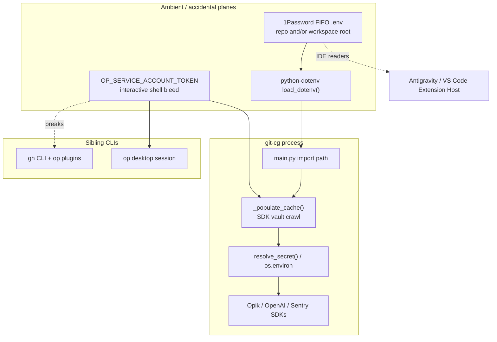
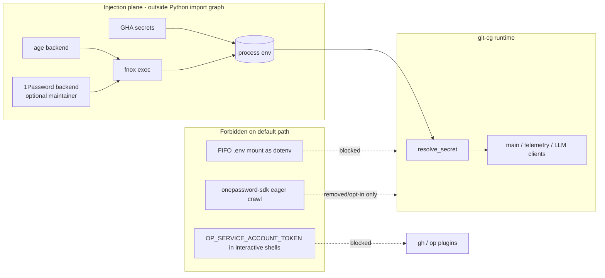
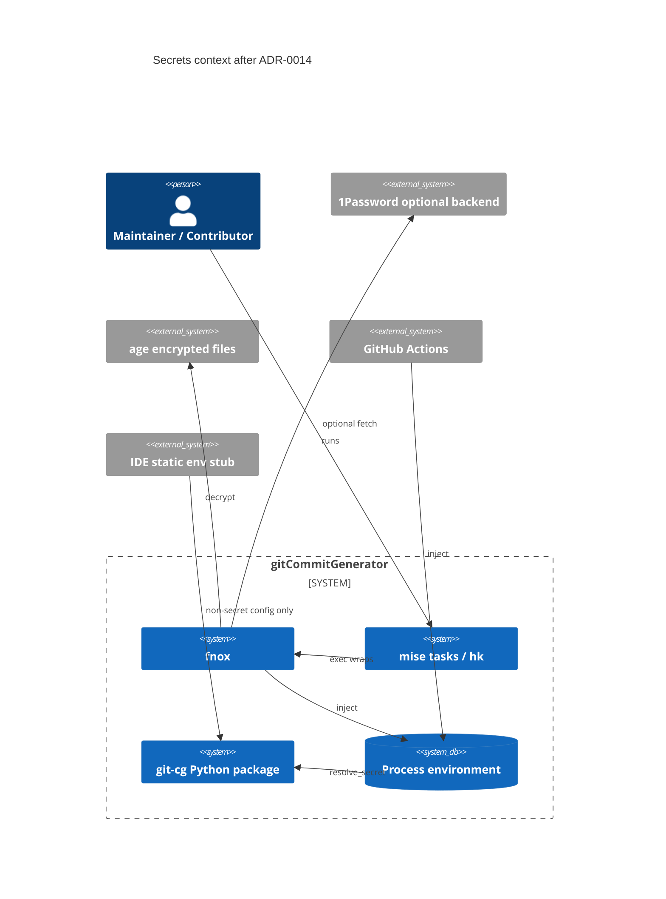
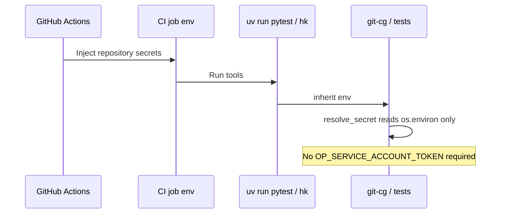

<!-- 🎨 HEADER IMAGE PROMPT & FILENAME
A hyper-detailed cinematic technical infographic, 8k, octane render, Unreal Engine 5 quality. At the top center, a massive three-tier stylized heading physically integrated into architecture: 'ADR' embossed in hot-magenta neon tubes mounted into dark titanium, 'FNOX' engraved into a gold-rimmed vault dial with a glowing red keyhole (fnox motif), and 'SECRETS BOUNDARY' cast as electric-cyan channel lettering bolted to a slate bulkhead. Below, a split scene: LEFT lane shows a chaotic 1Password vault leaking a UNIX FIFO named-pipe '.env' into an IDE extension-host that is overheating with red CPU gauges, while a GH CLI terminal flashes 403/auth failures under a global OP_SERVICE_ACCOUNT_TOKEN storm cloud; RIGHT lane shows a clean green hermetic pipeline labeled 'fnox' with two backend cartridges ('1Password optional' and 'age contributor'), injecting secrets only into a sealed process environment that feeds a small Python module 'resolve_secret()' with no import-time side effects. A hard firewall labeled 'NO FIFO AT WORKSPACE ROOT' blocks IDE readers. Deep shadows, volumetric dust, architectural precision. PURE TECHNICAL GRAPHIC. NO mobile phone UI, NO status bars, NO device frames.

📋 Target Filename: adr-0014-fnox-canonical-secrets-demote-1password-sdk-and-fifo-dotenv.jpeg
-->
<div align="center">


</div>

# ADR-0014: Make fnox Canonical for Secrets; Demote 1Password SDK and FIFO `.env` Runtime Paths

```yaml
adr_number: "0014"
title: "Make fnox Canonical for Secrets; Demote 1Password SDK and FIFO .env Runtime Paths"
status: "Accepted"
version: "v1.0.2"
date: "2026-07-23"
created: "2026-07-23 14:52:19"
modified: "2026-07-23 15:07:58"
risk_level: "High"
reversibility: "Medium"
security_scope: "Identity & Secrets"
tags:
  [
    "secrets",
    "fnox",
    "age",
    "1password",
    "onepassword-sdk",
    "dotenv",
    "fifo",
    "gh-cli",
    "mise",
    "hooks",
    "ide-boundary",
    "governance",
  ]
supersedes:
  [
    "0006-1password-python-sdk-migration",
  ]
superseded_by: []
related:
  [
    "0003-adopt-fnox-for-secrets-management",
    "0004-1password-service-account-integration",
    "0013-formalise-ide-boundaries-for-1password-mounted-local-env-files",
    "0002-adopt-gitleaks-and-trufflehog",
  ]
```

### Metadata enrichment (execution traceability)

| Field | Value |
| --- | --- |
| **Deciders** | Admin; Antigravity (drafting agent under human approval) |
| **Review schedule** | Quarterly, or earlier on any trigger in §12 |
| **Automation readiness** | **Partial** — decision **Accepted** 2026-07-23; implementation, mise task wiring, and code migration remain open until Implemented |
| **Technical story** | Secrets delivery mutated across ADR-0003 (fnox accepted), ADR-0004 (SA/`gh` breakage), ADR-0006 (SDK canonical), and ADR-0013 (FIFO IDE hazard) without replacing prior planes. Live `git-cg` still eager-loads 1Password SDK and dotenv against possible FIFO mounts, while docs/mise already point at fnox+age. This ADR collapses to env-first runtime + fnox orchestration and supersedes the SDK-canonical claim. |
| **Related ADRs** | ADR-0003 (implement); ADR-0004 (SA hygiene remains normative); ADR-0006 (**supersedes**); ADR-0013 (FIFO/IDE companion; accept alongside); ADR-0002 (scanning unchanged) |
| **Supersedes** | ADR-0006 — 1Password Python SDK as canonical Python runtime secrets path |
| **Superseded by** | — |

> **Index review (CHK-022):** `docs/ADRs/` has no separate `index.md` decision log (unlike the MacSetup ADR host). Navigation is filesystem order plus `docs/ADRs/0000-decision-matrix.md` (rejection sheet only). On **Accept** of this ADR: (1) set ADR-0006 YAML `status: Superseded` and `superseded_by: ["0014-fnox-canonical-secrets-demote-1password-sdk-and-fifo-dotenv"]`; (2) optionally add a one-line pointer in project docs/DEVELOPMENT secrets section; (3) do **not** rewrite ADR-0006 body history. No `docs/ADRs/index.md` update is possible until one is introduced.

## 1. Introduction and Goals

This Architecture Decision Record proposes a **secrets-path consolidation** for `gitCommitGenerator` (`git-cg`) and the maintainer’s local developer workspace that hosts it.

The repository already accepted **fnox** as the hybrid secrets orchestration tool (**ADR-0003**). It later made the **1Password Python SDK** the canonical in-process Python runtime path (**ADR-0006**), after service-account shell injection proved hostile to interactive `op` / GitHub CLI flows (**ADR-0004**). It then had to formalise IDE boundaries because the workspace-root `.env` is often a **1Password Environments FIFO / named pipe**, not a plaintext dotenv file (**ADR-0013**).

In practice, those decisions **stacked** rather than **replaced** each other. The live system now exhibits multiple concurrent secret-delivery mechanisms:

1. 1Password Environments **FIFO `.env`** mounts (repo root and/or umbrella workspace root)
2. `python-dotenv` `load_dotenv()` on CLI startup
3. Eager `onepassword-sdk` vault enumeration via `_populate_cache()` in `src/git_cg/secrets.py`, invoked from `src/git_cg/main.py` import path
4. Optional `OP_SERVICE_ACCOUNT_TOKEN` service-account context that overrides interactive `op` sessions
5. Documented but under-implemented **fnox + age** orchestration (tools pinned in `mise.toml`; DEVELOPMENT.md already describes fnox as the intended story)
6. CI-native environment injection (GitHub Actions secrets / OIDC) that must keep working without 1Password

This multi-path design produces recurring operational failures: GitHub CLI authentication instability, IDE Extension Host lockups, import-order / CI `hk` friction from delayed imports after secret bootstrap, rate-limit and cache complexity, and cognitive overload when diagnosing “which secret plane failed?”

### Core goals

1. **Make fnox the single front door** for local/task secret injection, implementing ADR-0003 as lived architecture rather than aspirational documentation.
2. **Demote or remove the 1Password Python SDK** as the default/canonical runtime path (superseding ADR-0006’s “SDK is canonical” claim).
3. **Stop treating 1Password-mounted FIFO `.env` files as application or IDE dotenv sources** (absorbing and strengthening ADR-0013).
4. **Preserve zero-plaintext discipline**: no regression to committed plaintext production secrets.
5. **Preserve contributor portability**: age (via fnox) remains the non-paywalled path; CI remains env-injected without 1Password.
6. **Preserve interactive tool authenticity**: GitHub CLI, `op` desktop session, and biometric unlock must not be globally poisoned by service-account tokens in interactive shells.
7. **Eliminate import-time secret I/O** from `git-cg` so hooks, ruff/isort, and cold starts are deterministic and side-effect free.
8. **Keep the public `resolve_secret()` contract** (or a thin successor) so call sites do not scatter ad-hoc env reads.

### Non-goals

* Replacing 1Password as a **human password manager / vault UI**
* Redesigning Opik/Sentry product telemetry semantics
* Completing Dependabot Actions / Python floor upgrades (#177)
* Mixing this migration into PR #176 Phase 3 intent-engine delivery
* Mandating dotenvx as the primary orchestrator (already rejected relative to fnox in ADR-0003)

---

## 2. Architecture Constraints

### 2.1 Governance lineage (must not be silently contradicted)

| ADR | Constraint carried forward |
| --- | --- |
| **0003 Accepted** | fnox is the chosen hybrid orchestrator; age fallback required; no contributor 1Password paywall |
| **0004** | `OP_SERVICE_ACCOUNT_TOKEN` in interactive shells breaks `op` plugin / GH flows; scoped headless use only |
| **0006 Accepted (to be superseded)** | Wanted env-first precedence and isolation from global `op` mutation — **intent kept**, **mechanism replaced** |
| **0013 Proposed** | FIFO `.env` is a runtime delivery interface, not IDE config; concurrent readers are unsafe |
| **0002 / betterleaks** | Secret scanning remains mandatory; migration must not increase leak surface |

### 2.2 Technical constraints

* `git-cg` runs in **hooks** (`prepare-commit-msg`, `commit-msg`) where latency, determinism, and lack of interactive prompts matter.
* Python packaging uses `src/git_cg` layout; import-time side effects affect ruff isort categorization and CI `hk check --pr`.
* `mise` already pins `fnox` and `age`; ecosystem alignment favors jdx tooling (`mise`, `hk`, `fnox`).
* CI must work with **GitHub-injected env only**.
* Umbrella Antigravity/VS Code workspaces may resolve `${workspaceFolder}/.env` to `/Users/admin/dev/activeProjects/.env`, not only the repo root.

### 2.3 Security constraints

* No committed plaintext production secrets.
* No broad `os.environ` dumps of vault contents.
* Disk caches of secrets (e.g. `.git/cg-op-cache.json`) are high-risk and must be eliminated or strictly time-bounded and gitignored with clear threat model — preferred: **eliminate**.
* Allowlisted env export for third-party SDKs (Opik/OpenAI/Sentry) may remain, but only after explicit injection by fnox/CI, not after O(N) vault crawl.

### 2.4 Organizational constraints

* Maintainer may continue using 1Password **as a fnox backend**.
* Contributors must not require 1Password subscription.
* Changes require a dedicated implementation track; must not destabilize in-flight Phase 3 (#161 / #176).

---

## 3. Context and Scope

### 3.1 Business / product context

`git-cg` needs API credentials for local/remote LLM providers, Opik telemetry, optional Sentry, and related integrations. Secrets are frequent, environment-specific, and dangerous if leaked into commits, logs, or model prompts.

### 3.2 What “the `.env` file” actually is in this workspace

In the maintainer environment, project and/or umbrella `.env` paths are often **1Password Environments local mounts**: UNIX FIFOs (`prw-------`), not regular dotenv text files. Official 1Password guidance warns these mounts are **not designed for concurrent access**; aggressive file watchers and readers cause loops and stalls.

That single fact invalidates a large class of “just use dotenv” assumptions for:

* IDE Python extensions
* `load_dotenv()` at import
* secret scanners / indexers treating `.env` as a static file
* AI tooling that eagerly reads workspace env files

### 3.3 Current runtime path (as implemented)



### 3.4 Failure modes observed (catalyst evidence classes)

| Failure class | Mechanism |
| --- | --- |
| GH CLI “permanently” unauthenticated / 403 | Service-account token forces `op` into SA scope; plugins point at vaults/items SA cannot read (ADR-0004 class) |
| IDE lockups / Extension Host starvation | Concurrent reads of FIFO `.env` (ADR-0013 class) |
| CI-only `hk` / ruff I001 import churn | Secret bootstrap forces delayed import blocks; isort category drift for packages like `opik` |
| Hook latency / rate limits | Eager vault enumeration + disk cache complexity |
| Debug stderr noise | SDK/dotenv failures print during ordinary commits |
| Dual source of truth | FIFO env vs SDK cache vs real process env disagree |

### 3.5 Scope of this ADR

**In scope**

* Canonical secrets architecture for `git-cg` and repo task runners
* Relationship to fnox, age, 1Password (backend only), CI env, IDE boundaries
* Supersession of ADR-0006 canonical-SDK claim
* Implementation sequencing and verification

**Out of scope**

* Choosing specific vault item layouts inside 1Password
* Full rewrite of telemetry redaction (covered by observability ADRs)
* Machine-wide uninstall of 1Password.app

---

## 4. Solution Strategy

### 4.1 Decision summary

**Adopt env-first, fnox-orchestrated secret delivery as the sole supported local injection path. Demote 1Password to an optional fnox backend. Remove FIFO `.env` and onepassword-sdk from the default `git-cg` runtime path. Supersede ADR-0006.**

### 4.2 Canonical resolution order

```text
resolve_secret(name):
  1. process environment (including values injected by:
       - GitHub Actions / CI
       - `fnox exec -- <command>`
       - explicit user export)
  2. optional explicit non-FIFO dotenv file ONLY if
       GIT_CG_DOTENV_PATH points at a regular file
       (default: disabled)
  3. never: import-time 1Password SDK vault crawl
  4. never: automatic read of workspace-root FIFO `.env`
  5. else: clear, secret-name-scoped error (fail closed for required keys)
```

### 4.3 Role separation

| Plane | Owner | Responsibility |
| --- | --- | --- |
| **Orchestration** | fnox (+ mise tasks) | Decrypt/fetch and inject into child process env |
| **Maintainer backend** | 1Password via fnox | Optional; not required for app code |
| **Contributor backend** | age via fnox | Portable encrypted secrets |
| **CI backend** | GitHub Actions secrets / OIDC | No 1Password |
| **Application** | `resolve_secret()` | Read env only; no network; no vault APIs |
| **IDE** | static stubs (e.g. `.vscode/python.env`) | Non-secret config only; never FIFO |
| **Interactive CLIs** | native auth (`gh auth`, desktop `op`) | No SA token in interactive shell |

### 4.4 Target architecture



### 4.5 Application code changes (strategic, not a full patch set)

1. **`src/git_cg/main.py`**
   * Remove eager `_populate_cache()` from module import path.
   * Keep `load_dotenv()` disabled by default, or gate behind explicit regular-file path.
   * Restore normal import ordering (no secret-bootstrap-driven delayed import block) where possible.
2. **`src/git_cg/secrets.py`**
   * Reduce to env-first `resolve_secret()` (+ optional explicit file backend).
   * Delete or hard-gate SDK client, vault iteration, and `.git/cg-op-cache.json`.
   * Preserve allowlist concept only for documenting which keys third-party libs require in env after fnox injection.
3. **`pyproject.toml`**
   * Remove `onepassword-sdk` from default dependencies once call sites are gone (or move to unused optional extra during transition).
   * Re-evaluate `python-dotenv` dependency necessity.
4. **`mise.toml` / tasks**
   * Canonical developer commands become `fnox exec -- mise run …` or mise tasks that wrap fnox.
   * Document `fnox` backend configuration (1Password vs age) without exporting SA tokens globally.
5. **Docs**
   * DEVELOPMENT.md secrets section becomes fnox-first; FIFO warning remains; SDK path removed.
6. **IDE / workspace**
   * Enforce ADR-0013: no Python extension `python.envFile` pointing at FIFO paths; use inert `.vscode/python.env` for non-secrets.
7. **Hooks**
   * Ensure hk/git hook invocations receive env from fnox-wrapped developer entrypoints or CI env; hooks themselves must not call 1Password.

### 4.6 Transition flags (recommended)

| Variable | Purpose |
| --- | --- |
| `GIT_CG_SECRETS_BACKEND=env` | Default; env only |
| `GIT_CG_SECRETS_BACKEND=fnox-injected` | Documentation alias; still env at runtime |
| `GIT_CG_DOTENV_PATH` | Optional absolute path to a **regular** dotenv file |
| `GIT_CG_ENABLE_OP_SDK=1` | Temporary escape hatch during migration only; default off; scheduled for removal |
| `OP_SERVICE_ACCOUNT_TOKEN` | Allowed only inside explicitly headless wrappers; never in interactive shell rc |

---

## 5. Building Block View

### 5.1 Components



### 5.2 Module responsibilities

| Module / artifact | Responsibility after ADR-0014 |
| --- | --- |
| `fnox` config (project) | Backend selection, secret mapping, encryption |
| `mise.toml` | Pin fnox/age; task entrypoints |
| `src/git_cg/secrets.py` | Pure resolution from env (+ optional explicit file) |
| `src/git_cg/main.py` | Consume resolved secrets at call sites; no bootstrap |
| `.vscode/python.env` | Non-secret IDE knobs only |
| GHA workflows | Provide required env for CI jobs |
| 1Password.app | Human vault; optional fnox backend — not imported by Python |

---

## 6. Runtime & Deployment View

### 6.1 Local interactive development

```bash
# Preferred
fnox exec -- git-cg commit
fnox exec -- mise run test
fnox exec -- hk check --check --no-stage --pr

# CI-equivalent without fnox (env already exported)
export OPENAI_API_KEY=...
git-cg commit
```

### 6.2 Git hooks

Hooks should assume secrets are already present in the environment when needed, or that the developer entrypoint that installs/runs hooks is fnox-wrapped. Hooks must not:

* launch 1Password SDK crawls
* read FIFO `.env` via dotenv
* require interactive biometric prompts mid-commit

### 6.3 CI / GitHub Actions



### 6.4 Maintainer 1Password path (optional)

1Password remains valid **behind fnox**:

* fnox backend configuration references op URIs / integration
* secrets appear only in the child process env of `fnox exec`
* interactive shell stays free of `OP_SERVICE_ACCOUNT_TOKEN`
* `gh auth` uses native GitHub credentials, not broken op-plugin SA scope

### 6.5 Contributor age path

* Encrypted secret material managed per ADR-0003
* Contributor installs mise tools (`fnox`, `age`)
* No 1Password subscription required

---

## 7. Cross-cutting Concepts

### 7.1 Security

* **Least privilege**: app process sees only keys it needs, not entire vault dumps.
* **No ambient authority**: removing SA token from interactive shells restores desktop `op` least privilege.
* **Attack surface reduction**: delete disk secret cache in `.git/` if present.
* **Scanning**: betterleaks/TruffleHog continue; ensure age key material and fnox config are handled per scanner allowlists without hiding real leaks.

### 7.2 Performance

* Eliminate O(vault × items) SDK fetch on every hook invocation.
* Eliminate FIFO read stalls in IDE and dotenv.
* Faster, more deterministic commits and CI lint.

### 7.3 Operability / DX

* One mental model: “if the var is not in env, injection failed.”
* Clear errors naming the missing key and pointing to fnox/CI docs.
* GH CLI auth becomes debuggable again in isolation.

### 7.4 Observability

* Do not log secret values.
* Optional debug may log **which backend plane supplied a key** (`env`, `dotenv-file`, `missing`) — never values.
* Opik/Sentry initialization happens only after env injection.

### 7.5 Compliance with Hybrid commits / hooks

* Secrets migration commits use Hybrid standard; trailers reference the implementation issue and this ADR.
* No secrets in commit messages or fixtures.

---

## 8. Catalyst

### What broke the status quo

Multiple concurrent catalysts converged:

1. **Operational auth collapse**: GitHub CLI authentication repeatedly fails in the maintainer environment when 1Password service-account and plugin contexts collide — the exact class of failure ADR-0004 documented, still present after ADR-0006 because SA tokens and FIFO env mounts remained ambient.
2. **FIFO `.env` is not dotenv**: The project “`.env`” is a 1Password Environments mount. Treating it as a normal environment file is architecturally false and operationally dangerous (IDE lockups per ADR-0013; concurrent reader warnings from 1Password).
3. **SDK eager bootstrap side effects**: `_populate_cache()` on CLI import creates delayed imports, env mutation, disk caching, and CI/local ruff isort discrepancies (e.g. third-party packages like `opik` mis-ordered relative to first-party `git_cg`).
4. **ADR drift**: ADR-0003 accepted fnox, but the running system optimized for 1Password SDK + FIFO mounts instead of implementing fnox as the front door. DEVELOPMENT.md already describes fnox; code path disagrees.
5. **Phase delivery risk**: Stabilizing `hk` and Phase 3 while secrets bootstrap keeps mutating process startup makes CI failures non-local and expensive to debug.

### Why this matters for long-term health

Secrets architecture is foundational. Every feature (telemetry, LLM providers, release automation) hangs off it. A multi-plane secrets system converts every outage into a cross-tool conspiracy theory. Consolidating on fnox+env restores debuggability, contributor access, and ADR honesty.

### Decision Drivers & Constraints

* Security boundary integrity (Identity & Secrets)
* Interactive CLI authenticity (`gh`, desktop `op`)
* IDE stability (no FIFO as `python.envFile`)
* Hook determinism and latency
* Contributor non-paywall (age)
* mise/fnox/hk ecosystem alignment
* Reversibility without plaintext regression
* Do not block Phase 3 merge path with unrelated secrets rewrite mid-PR

### Considered Options

- **Option 1: Keep ADR-0006 SDK-canonical; harden only**  
  Add more caches, short-circuits, and IDE exceptions while retaining eager SDK and FIFO mounts.  
  *Rejected because:* does not fix ambient SA/`gh` collisions; preserves multi-plane complexity; continues import-time I/O; contradicts lived need to “scrap the mutated 1Password integration.”

- **Option 2: Switch primary orchestration to dotenvx**  
  Use dotenvx encrypted env files as the main system.  
  *Rejected because:* ADR-0003 already evaluated dotenvx vs fnox and accepted **fnox** for multi-backend + mise alignment. Reopening that choice requires stronger new evidence than currently present.

- **Option 3: Plaintext `.env` only**  
  *Rejected because:* security regression; fails zero-plaintext goals; still collides with FIFO mounts if 1Password Environments remain enabled at the same path.

- **Option 4: fnox-canonical + env-first app resolver; demote SDK/FIFO** *(Chosen)*  
  Implement ADR-0003 fully; supersede ADR-0006 mechanism; absorb ADR-0013 boundaries; keep 1Password only as optional fnox backend.  
  *Chosen because:* matches accepted governance, fixes catalyst classes, preserves contributor path, restores GH/IDE sanity, minimizes app-side secret logic.

### Decision

**We will make fnox the canonical secrets orchestration layer for local and task-driven workflows; make process environment the sole default runtime source for `git-cg`; demote and ultimately remove onepassword-sdk eager integration; prohibit FIFO `.env` consumption by app and IDE dotenv loaders; and supersede ADR-0006’s claim that the 1Password Python SDK is the canonical Python runtime secrets path.**

ADR-0003 remains in force and is **implemented**, not replaced.  
ADR-0004’s warnings remain normative for SA token hygiene.  
ADR-0013’s IDE boundary becomes mandatory companion policy for this decision.

### Decision status

- **Accepted:** 2026-07-23 15:07:58 (Admin human approval after Phase 1 draft + Phase 2 checklist).
- **Implementation status:** Not started. Code still reflects pre-0014 SDK/FIFO paths until a dedicated implementation PR lands.
- **Do not treat Acceptance as Implemented.**

---

## 9. Impact Radius (Cause, Change, Effect)

### 1. `src/git_cg/secrets.py`
- **Cause**: Currently owns onepassword-sdk client, vault crawl, disk cache, allowlist export, and `resolve_secret`.
- **Change**: Collapse to env-first resolver; remove/gate SDK crawl and `.git/cg-op-cache.json`; document required keys only.
- **Effect**: No network on import; simpler tests; fewer auth side effects; call sites unchanged if API preserved.

### 2. `src/git_cg/main.py`
- **Cause**: Calls `_populate_cache()` during import; uses `load_dotenv()`; delayed imports after bootstrap.
- **Change**: Remove eager populate; disable automatic dotenv unless explicit regular-file path; normalize imports.
- **Effect**: Faster startup; cleaner ruff/isort; hooks stop depending on 1Password reachability.

### 3. `pyproject.toml` / `uv.lock`
- **Cause**: Declares `onepassword-sdk` and `python-dotenv` dependencies.
- **Change**: Remove or optionalize SDK; reassess dotenv.
- **Effect**: Smaller install; fewer native SDK issues; lockfile churn (separate PR from Phase 3).

### 4. `mise.toml` and developer tasks
- **Cause**: Already pins `fnox` and `age` but app doesn’t require fnox exec.
- **Change**: Task recipes and docs standardize on `fnox exec` (or equivalent mise-fnox integration).
- **Effect**: Secrets appear only in intended child processes; interactive shell stays clean.

### 5. DEVELOPMENT.md / README secrets docs
- **Cause**: Docs partially describe fnox but also 1Password-centric workflows.
- **Change**: Rewrite secrets section to fnox-first; FIFO warnings; CI env instructions; remove SDK-canonical language.
- **Effect**: Contributors and future agents follow one story.

### 6. IDE / workspace settings (Antigravity, VS Code)
- **Cause**: Default env file discovery hits FIFO mounts at workspace root (ADR-0013).
- **Change**: Point language tooling at inert regular files only; never at 1Password mounts.
- **Effect**: Stops Extension Host lockups; separates non-secret IDE config from runtime secrets.

### 7. GitHub CLI + shell environment
- **Cause**: SA token and op plugins interact badly (ADR-0004).
- **Change**: Ban SA token from interactive rc; use `gh auth login` native credentials; optional op plugin only with desktop session.
- **Effect**: Restores predictable `gh` auth for issue/PR workflows.

### 8. CI workflows (`.github/workflows/*`)
- **Cause**: Must not depend on 1Password desktop/FIFO.
- **Change**: Confirm jobs already env-based; add missing secrets to GHA as needed; no SDK requirement.
- **Effect**: CI remains hermetic; no new 1Password CI dependency.

### 9. Tests (`tests/test_secrets.py` and related)
- **Cause**: Tests encode SDK/cache behaviors.
- **Change**: Retarget to env-first resolver; delete cache/SDK tests or mark migration-only.
- **Effect**: Suite matches architecture; less flaky network-adjacent testing.

### 10. ADR index / decision matrix
- **Cause**: Supersession of 0006 and implementation of 0003 must be visible.
- **Change**: Update `docs/ADRs` index / matrix entries when this ADR is accepted.
- **Effect**: Prevents future agents from re-applying SDK-canonical guidance.

### 11. In-flight PR #176 / Issue #161
- **Cause**: Must not absorb secrets rewrite.
- **Change**: Explicit non-coupling; only minimal import hygiene if required for green CI.
- **Effect**: Phase 3 remains reviewable; secrets work ships as its own PR series.

### 12. Future issue tracking (suggested)
- **Cause**: Needs an execution vehicle after #176.
- **Change**: Open implementation issue linked to this ADR (not mixed into #177 deps floors unless explicitly desired).
- **Effect**: Ordered rollout with acceptance criteria.

---

## 10. Consequences

### Pros

* Single orchestration story aligned with **Accepted ADR-0003**
* Removes ambient 1Password failure domain from GH CLI, IDEs, and hooks
* Eliminates FIFO-as-dotenv class of outages
* Faster, side-effect-free Python startup
* Better contributor onboarding via age
* CI stays simple (pure env)
* Clear supersession reduces ADR contradiction debt
* Smaller security blast radius (no full-vault crawl into process)

### Cons

* Migration effort across code, docs, maintainer muscle memory
* Maintainer must learn/standardize fnox backend config (even if 1Password remains backend)
* Temporary dual-run period if `GIT_CG_ENABLE_OP_SDK` escape hatch exists
* Medium reversibility: once SDK removed and workflows change, rollback needs discipline
* Risk of “it works on my machine” if developers forget `fnox exec` — mitigated by mise task wrappers and docs
* Requires conscious handling of umbrella workspace FIFO mounts outside the repo

---

## 11. Verification Plan

### Automated Verification

- [ ] `python3 config/ADR/src/adr_ecosystem/verify_adr.py docs/ADRs/0014-fnox-canonical-secrets-demote-1password-sdk-and-fifo-dotenv.md` (structural ADR validation)
- [ ] Unit tests: `resolve_secret` returns env values; does not call SDK when env present
- [ ] Unit tests: missing required key fails closed with actionable error
- [ ] Assert no import of `onepassword` / `onepassword-sdk` from default `git_cg.main` path after implementation
- [ ] `uv run ruff check` / `hk check --check --no-stage --pr` green without secret-bootstrap delayed imports
- [ ] `mise run test` with secrets injected via fnox or env
- [ ] CI workflows green without `OP_SERVICE_ACCOUNT_TOKEN`

### Manual Verification

- [ ] Interactive shell: `gh auth status` succeeds **without** SA token exported
- [ ] `fnox exec -- git-cg` can resolve provider keys on maintainer machine
- [ ] Contributor simulation: age backend path documented and smoke-tested
- [ ] IDE: open umbrella workspace; Python extension does not read FIFO `.env`; no Extension Host CPU peg
- [ ] Confirm workspace-root and repo-root `.env` are either absent, regular non-secret stubs, or not referenced by tooling
- [ ] Hooks: commit flow works offline from 1Password desktop lock state if env pre-injected; fails clearly if required env missing
- [ ] Verify `.git/cg-op-cache.json` no longer created

### Security Verification

- [ ] betterleaks/TruffleHog clean on migration PR
- [ ] No secrets in ADR, tests, logs, or commit messages
- [ ] Disk cache removal verified

---

## 12. Review / Revisit Criteria

Revisit this ADR when any of the following occur:

* fnox is abandoned or unmaintained upstream, forcing orchestrator replacement
* 1Password provides a **non-FIFO**, concurrency-safe local injection mechanism that does not break IDEs or `gh`
* A new requirement demands in-process vault APIs for short-lived tokens that cannot be injected via env
* Escape hatch `GIT_CG_ENABLE_OP_SDK` is still present **90 days** after implementation (should be removed)
* Secret-related incidents recur (leaks, auth loops, IDE lockups) indicating incomplete boundary enforcement
* Contributor onboarding friction shows age/fnox path is impractical
* Major monorepo/workspace layout change alters `${workspaceFolder}` env discovery assumptions

---

## 13. Rollback Strategy

1. Revert implementation PR(s) restoring previous `secrets.py` / `main.py` behavior.
2. Restore `onepassword-sdk` dependency if removed.
3. Re-enable documented SDK path only behind explicit flag if emergency requires it.
4. Do **not** re-enable automatic FIFO dotenv loading as part of rollback without a separate decision — that path is known-dangerous.
5. If ADR-0014 is rejected before implementation: mark status `Deprecated` or leave `Proposed` and do not change code.
6. If superseded later: add `superseded_by` and update index; do not delete history.

### Rollback verification

* Prior hook commit path works under previous assumptions
* Tests for old behavior restored
* No plaintext secret material left behind from partial migration

---

## 14. Implementation Findings

*(To be filled when status moves to Implemented. Seed notes from pre-implementation investigation:)*

- ADR-0003 already selected fnox over dotenvx; implementation lagged.
- ADR-0006 correctly identified SA-token shell mutation as harmful, but SDK eager crawl reintroduced ambient complexity and disk caching.
- ADR-0013 correctly identified FIFO `.env` as the IDE killer; app-side `load_dotenv()` still participates in the same hazard class.
- `mise.toml` already pins `fnox` and `age`, reducing tooling bootstrap cost for the target architecture.
- DEVELOPMENT.md already warns about FIFO `.env` and mentions fnox — docs lead code.
- Secrets rewrite must stay decoupled from Phase 3 intent-engine PR (#176) and from dependency floor programme (#177), except where import hygiene is required for CI green.

---

## 15. Governance Follow-up

- **Antigravity rule assessment**: **Yes — update existing secrets/auth rules** and add a concise workspace rule forbidding FIFO `.env` as `python.envFile` / dotenv source.
- **Reasoning**: This decision changes the canonical secret path for all agents and humans; leaving ADR-0006 language active will cause re-implementation of SDK crawl patterns.
- **User decision**: Approved rule update (human accepted ADR-0014 on 2026-07-23; implementation issue + agent rule text still to land)
- **Affected rule or proposed rule name**:
  - Update: secrets resolution / 1Password guidance in project agent rules
  - Proposed: `secrets-fnox-env-first` (or equivalent)
  - Related: IDE env boundary rule from ADR-0013

### Index / relationship follow-up

- Mark ADR-0006 as **Superseded** by 0014 when 0014 is Accepted/Implemented (YAML status + `superseded_by` only).
- Keep ADR-0003 **Accepted** (implemented by 0014).
- Keep ADR-0004 as historical constraint (SA token hygiene).
- Advance ADR-0013 from Proposed → Accepted alongside or immediately after 0014 acceptance if not already accepted.
- **Index gap:** no `docs/ADRs/index.md` exists in this repo; reviewed 2026-07-23. Track acceptance in PR/issue + DEVELOPMENT secrets docs until an ADR index is introduced.
- Do not edit ADR-0000 rejection matrix unless a *new* rejected alternative appears; dotenvx-primary remains rejected per ADR-0003 and this ADR.

---

## 16. Links & References

- [ADR-0003: Adopt fnox for Hybrid Secrets Management](./0003-adopt-fnox-for-secrets-management.md) — *Accepted orchestrator decision this ADR implements*
- [ADR-0004: 1Password Service Account Integration](./0004-1password-service-account-integration.md) — *SA token vs interactive op/gh failure mode*
- [ADR-0006: 1Password Python SDK Migration](./0006-1password-python-sdk-migration.md) — *Superseded canonical-runtime claim*
- [ADR-0013: IDE Boundaries for 1Password-Mounted Local `.env` Files](./0013-formalise-ide-boundaries-for-1password-mounted-local-env-files.md) — *FIFO / IDE boundary companion*
- [fnox documentation](https://fnox.jdx.dev/) — *Orchestrator*
- [fnox GitHub](https://github.com/jdx/fnox) — *Upstream*
- [age](https://github.com/FiloSottile/age) — *Contributor encryption backend*
- [dotenvx](https://dotenvx.com/docs/introduction) — *Considered alternative; not chosen*
- [1Password Environments documentation](https://developer.1password.com/docs/environments/) — *FIFO local `.env` behavior and concurrency limits*
- Issue tracking (planned): implementation issue after Phase 3 baseline; do not mix into [#176](https://github.com/Thomo1318/gitCommitGenerator/pull/176) or [#177](https://github.com/Thomo1318/gitCommitGenerator/issues/177) unless explicitly scheduled

---

## CHANGELOG

- v1.0.0 (2026-07-23 14:52:19): Initial Proposed ADR drafted via ADR Generation Ecosystem full template; captures fnox-canonical secrets architecture, supersession of ADR-0006, absorption of ADR-0013 boundaries, and rejection of dotenvx-primary and plaintext-only alternatives.
- v1.0.1 (2026-07-23 14:58:10): Phase 2 checklist audit — added execution-traceability metadata table (Deciders, Review schedule, Automation readiness, Technical story, relationship fields), documented ADR index gap (CHK-022), and strengthened governance supersession bookkeeping notes. No decision-content change.
- v1.0.2 (2026-07-23 15:07:58): **Accepted** by Admin after review. Supersession bookkeeping applied to ADR-0006; ADR-0013 advanced to Accepted as companion IDE/FIFO boundary; DEVELOPMENT secrets section aligned to fnox-canonical / env-first wording. Implementation remains a separate track (not Implemented).

<!--
## Supporting Visual Aids

### Visual Aid Selection Rationale
- **Primary data shape or explanatory need**: trust-boundary / topology shift from multi-plane ambient secrets to single orchestration front door; before/after comparison of runtime paths; sequence of CI env injection
- **Chosen visual aid**: Mermaid flowcharts + sequence diagram + C4-style context diagram in body; Google Flow cinematic header for narrative anchoring
- **Why this visual aid was chosen**: Secrets architecture is primarily about boundaries and data flow, not time-series metrics. Topology and sequence diagrams communicate forbidden vs allowed planes more clearly than charts.
- **Alternative aids considered**:
  1. Pure C4 container diagrams only — strong, but less explicit about forbidden FIFO/SDK paths
  2. Before/after dumbbell or side-by-side matrix only — good for summary, weak for runtime causality
  3. d2 topology — excellent rendering, less portable in GitHub markdown than Mermaid
  4. Table-only decision matrix — necessary complement, insufficient alone
  5. Google Flow multi-panel comic of GH 403 — high empathy, low normative precision

### Supporting Visuals and Generated Artifacts
- **Reference source**: `config/ADR/visuals/visualAidQuickReference.md` (system topology / flow) + master table fallback
- **Chosen method**: Mermaid (in-body) + Google Flow (header asset)
- **Generated artifact path(s)**:
  - Header: `docs/assets/adr-0014-fnox-canonical-secrets-demote-1password-sdk-and-fifo-dotenv.jpeg` (Prompt only until generated)
  - In-body Mermaid: embedded in sections 3.3, 4.4, 5.1, 6.3
- **Notes**: User generates header image from the HTML-comment prompt and drops it at the predicted assets path; markdown link will then render automatically. No secrets may appear in any generated visual.
-->
