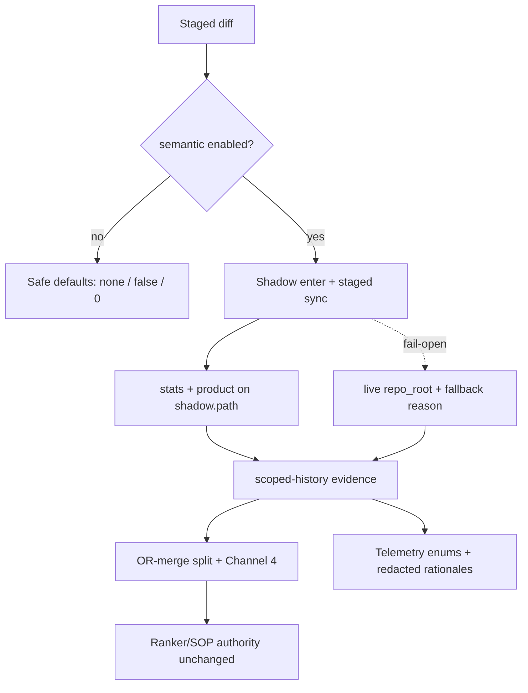

# ADR-0163: Scoped Reasoning History (Phase 9)

## Status

Accepted (Implemented; Issue #163)

## Context

Phase 7/7.5 introduced shadow-workspace graph isolation and semantic product fields.
Operators still lacked **high-confidence, fail-open** evidence for:

1. **Split recommendations** when staged files partition into flow-disjoint components
2. **Rename confidence** bands corroborated by AST/`code_fp` + token similarity
3. **Structural markers** (error handling, public API, new CLI command) for enrichment only

Legacy heuristic branches mixed advisory signals with authority fields and were hard to reason about under flag-off.

## Decision

Introduce `git_cg.scoped_history` as an **advisory, default-gated, fail-open** producer:

| Concern | Rule |
|---|---|
| Authority | Ranker/SOP remain sole authority for `intent_id`, `cc_type`, gitmoji, SemVer, changelog |
| Plan merge | OR-merge only: may set `split_recommended=True` and append bounded rationale notes |
| Prompt | Channel 4 `SCOPED-HISTORY FEEDBACK` is directive-free guidance text |
| Shadow lifetime | **Policy B**: stats + product queries use `shadow.path` *inside* the live context |
| Flag-off | `--no-enable-semantic` → zero producer side effects; safe enum defaults |
| Telemetry | Free-text rationales redacted; closed enums coerced, not scrubbed |
| Markers | P1/P2 structural markers fold into `fingerprint_markers` (closed vocabulary) |

## Architecture overview (Policy B + scoped-history)

Lifecycle for flag-on semantic runs. Ranker/SOP remain sole authority; scoped-history is advisory only.

```mermaid
sequenceDiagram
    autonumber
    participant CLI as git-cg commit path
    participant Coll as _collect_semantic_producer_metrics
    participant Shadow as shadow_workspace (Policy B)
    participant Graph as CRG stats + product bundle
    participant SH as evaluate_scoped_history
    participant Plan as OR-merge / Channel 4
    participant Tel as telemetry (redacted)

    CLI->>Coll: enable_semantic + preflight_groups_count (carry-through)
    alt flag-off
        Coll-->>CLI: zero-safe defaults (no graph/parser I/O)
    else flag-on
        Coll->>Shadow: enter index-only shadow (refresh-on)
        activate Shadow
        Note over Shadow,Graph: Policy B — query shadow.path only while context is live
        Coll->>Graph: graph_stats + detect/impact/flows on shadow.path
        Graph-->>Coll: product fields (+ free hub/complex/callers if present)
        Coll->>SH: flows map, rename bytes, parse results, preflight_groups_count
        SH-->>Coll: split/rename/structural evidence (fail-open)
        Coll->>Shadow: exit context
        deactivate Shadow
        Note over Coll,Shadow: After exit — never query destroyed shadow.path
        Coll-->>CLI: metrics + scoped_history_evidence
        CLI->>Plan: OR-merge split_recommended; Channel-4 guidance (directive-free)
        CLI->>Tel: closed enums kept; free-text rationales redacted
    end
```



## Consequences

### Positive

* Deterministic split/rename evidence with explicit fallback reasons
* Clear Policy B lifetime contract for shadow workspaces
* Safer enrichment without authority mutation

### Negative / follow-ups

* Parser stubs in tests must expose `results` (or producers fail-open)
* Legacy heuristic branches must be verified absent after full suite green
* Wide regression across Phase 7 / 7.25 gold paths required before merge

## References

* Issue #163
* Epic A #158
* Phase 7.5 Policy A shadow isolation (#180)
