# Mermaid Architecture Diagram Library

This document contains a library of advanced architectural layout strategies and examples for Mermaid diagrams. Each option demonstrates a different way to visually structure complex systems.

---

## Option 1 – Three-lane “railway” (Deterministic / Semantic / Telemetry)

Emphasizes separation of concerns into three vertical lanes.

```mermaid
%%{
  init: {
    'theme': 'base',
    'themeVariables': {
      'primaryColor': '#f6f8fa',
      'primaryBorderColor': '#d0d7de',
      'primaryTextColor': '#24292f',
      'lineColor': '#57606a'
    },
    'flowchart': {
      'defaultRenderer': 'elk'
    },
    'state': {
      'defaultRenderer': 'elk'
    }
  }
}%%
flowchart LR
  %% Styles
  classDef laneTitle fill:#eeeeee,stroke:#9e9e9e,color:#111,stroke-width:1px
  classDef authority fill:#fff3e0,stroke:#ef6c00,color:#111,stroke-width:2px
  classDef semantic fill:#e3f2fd,stroke:#1565c0,color:#111,stroke-width:1px
  classDef deterministic fill:#e8f5e9,stroke:#2e7d32,color:#111,stroke-width:1px
  classDef telemetry fill:#f3e5f5,stroke:#6a1b9a,color:#111,stroke-width:1px
  classDef deferred fill:#fafafa,stroke:#9e9e9e,color:#333,stroke-width:1px
  classDef decision fill:#ede7f6,stroke:#5e35b1,color:#111,stroke-width:1px

  %% Lane titles
  subgraph L1["Deterministic authority (Phase 3)"]
    direction TB
    STAGED["Staged index / diff extract<br/>shadow_workspace when disk tools need index-only tree"]
    SPLIT{"Split views<br/>analysis vs prompt<br/>Phase 3 ranker-safety"}
    ANALYSIS["Analysis view<br/>full staged evidence<br/>no blind char slice"]
    PROMPT["Prompt view<br/>pack_prompt_diff ceiling<br/>Phase 11 owns packer"]
    SIG["extract_diff_signals<br/>DiffSignals heuristics only<br/>no CRG / fingerprint I/O"]
    MARK["collect_active_markers<br/>flat additive if-accumulation<br/>no PEP-634 marker trees"]
    RANK["rank_commit_intents + SOP matrix<br/>sole ranking / semver_impact authority"]

    STAGED --> SPLIT
    SPLIT --> ANALYSIS --> SIG --> MARK --> RANK
    SPLIT --> PROMPT
  end

  subgraph L2["Semantic context (Phase 7 product)"]
    direction TB
    FLAG{"enable_semantic?<br/>CLI / GIT_CG_ENABLE_SEMANTIC<br/>default false"}

    P1["Phase 1 parser<br/>ast_parser + staged blobs<br/>semantic_parser_* metrics + fallback reasons"]
    P2["Phase 2 fingerprints<br/>HEAD↔index compare<br/>body_similarity_min/avg + class_counts"]
    GQ["Phase 7 graph product bundle<br/>extend graph_context (no second CRG client)<br/>detect_changes + impact_radius + affected_flows<br/>blast_radius_size · affected_flows_count · test_coverage_gap"]

    SUM["build_semantic_summary<br/>SemanticDiffSummary (schema_versioned)<br/>bounded · truncation-aware · partial OK<br/>@opik.track(name='semantic_analysis')"]
    CTX["GenerationContext<br/>diff_signals + ranked_intents + constraints<br/>semantic_summary? · risk_assessment?<br/>reserved: scope_priors / preflight_groups = None"]
    ONCE["Single producer pass per generation<br/>regen loop reuses context<br/>no second parse/fingerprint pass"]

    FLAG -->|yes| P1 --> P2 --> GQ --> SUM --> CTX --> ONCE
    FLAG -->|no| SKIP["Legacy context path<br/>no producers · no summary<br/>no semantic_analysis span"] --> CTX

    P1 -.-> SUM
    P2 -.-> SUM
    ANALYSIS -.->|staged changed_files| GQ
    STAGED -.->|opt-in GIT_CG_SEMANTIC_REFRESH_GRAPH| GQ
  end

  subgraph L3["Contract, LLM, telemetry, and deferred work"]
    direction TB
    CONTRACT["resolve_semantic_contract<br/>enforce_semantic_contract<br/>behaviour unchanged · matrix-authored"]
    LLM["LLM / Instructor render<br/>wording only inside contract<br/>unknown intents fail model-facing"]

    subgraph TEL["Phase 14 wire-now — Phase 7 fields"]
      direction TB
      SPAN["Opik span semantic_analysis<br/>ignore bulky / sensitive args"]
      STATE["GenerationTelemetry + GIT_CG_OPIK_STATE<br/>back-compat defaults + allowlists<br/>generate + record-telemetry parity"]
      REDACT["redact_payload gateway<br/>no secrets / raw source bodies<br/>distinct keys vs parser semantic_summary_hash"]
    end

    subgraph DEF["Explicitly not this issue"]
      direction TB
      P05["Phase 0.5 preflight grouping product"]
      P9["Phase 9 scoped history / hub-bridge/community split"]
      P10["Phase 10 post-render veto"]
      P11["Phase 11 PromptBudget packer / token bin-packer<br/>context_savings_*"]
      P13["Phase 13 multi-step reasoning speedups"]
      P15["Phase 15 Hypothesis fingerprint properties"]
    end

    ONCE --> CONTRACT --> LLM
    PROMPT --> LLM
    CTX -.->|optional bounded evidence block only<br/>no full summary dump| PROMPT

    SUM --> SPAN
    SUM --> STATE
    SPAN --> REDACT
    STATE --> REDACT

    SUM -.->|summary becomes later packer evidence| P11
    CTX -.->|placeholders only| P05
    CTX -.->|placeholders only| P9
  end

  %% Enrichment edges (cross-lane)
  P2 -.->|FingerprintEnrichmentFacts<br/>closed vocab only| MARK
  GQ -.->|GraphEnrichmentFacts<br/>production assembly required<br/>or documented replacement| MARK

  %% Classes
  class STAGED,SPLIT,ANALYSIS,PROMPT,SIG,MARK,RANK deterministic
  class P1,P2,GQ,SUM,CTX,ONCE,FLAG,SKIP semantic
  class CONTRACT,LLM,TEL,SPAN,STATE,REDACT telemetry
  class L1,L2,L3 laneTitle
  class DEF,P05,P9,P10,P11,P13,P15 deferred
  class FLAG decision
  class CONTRACT authority
```

---

## Option 2 – Top-down “phases” with explicit numbered layers

Highlights the three-layer architecture and defers at the bottom.

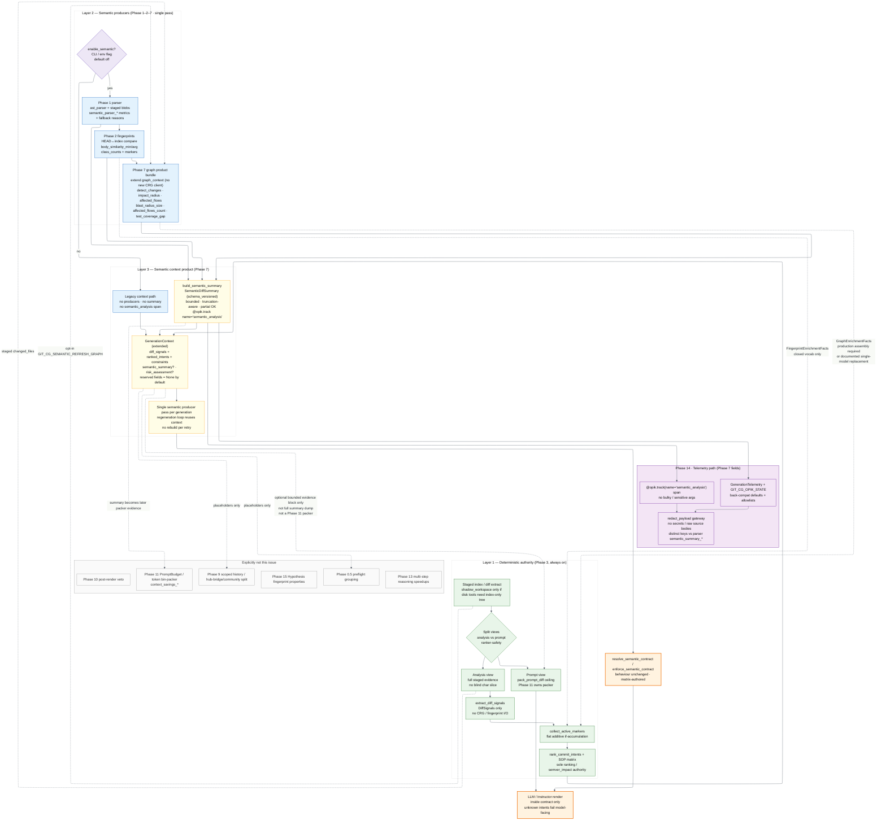
```mermaid
%%{
  init: {
    'theme': 'base',
    'themeVariables': {
      'primaryColor': '#f6f8fa',
      'primaryBorderColor': '#d0d7de',
      'primaryTextColor': '#24292f',
      'lineColor': '#57606a'
    },
    'flowchart': {
      'defaultRenderer': 'elk'
    },
    'state': {
      'defaultRenderer': 'elk'
    }
  }
}%%
flowchart TD
  classDef layer1 fill:#e8f5e9,stroke:#2e7d32,color:#111,stroke-width:1px
  classDef layer2 fill:#e3f2fd,stroke:#1565c0,color:#111,stroke-width:1px
  classDef layer3 fill:#fffde7,stroke:#f9a825,color:#111,stroke-width:1px
  classDef telemetry fill:#f3e5f5,stroke:#6a1b9a,color:#111,stroke-width:1px
  classDef deferred fill:#fafafa,stroke:#9e9e9e,color:#333,stroke-width:1px
  classDef decision fill:#ede7f6,stroke:#5e35b1,color:#111,stroke-width:1px
  classDef authority fill:#fff3e0,stroke:#ef6c00,color:#111,stroke-width:2px

  %% Entry
  STAGED["Staged index / diff extract<br/>shadow_workspace only if disk tools need index-only tree"]

  %% Layer 1 — Deterministic authority (Phase 3)
  subgraph L1["Layer 1 — Deterministic authority (Phase 3, always on)"]
    direction TB
    SPLIT{"Split views<br/>analysis vs prompt<br/>ranker-safety"}
    ANALYSIS["Analysis view<br/>full staged evidence<br/>no blind char slice"]
    PROMPT["Prompt view<br/>pack_prompt_diff ceiling<br/>Phase 11 owns packer"]
    SIG["extract_diff_signals<br/>DiffSignals only<br/>no CRG / fingerprint I/O"]
    MARK["collect_active_markers<br/>flat additive if-accumulation"]
    RANK["rank_commit_intents + SOP matrix<br/>sole ranking / semver_impact authority"]
    STAGED --> SPLIT
    SPLIT --> ANALYSIS --> SIG --> MARK --> RANK
    SPLIT --> PROMPT
  end

  %% Layer 2 — Semantic producers
  FLAG{"enable_semantic?<br/>CLI / env flag<br/>default off"}

  subgraph L2["Layer 2 — Semantic producers (Phase 1–2–7 · single pass)"]
    direction TB
    P1["Phase 1 parser<br/>ast_parser + staged blobs<br/>semantic_parser_* metrics + fallback reasons"]
    P2["Phase 2 fingerprints<br/>HEAD↔index compare<br/>body_similarity_min/avg<br/>class_counts + markers"]
    GQ["Phase 7 graph product bundle<br/>extend graph_context (no new CRG client)<br/>detect_changes · impact_radius · affected_flows<br/>blast_radius_size · affected_flows_count · test_coverage_gap"]
    FLAG -->|yes| P1 --> P2 --> GQ
  end

  FLAG -->|no| SKIP["Legacy context path<br/>no producers · no summary<br/>no semantic_analysis span"]

  ANALYSIS -.->|staged changed_files| GQ
  STAGED -.->|opt-in GIT_CG_SEMANTIC_REFRESH_GRAPH| GQ

  %% Enrichment into deterministic markers
  P2 -.->|FingerprintEnrichmentFacts<br/>closed vocab only| MARK
  GQ -.->|GraphEnrichmentFacts<br/>production assembly required<br/>or documented single-model replacement| MARK

  %% Layer 3 — Context + summary
  subgraph L3["Layer 3 — Semantic context product (Phase 7)"]
    direction TB
    SUM["build_semantic_summary<br/>SemanticDiffSummary (schema_versioned)<br/>bounded · truncation-aware · partial OK<br/>@opik.track name='semantic_analysis'"]
    CTX["GenerationContext (extended)<br/>diff_signals + ranked_intents + constraints<br/>semantic_summary? · risk_assessment?<br/>reserved fields = None by default"]
    ONCE["Single semantic producer pass per generation<br/>regeneration loop reuses context<br/>no rebuild per retry"]

    P1 --> SUM
    P2 --> SUM
    GQ --> SUM
    SUM --> CTX --> ONCE
    SKIP --> CTX
    RANK --> CTX
  end

  %% Contract + LLM
  CONTRACT["resolve_semantic_contract / enforce_semantic_contract<br/>behaviour unchanged · matrix-authored"]
  LLM["LLM / Instructor render<br/>inside contract only<br/>unknown intents fail model-facing"]

  ONCE --> CONTRACT --> LLM
  PROMPT --> LLM
  CTX -.->|optional bounded evidence block only<br/>not full summary dump<br/>not a Phase 11 packer| PROMPT

  %% Telemetry
  subgraph TEL["Phase 14 · Telemetry path (Phase 7 fields)"]
    direction TB
    SPAN["@opik.track(name='semantic_analysis') span<br/>no bulky / sensitive args"]
    STATE["GenerationTelemetry + GIT_CG_OPIK_STATE<br/>back-compat defaults + allowlists"]
    REDACT["redact_payload gateway<br/>no secrets / raw source bodies<br/>distinct keys vs parser semantic_summary_*"]
    SUM --> SPAN
    SUM --> STATE
    SPAN --> REDACT
    STATE --> REDACT
  end

  %% Deferred
  subgraph DEF["Explicitly not this issue"]
    direction LR
    P05["Phase 0.5 preflight grouping"]
    P9["Phase 9 scoped history / hub-bridge/community split"]
    P10["Phase 10 post-render veto"]
    P11["Phase 11 PromptBudget / token bin-packer<br/>context_savings_*"]
    P13["Phase 13 multi-step reasoning speedups"]
    P15["Phase 15 Hypothesis fingerprint properties"]
  end

  SUM -.->|summary becomes later packer evidence| P11
  CTX -.->|placeholders only| P05
  CTX -.->|placeholders only| P9

  %% Classes
  class STAGED,SPLIT,ANALYSIS,PROMPT,SIG,MARK,RANK layer1
  class FLAG,SKIP,P1,P2,GQ layer2
  class SUM,CTX,ONCE layer3
  class CONTRACT,LLM authority
  class TEL,SPAN,STATE,REDACT telemetry
  class DEF,P05,P9,P10,P11,P13,P15 deferred
  class FLAG decision
```

---

## Option 3 – “Bus” style: Core bus with side branches

Treats `GenerationContext` as the central bus, everything else as producers/consumers.

```mermaid
%%{
  init: {
    'theme': 'base',
    'themeVariables': {
      'primaryColor': '#f6f8fa',
      'primaryBorderColor': '#d0d7de',
      'primaryTextColor': '#24292f',
      'lineColor': '#57606a'
    },
    'flowchart': {
      'defaultRenderer': 'elk'
    },
    'state': {
      'defaultRenderer': 'elk'
    }
  }
}%%
flowchart LR
  classDef bus fill:#fffde7,stroke:#f9a825,color:#111,stroke-width:2px
  classDef producer fill:#e3f2fd,stroke:#1565c0,color:#111,stroke-width:1px
  classDef deterministic fill:#e8f5e9,stroke:#2e7d32,color:#111,stroke-width:1px
  classDef consumer fill:#ede7f6,stroke:#5e35b1,color:#111,stroke-width:1px
  classDef telemetry fill:#f3e5f5,stroke:#6a1b9a,color:#111,stroke-width:1px
  classDef deferred fill:#fafafa,stroke:#9e9e9e,color:#333,stroke-width:1px
  classDef decision fill:#fce4ec,stroke:#ad1457,color:#111,stroke-width:1px
  classDef authority fill:#fff3e0,stroke:#ef6c00,color:#111,stroke-width:2px

  %% Core bus
  CTX["GenerationContext (bus)<br/>diff_signals + ranked_intents + constraints<br/>semantic_summary? · risk_assessment?<br/>reserved: scope_priors / preflight_groups = None"]
  class CTX bus

  %% Deterministic producer branch
  subgraph DET["Deterministic Phase 3 branch"]
    direction TB
    STAGED["Staged index / diff extract"]
    SPLIT{"Split views<br/>analysis vs prompt"}
    ANALYSIS["Analysis view<br/>full staged evidence"]
    PROMPT["Prompt view<br/>pack_prompt_diff ceiling"]
    SIG["extract_diff_signals<br/>DiffSignals heuristics only"]
    MARK["collect_active_markers<br/>flat additive if-accumulation"]
    RANK["rank_commit_intents + SOP matrix<br/>sole ranking / semver_impact authority"]

    STAGED --> SPLIT
    SPLIT --> ANALYSIS --> SIG --> MARK --> RANK
    SPLIT --> PROMPT
  end

  RANK -->|authoritative ranking + semver_impact| CTX

  %% Semantic producers branch
  FLAG{"enable_semantic?<br/>CLI / env flag<br/>default off"}

  subgraph PROD["Phase 1–2–7 semantic producers (single pass)"]
    direction TB
    P1["Phase 1 parser<br/>ast_parser + staged blobs<br/>semantic_parser_* metrics + fallback reasons"]
    P2["Phase 2 fingerprints<br/>HEAD↔index compare · body_similarity_*"]
    GQ["Phase 7 graph product bundle<br/>extend graph_context · no second CRG client<br/>detect_changes · impact_radius · affected_flows<br/>blast_radius_size · affected_flows_count · test_coverage_gap"]
    FLAG -->|yes| P1 --> P2 --> GQ
  end

  FLAG -->|no| SKIP["Skip semantic producers + summary<br/>legacy context bus only"]

  ANALYSIS -.->|staged changed_files| GQ
  STAGED -.->|opt-in GIT_CG_SEMANTIC_REFRESH_GRAPH| GQ

  %% Semantic summary
  SUM["build_semantic_summary<br/>SemanticDiffSummary (versioned)<br/>bounded · truncation-aware · partial OK<br/>@opik.track semantic_analysis"]
  class SUM producer

  P1 --> SUM
  P2 --> SUM
  GQ --> SUM

  SUM -->|semantic_summary + risk view| CTX
  SKIP -->|no-op for semantic fields<br/>defaults only| CTX

  %% Enrichment into deterministic markers (side taps from bus inputs)
  P2 -.->|FingerprintEnrichmentFacts<br/>closed vocab only| MARK
  GQ -.->|GraphEnrichmentFacts<br/>production assembly required| MARK

  %% Contract + LLM consumers on the bus
  subgraph CONSUMERS["Consumers of GenerationContext bus"]
    direction TB
    CONTRACT["resolve_semantic_contract / enforce_semantic_contract<br/>behaviour unchanged · matrix-authored"]
    LLM["LLM / Instructor render<br/>inside semantic contract only"]
    CONTRACT --> LLM
  end

  CTX --> CONTRACT
  PROMPT --> LLM
  CTX -.->|optional bounded evidence block only| PROMPT

  %% Telemetry branch from semantic summary
  subgraph TEL["Telemetry branch (Phase 14 · Phase 7 fields)"]
    direction TB
    SPAN["Opik span semantic_analysis<br/>ignore bulky/sensitive args"]
    STATE["GenerationTelemetry + GIT_CG_OPIK_STATE<br/>back-compat defaults + allowlists"]
    REDACT["redact_payload gateway<br/>no secrets / raw source bodies<br/>distinct keys vs parser summary metrics"]
    SUM --> SPAN
    SUM --> STATE
    SPAN --> REDACT
    STATE --> REDACT
  end

  %% Deferred work off to the side
  subgraph DEF["Deferred phases (explicitly not this issue)"]
    direction TB
    P05["Phase 0.5 preflight grouping"]
    P9["Phase 9 scoped history / hub-bridge/community"]
    P10["Phase 10 post-render veto"]
    P11["Phase 11 PromptBudget / bin-packer<br/>context_savings_*"]
    P13["Phase 13 multi-step reasoning speedups"]
    P15["Phase 15 Hypothesis fingerprint properties"]
  end

  SUM -.->|evidence object for future packer| P11
  CTX -.->|placeholder fields only| P05
  CTX -.->|placeholder fields only| P9

  %% Classes
  class STAGED,SPLIT,ANALYSIS,PROMPT,SIG,MARK,RANK deterministic
  class P1,P2,GQ,FLAG,SKIP producer
  class CONTRACT,LLM consumer
  class TEL,SPAN,STATE,REDACT telemetry
  class DEF,P05,P9,P10,P11,P13,P15 deferred
  class FLAG decision
  class CONTRACT authority
```

---

## Option 4 – “Swimlanes” by responsibility (Data / Control / Telemetry / Product)

Good if you care about who owns what.

```mermaid
%%{
  init: {
    'theme': 'base',
    'themeVariables': {
      'primaryColor': '#f6f8fa',
      'primaryBorderColor': '#d0d7de',
      'primaryTextColor': '#24292f',
      'lineColor': '#57606a'
    },
    'flowchart': {
      'defaultRenderer': 'elk'
    },
    'state': {
      'defaultRenderer': 'elk'
    }
  }
}%%
flowchart LR
  classDef data fill:#e3f2fd,stroke:#1565c0,color:#111,stroke-width:1px
  classDef control fill:#e8f5e9,stroke:#2e7d32,color:#111,stroke-width:1px
  classDef product fill:#fff3e0,stroke:#ef6c00,color:#111,stroke-width:2px
  classDef telemetry fill:#f3e5f5,stroke:#6a1b9a,color:#111,stroke-width:1px
  classDef deferred fill:#fafafa,stroke:#9e9e9e,color:#333,stroke-width:1px
  classDef decision fill:#ede7f6,stroke:#5e35b1,color:#111,stroke-width:1px

  %% Data lane — staged diff + semantic evidence
  subgraph DATA["Data / Evidence"]
    direction TB
    STAGED["Staged index / diff extract"]
    ANALYSIS["Analysis view<br/>full staged evidence"]
    P1["Phase 1 parser metrics<br/>ast_parser / staged blobs"]
    P2["Phase 2 fingerprints<br/>HEAD↔index compare · body_similarity_*"]
    GQ["Phase 7 graph product bundle<br/>detect_changes / impact_radius / affected_flows<br/>blast_radius_size · affected_flows_count · test_coverage_gap"]
  end

  %% Control lane — flags, deterministic signals, ranker
  subgraph CONTROL["Control / Authority"]
    direction TB
    SPLIT{"Split views<br/>analysis vs prompt"}
    SIG["extract_diff_signals<br/>DiffSignals heuristics only"]
    MARK["additive markers + closed enrichment"]
    RANK["rank_commit_intents + SOP matrix<br/>sole ranking / semver_impact authority"]
    FLAG{"enable_semantic?<br/>CLI / env flag<br/>default off"}
    SKIP["Legacy context path<br/>no semantic facts / summary"]
  end

  %% Product lane — context, contract, LLM
  subgraph PRODUCT["Product surface"]
    direction TB
    PROMPT["Prompt view<br/>pack_prompt_diff ceiling<br/>Phase 11 owns packer"]
    SUM["build_semantic_summary<br/>SemanticDiffSummary (versioned)<br/>bounded · truncation-aware · partial OK"]
    CTX["GenerationContext (extended)<br/>diff_signals + ranked_intents + constraints<br/>semantic_summary? · risk_assessment?<br/>scope_priors / preflight_groups placeholders"]
    CONTRACT["resolve_semantic_contract / enforce_semantic_contract<br/>behaviour unchanged · matrix-authored"]
    LLM["LLM / Instructor render<br/>contract-bound; unknown intents fail model-facing"]
  end

  %% Telemetry lane
  subgraph TEL["Telemetry / Observability (Phase 14 wire-now)"]
    direction TB
    SPAN["Opik span semantic_analysis<br/>@opik.track(name='semantic_analysis')"]
    STATE["GenerationTelemetry + GIT_CG_OPIK_STATE<br/>state + allowlists parity"]
    REDACT["redact_payload gateway<br/>no secrets / raw bodies<br/>distinct keys vs parser semantic_summary_*"]
  end

  %% Deferred work lane
  subgraph DEF["Deferred phases / not this issue"]
    direction TB
    P05["Phase 0.5 preflight grouping"]
    P9["Phase 9 scoped history / hub-bridge/community"]
    P10["Phase 10 post-render veto"]
    P11["Phase 11 PromptBudget / bin-packer<br/>context_savings_*"]
    P13["Phase 13 multi-step reasoning"]
    P15["Phase 15 Hypothesis fingerprints"]
  end

  %% Edges between lanes
  STAGED --> SPLIT
  SPLIT --> ANALYSIS
  SPLIT --> PROMPT
  ANALYSIS --> SIG
  SIG --> MARK --> RANK

  FLAG -->|yes| P1 --> P2 --> GQ
  FLAG -->|no| SKIP

  ANALYSIS -.->|staged changed_files| GQ
  STAGED -.->|GIT_CG_SEMANTIC_REFRESH_GRAPH| GQ

  P2 -.->|FingerprintEnrichmentFacts<br/>closed vocab only| MARK
  GQ -.->|GraphEnrichmentFacts<br/>production assembly required| MARK

  P1 --> SUM
  P2 --> SUM
  GQ --> SUM

  RANK --> CTX
  SKIP --> CTX
  SUM --> CTX

  CTX --> CONTRACT --> LLM
  PROMPT --> LLM
  CTX -.->|optional bounded evidence only| PROMPT

  SUM --> SPAN
  SUM --> STATE
  SPAN --> REDACT
  STATE --> REDACT

  SUM -.->|evidence object later| P11
  CTX -.->|placeholders only| P05
  CTX -.->|placeholders only| P9

  %% Classes
  class STAGED,ANALYSIS,P1,P2,GQ data
  class SPLIT,SIG,MARK,RANK,FLAG,SKIP control
  class PROMPT,SUM,CTX,CONTRACT,LLM product
  class SPAN,STATE,REDACT telemetry
  class DEF,P05,P9,P10,P11,P13,P15 deferred
  class FLAG decision
```

---

## Option 5 – Compact “executive” view with inline legend

More compact, closer to your original, but re-structured and with a built-in mini-legend.

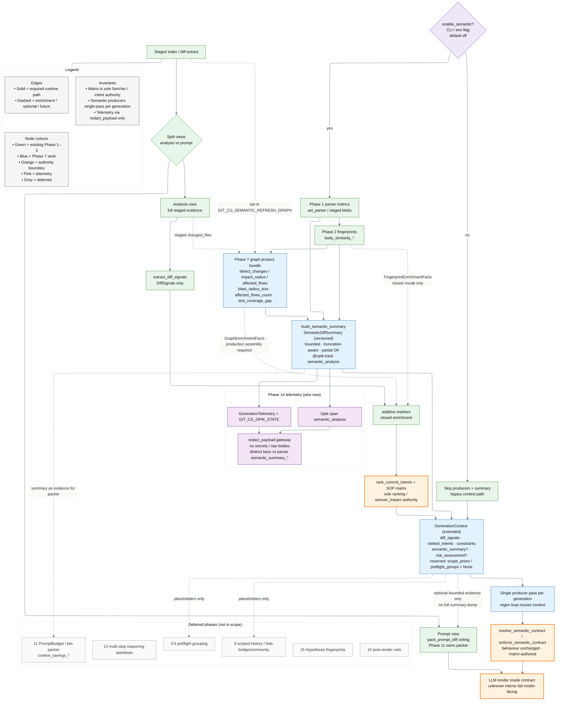
```mermaid
%%{
  init: {
    'theme': 'base',
    'themeVariables': {
      'primaryColor': '#f6f8fa',
      'primaryBorderColor': '#d0d7de',
      'primaryTextColor': '#24292f',
      'lineColor': '#57606a'
    },
    'flowchart': {
      'defaultRenderer': 'elk'
    },
    'state': {
      'defaultRenderer': 'elk'
    }
  }
}%%
flowchart TD
  classDef existing fill:#e8f5e9,stroke:#2e7d32,color:#111,stroke-width:1px
  classDef phase7 fill:#e3f2fd,stroke:#1565c0,color:#111,stroke-width:1px
  classDef authority fill:#fff3e0,stroke:#ef6c00,color:#111,stroke-width:2px
  classDef telemetry fill:#f3e5f5,stroke:#6a1b9a,color:#111,stroke-width:1px
  classDef deferred fill:#fafafa,stroke:#9e9e9e,color:#333,stroke-width:1px
  classDef decision fill:#ede7f6,stroke:#5e35b1,color:#111,stroke-width:1px
  classDef keybox fill:#f5f5f5,stroke:#616161,color:#111,stroke-width:1px

  %% Entry + Phase 3 split
  STAGED["Staged index / diff extract"]:::existing
  SPLIT{"Split views<br/>analysis vs prompt"}:::existing
  ANALYSIS["Analysis view<br/>full staged evidence"]:::existing
  PROMPT["Prompt view<br/>pack_prompt_diff ceiling<br/>Phase 11 owns packer"]:::existing

  STAGED --> SPLIT --> ANALYSIS
  SPLIT --> PROMPT

  %% Deterministic authority path
  SIG["extract_diff_signals<br/>DiffSignals only"]:::existing
  MARK["additive markers<br/>closed enrichment"]:::existing
  RANK["rank_commit_intents + SOP matrix<br/>sole ranking / semver_impact authority"]:::authority

  ANALYSIS --> SIG --> MARK --> RANK

  %% Semantic producers (once) + flag
  FLAG{"enable_semantic?<br/>CLI / env flag<br/>default off"}:::decision
  P1["Phase 1 parser metrics<br/>ast_parser / staged blobs"]:::existing
  P2["Phase 2 fingerprints<br/>body_similarity_*"]:::existing
  GQ["Phase 7 graph product bundle<br/>detect_changes / impact_radius / affected_flows<br/>blast_radius_size · affected_flows_count · test_coverage_gap"]:::phase7

  FLAG -->|yes| P1 --> P2 --> GQ
  FLAG -->|no| SKIP["Skip producers + summary<br/>legacy context path"]:::existing

  ANALYSIS -.->|staged changed_files| GQ
  STAGED -.->|opt-in GIT_CG_SEMANTIC_REFRESH_GRAPH| GQ

  P2 -.->|FingerprintEnrichmentFacts<br/>closed vocab only| MARK
  GQ -.->|GraphEnrichmentFacts<br/>production assembly required| MARK

  %% Summary + context + contract
  SUM["build_semantic_summary<br/>SemanticDiffSummary (versioned)<br/>bounded · truncation-aware · partial OK<br/>@opik.track semantic_analysis"]:::phase7
  CTX["GenerationContext (extended)<br/>diff_signals · ranked_intents · constraints<br/>semantic_summary? · risk_assessment?<br/>reserved: scope_priors / preflight_groups = None"]:::phase7
  ONCE["Single producer pass per generation<br/>regen loop reuses context"]:::phase7
  CONTRACT["resolve_semantic_contract / enforce_semantic_contract<br/>behaviour unchanged · matrix-authored"]:::authority
  LLM["LLM render inside contract<br/>unknown intents fail model-facing"]:::authority

  P1 --> SUM
  P2 --> SUM
  GQ --> SUM
  SUM --> CTX --> ONCE
  SKIP --> CTX
  RANK --> CTX

  ONCE --> CONTRACT --> LLM
  PROMPT --> LLM
  CTX -.->|optional bounded evidence only<br/>no full summary dump| PROMPT

  %% Telemetry
  subgraph TEL["Phase 14 telemetry (wire now)"]
    direction LR
    SPAN["Opik span semantic_analysis"]:::telemetry
    STATE["GenerationTelemetry + GIT_CG_OPIK_STATE"]:::telemetry
    REDACT["redact_payload gateway<br/>no secrets / raw bodies<br/>distinct keys vs parser semantic_summary_*"]:::telemetry
  end

  SUM --> SPAN
  SUM --> STATE
  SPAN --> REDACT
  STATE --> REDACT

  %% Deferred
  subgraph DEF["Deferred phases (not in scope)"]
    direction LR
    P05["0.5 preflight grouping"]:::deferred
    P9["9 scoped history / hub-bridge/community"]:::deferred
    P10["10 post-render veto"]:::deferred
    P11["11 PromptBudget / bin-packer<br/>context_savings_*"]:::deferred
    P13["13 multi-step reasoning speedups"]:::deferred
    P15["15 Hypothesis fingerprints"]:::deferred
  end

  SUM -.->|summary as evidence for packer| P11
  CTX -.->|placeholders only| P05
  CTX -.->|placeholders only| P9

  %% Mini-legend
  subgraph KEY["Legend"]
    direction TB
    K1["Node colours<br/>• Green = existing Phase 1–3<br/>• Blue = Phase 7 work<br/>• Orange = authority boundary<br/>• Pink = telemetry<br/>• Grey = deferred"]:::keybox
    K2["Edges<br/>• Solid = required runtime path<br/>• Dashed = enrichment / optional / future"]:::keybox
    K3["Invariants<br/>• Matrix is sole SemVer / intent authority<br/>• Semantic producers single-pass per generation<br/>• Telemetry via redact_payload only"]:::keybox
  end

  %% Layout
  STAGED --- KEY

  %% Classes for legend are already keybox
```

---

## Option 6 – “Nested containers” (Codespaces-style)

Uses big boxes-within-boxes to show containment: overall pipeline → deterministic core vs semantic, with Phase 7 nested.

```mermaid
%%{
  init: {
    'theme': 'base',
    'themeVariables': {
      'primaryColor': '#f6f8fa',
      'primaryBorderColor': '#d0d7de',
      'primaryTextColor': '#24292f',
      'lineColor': '#57606a'
    },
    'flowchart': {
      'defaultRenderer': 'elk'
    },
    'state': {
      'defaultRenderer': 'elk'
    }
  }
}%%
flowchart LR
  classDef container fill:#fafafa,stroke:#9e9e9e,color:#111,stroke-width:1.5px
  classDef subcontainer fill:#f5f5f5,stroke:#bdbdbd,color:#111,stroke-width:1px
  classDef existing fill:#e8f5e9,stroke:#2e7d32,color:#111,stroke-width:1px
  classDef phase7 fill:#e3f2fd,stroke:#1565c0,color:#111,stroke-width:1px
  classDef authority fill:#fff3e0,stroke:#ef6c00,color:#111,stroke-width:2px
  classDef telemetry fill:#f3e5f5,stroke:#6a1b9a,color:#111,stroke-width:1px
  classDef deferred fill:#eeeeee,stroke:#9e9e9e,color:#555,stroke-width:1px
  classDef decision fill:#ede7f6,stroke:#5e35b1,color:#111,stroke-width:1px

  %% Outer container — full generation pipeline
  subgraph PIPELINE["Git Commit Generator · semantic path within overall generation pipeline"]
    direction LR

    %% Left: Inputs / staged diff
    subgraph INPUTS["Inputs"]
      direction TB
      STAGED["Staged index / diff extract<br/>shadow_workspace only if disk tools need index-only tree"]:::existing
    end

    %% Middle: Core engine (deterministic + semantic)
    subgraph CORE["Core engine"]
      direction TB

      %% Deterministic core (Phase 3)
      subgraph DET["Deterministic authority (Phase 3 · always on)"]
        direction TB
        SPLIT{"Split views<br/>analysis vs prompt<br/>ranker-safety"}:::existing
        ANALYSIS["Analysis view<br/>full staged evidence<br/>no blind char-slice"]:::existing
        PROMPT["Prompt view<br/>pack_prompt_diff ceiling<br/>Phase 11 owns packer"]:::existing
        SIG["extract_diff_signals<br/>DiffSignals heuristics only"]:::existing
        MARK["collect_active_markers<br/>flat additive if-accumulation"]:::existing
        RANK["rank_commit_intents + SOP matrix<br/>sole ranking / semver_impact authority"]:::authority

        STAGED --> SPLIT
        SPLIT --> ANALYSIS --> SIG --> MARK --> RANK
        SPLIT --> PROMPT
      end

      %% Semantic context (Phase 7) nested as a subcontainer
      subgraph SEMANTIC["Semantic context (Phase 7) · nested on top of existing producers"]
        direction TB

        FLAG{"enable_semantic?<br/>CLI / GIT_CG_ENABLE_SEMANTIC<br/>default off"}:::decision

        subgraph PRODUCERS["Producers (reuse existing substrate · single pass)"]
          direction TB
          P1["Phase 1 parser<br/>ast_parser + staged blobs<br/>semantic_parser_* metrics + fallback reasons"]:::existing
          P2["Phase 2 fingerprints<br/>HEAD↔index compare<br/>body_similarity_min/avg · class_counts"]:::existing
          GQ["Phase 7 graph product bundle<br/>extend graph_context (no new CRG client)<br/>detect_changes · impact_radius · affected_flows<br/>blast_radius_size · affected_flows_count · test_coverage_gap"]:::phase7

          FLAG -->|yes| P1 --> P2 --> GQ
        end

        FLAG -->|no| SKIP["Skip producers + summary<br/>legacy context path<br/>no semantic_analysis span"]:::existing

        ANALYSIS -.->|staged changed_files| GQ
        STAGED -.->|opt-in GIT_CG_SEMANTIC_REFRESH_GRAPH| GQ

        %% Summary + context object inside this container
        SUM["build_semantic_summary<br/>SemanticDiffSummary (schema_versioned)<br/>bounded · truncation-aware · partial OK<br/>@opik.track name='semantic_analysis'"]:::phase7
        CTX["GenerationContext (extended)<br/>diff_signals · ranked_intents · constraints<br/>semantic_summary? · risk_assessment?<br/>reserved scope_priors / preflight_groups = None"]:::phase7
        ONCE["Single producer pass per generation<br/>regen loop reuses context<br/>no second parse/fingerprint"]:::phase7

        P1 --> SUM
        P2 --> SUM
        GQ --> SUM
        SUM --> CTX --> ONCE
        SKIP --> CTX
        RANK --> CTX

        %% Enrichment tapping into deterministic markers
        P2 -.->|FingerprintEnrichmentFacts<br/>closed vocab only| MARK
        GQ -.->|GraphEnrichmentFacts<br/>production assembly required<br/>or documented single-model replacement| MARK
      end
    end

    %% Right: consumers + telemetry
    subgraph OUTPUTS["Consumers + telemetry"]
      direction TB

      subgraph CONTRACT_ZONE["Contract + LLM"]
        direction TB
        CONTRACT["resolve_semantic_contract / enforce_semantic_contract<br/>behaviour unchanged · matrix-authored"]:::authority
        LLM["LLM / Instructor render<br/>wording only inside contract<br/>unknown intents fail model-facing"]:::authority
        ONCE --> CONTRACT --> LLM
        PROMPT --> LLM
        CTX -.->|optional bounded evidence only<br/>no full summary dump<br/>not a Phase 11 packer| PROMPT
      end

      subgraph TEL["Phase 14 telemetry (wire-now)"]
        direction TB
        SPAN["Opik span semantic_analysis<br/>ignore bulky / sensitive args"]:::telemetry
        STATE["GenerationTelemetry + GIT_CG_OPIK_STATE<br/>state + allowlists parity"]:::telemetry
        REDACT["redact_payload gateway<br/>no secrets / raw source bodies<br/>distinct keys vs parser semantic_summary_*"]:::telemetry
        SUM --> SPAN
        SUM --> STATE
        SPAN --> REDACT
        STATE --> REDACT
      end
    end
  end

  %% Deferred work box off to the side
  subgraph DEF["Deferred phases (explicitly not this issue)"]
    direction TB
    P05["Phase 0.5 preflight grouping"]:::deferred
    P9["Phase 9 scoped history / hub-bridge/community"]:::deferred
    P10["Phase 10 post-render veto"]:::deferred
    P11["Phase 11 PromptBudget / token bin-packer<br/>context_savings_*"]:::deferred
    P13["Phase 13 multi-step reasoning speedups"]:::deferred
    P15["Phase 15 Hypothesis fingerprint properties"]:::deferred
  end

  SUM -.->|summary as later packer evidence| P11
  CTX -.->|placeholders only| P05
  CTX -.->|placeholders only| P9

  class PIPELINE,CORE,SEMANTIC,INPUTS,OUTPUTS,PRODUCERS,CONTRACT_ZONE,TEL,DEF container
```

---

## Option 7 – “Left-to-right story” with milestone flags

Good if you want a very linear “story” with small phase callouts.

```mermaid
%%{
  init: {
    'theme': 'base',
    'themeVariables': {
      'primaryColor': '#f6f8fa',
      'primaryBorderColor': '#d0d7de',
      'primaryTextColor': '#24292f',
      'lineColor': '#57606a'
    },
    'flowchart': {
      'defaultRenderer': 'elk'
    },
    'state': {
      'defaultRenderer': 'elk'
    }
  }
}%%
flowchart LR
  classDef existing fill:#e8f5e9,stroke:#2e7d32,color:#111,stroke-width:1px
  classDef phase7 fill:#e3f2fd,stroke:#1565c0,color:#111,stroke-width:1px
  classDef authority fill:#fff3e0,stroke:#ef6c00,color:#111,stroke-width:2px
  classDef telemetry fill:#f3e5f5,stroke:#6a1b9a,color:#111,stroke-width:1px
  classDef deferred fill:#fafafa,stroke:#9e9e9e,color:#333,stroke-width:1px
  classDef phaseBadge fill:#eeeeee,stroke:#9e9e9e,color:#555,stroke-width:1px
  classDef decision fill:#ede7f6,stroke:#5e35b1,color:#111,stroke-width:1px

  %% Phase badges (small labels)
  P1B["Phase 1<br/>parsers"]:::phaseBadge
  P2B["Phase 2<br/>fingerprints"]:::phaseBadge
  P3B["Phase 3<br/>authority"]:::phaseBadge
  P7B["Phase 7<br/>semantic context"]:::phaseBadge
  P14B["Phase 14<br/>telemetry"]:::phaseBadge

  %% Main left-to-right story
  STAGED["Staged index / diff extract"]:::existing
  SPLIT{"Split views<br/>analysis vs prompt"}:::existing
  ANALYSIS["Analysis view<br/>full staged evidence"]:::existing
  SIG["extract_diff_signals<br/>DiffSignals only"]:::existing
  MARK["additive markers<br/>closed enrichment"]:::existing
  RANK["rank_commit_intents + SOP matrix<br/>sole ranking / semver_impact authority"]:::authority

  STAGED --> SPLIT --> ANALYSIS --> SIG --> MARK --> RANK

  %% Semantic path branching off
  FLAG{"enable_semantic?<br/>default off"}:::decision
  P1["Phase 1 parser (metrics only)<br/>ast_parser + staged blobs"]:::existing
  P2["Phase 2 fingerprints<br/>HEAD↔index · body_similarity_*"]:::existing
  GQ["Phase 7 graph bundle<br/>detect_changes / impact_radius / affected_flows<br/>blast_radius_size · affected_flows_count · test_coverage_gap"]:::phase7

  ANALYSIS -.->|staged changed_files| FLAG
  FLAG -->|yes| P1 --> P2 --> GQ
  FLAG -->|no| SKIP["Skip semantic producers + summary<br/>legacy context path"]:::existing

  STAGED -.->|opt-in GIT_CG_SEMANTIC_REFRESH_GRAPH| GQ

  %% Summary + context
  SUM["build_semantic_summary<br/>SemanticDiffSummary (versioned)<br/>bounded / truncation-aware / partial OK"]:::phase7
  CTX["GenerationContext (extended)<br/>diff_signals · ranked_intents · constraints<br/>semantic_summary? · risk_assessment?"]:::phase7
  ONCE["Single producer pass per generation<br/>regen loop reuses context"]:::phase7

  P1 --> SUM
  P2 --> SUM
  GQ --> SUM
  SUM --> CTX --> ONCE
  SKIP --> CTX
  RANK --> CTX

  %% Enrichment into Phase 3
  P2 -.->|FingerprintEnrichmentFacts<br/>closed vocab only| MARK
  GQ -.->|GraphEnrichmentFacts<br/>production assembly required| MARK

  %% Contract + LLM
  PROMPT["Prompt view<br/>pack_prompt_diff ceiling<br/>Phase 11 owns packer"]:::existing
  LLM["LLM / Instructor render<br/>inside semantic contract"]:::authority
  CONTRACT["resolve_semantic_contract / enforce_semantic_contract<br/>behaviour unchanged · matrix-authored"]:::authority

  SPLIT --> PROMPT
  CTX --> CONTRACT --> LLM
  PROMPT --> LLM
  CTX -.->|optional bounded evidence only| PROMPT

  %% Telemetry path
  SPAN["Opik span semantic_analysis"]:::telemetry
  STATE["GenerationTelemetry + GIT_CG_OPIK_STATE"]:::telemetry
  REDACT["redact_payload gateway<br/>no secrets / raw bodies"]:::telemetry

  SUM --> SPAN
  SUM --> STATE
  SPAN --> REDACT
  STATE --> REDACT

  %% Deferred work
  subgraph DEF["Deferred (not this issue)"]
    direction TB
    P05["0.5 preflight grouping"]:::deferred
    P9["9 scoped history / hub-bridge/community"]:::deferred
    P10["10 post-render veto"]:::deferred
    P11["11 PromptBudget / bin-packer<br/>context_savings_*"]:::deferred
    P13["13 multi-step reasoning speedups"]:::deferred
    P15["15 Hypothesis fingerprints"]:::deferred
  end

  SUM -.->|summary as later packer evidence| P11
  CTX -.->|placeholders only| P05
  CTX -.->|placeholders only| P9

  %% Phase badges attached as annotations
  STAGED --- P1B
  SIG --- P3B
  P2 --- P2B
  GQ --- P7B
  SPAN --- P14B
```

---

## Option 8 – “Two towers” (Deterministic vs Semantic)

Two vertical stacks side‑by‑side, meeting at `GenerationContext`.

```mermaid
%%{
  init: {
    'theme': 'base',
    'themeVariables': {
      'primaryColor': '#f6f8fa',
      'primaryBorderColor': '#d0d7de',
      'primaryTextColor': '#24292f',
      'lineColor': '#57606a'
    },
    'flowchart': {
      'defaultRenderer': 'elk'
    },
    'state': {
      'defaultRenderer': 'elk'
    }
  }
}%%
flowchart LR
  classDef tower fill:#fafafa,stroke:#bdbdbd,color:#111,stroke-width:1.5px
  classDef existing fill:#e8f5e9,stroke:#2e7d32,color:#111,stroke-width:1px
  classDef phase7 fill:#e3f2fd,stroke:#1565c0,color:#111,stroke-width:1px
  classDef authority fill:#fff3e0,stroke:#ef6c00,color:#111,stroke-width:2px
  classDef telemetry fill:#f3e5f5,stroke:#6a1b9a,color:#111,stroke-width:1px
  classDef deferred fill:#fafafa,stroke:#9e9e9e,color:#333,stroke-width:1px
  classDef decision fill:#ede7f6,stroke:#5e35b1,color:#111,stroke-width:1px

  %% Tower 1 – Deterministic path
  subgraph DET["Tower 1 — Deterministic authority (Phase 3)"]
    direction TB
    STAGED["Staged index / diff extract"]:::existing
    SPLIT{"Split views<br/>analysis vs prompt"}:::existing
    ANALYSIS["Analysis view<br/>full staged evidence"]:::existing
    SIG["extract_diff_signals<br/>DiffSignals heuristics only"]:::existing
    MARK["collect_active_markers<br/>flat additive if-accumulation"]:::existing
    RANK["rank_commit_intents + SOP matrix<br/>sole ranking / semver_impact authority"]:::authority
    PROMPT["Prompt view<br/>pack_prompt_diff ceiling"]:::existing

    STAGED --> SPLIT --> ANALYSIS --> SIG --> MARK --> RANK
    SPLIT --> PROMPT
  end

  %% Tower 2 – Semantic path
  subgraph SEM["Tower 2 — Semantic context (Phase 7)"]
    direction TB
    FLAG{"enable_semantic?<br/>CLI / env flag<br/>default off"}:::decision
    P1["Phase 1 parser metrics<br/>ast_parser / staged blobs"]:::existing
    P2["Phase 2 fingerprints<br/>HEAD↔index compare · body_similarity_*"]:::existing
    GQ["Phase 7 graph product bundle<br/>extend graph_context (no new client)<br/>detect_changes · impact_radius · affected_flows<br/>blast_radius_size · affected_flows_count · test_coverage_gap"]:::phase7
    SUM["build_semantic_summary<br/>SemanticDiffSummary (versioned)<br/>bounded / truncation-aware / partial OK"]:::phase7

    FLAG -->|yes| P1 --> P2 --> GQ --> SUM
    FLAG -->|no| SKIP["Skip producers + summary<br/>legacy context path"]:::existing
  end

  %% Cross‑tower feeds
  ANALYSIS -.->|staged changed_files| GQ
  STAGED -.->|opt-in GIT_CG_SEMANTIC_REFRESH_GRAPH| GQ

  P2 -.->|FingerprintEnrichmentFacts<br/>closed vocab only| MARK
  GQ -.->|GraphEnrichmentFacts<br/>production assembly required| MARK

  %% Shared context + consumers at the base
  CTX["GenerationContext (shared)<br/>diff_signals · ranked_intents · constraints<br/>semantic_summary? · risk_assessment?"]:::phase7
  ONCE["Single producer pass per generation<br/>regen loop reuses context"]:::phase7
  CONTRACT["resolve_semantic_contract / enforce_semantic_contract<br/>behaviour unchanged · matrix-authored"]:::authority
  LLM["LLM / Instructor render<br/>inside semantic contract"]:::authority

  RANK --> CTX
  SKIP --> CTX
  SUM --> CTX --> ONCE
  ONCE --> CONTRACT --> LLM
  PROMPT --> LLM
  CTX -.->|optional bounded evidence only| PROMPT

  %% Telemetry to the side
  subgraph TEL["Telemetry (Phase 14)"]
    direction TB
    SPAN["Opik span semantic_analysis"]:::telemetry
    STATE["GenerationTelemetry + GIT_CG_OPIK_STATE"]:::telemetry
    REDACT["redact_payload gateway<br/>no secrets / raw bodies"]:::telemetry
  end

  SUM --> SPAN
  SUM --> STATE
  SPAN --> REDACT
  STATE --> REDACT

  %% Deferred zone
  subgraph DEF["Deferred phases (not this issue)"]
    direction TB
    P05["0.5 preflight grouping"]:::deferred
    P9["9 scoped history / hub-bridge/community"]:::deferred
    P10["10 post-render veto"]:::deferred
    P11["11 PromptBudget / bin-packer<br/>context_savings_*"]:::deferred
    P13["13 multi-step reasoning speedups"]:::deferred
    P15["15 Hypothesis fingerprints"]:::deferred
  end

  SUM -.->|summary as evidence object| P11
  CTX -.->|placeholders only| P05
  CTX -.->|placeholders only| P9

  class DET,SEM,TEL,DEF tower
```

---

## Option 9 – “Matrix” layout (rows = concern, columns = stage)

Organizes by concern: deterministic, semantic, contract, telemetry.

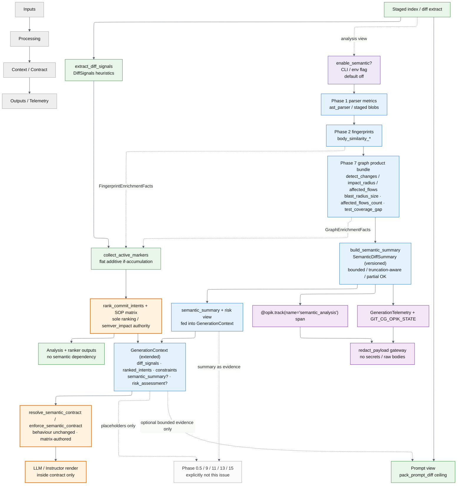
```mermaid
%%{
  init: {
    'theme': 'base',
    'themeVariables': {
      'primaryColor': '#f6f8fa',
      'primaryBorderColor': '#d0d7de',
      'primaryTextColor': '#24292f',
      'lineColor': '#57606a'
    },
    'flowchart': {
      'defaultRenderer': 'elk'
    },
    'state': {
      'defaultRenderer': 'elk'
    }
  }
}%%
flowchart TD
  classDef colTitle fill:#eeeeee,stroke:#9e9e9e,color:#111,stroke-width:1px
  classDef deterministic fill:#e8f5e9,stroke:#2e7d32,color:#111,stroke-width:1px
  classDef phase7 fill:#e3f2fd,stroke:#1565c0,color:#111,stroke-width:1px
  classDef authority fill:#fff3e0,stroke:#ef6c00,color:#111,stroke-width:2px
  classDef telemetry fill:#f3e5f5,stroke:#6a1b9a,color:#111,stroke-width:1px
  classDef deferred fill:#fafafa,stroke:#9e9e9e,color:#333,stroke-width:1px
  classDef decision fill:#ede7f6,stroke:#5e35b1,color:#111,stroke-width:1px

  %% Column titles
  C_IN["Inputs"]:::colTitle
  C_PROC["Processing"]:::colTitle
  C_CTX["Context / Contract"]:::colTitle
  C_OUT["Outputs / Telemetry"]:::colTitle

  %% Row 1: Deterministic
  D_IN["Staged index / diff extract"]:::deterministic
  D_PROC1["extract_diff_signals<br/>DiffSignals heuristics"]:::deterministic
  D_PROC2["collect_active_markers<br/>flat additive if-accumulation"]:::deterministic
  D_CTX["rank_commit_intents + SOP matrix<br/>sole ranking / semver_impact authority"]:::authority
  D_OUT["Analysis + ranker outputs<br/>no semantic dependency"]:::deterministic

  %% Row 2: Semantic producers
  S_IN["enable_semantic?<br/>CLI / env flag<br/>default off"]:::decision
  S_PROC1["Phase 1 parser metrics<br/>ast_parser / staged blobs"]:::phase7
  S_PROC2["Phase 2 fingerprints<br/>body_similarity_*"]:::phase7
  S_PROC3["Phase 7 graph product bundle<br/>detect_changes / impact_radius / affected_flows<br/>blast_radius_size · affected_flows_count · test_coverage_gap"]:::phase7
  S_CTX["build_semantic_summary<br/>SemanticDiffSummary (versioned)<br/>bounded / truncation-aware / partial OK"]:::phase7
  S_OUT["semantic_summary + risk view<br/>fed into GenerationContext"]:::phase7

  %% Row 3: Contract + LLM
  C_PROC1["GenerationContext (extended)<br/>diff_signals · ranked_intents · constraints<br/>semantic_summary? · risk_assessment?"]:::phase7
  C_PROC2["resolve_semantic_contract / enforce_semantic_contract<br/>behaviour unchanged · matrix-authored"]:::authority
  C_OUT1["LLM / Instructor render<br/>inside contract only"]:::authority

  %% Row 4: Telemetry
  T_PROC1["@opik.track(name='semantic_analysis') span"]:::telemetry
  T_PROC2["GenerationTelemetry + GIT_CG_OPIK_STATE"]:::telemetry
  T_OUT["redact_payload gateway<br/>no secrets / raw bodies"]:::telemetry

  %% Row 5: Deferred
  DF_PROC["Phase 0.5 / 9 / 11 / 13 / 15<br/>explicitly not this issue"]:::deferred

  %% Column linking
  C_IN --> C_PROC --> C_CTX --> C_OUT

  %% Deterministic row edges
  D_IN --> D_PROC1 --> D_PROC2 --> D_CTX --> D_OUT

  %% Semantic row edges
  D_IN -.->|analysis view| S_IN
  S_IN --> S_PROC1 --> S_PROC2 --> S_PROC3 --> S_CTX --> S_OUT

  %% Enrichment edges into deterministic markers
  S_PROC2 -.->|FingerprintEnrichmentFacts| D_PROC2
  S_PROC3 -.->|GraphEnrichmentFacts| D_PROC2

  %% Context + contract row
  D_CTX --> C_PROC1
  S_OUT --> C_PROC1
  C_PROC1 --> C_PROC2 --> C_OUT1

  %% Telemetry row
  S_CTX --> T_PROC1
  S_CTX --> T_PROC2
  T_PROC1 --> T_OUT
  T_PROC2 --> T_OUT

  %% Deferred
  S_OUT -.->|summary as evidence| DF_PROC
  C_PROC1 -.->|placeholders only| DF_PROC

  %% Prompt path (not fully expanded, but indicated)
  P_PROMPT["Prompt view<br/>pack_prompt_diff ceiling"]:::deterministic
  D_IN --> P_PROMPT
  C_PROC1 -.->|optional bounded evidence only| P_PROMPT
```

---

## Option 10 – “Compact blocks + clear legend” (very scannable)

Very compact, more like an “exec slide” with a small legend baked in.

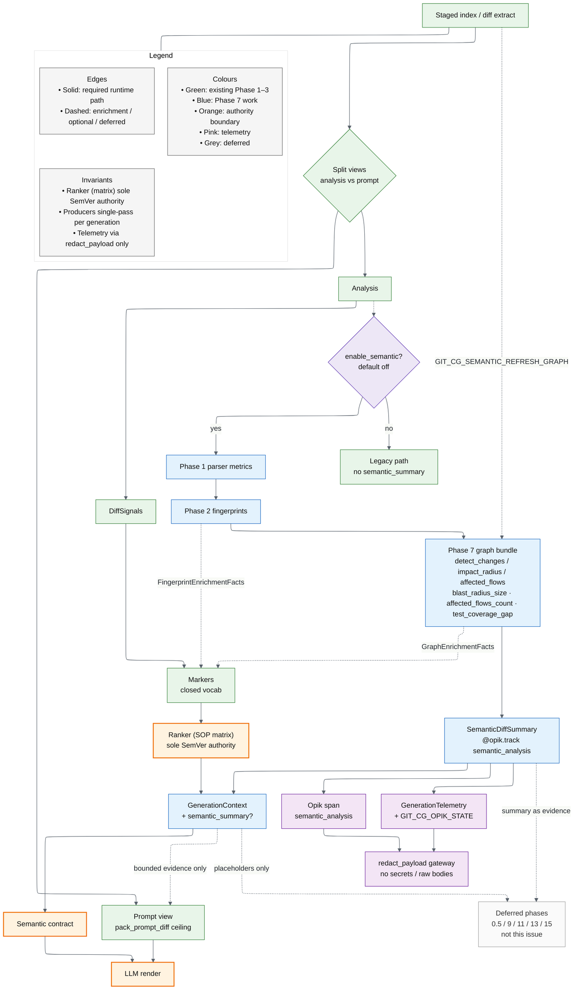
```mermaid
%%{
  init: {
    'theme': 'base',
    'themeVariables': {
      'primaryColor': '#f6f8fa',
      'primaryBorderColor': '#d0d7de',
      'primaryTextColor': '#24292f',
      'lineColor': '#57606a'
    },
    'flowchart': {
      'defaultRenderer': 'elk'
    },
    'state': {
      'defaultRenderer': 'elk'
    }
  }
}%%
flowchart TD
  classDef existing fill:#e8f5e9,stroke:#2e7d32,color:#111,stroke-width:1px
  classDef phase7 fill:#e3f2fd,stroke:#1565c0,color:#111,stroke-width:1px
  classDef authority fill:#fff3e0,stroke:#ef6c00,color:#111,stroke-width:2px
  classDef telemetry fill:#f3e5f5,stroke:#6a1b9a,color:#111,stroke-width:1px
  classDef deferred fill:#fafafa,stroke:#9e9e9e,color:#333,stroke-width:1px
  classDef decision fill:#ede7f6,stroke:#5e35b1,color:#111,stroke-width:1px
  classDef keybox fill:#f5f5f5,stroke:#616161,color:#111,stroke-width:1px

  %% Core flow (top row)
  STAGED["Staged index / diff extract"]:::existing
  SPLIT{"Split views<br/>analysis vs prompt"}:::existing
  ANALYSIS["Analysis"]:::existing
  SIG["DiffSignals"]:::existing
  MARK["Markers<br/>closed vocab"]:::existing
  RANK["Ranker (SOP matrix)<br/>sole SemVer authority"]:::authority
  CTX["GenerationContext<br/>+ semantic_summary?"]:::phase7
  CONTRACT["Semantic contract"]:::authority
  LLM["LLM render"]:::authority

  STAGED --> SPLIT --> ANALYSIS --> SIG --> MARK --> RANK --> CTX --> CONTRACT --> LLM

  %% Prompt
  PROMPT["Prompt view<br/>pack_prompt_diff ceiling"]:::existing
  SPLIT --> PROMPT
  CTX -.->|bounded evidence only| PROMPT
  PROMPT --> LLM

  %% Semantic branch
  FLAG{"enable_semantic?<br/>default off"}:::decision
  P1["Phase 1 parser metrics"]:::phase7
  P2["Phase 2 fingerprints"]:::phase7
  GQ["Phase 7 graph bundle<br/>detect_changes / impact_radius / affected_flows<br/>blast_radius_size · affected_flows_count · test_coverage_gap"]:::phase7
  SUM["SemanticDiffSummary<br/>@opik.track semantic_analysis"]:::phase7

  ANALYSIS -.-> FLAG
  FLAG -->|yes| P1 --> P2 --> GQ --> SUM --> CTX
  FLAG -->|no| SKIP["Legacy path<br/>no semantic_summary"]:::existing

  STAGED -.->|GIT_CG_SEMANTIC_REFRESH_GRAPH| GQ

  %% Enrichment edges
  P2 -.->|FingerprintEnrichmentFacts| MARK
  GQ -.->|GraphEnrichmentFacts| MARK

  %% Telemetry
  SPAN["Opik span<br/>semantic_analysis"]:::telemetry
  STATE["GenerationTelemetry<br/>+ GIT_CG_OPIK_STATE"]:::telemetry
  REDACT["redact_payload gateway<br/>no secrets / raw bodies"]:::telemetry

  SUM --> SPAN
  SUM --> STATE
  SPAN --> REDACT
  STATE --> REDACT

  %% Deferred block
  DEF["Deferred phases<br/>0.5 / 9 / 11 / 13 / 15<br/>not this issue"]:::deferred
  SUM -.->|summary as evidence| DEF
  CTX -.->|placeholders only| DEF

  %% Legend
  subgraph LEGEND["Legend"]
    direction TB
    L1["Colours<br/>• Green: existing Phase 1–3<br/>• Blue: Phase 7 work<br/>• Orange: authority boundary<br/>• Pink: telemetry<br/>• Grey: deferred"]:::keybox
    L2["Edges<br/>• Solid: required runtime path<br/>• Dashed: enrichment / optional / deferred"]:::keybox
    L3["Invariants<br/>• Ranker (matrix) sole SemVer authority<br/>• Producers single-pass per generation<br/>• Telemetry via redact_payload only"]:::keybox
  end

  STAGED --- LEGEND
```

---

## Option 11 – “Strict stack” (very linear top‑down)

Emphasizes the vertical pipeline from staged diff → deterministic → semantic → contract → telemetry → deferred.

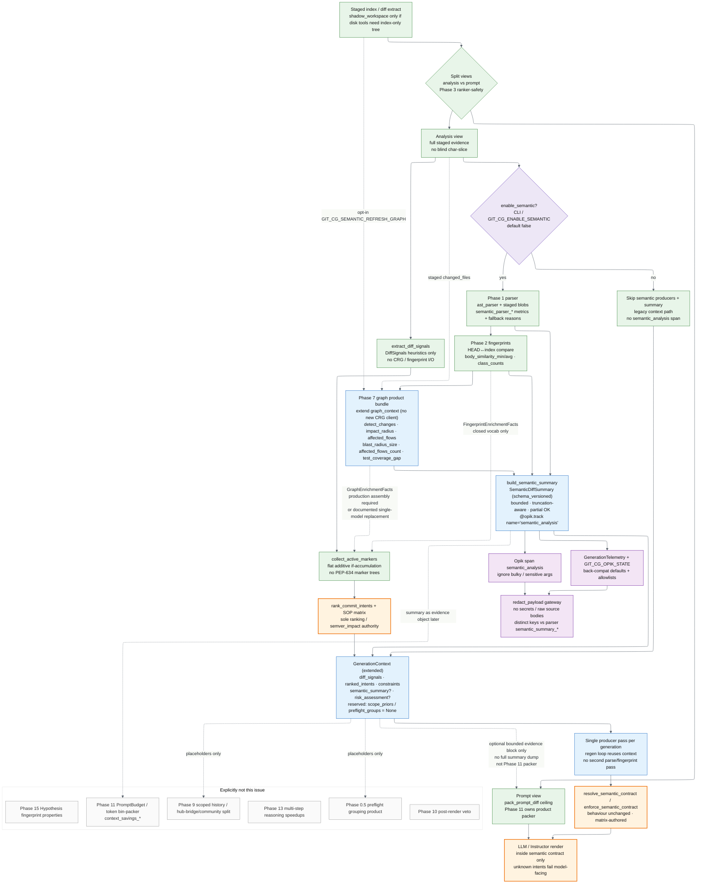
```mermaid
%%{
  init: {
    'theme': 'base',
    'themeVariables': {
      'primaryColor': '#f6f8fa',
      'primaryBorderColor': '#d0d7de',
      'primaryTextColor': '#24292f',
      'lineColor': '#57606a'
    },
    'flowchart': {
      'defaultRenderer': 'elk'
    },
    'state': {
      'defaultRenderer': 'elk'
    }
  }
}%%
flowchart TD
  %% Styles
  classDef existing fill:#e8f5e9,stroke:#2e7d32,color:#111,stroke-width:1px
  classDef phase7 fill:#e3f2fd,stroke:#1565c0,color:#111,stroke-width:1px
  classDef authority fill:#fff3e0,stroke:#ef6c00,color:#111,stroke-width:2px
  classDef telemetry fill:#f3e5f5,stroke:#6a1b9a,color:#111,stroke-width:1px
  classDef deferred fill:#fafafa,stroke:#9e9e9e,color:#333,stroke-width:1px
  classDef decision fill:#ede7f6,stroke:#5e35b1,color:#111,stroke-width:1px

  %% 1. Inputs and view split
  STAGED["Staged index / diff extract<br/>shadow_workspace only if disk tools need index-only tree"]:::existing
  SPLIT{"Split views<br/>analysis vs prompt<br/>Phase 3 ranker-safety"}:::existing
  ANALYSIS["Analysis view<br/>full staged evidence<br/>no blind char-slice"]:::existing
  PROMPT["Prompt view<br/>pack_prompt_diff ceiling<br/>Phase 11 owns product packer"]:::existing

  STAGED --> SPLIT --> ANALYSIS
  SPLIT --> PROMPT

  %% 2. Deterministic authority (Phase 3)
  SIG["extract_diff_signals<br/>DiffSignals heuristics only<br/>no CRG / fingerprint I/O"]:::existing
  MARK["collect_active_markers<br/>flat additive if-accumulation<br/>no PEP-634 marker trees"]:::existing
  RANK["rank_commit_intents + SOP matrix<br/>sole ranking / semver_impact authority"]:::authority

  ANALYSIS --> SIG --> MARK --> RANK

  %% 3. Semantic producers (Phase 1–2–7) · single pass
  FLAG{"enable_semantic?<br/>CLI / GIT_CG_ENABLE_SEMANTIC<br/>default false"}:::decision
  P1["Phase 1 parser<br/>ast_parser + staged blobs<br/>semantic_parser_* metrics + fallback reasons"]:::existing
  P2["Phase 2 fingerprints<br/>HEAD↔index compare<br/>body_similarity_min/avg · class_counts"]:::existing
  GQ["Phase 7 graph product bundle<br/>extend graph_context (no new CRG client)<br/>detect_changes · impact_radius · affected_flows<br/>blast_radius_size · affected_flows_count · test_coverage_gap"]:::phase7
  SKIP["Skip semantic producers + summary<br/>legacy context path<br/>no semantic_analysis span"]:::existing

  ANALYSIS --> FLAG
  FLAG -->|yes| P1 --> P2 --> GQ
  FLAG -->|no| SKIP

  STAGED -.->|opt-in GIT_CG_SEMANTIC_REFRESH_GRAPH| GQ
  ANALYSIS -.->|staged changed_files| GQ

  %% enrichment into Phase 3 markers
  P2 -.->|FingerprintEnrichmentFacts<br/>closed vocab only| MARK
  GQ -.->|GraphEnrichmentFacts<br/>production assembly required<br/>or documented single-model replacement| MARK

  %% 4. Summary + context (Phase 7 product)
  SUM["build_semantic_summary<br/>SemanticDiffSummary (schema_versioned)<br/>bounded · truncation-aware · partial OK<br/>@opik.track name='semantic_analysis'"]:::phase7
  CTX["GenerationContext (extended)<br/>diff_signals · ranked_intents · constraints<br/>semantic_summary? · risk_assessment?<br/>reserved: scope_priors / preflight_groups = None"]:::phase7
  ONCE["Single producer pass per generation<br/>regen loop reuses context<br/>no second parse/fingerprint pass"]:::phase7

  P1 --> SUM
  P2 --> SUM
  GQ --> SUM
  SUM --> CTX --> ONCE
  SKIP --> CTX
  RANK --> CTX

  %% 5. Contract + LLM
  CONTRACT["resolve_semantic_contract / enforce_semantic_contract<br/>behaviour unchanged · matrix-authored"]:::authority
  LLM["LLM / Instructor render<br/>inside semantic contract only<br/>unknown intents fail model-facing"]:::authority

  ONCE --> CONTRACT --> LLM
  PROMPT --> LLM
  CTX -.->|optional bounded evidence block only<br/>no full summary dump<br/>not Phase 11 packer| PROMPT

  %% 6. Telemetry (Phase 14 wire-now · Phase 7 fields)
  SPAN["Opik span semantic_analysis<br/>ignore bulky / sensitive args"]:::telemetry
  STATE["GenerationTelemetry + GIT_CG_OPIK_STATE<br/>back-compat defaults + allowlists"]:::telemetry
  REDACT["redact_payload gateway<br/>no secrets / raw source bodies<br/>distinct keys vs parser semantic_summary_*"]:::telemetry

  SUM --> SPAN
  SUM --> STATE
  SPAN --> REDACT
  STATE --> REDACT

  %% 7. Deferred phases (explicitly out of scope)
  subgraph DEF["Explicitly not this issue"]
    direction TB
    P05["Phase 0.5 preflight grouping product"]:::deferred
    P9["Phase 9 scoped history / hub-bridge/community split"]:::deferred
    P10["Phase 10 post-render veto"]:::deferred
    P11["Phase 11 PromptBudget / token bin-packer<br/>context_savings_*"]:::deferred
    P13["Phase 13 multi-step reasoning speedups"]:::deferred
    P15["Phase 15 Hypothesis fingerprint properties"]:::deferred
  end

  SUM -.->|summary as evidence object later| P11
  CTX -.->|placeholders only| P05
  CTX -.->|placeholders only| P9
```

---

## Option 12 – “Three stacked bands” (Deterministic → Semantic → Telemetry)

Three visual bands top‑down: Phase 3, Phase 7, Phase 14 (+ deferred block at bottom).

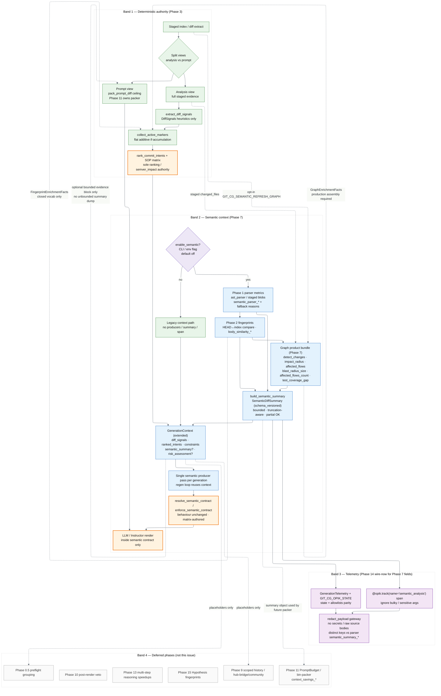
```mermaid
%%{
  init: {
    'theme': 'base',
    'themeVariables': {
      'primaryColor': '#f6f8fa',
      'primaryBorderColor': '#d0d7de',
      'primaryTextColor': '#24292f',
      'lineColor': '#57606a'
    },
    'flowchart': {
      'defaultRenderer': 'elk'
    },
    'state': {
      'defaultRenderer': 'elk'
    }
  }
}%%
flowchart TD
  classDef bandTitle fill:#eeeeee,stroke:#9e9e9e,color:#111,stroke-width:1px
  classDef existing fill:#e8f5e9,stroke:#2e7d32,color:#111,stroke-width:1px
  classDef phase7 fill:#e3f2fd,stroke:#1565c0,color:#111,stroke-width:1px
  classDef authority fill:#fff3e0,stroke:#ef6c00,color:#111,stroke-width:2px
  classDef telemetry fill:#f3e5f5,stroke:#6a1b9a,color:#111,stroke-width:1px
  classDef deferred fill:#fafafa,stroke:#9e9e9e,color:#333,stroke-width:1px
  classDef decision fill:#ede7f6,stroke:#5e35b1,color:#111,stroke-width:1px

  %% Band 1 — Phase 3 deterministic core
  subgraph B1["Band 1 — Deterministic authority (Phase 3)"]
    direction TB
    STAGED["Staged index / diff extract"]:::existing
    SPLIT{"Split views<br/>analysis vs prompt"}:::existing
    ANALYSIS["Analysis view<br/>full staged evidence"]:::existing
    SIG["extract_diff_signals<br/>DiffSignals heuristics only"]:::existing
    MARK["collect_active_markers<br/>flat additive if-accumulation"]:::existing
    RANK["rank_commit_intents + SOP matrix<br/>sole ranking / semver_impact authority"]:::authority
    PROMPT["Prompt view<br/>pack_prompt_diff ceiling<br/>Phase 11 owns packer"]:::existing

    STAGED --> SPLIT --> ANALYSIS --> SIG --> MARK --> RANK
    SPLIT --> PROMPT
  end

  %% Band 2 — Phase 7 semantic context
  subgraph B2["Band 2 — Semantic context (Phase 7)"]
    direction TB
    FLAG{"enable_semantic?<br/>CLI / env flag<br/>default off"}:::decision
    P1["Phase 1 parser metrics<br/>ast_parser / staged blobs<br/>semantic_parser_* + fallback reasons"]:::phase7
    P2["Phase 2 fingerprints<br/>HEAD↔index compare · body_similarity_*"]:::phase7
    GQ["Graph product bundle (Phase 7)<br/>detect_changes · impact_radius · affected_flows<br/>blast_radius_size · affected_flows_count · test_coverage_gap"]:::phase7
    SKIP["Legacy context path<br/>no producers / summary / span"]:::existing

    FLAG -->|yes| P1 --> P2 --> GQ
    FLAG -->|no| SKIP

    ANALYSIS -.->|staged changed_files| GQ
    STAGED -.->|opt-in GIT_CG_SEMANTIC_REFRESH_GRAPH| GQ

    %% enrichment into Phase 3 markers
    P2 -.->|FingerprintEnrichmentFacts<br/>closed vocab only| MARK
    GQ -.->|GraphEnrichmentFacts<br/>production assembly required| MARK

    SUM["build_semantic_summary<br/>SemanticDiffSummary (schema_versioned)<br/>bounded · truncation-aware · partial OK"]:::phase7
    CTX["GenerationContext (extended)<br/>diff_signals · ranked_intents · constraints<br/>semantic_summary? · risk_assessment?"]:::phase7
    ONCE["Single semantic producer pass per generation<br/>regen loop reuses context"]:::phase7

    P1 --> SUM
    P2 --> SUM
    GQ --> SUM
    SUM --> CTX --> ONCE
    SKIP --> CTX
    RANK --> CTX

    CONTRACT["resolve_semantic_contract / enforce_semantic_contract<br/>behaviour unchanged · matrix-authored"]:::authority
    LLM["LLM / Instructor render<br/>inside semantic contract only"]:::authority

    ONCE --> CONTRACT --> LLM
    PROMPT --> LLM
    CTX -.->|optional bounded evidence block only<br/>no unbounded summary dump| PROMPT
  end

  %% Band 3 — Phase 14 telemetry
  subgraph B3["Band 3 — Telemetry (Phase 14 wire-now for Phase 7 fields)"]
    direction TB
    SPAN["@opik.track(name='semantic_analysis') span<br/>ignore bulky / sensitive args"]:::telemetry
    STATE["GenerationTelemetry + GIT_CG_OPIK_STATE<br/>state + allowlists parity"]:::telemetry
    REDACT["redact_payload gateway<br/>no secrets / raw source bodies<br/>distinct keys vs parser semantic_summary_*"]:::telemetry

    SUM --> SPAN
    SUM --> STATE
    SPAN --> REDACT
    STATE --> REDACT
  end

  %% Bottom — Deferred work
  subgraph DEF["Band 4 — Deferred phases (not this issue)"]
    direction TB
    P05["Phase 0.5 preflight grouping"]:::deferred
    P9["Phase 9 scoped history / hub-bridge/community"]:::deferred
    P10["Phase 10 post-render veto"]:::deferred
    P11["Phase 11 PromptBudget / bin-packer<br/>context_savings_*"]:::deferred
    P13["Phase 13 multi-step reasoning speedups"]:::deferred
    P15["Phase 15 Hypothesis fingerprints"]:::deferred
  end

  SUM -.->|summary object used by future packer| P11
  CTX -.->|placeholders only| P05
  CTX -.->|placeholders only| P9
```

---

## Option 13 – “Phase ladder” (each phase as a labeled rung)

Each rung is a phase; semantic context is rung 7.

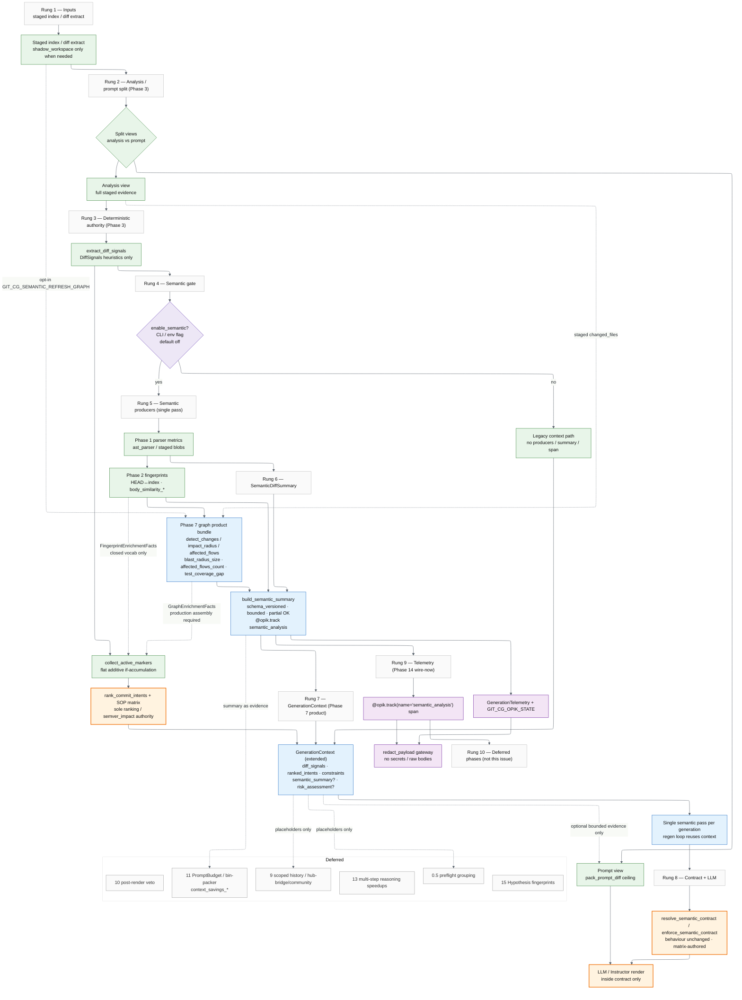
```mermaid
%%{
  init: {
    'theme': 'base',
    'themeVariables': {
      'primaryColor': '#f6f8fa',
      'primaryBorderColor': '#d0d7de',
      'primaryTextColor': '#24292f',
      'lineColor': '#57606a'
    },
    'flowchart': {
      'defaultRenderer': 'elk'
    },
    'state': {
      'defaultRenderer': 'elk'
    }
  }
}%%
flowchart TD
  classDef rung fill:#fafafa,stroke:#bdbdbd,color:#111,stroke-width:1px
  classDef existing fill:#e8f5e9,stroke:#2e7d32,color:#111,stroke-width:1px
  classDef phase7 fill:#e3f2fd,stroke:#1565c0,color:#111,stroke-width:1px
  classDef authority fill:#fff3e0,stroke:#ef6c00,color:#111,stroke-width:2px
  classDef telemetry fill:#f3e5f5,stroke:#6a1b9a,color:#111,stroke-width:1px
  classDef deferred fill:#fafafa,stroke:#9e9e9e,color:#333,stroke-width:1px
  classDef decision fill:#ede7f6,stroke:#5e35b1,color:#111,stroke-width:1px

  %% Rung 1 — Inputs
  R1["Rung 1 — Inputs<br/>staged index / diff extract"]:::rung
  STAGED["Staged index / diff extract<br/>shadow_workspace only when needed"]:::existing
  R1 --> STAGED

  %% Rung 2 — Phase 3 view split
  R2["Rung 2 — Analysis / prompt split (Phase 3)"]:::rung
  SPLIT{"Split views<br/>analysis vs prompt"}:::existing
  ANALYSIS["Analysis view<br/>full staged evidence"]:::existing
  PROMPT["Prompt view<br/>pack_prompt_diff ceiling"]:::existing
  STAGED --> R2 --> SPLIT
  SPLIT --> ANALYSIS
  SPLIT --> PROMPT

  %% Rung 3 — DiffSignals + markers + ranker
  R3["Rung 3 — Deterministic authority (Phase 3)"]:::rung
  SIG["extract_diff_signals<br/>DiffSignals heuristics only"]:::existing
  MARK["collect_active_markers<br/>flat additive if-accumulation"]:::existing
  RANK["rank_commit_intents + SOP matrix<br/>sole ranking / semver_impact authority"]:::authority

  ANALYSIS --> R3 --> SIG --> MARK --> RANK

  %% Rung 4 — Semantic enable flag
  R4["Rung 4 — Semantic gate"]:::rung
  FLAG{"enable_semantic?<br/>CLI / env flag<br/>default off"}:::decision
  SIG --> R4 --> FLAG

  %% Rung 5 — Producers (Phase 1–2–7)
  R5["Rung 5 — Semantic producers (single pass)"]:::rung
  P1["Phase 1 parser metrics<br/>ast_parser / staged blobs"]:::existing
  P2["Phase 2 fingerprints<br/>HEAD↔index · body_similarity_*"]:::existing
  GQ["Phase 7 graph product bundle<br/>detect_changes / impact_radius / affected_flows<br/>blast_radius_size · affected_flows_count · test_coverage_gap"]:::phase7
  SKIP["Legacy context path<br/>no producers / summary / span"]:::existing

  FLAG -->|yes| R5 --> P1 --> P2 --> GQ
  FLAG -->|no| SKIP

  ANALYSIS -.->|staged changed_files| GQ
  STAGED -.->|opt-in GIT_CG_SEMANTIC_REFRESH_GRAPH| GQ

  P2 -.->|FingerprintEnrichmentFacts<br/>closed vocab only| MARK
  GQ -.->|GraphEnrichmentFacts<br/>production assembly required| MARK

  %% Rung 6 — Semantic summary
  R6["Rung 6 — SemanticDiffSummary"]:::rung
  SUM["build_semantic_summary<br/>schema_versioned · bounded · partial OK<br/>@opik.track semantic_analysis"]:::phase7
  P1 --> R6 --> SUM
  P2 --> SUM
  GQ --> SUM

  %% Rung 7 — GenerationContext (Phase 7)
  R7["Rung 7 — GenerationContext (Phase 7 product)"]:::rung
  CTX["GenerationContext (extended)<br/>diff_signals · ranked_intents · constraints<br/>semantic_summary? · risk_assessment?"]:::phase7
  ONCE["Single semantic pass per generation<br/>regen loop reuses context"]:::phase7

  SUM --> R7 --> CTX --> ONCE
  SKIP --> CTX
  RANK --> CTX

  %% Rung 8 — Contract + LLM
  R8["Rung 8 — Contract + LLM"]:::rung
  CONTRACT["resolve_semantic_contract / enforce_semantic_contract<br/>behaviour unchanged · matrix-authored"]:::authority
  LLM["LLM / Instructor render<br/>inside contract only"]:::authority

  ONCE --> R8 --> CONTRACT --> LLM
  PROMPT --> LLM
  CTX -.->|optional bounded evidence only| PROMPT

  %% Rung 9 — Telemetry
  R9["Rung 9 — Telemetry (Phase 14 wire-now)"]:::rung
  SPAN["@opik.track(name='semantic_analysis') span"]:::telemetry
  STATE["GenerationTelemetry + GIT_CG_OPIK_STATE"]:::telemetry
  REDACT["redact_payload gateway<br/>no secrets / raw bodies"]:::telemetry

  SUM --> R9 --> SPAN
  SUM --> STATE
  SPAN --> REDACT
  STATE --> REDACT

  %% Rung 10 — Deferred work
  R10["Rung 10 — Deferred phases (not this issue)"]:::rung
  subgraph DEF["Deferred"]
    direction TB
    P05["0.5 preflight grouping"]:::deferred
    P9["9 scoped history / hub-bridge/community"]:::deferred
    P10["10 post-render veto"]:::deferred
    P11["11 PromptBudget / bin-packer<br/>context_savings_*"]:::deferred
    P13["13 multi-step reasoning speedups"]:::deferred
    P15["15 Hypothesis fingerprints"]:::deferred
  end

  SPAN --> R10
  SUM -.->|summary as evidence| P11
  CTX -.->|placeholders only| P05
  CTX -.->|placeholders only| P9
```

---

## Option 14 – “Top‑down with inline mini‑groups”

Organizes top‑down but uses compact subgraphs to keep related nodes tight visually.

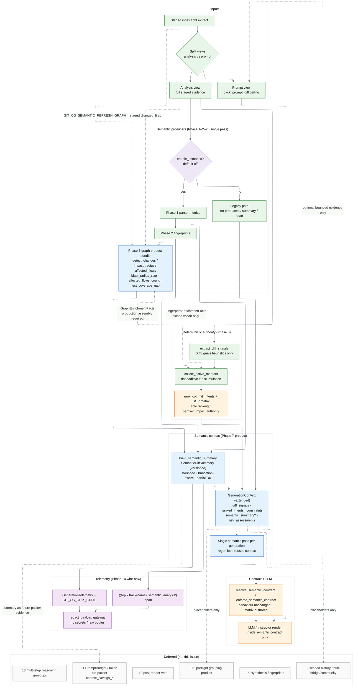
```mermaid
%%{
  init: {
    'theme': 'base',
    'themeVariables': {
      'primaryColor': '#f6f8fa',
      'primaryBorderColor': '#d0d7de',
      'primaryTextColor': '#24292f',
      'lineColor': '#57606a'
    },
    'flowchart': {
      'defaultRenderer': 'elk'
    },
    'state': {
      'defaultRenderer': 'elk'
    }
  }
}%%
flowchart TD
  classDef existing fill:#e8f5e9,stroke:#2e7d32,color:#111,stroke-width:1px
  classDef phase7 fill:#e3f2fd,stroke:#1565c0,color:#111,stroke-width:1px
  classDef authority fill:#fff3e0,stroke:#ef6c00,color:#111,stroke-width:2px
  classDef telemetry fill:#f3e5f5,stroke:#6a1b9a,color:#111,stroke-width:1px
  classDef deferred fill:#fafafa,stroke:#9e9e9e,color:#333,stroke-width:1px
  classDef decision fill:#ede7f6,stroke:#5e35b1,color:#111,stroke-width:1px

  %% Inputs + views
  subgraph ENTRY["Inputs"]
    direction TB
    STAGED["Staged index / diff extract"]:::existing
    SPLIT{"Split views<br/>analysis vs prompt"}:::existing
    ANALYSIS["Analysis view<br/>full staged evidence"]:::existing
    PROMPT["Prompt view<br/>pack_prompt_diff ceiling"]:::existing
    STAGED --> SPLIT --> ANALYSIS
    SPLIT --> PROMPT
  end

  %% Deterministic authority
  subgraph DET["Deterministic authority (Phase 3)"]
    direction TB
    SIG["extract_diff_signals<br/>DiffSignals heuristics only"]:::existing
    MARK["collect_active_markers<br/>flat additive if-accumulation"]:::existing
    RANK["rank_commit_intents + SOP matrix<br/>sole ranking / semver_impact authority"]:::authority
    ANALYSIS --> SIG --> MARK --> RANK
  end

  %% Semantic enable + producers
  subgraph SEM_PROD["Semantic producers (Phase 1–2–7 · single pass)"]
    direction TB
    FLAG{"enable_semantic?<br/>default off"}:::decision
    P1["Phase 1 parser metrics"]:::existing
    P2["Phase 2 fingerprints"]:::existing
    GQ["Phase 7 graph product bundle<br/>detect_changes / impact_radius / affected_flows<br/>blast_radius_size · affected_flows_count · test_coverage_gap"]:::phase7
    SKIP["Legacy path<br/>no producers / summary / span"]:::existing

    ANALYSIS --> FLAG
    FLAG -->|yes| P1 --> P2 --> GQ
    FLAG -->|no| SKIP

    STAGED -.->|GIT_CG_SEMANTIC_REFRESH_GRAPH| GQ
    ANALYSIS -.->|staged changed_files| GQ

    P2 -.->|FingerprintEnrichmentFacts<br/>closed vocab only| MARK
    GQ -.->|GraphEnrichmentFacts<br/>production assembly required| MARK
  end

  %% Summary + context
  subgraph CONTEXT["Semantic context (Phase 7 product)"]
    direction TB
    SUM["build_semantic_summary<br/>SemanticDiffSummary (versioned)<br/>bounded · truncation-aware · partial OK"]:::phase7
    CTX["GenerationContext (extended)<br/>diff_signals · ranked_intents · constraints<br/>semantic_summary? · risk_assessment?"]:::phase7
    ONCE["Single semantic pass per generation<br/>regen loop reuses context"]:::phase7

    P1 --> SUM
    P2 --> SUM
    GQ --> SUM
    SUM --> CTX --> ONCE
    SKIP --> CTX
    RANK --> CTX
  end

  %% Contract + LLM
  subgraph CONTRACT_ZONE["Contract + LLM"]
    direction TB
    CONTRACT["resolve_semantic_contract / enforce_semantic_contract<br/>behaviour unchanged · matrix-authored"]:::authority
    LLM["LLM / Instructor render<br/>inside semantic contract only"]:::authority
    ONCE --> CONTRACT --> LLM
    PROMPT --> LLM
    CTX -.->|optional bounded evidence only| PROMPT
  end

  %% Telemetry
  subgraph TELEMETRY["Telemetry (Phase 14 wire-now)"]
    direction TB
    SPAN["@opik.track(name='semantic_analysis') span"]:::telemetry
    STATE["GenerationTelemetry + GIT_CG_OPIK_STATE"]:::telemetry
    REDACT["redact_payload gateway<br/>no secrets / raw bodies"]:::telemetry
    SUM --> SPAN
    SUM --> STATE
    SPAN --> REDACT
    STATE --> REDACT
  end

  %% Deferred
  subgraph DEF["Deferred (not this issue)"]
    direction TB
    P05["0.5 preflight grouping product"]:::deferred
    P9["9 scoped history / hub-bridge/community"]:::deferred
    P10["10 post-render veto"]:::deferred
    P11["11 PromptBudget / token bin-packer<br/>context_savings_*"]:::deferred
    P13["13 multi-step reasoning speedups"]:::deferred
    P15["15 Hypothesis fingerprints"]:::deferred
  end

  SUM -.->|summary as future packer evidence| P11
  CTX -.->|placeholders only| P05
  CTX -.->|placeholders only| P9
```

---

## Option 15 – “Top‑down with explicit legend at bottom”

Top‑down architecture with a small key at the end.

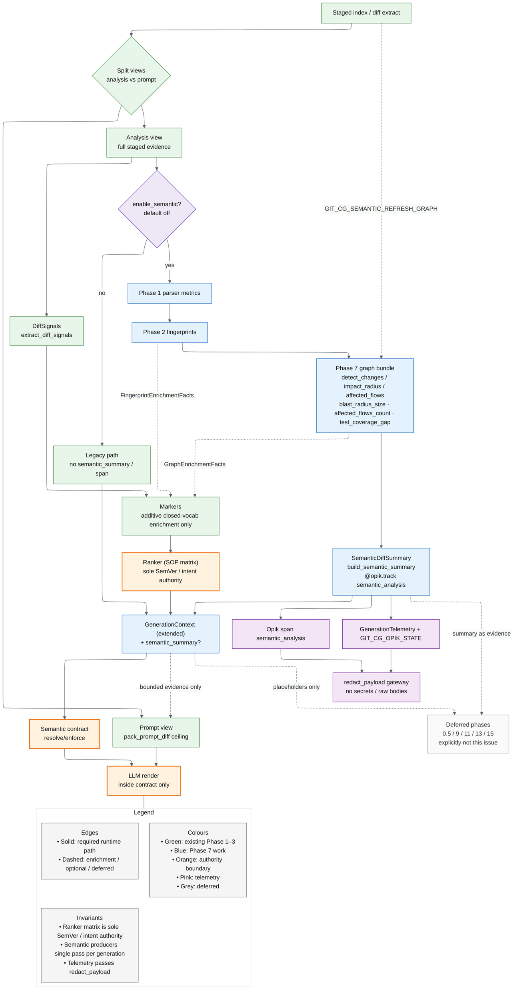
```mermaid
%%{
  init: {
    'theme': 'base',
    'themeVariables': {
      'primaryColor': '#f6f8fa',
      'primaryBorderColor': '#d0d7de',
      'primaryTextColor': '#24292f',
      'lineColor': '#57606a'
    },
    'flowchart': {
      'defaultRenderer': 'elk'
    },
    'state': {
      'defaultRenderer': 'elk'
    }
  }
}%%
flowchart TD
  classDef existing fill:#e8f5e9,stroke:#2e7d32,color:#111,stroke-width:1px
  classDef phase7 fill:#e3f2fd,stroke:#1565c0,color:#111,stroke-width:1px
  classDef authority fill:#fff3e0,stroke:#ef6c00,color:#111,stroke-width:2px
  classDef telemetry fill:#f3e5f5,stroke:#6a1b9a,color:#111,stroke-width:1px
  classDef deferred fill:#fafafa,stroke:#9e9e9e,color:#333,stroke-width:1px
  classDef decision fill:#ede7f6,stroke:#5e35b1,color:#111,stroke-width:1px
  classDef keybox fill:#f5f5f5,stroke:#616161,color:#111,stroke-width:1px

  %% Core top-down path
  STAGED["Staged index / diff extract"]:::existing
  SPLIT{"Split views<br/>analysis vs prompt"}:::existing
  ANALYSIS["Analysis view<br/>full staged evidence"]:::existing
  SIG["DiffSignals<br/>extract_diff_signals"]:::existing
  MARK["Markers<br/>additive closed-vocab enrichment only"]:::existing
  RANK["Ranker (SOP matrix)<br/>sole SemVer / intent authority"]:::authority
  CTX["GenerationContext (extended)<br/>+ semantic_summary?"]:::phase7
  CONTRACT["Semantic contract<br/>resolve/enforce"]:::authority
  LLM["LLM render<br/>inside contract only"]:::authority

  STAGED --> SPLIT --> ANALYSIS --> SIG --> MARK --> RANK --> CTX --> CONTRACT --> LLM

  PROMPT["Prompt view<br/>pack_prompt_diff ceiling"]:::existing
  SPLIT --> PROMPT
  CTX -.->|bounded evidence only| PROMPT
  PROMPT --> LLM

  %% Semantic branch
  FLAG{"enable_semantic?<br/>default off"}:::decision
  P1["Phase 1 parser metrics"]:::phase7
  P2["Phase 2 fingerprints"]:::phase7
  GQ["Phase 7 graph bundle<br/>detect_changes / impact_radius / affected_flows<br/>blast_radius_size · affected_flows_count · test_coverage_gap"]:::phase7
  SKIP["Legacy path<br/>no semantic_summary / span"]:::existing
  SUM["SemanticDiffSummary<br/>build_semantic_summary<br/>@opik.track semantic_analysis"]:::phase7

  ANALYSIS --> FLAG
  FLAG -->|yes| P1 --> P2 --> GQ --> SUM --> CTX
  FLAG -->|no| SKIP --> CTX

  STAGED -.->|GIT_CG_SEMANTIC_REFRESH_GRAPH| GQ
  P2 -.->|FingerprintEnrichmentFacts| MARK
  GQ -.->|GraphEnrichmentFacts| MARK

  %% Telemetry
  SPAN["Opik span semantic_analysis"]:::telemetry
  STATE["GenerationTelemetry + GIT_CG_OPIK_STATE"]:::telemetry
  REDACT["redact_payload gateway<br/>no secrets / raw bodies"]:::telemetry

  SUM --> SPAN
  SUM --> STATE
  SPAN --> REDACT
  STATE --> REDACT

  %% Deferred
  DEF["Deferred phases<br/>0.5 / 9 / 11 / 13 / 15<br/>explicitly not this issue"]:::deferred
  SUM -.->|summary as evidence| DEF
  CTX -.->|placeholders only| DEF

  %% Legend at bottom
  subgraph KEY["Legend"]
    direction TB
    K1["Colours<br/>• Green: existing Phase 1–3<br/>• Blue: Phase 7 work<br/>• Orange: authority boundary<br/>• Pink: telemetry<br/>• Grey: deferred"]:::keybox
    K2["Edges<br/>• Solid: required runtime path<br/>• Dashed: enrichment / optional / deferred"]:::keybox
    K3["Invariants<br/>• Ranker matrix is sole SemVer / intent authority<br/>• Semantic producers single pass per generation<br/>• Telemetry passes redact_payload"]:::keybox
  end

  LLM --- KEY
```

---

## Option 16 – “Top‑down plus ‘Existing vs New’ side labels”

Shows the existing path first, then the Phase 7 additions as a second vertical column.

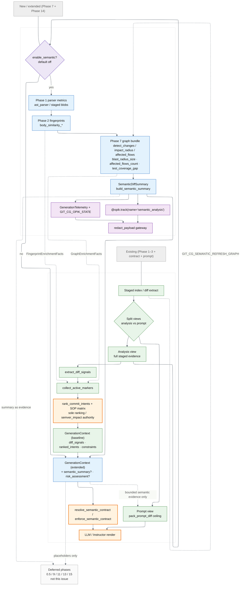
```mermaid
%%{
  init: {
    'theme': 'base',
    'themeVariables': {
      'primaryColor': '#f6f8fa',
      'primaryBorderColor': '#d0d7de',
      'primaryTextColor': '#24292f',
      'lineColor': '#57606a'
    },
    'flowchart': {
      'defaultRenderer': 'elk'
    },
    'state': {
      'defaultRenderer': 'elk'
    }
  }
}%%
flowchart TD
  classDef existing fill:#e8f5e9,stroke:#2e7d32,color:#111,stroke-width:1px
  classDef phase7 fill:#e3f2fd,stroke:#1565c0,color:#111,stroke-width:1px
  classDef authority fill:#fff3e0,stroke:#ef6c00,color:#111,stroke-width:2px
  classDef telemetry fill:#f3e5f5,stroke:#6a1b9a,color:#111,stroke-width:1px
  classDef deferred fill:#fafafa,stroke:#9e9e9e,color:#333,stroke-width:1px
  classDef decision fill:#ede7f6,stroke:#5e35b1,color:#111,stroke-width:1px
  classDef label fill:#eeeeee,stroke:#9e9e9e,color:#555,stroke-width:1px

  %% Column labels
  L_EXIST["Existing (Phase 1–3 + contract + prompt)"]:::label
  L_NEW["New / extended (Phase 7 + Phase 14)"]:::label

  %% Existing column
  subgraph COL1[" "]
    direction TB
    STAGED["Staged index / diff extract"]:::existing
    SPLIT{"Split views<br/>analysis vs prompt"}:::existing
    ANALYSIS["Analysis view<br/>full staged evidence"]:::existing
    SIG["extract_diff_signals"]:::existing
    MARK["collect_active_markers"]:::existing
    RANK["rank_commit_intents + SOP matrix<br/>sole ranking / semver_impact authority"]:::authority
    CTX_BASE["GenerationContext (baseline)<br/>diff_signals · ranked_intents · constraints"]:::existing
    CONTRACT["resolve_semantic_contract / enforce_semantic_contract"]:::authority
    LLM["LLM / Instructor render"]:::authority
    PROMPT["Prompt view<br/>pack_prompt_diff ceiling"]:::existing

    STAGED --> SPLIT --> ANALYSIS --> SIG --> MARK --> RANK --> CTX_BASE --> CTX_EXT --> CONTRACT --> LLM
    SPLIT --> PROMPT
    PROMPT --> LLM
  end

  %% New / extended column
  subgraph COL2[" "]
    direction TB
    FLAG{"enable_semantic?<br/>default off"}:::decision
    P1["Phase 1 parser metrics<br/>ast_parser / staged blobs"]:::phase7
    P2["Phase 2 fingerprints<br/>body_similarity_*"]:::phase7
    GQ["Phase 7 graph bundle<br/>detect_changes / impact_radius / affected_flows<br/>blast_radius_size · affected_flows_count · test_coverage_gap"]:::phase7
    SUM["SemanticDiffSummary<br/>build_semantic_summary"]:::phase7
    CTX_EXT["GenerationContext (extended)<br/>+ semantic_summary? · risk_assessment?"]:::phase7
    SPAN["@opik.track(name='semantic_analysis')"]:::telemetry
    STATE["GenerationTelemetry + GIT_CG_OPIK_STATE"]:::telemetry
    REDACT["redact_payload gateway"]:::telemetry

    ANALYSIS --> FLAG
    FLAG -->|yes| P1 --> P2 --> GQ --> SUM --> CTX_EXT
    FLAG -->|no| CTX_EXT

    STAGED -.->|GIT_CG_SEMANTIC_REFRESH_GRAPH| GQ
    P2 -.->|FingerprintEnrichmentFacts| MARK
    GQ -.->|GraphEnrichmentFacts| MARK

    SUM --> SPAN
    SUM --> STATE
    SPAN --> REDACT
    STATE --> REDACT

    %% Context overlay onto existing context
  end

  %% Prompt evidence overlay
  CTX_EXT -.->|bounded semantic evidence only| PROMPT

  %% Deferred block
  DEF["Deferred phases<br/>0.5 / 9 / 11 / 13 / 15<br/>not this issue"]:::deferred
  SUM -.->|summary as evidence| DEF
  CTX_EXT -.->|placeholders only| DEF

  %% Attach labels
  L_EXIST --- STAGED
  L_NEW --- FLAG
```

---

## Option 17 – Real-World GitHub Integration Capstone

This capstone example brings together Primer styling, accessibility descriptions, strict grid legends, invisible nodes, and complex layout control.

```mermaid
%%{
  init: {
    'theme': 'base',
    'themeVariables': {
      'primaryColor': '#f6f8fa',
      'primaryBorderColor': '#d0d7de',
      'primaryTextColor': '#24292f',
      'lineColor': '#57606a'
    },
    'flowchart': {
      'defaultRenderer': 'elk'
    },
    'state': {
      'defaultRenderer': 'elk'
    }
  }
}%%
flowchart TD
  accTitle: Gold-standard GitHub release notes architecture
  accDescr: git-cg release calculates SemVer, optionally preflights repo slug, injects versions, prepends CHANGELOG, assembles house-style GitHub notes, writes notes file, and optionally publishes via gh when tag exists.

  classDef existing fill:#dafbe1,stroke:#1a7f37,color:#1a7f37,stroke-width:1px
  classDef feature fill:#ddf4ff,stroke:#0969da,color:#0969da,stroke-width:1px
  classDef authority fill:#fff8c5,stroke:#9a6700,color:#9a6700,stroke-width:2px
  classDef safety fill:#ffebe9,stroke:#cf222e,color:#cf222e,stroke-width:1px
  classDef decision fill:#ddf4ff,stroke:#8250df,color:#8250df,stroke-width:1px
  classDef keybox fill:#f6f8fa,stroke:#8c959f,color:#24292f,stroke-width:1px
  classDef hidden fill:none,stroke:none,color:#fff


  CLI["git-cg release FLAGS"]:::existing
  FLAGS{"Flag validation<br/>publish ⨯ skip-notes forbidden"}:::safety
  NOTES_PATH{"notes path?"}:::decision
  SLUG["detect_repo_slug preflight<br/>explicit → remote → gh<br/>allow_default=not publish"]:::feature
  BUMP["SemVer bump + validate_release<br/>matrix trailers authority"]:::authority
  INJECT["inject_file_versions"]:::existing
  CLOG["format_changelog_markdown<br/>_prepend_changelog_version<br/>exact ## tag heading match"]:::feature
  SKIP["Changelog-only finish<br/>no slug / no notes / no publish"]:::existing

  subgraph NOTES["Notes assembly"]
    direction TB
    THEME["resolve_release_theme"]:::feature
    TITLE["format_release_title<br/>🚀 git-cg vX.Y.Z: theme"]:::feature
    BODY["build_github_release_notes<br/>boundary · invariant · highlights<br/>What's Changed · compare links"]:::feature
    WRITE["write_github_release_notes_file<br/>default .git/GIT_CG_RELEASE_NOTES_tag.md"]:::feature
    THEME --> TITLE --> BODY --> WRITE
  end

  PUB{"publish_github?"}:::decision
  TAGCHK["require_existing_release_tag"]:::safety
  GH["create_github_release via gh<br/>--prerelease default<br/>optional --target"]:::feature
  DRY["dry-run panels + dry-run gh summary<br/>no file writes / no remote create"]:::feature

  CLI --> FLAGS --> NOTES_PATH
  NOTES_PATH -->|assemble notes| SLUG --> BUMP
  NOTES_PATH -->|changelog-only skip notes| BUMP
  BUMP --> INJECT --> CLOG
  CLOG --> PRE2{"skip_github_notes?"}:::decision
  PRE2 -->|yes| SKIP
  PRE2 -->|no| NOTES
  NOTES --> PUB
  PUB -->|yes| TAGCHK --> GH
  PUB -->|no| MANUAL["Print commit/tag/gh instructions"]:::existing
  FLAGS -.->|dry-run| DRY
  NOTES -.-> DRY
  GH -.-> DRY

  subgraph KEY["Legend & Invariants"]
    direction TB

    K_EXIST["Existing process step"]:::existing
    K_FEAT["New notes/publish step"]:::feature
    K_SAFE["Safety check"]:::safety
    K_AUTH["SemVer / trailer authority"]:::authority

    subgraph ARROWS[" "]
      direction LR
      A1[" "]:::hidden -->|Standard Flow| B1[" "]:::hidden
      A2[" "]:::hidden -.->|Dry Run Flow| B2[" "]:::hidden
    end

    K_FEAT_DEC{"Path choice / Branch"}:::decision
    K_SAFE_DEC{"Safety policy gate"}:::safety
    K_INV["Invariants:<br/>• Publish is opt-in<br/>• Preflight repo slug if notes enabled<br/>• Exact changelog heading match<br/>• No silent wrong-repo publish"]:::keybox

    K_EXIST ~~~ ARROWS
    K_FEAT ~~~ K_FEAT_DEC
    K_SAFE ~~~ K_SAFE_DEC
    K_AUTH ~~~ K_INV
  end

  MANUAL ~~~ KEY
  DRY ~~~ KEY

  style KEY fill:#ffffff,stroke:#d0d7de,stroke-width:1px
  style ARROWS fill:none,stroke:none
```

---

## Option 18 – State Diagram (System Lifecycles)

Template for modeling system state machines and error recovery loops.

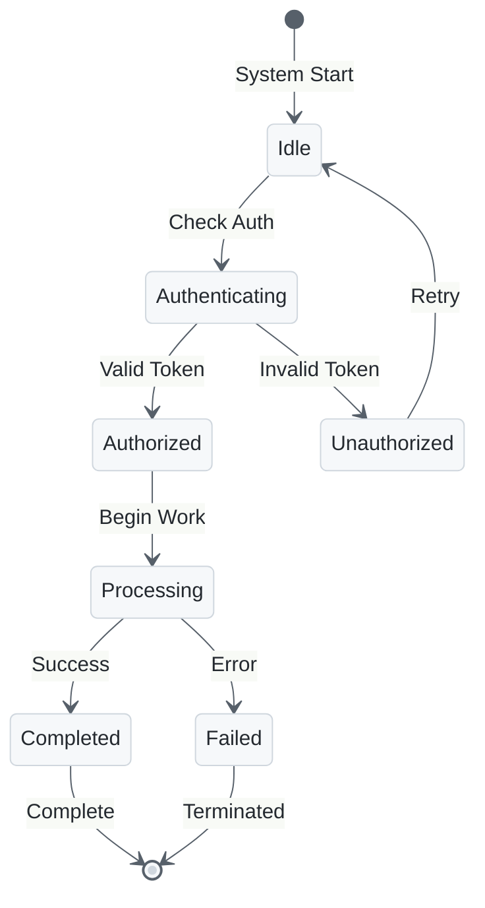
```mermaid
%%{
  init: {
    'theme': 'base',
    'themeVariables': {
      'primaryColor': '#f6f8fa',
      'primaryBorderColor': '#d0d7de',
      'primaryTextColor': '#24292f',
      'lineColor': '#57606a'
    },
    'flowchart': {
      'defaultRenderer': 'elk'
    },
    'state': {
      'defaultRenderer': 'elk'
    }
  }
}%%
stateDiagram-v2
    [*] --> Idle: System Start

    Idle --> Authenticating: Check Auth
    Authenticating --> Authorized: Valid Token
    Authenticating --> Unauthorized: Invalid Token

    Unauthorized --> Idle: Retry

    Authorized --> Processing: Begin Work
    Processing --> Completed: Success
    Processing --> Failed: Error

    Completed --> [*]: Complete
    Failed --> [*]: Terminated
```

---

## Option 19 – Requirement Diagram (System Constraints)

Template for mapping out strict system constraints, functional requirements, and test verifications.

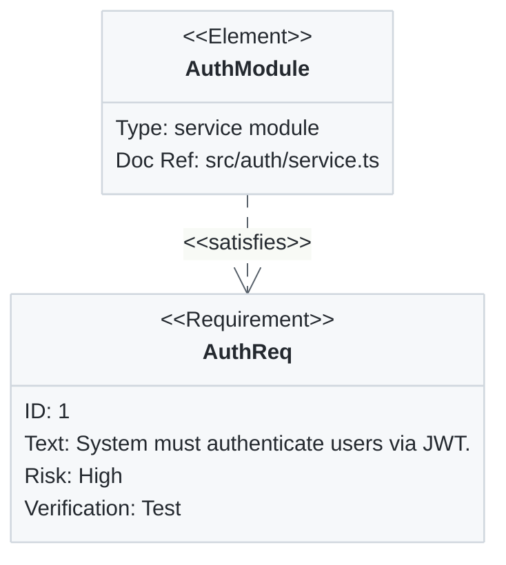
```mermaid
%%{
  init: {
    'theme': 'base',
    'themeVariables': {
      'primaryColor': '#f6f8fa',
      'primaryBorderColor': '#d0d7de',
      'primaryTextColor': '#24292f',
      'lineColor': '#57606a'
    },
    'flowchart': {
      'defaultRenderer': 'elk'
    },
    'state': {
      'defaultRenderer': 'elk'
    }
  }
}%%
requirementDiagram

    requirement AuthReq {
      id: 1
      text: "System must authenticate users via JWT."
      risk: high
      verifymethod: test
    }

    element AuthModule {
      type: "service module"
      docRef: "src/auth/service.ts"
    }

    AuthModule - satisfies -> AuthReq
```

## Option 20: PR #188 State Diagram

Design notes:

- Two composite states — RES (mode resolution, happens once) and GEN (the generation lifecycle that runs under the resolved mode). This maps 1:1 to resolve_gold_mode → \_run_commit_generation.
- Terminal states are explicit: Write (message lands) and Abort (non-zero exit) — the two only ways out, matching the fail-mode matrix.
- Findings as a nested state — the four mode-specific behaviours (suppress/print/menu/regen) are sub-states, so the diagram shows that mode only gates what happens to findings, never whether the linter runs.
- Notes carry the locked invariants (precedence order, report=False redaction) — same role the capstone's K_INV keybox plays.
- What it deliberately omits: the three-channel prompt assembly and the B1 ranker — those are flows, not states, and the PR's existing architecture mermaid already covers them.

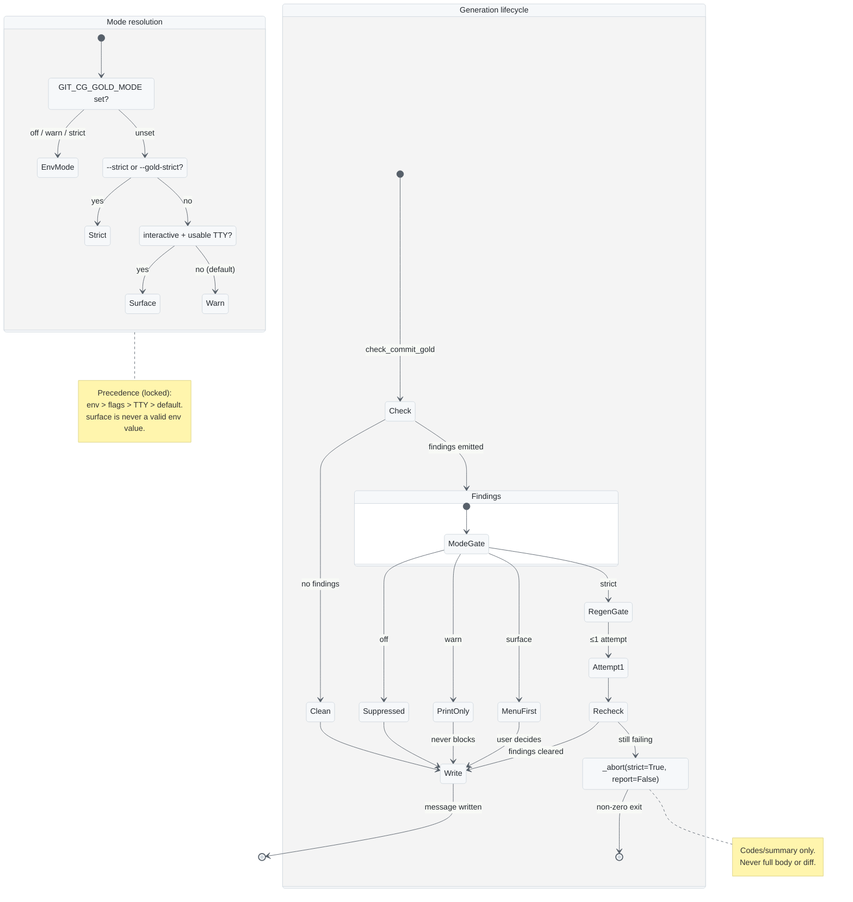
```mermaid
%%{
  init: {
    'theme': 'base',
    'themeVariables': {
      'primaryColor': '#f6f8fa',
      'primaryBorderColor': '#d0d7de',
      'primaryTextColor': '#24292f',
      'lineColor': '#57606a'
    },
    'flowchart': {
      'defaultRenderer': 'elk'
    },
    'state': {
      'defaultRenderer': 'elk'
    }
  }
}%%
stateDiagram-v2
  accTitle: PR 188 gold mode resolution and strict regen lifecycle
  accDescr: Gold mode resolves from env, flags, and TTY into one of four modes; strict mode drives a single-attempt regeneration lifecycle ending in write or abort.

  state "Mode resolution" as RES {
    [*] --> EnvCheck
    EnvCheck: GIT_CG_GOLD_MODE set?
    EnvCheck --> EnvMode: off / warn / strict
    EnvCheck --> StrictFlag: unset
    StrictFlag: --strict or --gold-strict?
    StrictFlag --> Strict: yes
    StrictFlag --> TTY: no
    TTY: interactive + usable TTY?
    TTY --> Surface: yes
    TTY --> Warn: no (default)
  }

  state "Generation lifecycle" as GEN {
    [*] --> Check: check_commit_gold
    Check --> Clean: no findings
    Check --> Findings: findings emitted

    Clean --> Write

    state Findings {
      [*] --> ModeGate
      ModeGate --> Suppressed: off
      ModeGate --> PrintOnly: warn
      ModeGate --> MenuFirst: surface
      ModeGate --> RegenGate: strict
    }

    Suppressed --> Write
    PrintOnly --> Write: never blocks
    MenuFirst --> Write: user decides
    RegenGate --> Attempt1: ≤1 attempt
    Attempt1 --> Recheck
    Recheck --> Write: findings cleared
    Recheck --> Abort: still failing

    Abort: _abort(strict=True, report=False)
    Abort --> [*]: non-zero exit
  }

  Write --> [*]: message written

  note right of RES
    Precedence (locked):
    env > flags > TTY > default.
    surface is never a valid env value.
  end note

  note right of Abort
    Codes/summary only.
    Never full body or diff.
  end note
```
