# Advanced Mermaid Diagramming on GitHub

This guide covers advanced techniques for creating Mermaid diagrams in GitHub markdown. It goes beyond the basics to explore deep integration with GitHub's **Primer Design System**, complex architectural layout strategies, and advanced formatting tricks for grids and legends.

## Quick Reference Links

For further context, libraries, and architectural guidance, refer to these canonical sources:

- **[Mermaid.ai Official Docs](https://mermaid.ai/open-source/intro/)**: The authoritative documentation for Mermaid syntax, configuration, and supported graph types.
- **[DeepWiki: Mermaid JS](https://deepwiki.com/mermaid-js/mermaid/1-overview)**: Deeply indexed, AI-friendly documentation for context and structural syntax.
- **[Craft Agents: Mermaid](https://agents.craft.do/mermaid)**: The official landing page for `beautiful-mermaid`—an open-source library designed for AI agents that renders ultra-fast, fully themeable diagrams to both SVG and ASCII.
- **[Beautiful Mermaid GitHub](https://github.com/lukilabs/beautiful-mermaid)**: The GitHub repository for the `beautiful-mermaid` rendering library.
- **[Primer Theme Gist](https://gist.github.com/Thomo1318/8c6f1dc6008afee6e707dba68ff1e7b2)**: The foundational gold-standard Gist defining the GitHub Primer CSS variables and theme integrations used in this guide.

<details>
<summary>Agent prompt for generating SVG mermaid diagram with ELK layout (beautiful-mermaid)</summary>

`````markdown
Instructions: Implementing Mermaid ELK → SVG Auto-Rendering Hook

Goal: Create a pre-commit hook that automatically converts complex ELK-layout Mermaid diagrams to external SVG files while leaving simple diagrams as raw Mermaid.

Requirements

Core Behavior:

- Only process Mermaid diagrams with layout: elk in their config
- Leave non-ELK diagrams (sequence, gantt, etc.) as raw Mermaid blocks
- Generate hash-based SVG filenames for stability (MD5 of Mermaid source)
- Store SVGs in ./diagrams/ subdirectory relative to each markdown file
- Preserve original Mermaid source in collapsible <details> blocks
- Track hash in data-diagram-hash attribute for fast comparison
- Auto-stage all changes (SVGs + markdown) to continue commit seamlessly
- Implement garbage collection to remove unused SVG files

Implementation Steps

1. Create Main Processing Script

File: .git-hooks/process-diagrams.js

Core Functions Needed:
// Get staged markdown files from git
function getStagedMarkdownFiles()

// Generate MD5 hash of diagram code
function hashDiagram(code)

// Check if diagram uses ELK layout (regex: /layout:\s\*elk/)
function usesElkLayout(code)

// Validate Mermaid syntax before rendering
function validateMermaidSyntax(code, filePath)

// Render Mermaid to SVG using beautiful-mermaid-cli (bm)
function renderMermaidToSVG(code, outputPath)

// Get diagram directory for markdown file (dirname + "/diagrams")
function getDiagramDir(mdFile)

// Ensure diagram directory exists
function ensureDiagramDir(mdFile)

// Track referenced SVGs per directory for garbage collection
function trackReferencedSvg(diagramDir, svgName)

// Process a single markdown file
function processFile(mdFile)

// Garbage collection: delete unused SVGs
function cleanupUnused()

Processing Logic:

1. Get all staged markdown files from git diff --cached --name-only --diff-filter=ACM
2. For each markdown file:


    - Create ./diagrams/ subdirectory if needed
    - Find all patterns (using regex):
      - Pattern A: Already processed with ![Diagram] + <details data-diagram-hash="...">
      - Pattern B: Raw ````mermaid` blocks (new diagrams)

3. For Pattern A (already processed):


    - Extract hash from data-diagram-hash attribute
    - Extract Mermaid code from <details> block
    - Calculate new hash from code
    - Check if ELK diagram:
        - If not ELK: convert back to raw Mermaid
      - If ELK: check if hash changed OR path wrong OR file missing
            - If needs update: validate, render SVG, update markdown
        - Track SVG reference

4. For Pattern B (raw Mermaid):


    - Skip if inside <details> block (already processed)
    - Skip if inside ````markdown` code block (examples)
    - Check if uses ELK layout:
        - If not ELK: skip (leave as raw Mermaid)
      - If ELK: validate, render SVG, replace with ![Diagram] + <details> format
      - Track SVG reference

5. Apply all replacements to file content
6. If changed: write file, stage with git add
7. Run garbage collection on each diagram directory

Regex Patterns:
// Already processed with ![Diagram]
/!\[Diagram\]\(([^)]+\/([a-f0-9]+)\.svg)\)\s*\n\s*<details data-diagram-hash="([a-f0-9]+)">\s*<summary>Original Mermaid Diagram \(for AI\)<\/summary>\s*\n\s*```mermaid\s*([\s\S]_?)```\s_\n\s\*<\/details>/gm

// Raw Mermaid blocks
/`mermaid[\w-]*\s*([\s\S]*?)`/gm

Output Format (for ELK diagrams):


  <details data-diagram-hash="abc123hash">
  <summary>Original Mermaid Diagram (for AI)</summary>

```mermaid
---
config:
  layout: elk
---
flowchart TB
    A --> B

Skip Conditions:
- Mermaid block preceded by "Original Mermaid Diagram" without closing </details>
- Mermaid block followed immediately by </details>
- Mermaid block inside markdown` or html` code blocks

Garbage Collection:
- Track all SVG references per directory in a Map
- For each diagram directory:
  - List all .svg files
  - Delete files not in reference set
  - Stage directory with git add

2. Integrate with Pre-Commit

File: .pre-commit-config.yaml

Add hook before mermaid-syntax-check:
- repo: local
  hooks:
    - id: mermaid-to-svg
      name: Render Mermaid diagrams to SVG
      entry: .git-hooks/process-diagrams.js
      language: system
      types: [markdown]
      files: \.md$
      exclude: ^(frontend/node_modules|api/venv|\.git)/
      pass_filenames: false

3. Update Markdown Link Check Config

File: .markdown-link-check.json

Add pattern to ignore SVG links:
{
  "ignorePatterns": [
    { "pattern": "^\\./diagrams/.*\\.svg$" }
  ]
}

4. Validation Integration

beautiful-mermaid validates natively during render — no separate syntax-check step:
- Write Mermaid to temp file
- Call bm "${tmpFile}" -o "${outputPath}" (validation + render in one pass)
- If bm exits non-zero or emits no SVG: skip diagram, log error
- If succeeds: proceed with markdown replacement

5. SVG Generation Command

Use npx to auto-install and run beautiful-mermaid-cli (bm):
npx -y beautiful-mermaid-cli@latest "${tmpFile}" -o "${outputPath}"

beautiful-mermaid renders ultra-fast, fully themeable SVG (and ASCII) with
built-in syntax validation — a single tool replaces mermaid-cli plus the
separate check-mermaid-syntax.py validator.

Error Handling:
- Catch rendering errors
- Skip diagram if fails
- Log clear error message
- Don't block commit for other diagrams

6. Testing Requirements

Test Cases:
1. Raw ELK diagram → should convert to SVG
2. Raw non-ELK diagram → should leave as-is
3. Already processed ELK diagram with hash match → no change
4. Already processed ELK diagram with hash mismatch → regenerate
5. Already processed with wrong path → fix path
6. Missing SVG file → regenerate
7. Mermaid in code block example → skip
8. Non-ELK changed to ELK → convert to SVG
9. ELK changed to non-ELK → convert back to raw Mermaid
10. Unused SVG files → delete

Success Criteria

- ELK diagrams automatically converted to SVG on commit
- Non-ELK diagrams unchanged (raw Mermaid)
- Hash tracking enables fast comparison
- Missing files regenerated automatically
- Unused files cleaned up
- All changes auto-staged
- Commit proceeds without manual intervention
- LLMs can edit Mermaid source in <details> blocks

Dependencies

- Node.js (for running script)
- npx (for beautiful-mermaid-cli, auto-installed)
- Git (for staging operations)

Python 3 / check-mermaid-syntax.py are no longer required — beautiful-mermaid
validates during render.

Documentation

Create guide at docs/code-quality/mermaid-to-svg-guide.md explaining:
- How the system works
- When to use ELK layout vs raw Mermaid
- How to edit diagrams (for humans and LLMs)
- Directory structure
- Troubleshooting common issues
```
`````

</details>

---

## 1. Advanced Primer Design System Integration

GitHub uses the [Primer Design System](https://primer.style/). Primer uses **semantic functional tokens** rather than hardcoded hex colors, which ensures that colors automatically adapt when a user switches between GitHub's Light and Dark modes.

When styling Mermaid diagrams on GitHub, you can use these CSS variables directly within Mermaid's configuration blocks.

### Primer Functional Color Variables

| Semantic Meaning     | Foreground (Text/Icons)    | Background                          | Border                                  | Light Mode Fallback |
| :------------------- | :------------------------- | :---------------------------------- | :-------------------------------------- | :------------------ |
| **Default/Neutral**  | `var(--fgColor-default)`   | `var(--bgColor-default)`            | `var(--borderColor-default)`            | `#24292f`           |
| **Muted/Subtle**     | `var(--fgColor-muted)`     | `var(--bgColor-muted)`              | `var(--borderColor-muted)`              | `#57606a`           |
| **Accent (Blue)**    | `var(--fgColor-accent)`    | `var(--bgColor-accent-emphasis)`    | `var(--borderColor-accent-emphasis)`    | `#0969da`           |
| **Success (Green)**  | `var(--fgColor-success)`   | `var(--bgColor-success-emphasis)`   | `var(--borderColor-success-emphasis)`   | `#1a7f37`           |
| **Danger (Red)**     | `var(--fgColor-danger)`    | `var(--bgColor-danger-emphasis)`    | `var(--borderColor-danger-emphasis)`    | `#cf222e`           |
| **Done (Purple)**    | `var(--fgColor-done)`      | `var(--bgColor-done-emphasis)`      | `var(--borderColor-done-emphasis)`      | `#8250df`           |
| **Warning (Yellow)** | `var(--fgColor-attention)` | `var(--bgColor-attention-emphasis)` | `var(--borderColor-attention-emphasis)` | `#9a6700`           |

### Method 1: Using `themeCSS` for Native Dark-Mode Support

You can use frontmatter (`%%{init: ...}%%`) to inject raw CSS into the generated SVG. Using Primer's `var()` syntax ensures the diagram changes dynamically with the user's GitHub theme.

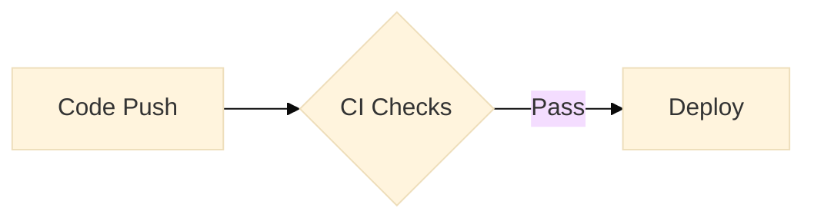

### Method 2: Fallback Hex Codes via `classDef`

If you prefer standard Mermaid syntax without CSS injection, use Primer's core hex codes. Note: these perfectly match GitHub's light mode branding.

````markdown
```mermaid
graph TD
    classDef default fill:#f6f8fa,stroke:#d0d7de,color:#24292f;
    classDef accent fill:#ddf4ff,stroke:#0969da,color:#0969da;
    classDef success fill:#dafbe1,stroke:#1a7f37,color:#1a7f37;
    classDef danger fill:#ffebe9,stroke:#cf222e,color:#cf222e;
```
````

---

## 2. Accessibility (A11y) in GitHub Mermaid

GitHub emphasizes that visual diagrams must not be the _only_ way information is presented. Within Mermaid itself, you can add screen-reader support using `accTitle` and `accDescr`.

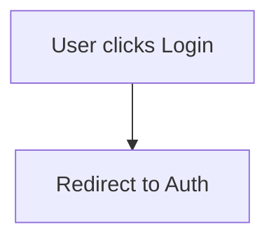

- **`accTitle`**: Provides a brief title for screen readers.
- **`accDescr`**: Provides a detailed summary of the diagram's flow.

---

## 3. Interactive Diagrams (Clickable Nodes)

You can turn nodes into hyperlinks. This is highly useful in GitHub `README.md` files or wikis for linking architectural components directly to their respective directories.

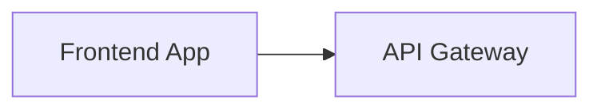

> [!NOTE]
> Mermaid `click` node hyperlinks are **not supported** in GitHub-rendered Markdown.
> Use them only in local/custom Mermaid integrations (or link from surrounding prose).
> Example (non-GitHub): `click A "https://github.com/org/repo/tree/main/frontend" "Go to Frontend Code"`.

---

## 4. Architectural Layout Strategies

When building complex software architecture diagrams, standard Top-Down (`TD`) flows can become tangled. Here are architectural layout patterns for clarity:

### 4.1 "Nested Containers" (Codespaces-style)

Uses `subgraph` boxes to show containment and boundaries.
_Best for: Showing system boundaries and data flow through discrete modules._

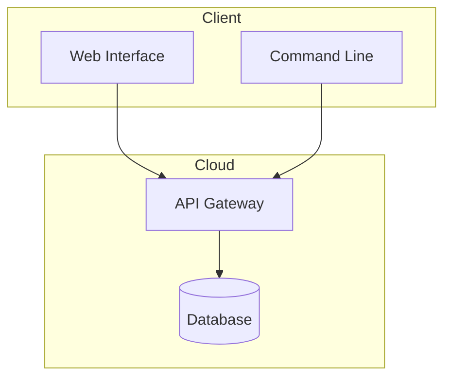

### 4.2 "The Core Bus"

Treats a central context object as the main horizontal "bus" with producers dropping data in, and consumers reading data out.
_Best for: Event-driven architectures, pipeline contexts, or Redux-style state diagrams._

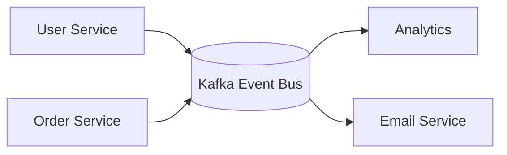

### 4.3 "Three-lane Railway" / "Swimlanes"

Emphasizes separation of concerns into vertical or horizontal lanes.
_Best for: Showing who owns what (e.g., separating Data, Control, and Telemetry tracks)._

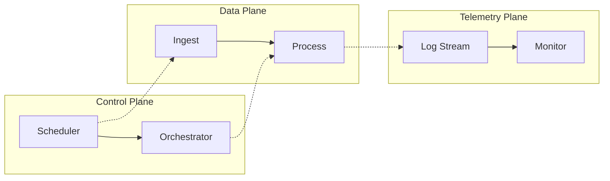

---

## 5. Advanced Layout & Grid Tricks

Mermaid's Dagre layout engine can be frustrating when building neat legends or aligning parallel tracks. Use these advanced tricks to force strict alignment.

### 5.1 Forcing a Grid Layout (Rows and Columns)

By default, placing items in a `subgraph` with `direction LR` might still result in vertical "towers" if the parent graph is `TD`. To force a strict left-to-right grid layout inside a `TD` diagram, use vertical invisible links (`~~~`) between items on different rows.

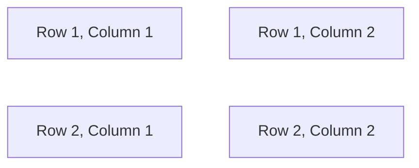

_Why this works_: Mermaid evaluates nodes that share no horizontal links on the same vertical rank. The vertical `~~~` links force them to align perfectly into columns without drawing lines.

### 5.2 Creating Standalone Flow Arrows in a Legend

If you want to display an arrow (e.g., `-->` or `-.->`) inside a legend without visible bounding boxes attached to them:

1. Define a hidden class: `classDef hidden fill:none,stroke:none,color:#fff`
2. Create an `LR` subgraph for the arrows.
3. Link invisible nodes using the arrow you want to display.

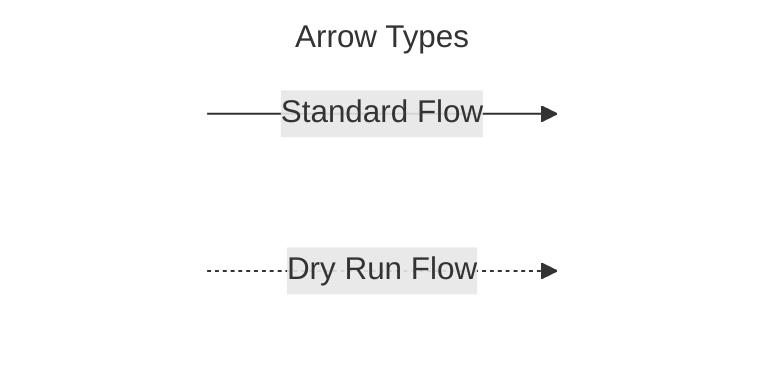

---

## 6. Advanced Diagram Types for Software Engineering

While flowcharts are common, GitHub's Mermaid implementation supports specialized charts crucial for engineering context.

### 6.1 GitGraph: Visualizing Branching Strategies

Use `gitGraph` to document your repository's branching model, release workflows, or complex merge conflict resolutions.

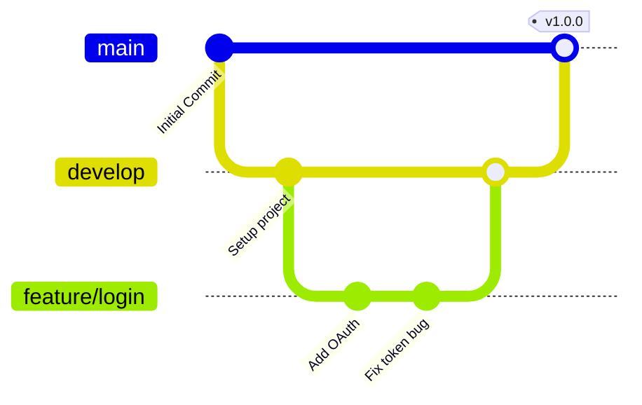

### 6.2 Sequence Diagrams: API and Microservice Interactions

Sequence diagrams are essential for documenting network requests, authentication handshakes, and microservice choreography.

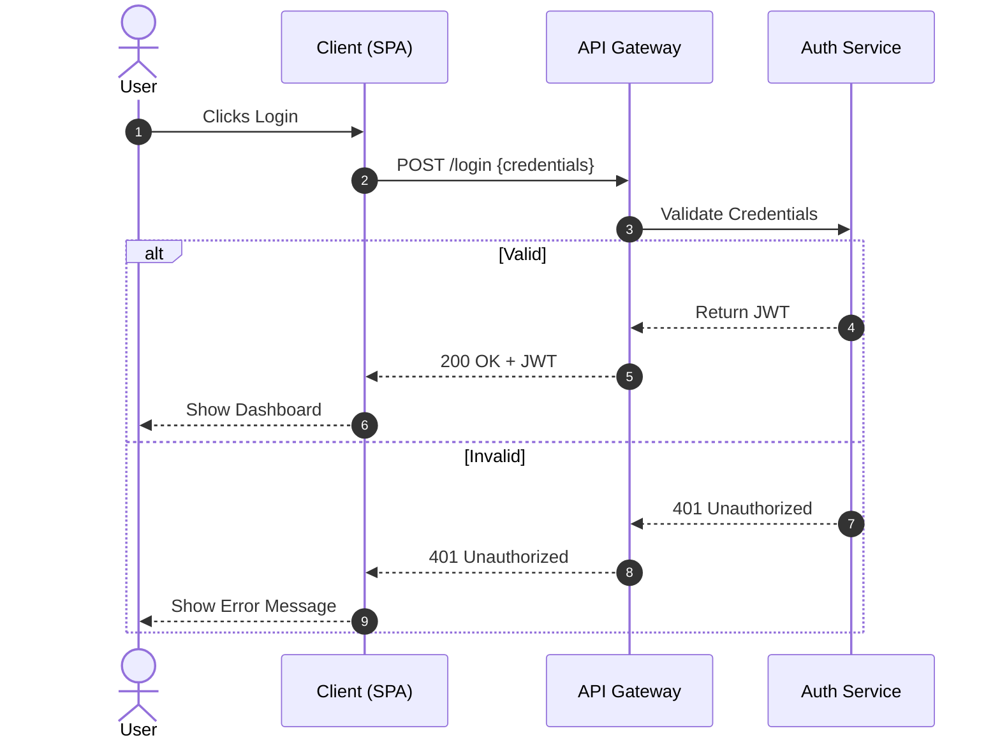

### 6.3 Entity-Relationship (ER) Diagrams: Database Schemas

Document database structures directly in your PRs or markdown wikis.

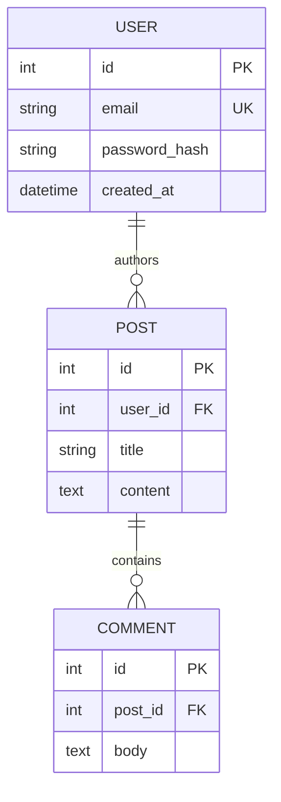

### 6.4 State Diagrams: System Lifecycles & State Machines

Perfect for modeling state machines, auth lifecycles, and error recovery loops.

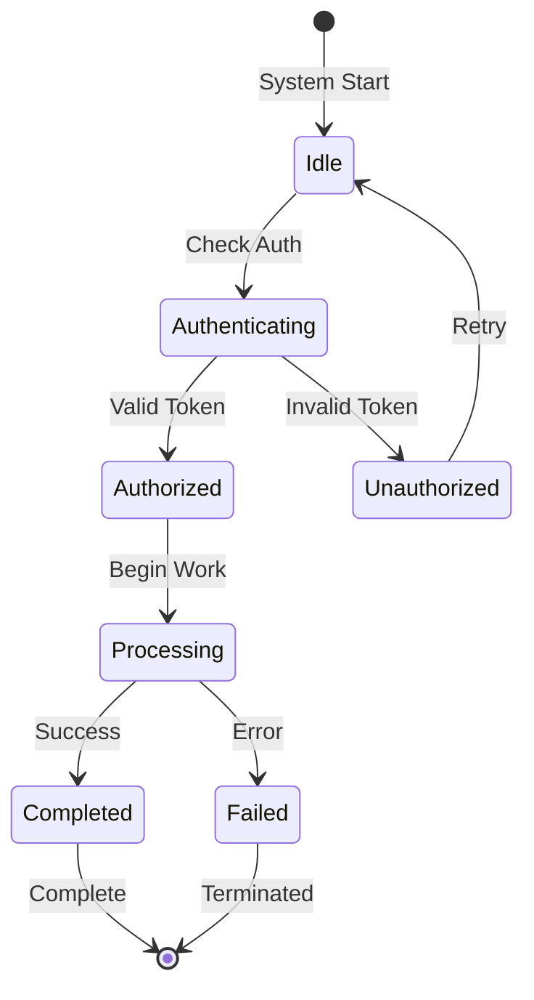

### 6.5 Requirement Diagrams: System Specifications & Testing

An often-overlooked diagram type perfect for mapping out system constraints, functional requirements, and test verifications before you write code.

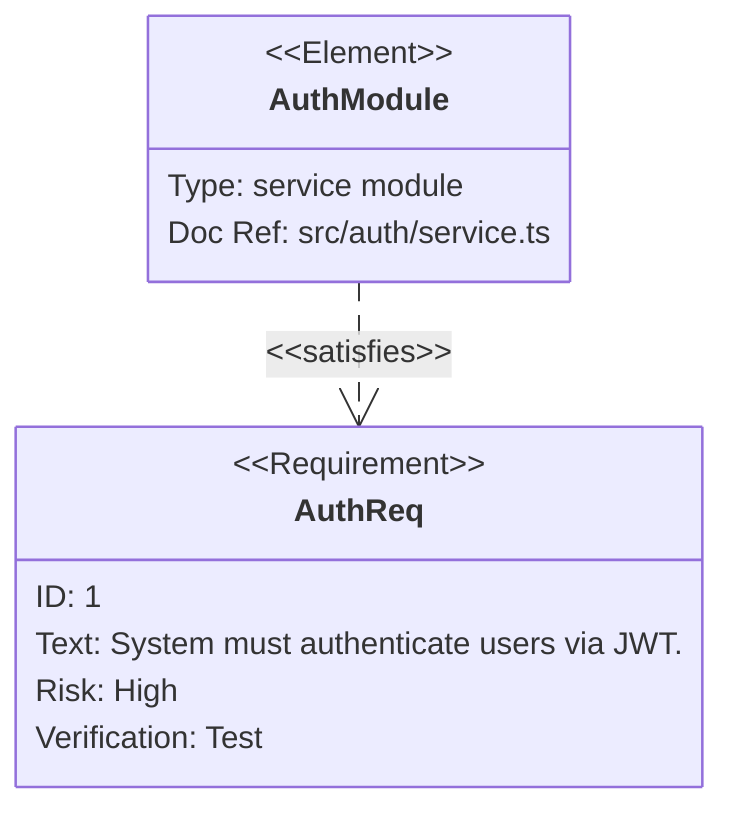

> [!WARNING]
> The `beautiful-mermaid-cli` (`bm`) tool currently rejects `requirementDiagram` headers. If you need to compress these specific diagrams, you must use the official `@mermaid-js/mermaid-cli` (`mmdc`) instead of `bm`.

---

## 7. Shape Syntax Cheatsheet

Understanding shape semantics is crucial for GitHub Docs compliance.

- **`[Rectangles]`**: Represent concrete entities, objects, or ideas.
- **`([Pill/Rounded])`**: Represent state transitions or start/end points.
- **`([\Parallelogram\])`**: Represent Input/Output operations (e.g., reading a file).
- **`((Circles))`**: Represent complex systems, databases, or unique actors.
- **`{Diamonds}`**: Represent conditional branching or decisions.
- **`[[Subroutines]]`**: Represent a pre-defined process defined elsewhere.
- **`[(Cylinders)]`**: Represent databases or data storage.

---

## 8. Advanced Rendering Engine Control

Mermaid's layout is automatically calculated by its underlying rendering engine. You cannot manually set exact (X, Y) coordinates, but you can heavily influence the output:

### 8.1 Change the Rendering Engine (Elk) — local/custom only

By default, Mermaid uses the `dagre` layout engine. You can switch to the **`elk`** renderer, which is often much better at untangling crossing lines and routing complex graphs neatly.

> [!IMPORTANT]
> **`flowchart.defaultRenderer: "elk"` is not supported by GitHub’s Mermaid renderer.**
> Use ELK only in local previews, docs sites, or other custom Mermaid integrations.
> On GitHub-rendered Markdown, keep the default `dagre` engine (or omit `defaultRenderer`).

For **local/custom** Mermaid integrations, add this to the very top of your diagram:

````markdown
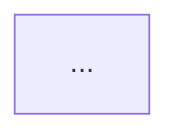
````

> [!WARNING]
> **Do not stack multiple `%%{init}%%` blocks.** If you are already using an `init` block for the Primer theme variables (from Section 1), Mermaid will ignore one of them. You must merge all configurations into a single JSON-like object:
>
> ````markdown
> ```mermaid
> %%{
>   init: {
>     'theme': 'base',
>     'themeVariables': {
>       'primaryColor': '#f6f8fa',
>       'primaryBorderColor': '#d0d7de'
>     },
>     'flowchart': {
>       'defaultRenderer': 'elk'
>     }
>   }
> }%%
> flowchart TD
> ```
> ````

### 8.2 Tweak the Spacing

If the layout looks too squished or too spread out, you can explicitly define the padding between nodes (`nodeSpacing`) and the distance between vertical rows (`rankSpacing`):

````markdown

````

### 8.3 Change Global or Local Flow Direction

You can mix and match `TD` (Top-Down) and `LR` (Left-Right) by using **subgraphs with different directions**. For example, a `TD` graph can have a horizontal bus inside it:

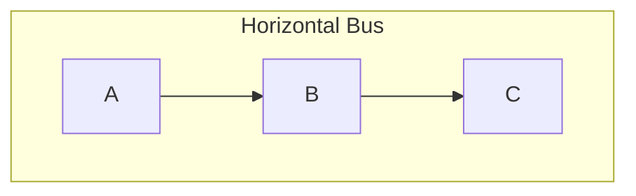

_(Note: Forcing grid alignments with invisible links `~~~` is covered in the Advanced Layout & Grid Tricks section.)_

## 9. Real-World Integration Capstone: git-cg Architecture

This capstone example brings together Primer styling, accessibility descriptions, strict grid legends, invisible nodes, and complex layout control.

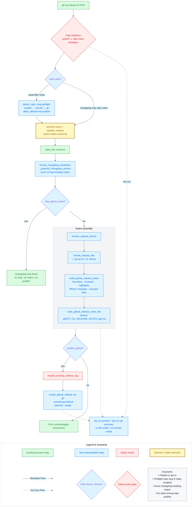

### Key Takeaways for High-Quality GitHub Diagrams

1. **Prefer `themeCSS` with Primer CSS Variables (`var(--fgColor-success)`)** if you want perfect dual-mode (Light/Dark) compatibility.
2. **Use `accTitle` and `accDescr`** on complex diagrams that are copied from library templates already carrying them (or add both when authoring new multi-subgraph charts).
3. **Use Subgraphs** to group related architecture (e.g., placing all frontend nodes in a `subgraph Frontend` block).
4. **Link out:** Connect your architectural boxes to the actual code folders using the `click` command.

---

## 10. Local Rendering & Compression Workflow

While GitHub renders Mermaid code blocks automatically, you often need to generate standalone SVG or PNG images for use in presentations, emails, or static sites.

You can render diagrams beautifully via the command line using [beautiful-mermaid-cli](https://www.npmjs.com/package/beautiful-mermaid-cli) (or its base library [beautiful-mermaid](https://www.npmjs.com/package/beautiful-mermaid)).

### Rendering with `bm`

Generate a high-quality image from your local `.mmd` or `.md` file:

```bash
# Renders diagram.mmd to a PNG image
bm diagram.mmd -o out.png
```

### Companion Tool: Zipic

`bm` produces pristine SVG / PNG files. To compress them losslessly before shipping or embedding, pair it with **Zipic**.

[Zipic](https://zipic.app/) — Smart image compression for macOS, with native SVG / PNG / WebP / AVIF / HEIC support.

- 🔄 **Perfect Pairing:** `bm diagram.mmd -o out.png` → drop into Zipic → typically 5–10× smaller at the same visual quality.
- ✨ **Bonus:** One-step format conversion (SVG → optimized PNG / WebP) for diagrams you want to embed in Markdown / web.
- 🎯 **Workflow:** `bm` renders beautiful diagrams → Zipic ships them lean.

---

## 11. The Mermaid Reference Library

For a comprehensive collection of architectural diagram examples, variations, and historical iterations, please refer to the **[Mermaid Library](./mermaidLibrary.md)**.

The library contains:

- 19 distinct architectural options and flow layouts (including the evolution of the `git-cg` architecture).
- Layout and routing examples that can be adapted for `elk` or `dagre` renderers.
- Strict grid column and orthogonal routing demonstrations.
- Accessible (`accTitle` / `accDescr`) examples for various chart styles.

Use the Library as a copy-paste template source when scaffolding new diagrams!
