# TUI Storyboarding and Design Guide with Mermaid

This guide explains how to effectively use Mermaid diagrams to map out Terminal User Interface (TUI) designs. It covers how to model screen navigation flows, visualize state machines, and create storyboard representations of your terminal applications.

## 1. Choosing the Right Diagram Type

When designing a TUI, you generally have two distinct goals depending on the phase of design:

1.  **Storyboarding / Visual Conception**: You want to show what the screens look like and visually communicate the user journey.
2.  **Navigation Logic**: You want to define the strict state machine of how the application functions, responds to inputs, and manages state.

### Recommended Approaches

- **`flowchart` (LR or TD)**: Best for storyboard-style visual conceptions. Nodes can be styled to look like physical menu panels.
- **`stateDiagram-v2`**: Best for modeling actual TUI navigation logic. Each menu is a state, user input is a transition, and "back" returns to the previous state.
- **Avoid Class Diagrams**: While a class diagram can technically look like a menu (with properties acting as list items), it is semantically incorrect. Class diagrams represent static object structures, not screen-to-screen navigation.

---

## 2. Storyboard-Style Flowcharts (Visual Conception)

Use a `flowchart` when you want a visual conception of the experience. This is ideal for design reviews.

### Basic Storyboard Flowchart

### Standard Layout

#### Standard Layout

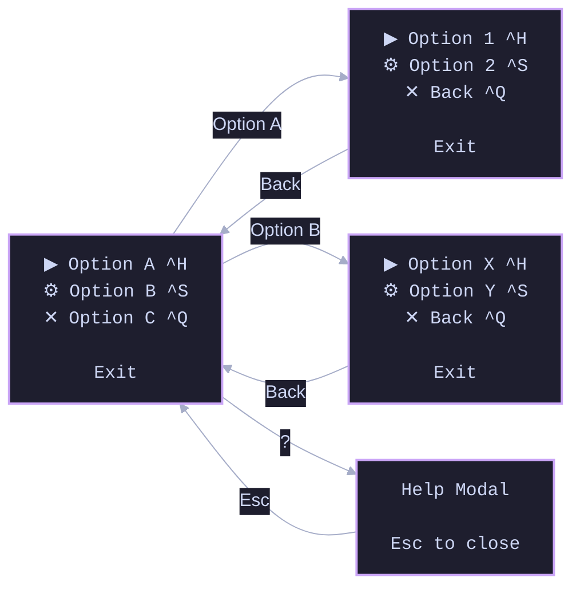

### ELK Layout

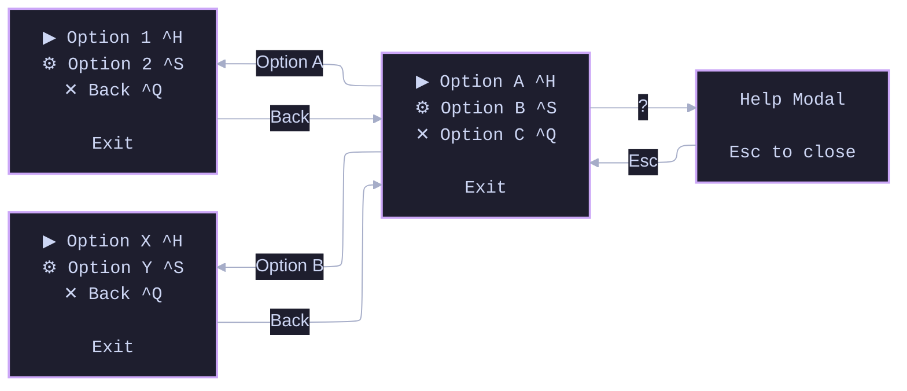

> **Note:** Mermaid is excellent for structure, but it is not perfect for pixel-level layout. If you need exact character-by-character composition of a terminal screen, consider a dedicated wireframing tool in conjunction with Mermaid.

---

## 3. TUI Navigation Logic (State Diagrams)

Use `stateDiagram-v2` for the authoritative interaction model and navigation logic. This explicitly models your TUI as a state machine.

### Standard Layout

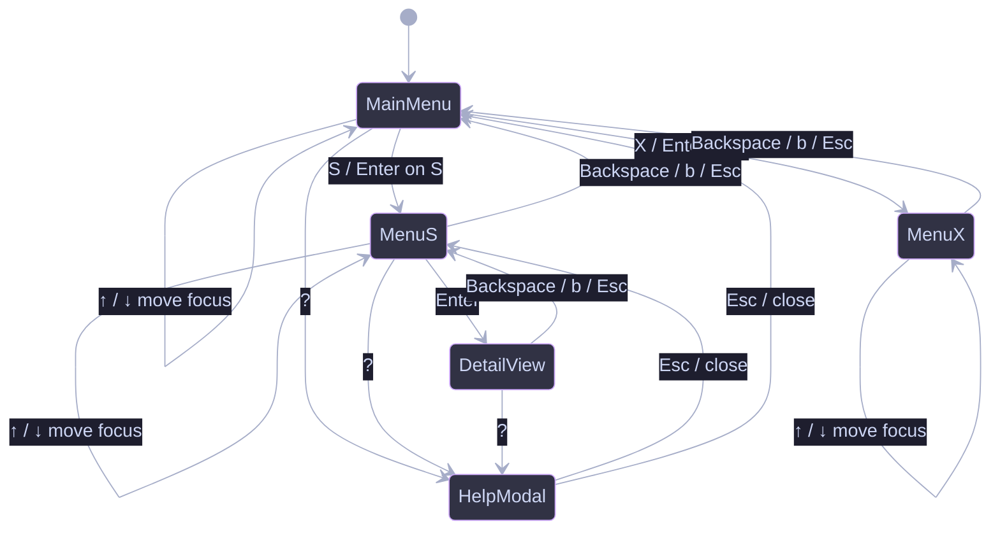

### ELK Layout


---

## 4. Reusable Templates & Best Practices

### Standardized Keyboard Shortcuts

When labeling transitions, establish a standard legend so the diagrams remain consistent:

- `↑ / ↓` = move focus
- `Enter` = activate selected item
- `Backspace / b / Esc` = go back to previous menu
- `?` = open help modal
- `Esc` = close modal

### Reusable State Diagram Template

Use this base template and rename the placeholders (`MENU_HOME`, `MENU_A`, `MODAL_HELP`) to match your actual screens. Copy the pattern to add more submenus.

### Standard Layout

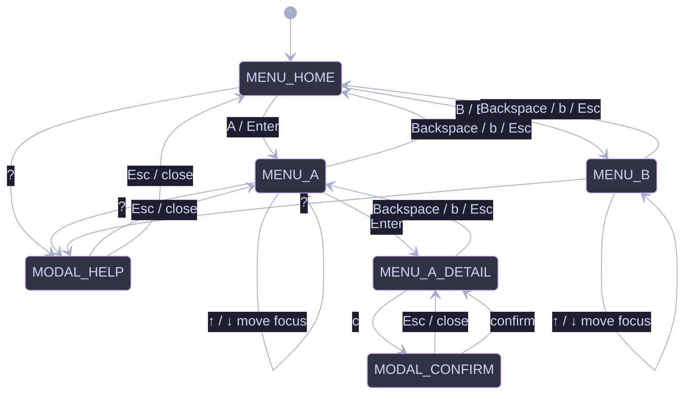

### ELK Layout


### Matching Flowchart Template

If you prefer the storyboard version, here is the exact equivalent using `flowchart TD`:

### Standard Layout

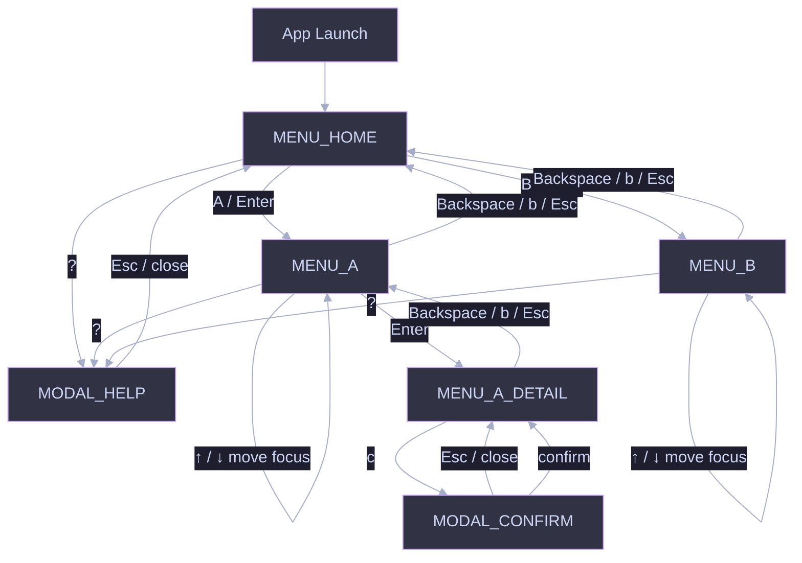

### ELK Layout

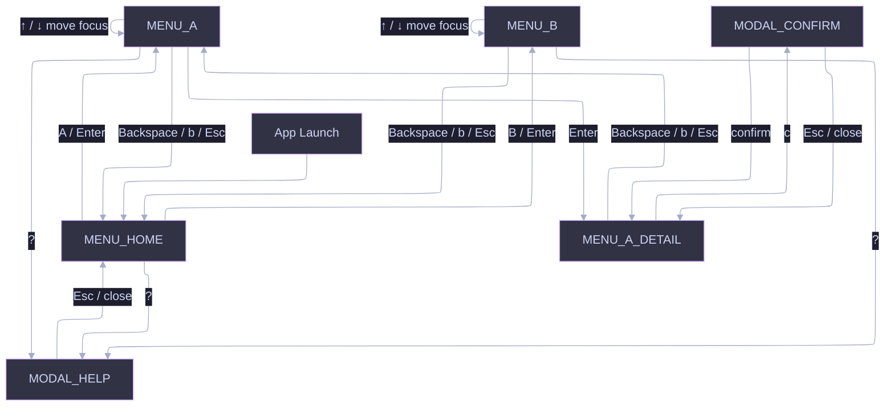

## 5. Real-World Example: Commit Generator Menus

Often you will start with standard text menus in a terminal. Below is a full arbitration flow for a commit generator, starting from a low-confidence menu and branching into various locked states.

### The Text Menus

#### Root (for context)

```text
Low confidence — pick primary intent
────────────────────────────────────
Top score margin is only +6.2 (threshold 12.0). Confirm the primary
contract before generation.

  A  ✨ feat(core) — feature_addition          84.0  (+6.2)
  B  🥅 fix(core) — error_handling           77.8

Markers (shared): adds_public_api, error_handling_added, tests_updated
SemVer if A: MINOR · if B: PATCH

▸ Use A: ✨ feat(core) — feature_addition     score 84.0  (+6.2)
  Use B: 🥅 fix(core) — error_handling      score 77.8
  See more candidates…
  Add regeneration guidance…
  Specify from matrix…
  Cancel
```

#### 1. Use A

**On select — confirm (optional but good):**

```text
Lock primary intent — Option A
────────────────────────────────────
Contract to lock (wording generated after this):

  ✨ feat(core): <subject — model fills>
  intent_id:     feature_addition
  score:         84.0  (margin +6.2 over B)
  SemVer-Impact: MINOR
  Changelog:     Added

Why A ranked first:
  • new_user_facing_capability / adds_public_api
  • product_src surface dominant
  • error_handling markers present but negative-weighted for this row

Runner-up you are not choosing:
  🥅 fix(core) — error_handling  77.8

▸ Lock A and generate message
  ← Back
```

**After lock (status line into generation):**

```text
Primary locked: feature_addition (user confirmed A)
Generating commit message…
```

#### 2. Use B

```text
Lock primary intent — Option B
────────────────────────────────────
Contract to lock (wording generated after this):

  🥅 fix(core): <subject — model fills>
  intent_id:     error_handling
  score:         77.8  (−6.2 under A)
  SemVer-Impact: PATCH
  Changelog:     Fixed

Why B is competitive:
  • error_handling_added / try_except_wiring
  • fix-shaped diff hunks in core paths

You are overriding the top rank (A: feature_addition 84.0).

▸ Lock B and generate message
  ← Back
```

```text
Primary locked: error_handling (user overrode top rank → B)
Generating commit message…
```

#### 3. See more candidates…

```text
Top candidates (5) — this diff only
────────────────────────────────────
Ranked intents for the current staged diff. Pick one to lock, or go back.

▸ 1. ✨ feat(core) — feature_addition           84.0  ← current A
  2. 🥅 fix(core) — error_handling            77.8  ← current B
  3. ♻️ refactor(core) — internal_restructure  71.2
  4. ✅ test(core) — tests_update               64.0
  5. 📝 docs(core) — docs_update                41.5
  ← Back
```

**If user picks e.g. 3:**

```text
Lock primary intent — candidate #3
────────────────────────────────────
  ♻️ refactor(core): <subject — model fills>
  intent_id:     internal_restructure
  score:         71.2
  SemVer-Impact: PATCH
  Changelog:     Changed

This is not A/B; you selected a lower-ranked matrix row for this diff.

▸ Lock #3 and generate message
  ← Back to candidates
```

**← Back** returns to the root low-confidence menu.

#### 4. Add regeneration guidance…

```text
Add regeneration guidance
────────────────────────────────────
Optional notes for the next generation pass. Does not lock intent by itself.
Primary stays A (feature_addition) unless you go back and pick another path.

Examples:
  • Prefer feat; body should stress API surface not try/except
  • Treat this as a fix; de-emphasize feature wording
  • Split tests out; primary is product only

Guidance:
▸ [ gum input / write ]
  (empty to clear)

▸ Save guidance and return
  Save guidance and regenerate ranking
  ← Back without saving
```

**After “Save guidance and return”:**

```text
Low confidence — pick primary intent
────────────────────────────────────
…same A/B block…

Regeneration guidance: Prefer feat; stress API surface not try/except

▸ Use A: …
  …
```

**After “Save guidance and regenerate ranking”:**

```text
Guidance saved. Re-running deterministic rank with guidance hints…
(Then either new Low menu or auto-continue if margin becomes High/Medium.)
```

#### 5. Specify from matrix…

```text
Specify primary from SOP matrix
────────────────────────────────────
Choose how to find a legal intent. Free-typed types are not allowed;
every selection is a matrix row.

▸ Fuzzy search matrix…
  Browse all intents (with explanations)…
  ← Back
```

**5a. Fuzzy search matrix…**

```text
Fuzzy search — SOP matrix
────────────────────────────────────
Filter by type, intent id, emoji, or description.
Enter selects a row; Esc / empty cancel returns.

Filter: feat_
────────────────────────────────────
▸ ✨ feat — feature_addition
    Net-new user-facing capability or API surface. SemVer: MINOR · Added
  ✨ feat — feature_flag
    Introduce or wire a feature flag. SemVer: MINOR · Added
  ✨ feat — ui_feature
    User-visible UI behaviour. SemVer: MINOR · Added
  ← Back
```

**On row select:**

```text
Lock primary intent — matrix selection
────────────────────────────────────
  ✨ feat(core): <subject — model fills>
  intent_id:     feature_addition
  source:        matrix fuzzy search (not ranker top)
  SemVer-Impact: MINOR
  Changelog:     Added

Ranker top was: feature_addition 84.0 (same row)   # or “differs from A” if override

▸ Lock and generate message
  ← Back to search
```

**5b. Browse all intents (with explanations)…**

```text
Browse SOP matrix
────────────────────────────────────
Scroll and select. Each row is a legal primary contract.

▸ ✨ feat — feature_addition
    Net-new product capability or public API. Use when the diff’s main
    outcome is something users/callers can take dependency on.
    SemVer: MINOR · Changelog: Added

  🥅 fix — error_handling
    Correct handling of errors/failures without a new capability.
    SemVer: PATCH · Changelog: Fixed

  ♻️ refactor — internal_restructure
    Internal structure change; behaviour should stay equivalent.
    SemVer: PATCH · Changelog: Changed

  ✅ test — tests_update
    Tests only or test-dominant coverage of existing behaviour.
    SemVer: NONE · Changelog: Miscellaneous

  … (full matrix) …

  ← Back
```

#### 6. Cancel

```text
Cancel intent arbitration?
────────────────────────────────────
No contract lock from this menu.

▸ Continue with top rank (A) non-interactively
  Abort commit message generation
  ← Back
```

**Continue with A:**

```text
Arbitration cancelled — using top rank feature_addition (84.0).
Generating commit message…
```

**Abort:**

```text
Commit message generation aborted (user cancelled low-confidence arbitration).
```

### Action Summary

| Item                           | Immediate UI                        | Outcome                                       |
| ------------------------------ | ----------------------------------- | --------------------------------------------- |
| **Use A**                      | Confirm lock card for top rank      | Lock A → generate                             |
| **Use B**                      | Confirm lock card + override notice | Lock B → generate                             |
| **See more candidates…**       | Top-5 list + Back                   | Pick 1–5 → confirm → generate, or Back        |
| **Add regeneration guidance…** | Text input + save/regen/back        | Guidance set; optional re-rank; no lock alone |
| **Specify from matrix…**       | Fuzzy **or** browse catalogue       | Matrix row only → confirm → generate          |
| **Cancel**                     | Continue A / Abort / Back           | No new lock, or hard stop                     |

---

### Step 1: Exact UI Storyboarding (Text as Nodes)

Convert the text menus into a Mermaid storyboard. Use:

- **`panel`** — full TUI chrome (menus / confirms)
- **`status`** — transient system lines (re-rank, generating)
- **`terminal`** — hard stop (abort)
- **Solid edges** — forward / select
- **Dotted edges** (`-.->`) — Back (one level only)

**Structural rules (do not regress):**

1. **One `GENERATING` sink** for every successful lock (A, B, top-5, matrix, cancel→continue A).
2. **No `GUIDANCE_SAVED` screen** — “Save & return” edges to `MAIN` (optional status strip on root).
3. **`REGEN` has two exits** — still Low → `MAIN`; High/Medium → `GENERATING`.
4. **Matrix confirm Back → `SPECIFY` hub** (not only “search”).
5. **Lanes (subgraphs)** organise LR layout: Root → Chooser → Submenu → Confirm → Terminal.
6. **ELK layout:** fully supported for authoring and for **Zensical** docs. GitHub’s issue/PR Mermaid renderer **does not apply ELK** (inline `defaultRenderer: 'elk'` is ignored). For ELK diagrams on GitHub, pre-render to **SVG** (preferred) with `bm` / beautiful-mermaid or mermaid-cli and embed the image; keep the `.mmd` source next to it. Non-ELK inline mermaid remains fine on GitHub for simple flows.

> **Legend:** solid = forward · dotted = Back · purple stroke = screen · blue stroke = status · pink stroke = abort

#### Detailed variant (full panel chrome)

Use this when reviewing **copy and layout** of each screen.

```mermaid
%%{
  init: {
    'theme': 'base',
    'themeVariables': {
      'primaryColor': '#313244',
      'primaryBorderColor': '#cba6f7',
      'primaryTextColor': '#cdd6f4',
      'lineColor': '#a6adc8',
      'clusterBkg': '#181825',
      'clusterBorder': '#585b70',
      'edgeLabelBackground': '#1e1e2e',
      'secondaryColor': '#45475a',
      'tertiaryColor': '#1e1e2e'
    }
  }
}%%
flowchart LR
  accTitle: Low-confidence intent arbitration TUI — detailed storyboard
  accDescr: Full panel chrome for each screen. Lanes organise root, choosers, submenus, matrix confirm, and terminals. One GENERATING sink. Back is one level.

  classDef panel fill:#313244,stroke:#cba6f7,stroke-width:2px,color:#cdd6f4,font-family:monospace,text-align:left,rx:6,ry:6;
  classDef status fill:#45475a,stroke:#89b4fa,stroke-width:2px,color:#cdd6f4,font-family:monospace,text-align:left,rx:12,ry:12;
  classDef terminal fill:#45475a,stroke:#f38ba8,stroke-width:2px,color:#cdd6f4,font-family:monospace,text-align:left,rx:12,ry:12;

  subgraph L1["1 · Root"]
    direction TB
    MAIN["Low confidence — pick primary intent<br/>────────────────────────────────────<br/>Top score margin is only +6.2 (threshold 12.0). Confirm the primary<br/>contract before generation.<br/><br/>  A  ✨ feat(core) — feature_addition          84.0  (+6.2)<br/>  B  🥅 fix(core) — error_handling           77.8<br/><br/>Markers (shared): adds_public_api, error_handling_added, tests_updated<br/>SemVer if A: MINOR · if B: PATCH<br/><br/>Status strip (optional): guidance set…<br/><br/>▸ Use A: ✨ feat(core) — feature_addition     score 84.0  (+6.2)<br/>  Use B: 🥅 fix(core) — error_handling      score 77.8<br/>  See more candidates…<br/>  Add regeneration guidance…<br/>  Specify from matrix…<br/>  Cancel"]:::panel
  end

  subgraph L2["2 · First chooser"]
    direction TB
    LOCK_A["Lock primary intent — Option A<br/>────────────────────────────────────<br/>Contract to lock (wording generated after this):<br/><br/>  ✨ feat(core): &lt;subject — model fills&gt;<br/>  intent_id:     feature_addition<br/>  score:         84.0  (margin +6.2 over B)<br/>  SemVer-Impact: MINOR<br/>  Changelog:     Added<br/><br/>Why A ranked first:<br/>  • new_user_facing_capability / adds_public_api<br/>  • product_src surface dominant<br/>  • error_handling markers present but negative-weighted for this row<br/><br/>Runner-up you are not choosing:<br/>  🥅 fix(core) — error_handling  77.8<br/><br/>▸ Lock A and generate message<br/>  ← Back"]:::panel
    LOCK_B["Lock primary intent — Option B<br/>────────────────────────────────────<br/>Contract to lock (wording generated after this):<br/><br/>  🥅 fix(core): &lt;subject — model fills&gt;<br/>  intent_id:     error_handling<br/>  score:         77.8  (−6.2 under A)<br/>  SemVer-Impact: PATCH<br/>  Changelog:     Fixed<br/><br/>Why B is competitive:<br/>  • error_handling_added / try_except_wiring<br/>  • fix-shaped diff hunks in core paths<br/><br/>You are overriding the top rank (A: feature_addition 84.0).<br/><br/>▸ Lock B and generate message<br/>  ← Back"]:::panel
    CANDIDATES["Top candidates (5) — this diff only<br/>────────────────────────────────────<br/>Ranked intents for the current staged diff. Pick one to lock, or go back.<br/><br/>▸ 1. ✨ feat(core) — feature_addition           84.0  ← current A<br/>  2. 🥅 fix(core) — error_handling            77.8  ← current B<br/>  3. ♻️ refactor(core) — internal_restructure  71.2<br/>  4. ✅ test(core) — tests_update               64.0<br/>  5. 📝 docs(core) — docs_update                41.5<br/>  ← Back"]:::panel
    GUIDANCE["Add regeneration guidance<br/>────────────────────────────────────<br/>Optional notes for the next generation pass. Does not lock intent by itself.<br/>Primary stays A (feature_addition) unless you go back and pick another path.<br/><br/>Examples:<br/>  • Prefer feat; body should stress API surface not try/except<br/>  • Treat this as a fix; de-emphasize feature wording<br/>  • Split tests out; primary is product only<br/><br/>Guidance:<br/>▸ [ gum input / write ]<br/>  (empty to clear)<br/><br/>▸ Save guidance and return<br/>  Save guidance and regenerate ranking<br/>  ← Back without saving"]:::panel
    SPECIFY["Specify primary from SOP matrix<br/>────────────────────────────────────<br/>Choose how to find a legal intent. Free-typed types are not allowed;<br/>every selection is a matrix row.<br/><br/>▸ Fuzzy search matrix…<br/>  Browse all intents (with explanations)…<br/>  ← Back"]:::panel
    CANCEL_MENU["Cancel intent arbitration?<br/>────────────────────────────────────<br/>No contract lock from this menu.<br/><br/>▸ Continue with top rank (A) non-interactively<br/>  Abort commit message generation<br/>  ← Back"]:::panel
  end

  subgraph L3["3 · Submenus"]
    direction TB
    LOCK_N["Lock primary intent — candidate #N<br/>────────────────────────────────────<br/>  ♻️ refactor(core): &lt;subject — model fills&gt;<br/>  intent_id:     internal_restructure<br/>  score:         71.2<br/>  SemVer-Impact: PATCH<br/>  Changelog:     Changed<br/><br/>This is not A/B; you selected a lower-ranked matrix row for this diff.<br/><br/>▸ Lock #N and generate message<br/>  ← Back to candidates"]:::panel
    REGEN["Re-rank with guidance…<br/>Deterministic rank + guidance hints"]:::status
    FUZZY["Fuzzy search — SOP matrix<br/>────────────────────────────────────<br/>Filter by type, intent id, emoji, or description.<br/>Enter selects a row; Esc / empty cancel returns.<br/><br/>Filter: feat_<br/>────────────────────────────────────<br/>▸ ✨ feat — feature_addition<br/>    Net-new user-facing capability or API surface. SemVer: MINOR · Added<br/>  ✨ feat — feature_flag<br/>    Introduce or wire a feature flag. SemVer: MINOR · Added<br/>  ✨ feat — ui_feature<br/>    User-visible UI behaviour. SemVer: MINOR · Added<br/>  ← Back"]:::panel
    BROWSE["Browse SOP matrix<br/>────────────────────────────────────<br/>Scroll and select. Each row is a legal primary contract.<br/><br/>▸ ✨ feat — feature_addition<br/>    Net-new product capability or public API. Use when the diff’s main<br/>    outcome is something users/callers can take dependency on.<br/>    SemVer: MINOR · Changelog: Added<br/><br/>  🥅 fix — error_handling<br/>    Correct handling of errors/failures without a new capability.<br/>    SemVer: PATCH · Changelog: Fixed<br/><br/>  ♻️ refactor — internal_restructure<br/>    Internal structure change; behaviour should stay equivalent.<br/>    SemVer: PATCH · Changelog: Changed<br/><br/>  … (full matrix) …<br/><br/>  ← Back"]:::panel
  end

  subgraph L4["4 · Matrix confirm"]
    direction TB
    LOCK_M["Lock primary intent — matrix selection<br/>────────────────────────────────────<br/>  ✨ feat(core): &lt;subject — model fills&gt;<br/>  intent_id:     feature_addition<br/>  source:        matrix fuzzy/browse (not necessarily ranker top)<br/>  SemVer-Impact: MINOR<br/>  Changelog:     Added<br/><br/>Ranker top was: feature_addition 84.0 (same row — or differs if override)<br/><br/>▸ Lock and generate message<br/>  ← Back to specify hub"]:::panel
  end

  subgraph L5["5 · Terminal"]
    direction TB
    GENERATING["GENERATING<br/>Primary locked · LLM → gold → review"]:::status
    ABORT["ABORT<br/>Commit message generation cancelled"]:::terminal
  end

  %% Forward — root
  MAIN -->|Use A| LOCK_A
  MAIN -->|Use B| LOCK_B
  MAIN -->|See more…| CANDIDATES
  MAIN -->|Guidance…| GUIDANCE
  MAIN -->|Specify…| SPECIFY
  MAIN -->|Cancel| CANCEL_MENU

  %% A/B
  LOCK_A -->|Lock & generate| GENERATING
  LOCK_B -->|Lock & generate| GENERATING
  LOCK_A -.->|← Back| MAIN
  LOCK_B -.->|← Back| MAIN

  %% Candidates
  CANDIDATES -->|Pick 1..5| LOCK_N
  LOCK_N -->|Lock & generate| GENERATING
  CANDIDATES -.->|← Back| MAIN
  LOCK_N -.->|← Back| CANDIDATES

  %% Guidance — no GUIDANCE_SAVED node; return is MAIN
  GUIDANCE -->|Save & return| MAIN
  GUIDANCE -->|Save & re-rank| REGEN
  GUIDANCE -.->|← Back without saving| MAIN
  REGEN -->|still Low| MAIN
  REGEN -->|High or Medium| GENERATING

  %% Specify / matrix — confirm Back always to SPECIFY hub
  SPECIFY -->|Fuzzy…| FUZZY
  SPECIFY -->|Browse…| BROWSE
  SPECIFY -.->|← Back| MAIN
  FUZZY -->|Select row| LOCK_M
  BROWSE -->|Select row| LOCK_M
  FUZZY -.->|← Back| SPECIFY
  BROWSE -.->|← Back| SPECIFY
  LOCK_M -->|Lock & generate| GENERATING
  LOCK_M -.->|← Back| SPECIFY

  %% Cancel
  CANCEL_MENU -->|Continue with A| GENERATING
  CANCEL_MENU -->|Abort| ABORT
  CANCEL_MENU -.->|← Back| MAIN

```

#### Detailed variant — ELK (SVG export / Zensical)

Same graph with ELK enabled. Use for local SVG export and Zensical. On GitHub issues/PRs, embed the **SVG** — do not expect inline ELK to change layout.

```mermaid
%%{
  init: {
    'theme': 'base',
    'themeVariables': {
      'primaryColor': '#313244',
      'primaryBorderColor': '#cba6f7',
      'primaryTextColor': '#cdd6f4',
      'lineColor': '#a6adc8',
      'clusterBkg': '#181825',
      'clusterBorder': '#585b70',
      'edgeLabelBackground': '#1e1e2e',
      'secondaryColor': '#45475a',
      'tertiaryColor': '#1e1e2e'
    },
    'flowchart': {
      'defaultRenderer': 'elk'
    },
    'state': {
      'defaultRenderer': 'elk'
    }
  }
}%%
flowchart LR
  accTitle: Low-confidence intent arbitration TUI — detailed storyboard
  accDescr: Full panel chrome for each screen. Lanes organise root, choosers, submenus, matrix confirm, and terminals. One GENERATING sink. Back is one level.

  classDef panel fill:#313244,stroke:#cba6f7,stroke-width:2px,color:#cdd6f4,font-family:monospace,text-align:left,rx:6,ry:6;
  classDef status fill:#45475a,stroke:#89b4fa,stroke-width:2px,color:#cdd6f4,font-family:monospace,text-align:left,rx:12,ry:12;
  classDef terminal fill:#45475a,stroke:#f38ba8,stroke-width:2px,color:#cdd6f4,font-family:monospace,text-align:left,rx:12,ry:12;

  subgraph L1["1 · Root"]
    direction TB
    MAIN["Low confidence — pick primary intent<br/>────────────────────────────────────<br/>Top score margin is only +6.2 (threshold 12.0). Confirm the primary<br/>contract before generation.<br/><br/>  A  ✨ feat(core) — feature_addition          84.0  (+6.2)<br/>  B  🥅 fix(core) — error_handling           77.8<br/><br/>Markers (shared): adds_public_api, error_handling_added, tests_updated<br/>SemVer if A: MINOR · if B: PATCH<br/><br/>Status strip (optional): guidance set…<br/><br/>▸ Use A: ✨ feat(core) — feature_addition     score 84.0  (+6.2)<br/>  Use B: 🥅 fix(core) — error_handling      score 77.8<br/>  See more candidates…<br/>  Add regeneration guidance…<br/>  Specify from matrix…<br/>  Cancel"]:::panel
  end

  subgraph L2["2 · First chooser"]
    direction TB
    LOCK_A["Lock primary intent — Option A<br/>────────────────────────────────────<br/>Contract to lock (wording generated after this):<br/><br/>  ✨ feat(core): &lt;subject — model fills&gt;<br/>  intent_id:     feature_addition<br/>  score:         84.0  (margin +6.2 over B)<br/>  SemVer-Impact: MINOR<br/>  Changelog:     Added<br/><br/>Why A ranked first:<br/>  • new_user_facing_capability / adds_public_api<br/>  • product_src surface dominant<br/>  • error_handling markers present but negative-weighted for this row<br/><br/>Runner-up you are not choosing:<br/>  🥅 fix(core) — error_handling  77.8<br/><br/>▸ Lock A and generate message<br/>  ← Back"]:::panel
    LOCK_B["Lock primary intent — Option B<br/>────────────────────────────────────<br/>Contract to lock (wording generated after this):<br/><br/>  🥅 fix(core): &lt;subject — model fills&gt;<br/>  intent_id:     error_handling<br/>  score:         77.8  (−6.2 under A)<br/>  SemVer-Impact: PATCH<br/>  Changelog:     Fixed<br/><br/>Why B is competitive:<br/>  • error_handling_added / try_except_wiring<br/>  • fix-shaped diff hunks in core paths<br/><br/>You are overriding the top rank (A: feature_addition 84.0).<br/><br/>▸ Lock B and generate message<br/>  ← Back"]:::panel
    CANDIDATES["Top candidates (5) — this diff only<br/>────────────────────────────────────<br/>Ranked intents for the current staged diff. Pick one to lock, or go back.<br/><br/>▸ 1. ✨ feat(core) — feature_addition           84.0  ← current A<br/>  2. 🥅 fix(core) — error_handling            77.8  ← current B<br/>  3. ♻️ refactor(core) — internal_restructure  71.2<br/>  4. ✅ test(core) — tests_update               64.0<br/>  5. 📝 docs(core) — docs_update                41.5<br/>  ← Back"]:::panel
    GUIDANCE["Add regeneration guidance<br/>────────────────────────────────────<br/>Optional notes for the next generation pass. Does not lock intent by itself.<br/>Primary stays A (feature_addition) unless you go back and pick another path.<br/><br/>Examples:<br/>  • Prefer feat; body should stress API surface not try/except<br/>  • Treat this as a fix; de-emphasize feature wording<br/>  • Split tests out; primary is product only<br/><br/>Guidance:<br/>▸ [ gum input / write ]<br/>  (empty to clear)<br/><br/>▸ Save guidance and return<br/>  Save guidance and regenerate ranking<br/>  ← Back without saving"]:::panel
    SPECIFY["Specify primary from SOP matrix<br/>────────────────────────────────────<br/>Choose how to find a legal intent. Free-typed types are not allowed;<br/>every selection is a matrix row.<br/><br/>▸ Fuzzy search matrix…<br/>  Browse all intents (with explanations)…<br/>  ← Back"]:::panel
    CANCEL_MENU["Cancel intent arbitration?<br/>────────────────────────────────────<br/>No contract lock from this menu.<br/><br/>▸ Continue with top rank (A) non-interactively<br/>  Abort commit message generation<br/>  ← Back"]:::panel
  end

  subgraph L3["3 · Submenus"]
    direction TB
    LOCK_N["Lock primary intent — candidate #N<br/>────────────────────────────────────<br/>  ♻️ refactor(core): &lt;subject — model fills&gt;<br/>  intent_id:     internal_restructure<br/>  score:         71.2<br/>  SemVer-Impact: PATCH<br/>  Changelog:     Changed<br/><br/>This is not A/B; you selected a lower-ranked matrix row for this diff.<br/><br/>▸ Lock #N and generate message<br/>  ← Back to candidates"]:::panel
    REGEN["Re-rank with guidance…<br/>Deterministic rank + guidance hints"]:::status
    FUZZY["Fuzzy search — SOP matrix<br/>────────────────────────────────────<br/>Filter by type, intent id, emoji, or description.<br/>Enter selects a row; Esc / empty cancel returns.<br/><br/>Filter: feat_<br/>────────────────────────────────────<br/>▸ ✨ feat — feature_addition<br/>    Net-new user-facing capability or API surface. SemVer: MINOR · Added<br/>  ✨ feat — feature_flag<br/>    Introduce or wire a feature flag. SemVer: MINOR · Added<br/>  ✨ feat — ui_feature<br/>    User-visible UI behaviour. SemVer: MINOR · Added<br/>  ← Back"]:::panel
    BROWSE["Browse SOP matrix<br/>────────────────────────────────────<br/>Scroll and select. Each row is a legal primary contract.<br/><br/>▸ ✨ feat — feature_addition<br/>    Net-new product capability or public API. Use when the diff’s main<br/>    outcome is something users/callers can take dependency on.<br/>    SemVer: MINOR · Changelog: Added<br/><br/>  🥅 fix — error_handling<br/>    Correct handling of errors/failures without a new capability.<br/>    SemVer: PATCH · Changelog: Fixed<br/><br/>  ♻️ refactor — internal_restructure<br/>    Internal structure change; behaviour should stay equivalent.<br/>    SemVer: PATCH · Changelog: Changed<br/><br/>  … (full matrix) …<br/><br/>  ← Back"]:::panel
  end

  subgraph L4["4 · Matrix confirm"]
    direction TB
    LOCK_M["Lock primary intent — matrix selection<br/>────────────────────────────────────<br/>  ✨ feat(core): &lt;subject — model fills&gt;<br/>  intent_id:     feature_addition<br/>  source:        matrix fuzzy/browse (not necessarily ranker top)<br/>  SemVer-Impact: MINOR<br/>  Changelog:     Added<br/><br/>Ranker top was: feature_addition 84.0 (same row — or differs if override)<br/><br/>▸ Lock and generate message<br/>  ← Back to specify hub"]:::panel
  end

  subgraph L5["5 · Terminal"]
    direction TB
    GENERATING["GENERATING<br/>Primary locked · LLM → gold → review"]:::status
    ABORT["ABORT<br/>Commit message generation cancelled"]:::terminal
  end

  %% Forward — root
  MAIN -->|Use A| LOCK_A
  MAIN -->|Use B| LOCK_B
  MAIN -->|See more…| CANDIDATES
  MAIN -->|Guidance…| GUIDANCE
  MAIN -->|Specify…| SPECIFY
  MAIN -->|Cancel| CANCEL_MENU

  %% A/B
  LOCK_A -->|Lock & generate| GENERATING
  LOCK_B -->|Lock & generate| GENERATING
  LOCK_A -.->|← Back| MAIN
  LOCK_B -.->|← Back| MAIN

  %% Candidates
  CANDIDATES -->|Pick 1..5| LOCK_N
  LOCK_N -->|Lock & generate| GENERATING
  CANDIDATES -.->|← Back| MAIN
  LOCK_N -.->|← Back| CANDIDATES

  %% Guidance — no GUIDANCE_SAVED node; return is MAIN
  GUIDANCE -->|Save & return| MAIN
  GUIDANCE -->|Save & re-rank| REGEN
  GUIDANCE -.->|← Back without saving| MAIN
  REGEN -->|still Low| MAIN
  REGEN -->|High or Medium| GENERATING

  %% Specify / matrix — confirm Back always to SPECIFY hub
  SPECIFY -->|Fuzzy…| FUZZY
  SPECIFY -->|Browse…| BROWSE
  SPECIFY -.->|← Back| MAIN
  FUZZY -->|Select row| LOCK_M
  BROWSE -->|Select row| LOCK_M
  FUZZY -.->|← Back| SPECIFY
  BROWSE -.->|← Back| SPECIFY
  LOCK_M -->|Lock & generate| GENERATING
  LOCK_M -.->|← Back| SPECIFY

  %% Cancel
  CANCEL_MENU -->|Continue with A| GENERATING
  CANCEL_MENU -->|Abort| ABORT
  CANCEL_MENU -.->|← Back| MAIN

```

#### Compact variant (same edges, shorter labels)

Use this when reviewing **navigation** without reading every line of chrome.

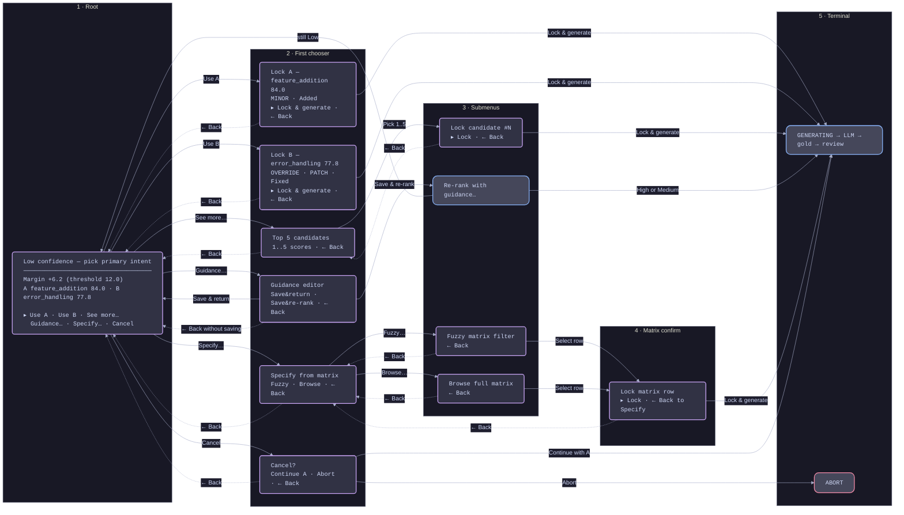

#### Compact variant — ELK (SVG export / Zensical)

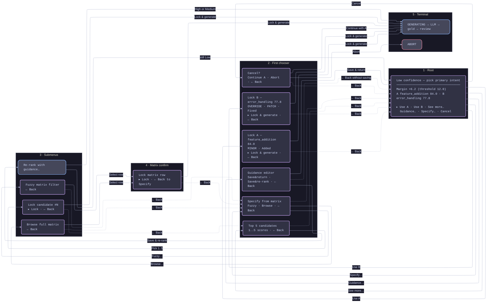

#### Embed pattern (issues / docs)

ELK is **not banned** — GitHub’s issue/PR Mermaid renderer simply **does not apply** `defaultRenderer: 'elk'`. For ELK (or any layout-sensitive diagram) on GitHub, convert Mermaid → **SVG** (preferred over PNG for scaling) and embed the image. Keep the raw `.mmd` beside it.

```markdown
### Intent arbitration (detailed storyboard)

ELK layout lives in the `.mmd` source. GitHub ignores ELK on inline mermaid,
so embed the pre-rendered SVG:


<details>
<summary>Mermaid source (ELK) — editors / Zensical / CI</summary>

…link or fence the `.mmd` with ELK init…

</details>

<details>
<summary>Compact flow (inline mermaid, no ELK — OK on GitHub)</summary>

…paste compact non-ELK mermaid for quick PR scans…

</details>
```

**Local render** (beautiful-mermaid / `bm`, or mermaid-cli):

```bash
bm docs/diagrams/ranking-confidence/tui-detailed.mmd -o docs/diagrams/ranking-confidence/tui-detailed.svg
# or: npx -y @mermaid-js/mermaid-cli -i tui-detailed.mmd -o tui-detailed.svg
```

**CI / GitHub Action (optional automation)**

A workflow can convert raw Mermaid (including ELK) to SVG on push/PR so issues and docs always embed fresh assets:

1. Glob `docs/**/*.mmd` (or only files whose source contains `elk` / `defaultRenderer`).
2. Render each to a sibling `.svg` with `bm`, mermaid-cli, or a container image that includes a browser for mermaid-cli.
3. Commit the SVG (bot PR) **or** upload as a workflow artifact; prefer committing under `docs/diagrams/` so GitHub issue markdown can link stable paths.
4. Fail the job if `.mmd` is newer than `.svg` without a regen (drift gate).

Sketch (illustrative — not a committed workflow yet):

```yaml
# .github/workflows/mermaid-svg.yml
name: Mermaid → SVG
on:
  push:
    paths: ['docs/**/*.mmd', 'docs/**/*.md']
  workflow_dispatch:
jobs:
  render:
    runs-on: ubuntu-latest
    steps:
      - uses: actions/checkout@v4
      - name: Setup Node
        uses: actions/setup-node@v4
        with:
          node-version: '22'
      - name: Render ELK/complex diagrams to SVG
        run: |
          # Prefer project-standard CLI when pinned; else:
          npx -y -p beautiful-mermaid-cli bm --help || true
          # Example loop — adjust to repo layout:
          find docs -name '*.mmd' -print0 | while IFS= read -r -d '' f; do
            out="${f%.mmd}.svg"
            npx -y @mermaid-js/mermaid-cli -i "$f" -o "$out"
          done
      - name: Open PR if SVGs changed
        uses: peter-evans/create-pull-request@v6
        with:
          title: 'docs(diagrams): regenerate Mermaid SVGs'
          commit-message: 'docs(diagrams): regenerate Mermaid SVGs'
```

Pin action/CLI versions in the real workflow; prefer the same renderer locally and in CI (`bm` if that is house standard per `docs/mermaid_guide.md`).

**Where ELK applies**

| Surface | ELK effect | What to do |
| --- | --- | --- |
| GitHub issue / PR **inline** mermaid | ELK **ignored** | Pre-render **SVG** and embed; keep `.mmd` in repo |
| GitHub issue / PR **image** embed | N/A (static SVG) | CI or local `bm` / mermaid-cli / Action |
| Zensical documentation site | ELK **allowed** | Site Mermaid config and/or SVG assets |
| Local preview | ELK **allowed** | Default for complex TUI storyboards |

---

### Step 2: Abstracting to an “Advanced Branching Flow”

Exact panel text is useful for drafting copy; it is noisy for **system logic**. Abstract into screens (purple) vs actions (blue).

**Fixes vs an over-simple branching sketch:**

- `Use A / Use B` both enter **`LOCK_CONFIRM`** (then one pipeline)
- Guidance **forks**: return to `MAIN` vs re-rank → `MAIN` | `GENERATING`
- Fuzzy and Browse share **`LOCK_CONFIRM`**; Back from confirm → **Specify**
- Cancel is **Continue with A** or **Abort**, not a vague Exit
- **Non-interactive** bypass node documents hook / no-TTY behaviour

#### Standard layout

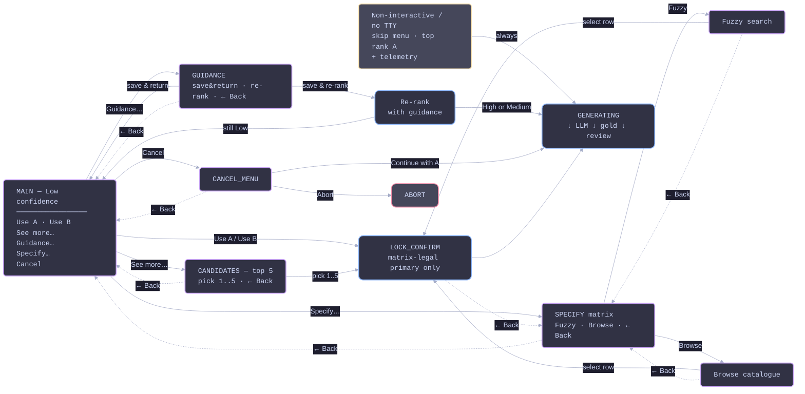

#### ELK layout (SVG export / Zensical)

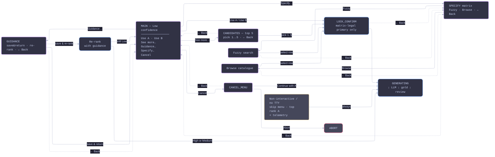

---

### Step 3: Navigation logic as a state machine

Authoritative interaction model for implementers (gum choose stack). Prefer this in the feature issue under “fail-mode / navigation invariants.”

#### Standard layout

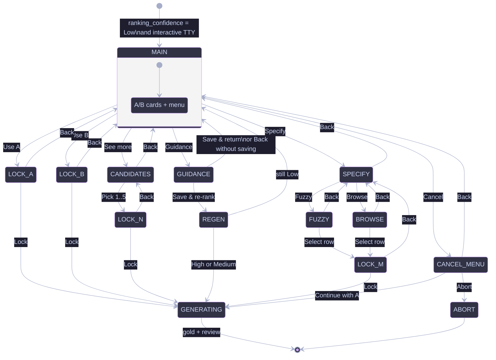

#### Notes for implementers

| Topic              | Rule                                                                                                |
| ------------------ | --------------------------------------------------------------------------------------------------- |
| Stack depth        | Every submenu has exactly one Back target (parent frame)                                            |
| Esc                | Treat as Back on nested frames; on `CANCEL_MENU` / root, define explicitly (Back vs Abort)          |
| Lock               | Only matrix-legal rows (ranked candidates are matrix rows; specify path cannot free-type `cc_type`) |
| Guidance           | Never locks intent alone                                                                            |
| Non-interactive    | No `MAIN`; top rank + telemetry; optional warn                                                      |
| After `GENERATING` | Existing gold → interactive review menu (separate state machine)                                    |

---

### Step 4: When to use which diagram

| Goal                            | Diagram                                                       |
| ------------------------------- | ------------------------------------------------------------- |
| Copy / UX review of screens | **Detailed** storyboard with **ELK** → commit **SVG** + `.mmd` |
| Navigation review in a PR/issue | **SVG embed** (ELK) and/or **compact non-ELK** inline mermaid |
| Zensical docs | **ELK** inline or SVG assets |
| CI | Optional **Mermaid → SVG** GitHub Action on `*.mmd` (incl. ELK) |
| Implementation contract | **State diagram** + fail-mode table |
| Hook / CI behaviour | Branching flow **NI** node only |

---

### Action Summary (recap)

| Item                           | Immediate UI                        | Outcome                                       |
| ------------------------------ | ----------------------------------- | --------------------------------------------- |
| **Use A**                      | Confirm lock card for top rank      | Lock A → `GENERATING`                         |
| **Use B**                      | Confirm lock card + override notice | Lock B → `GENERATING`                         |
| **See more candidates…**       | Top-5 list + Back                   | Pick 1–5 → confirm → `GENERATING`, or Back    |
| **Add regeneration guidance…** | Text input + save/regen/back        | Guidance set; optional re-rank; no lock alone |
| **Specify from matrix…**       | Fuzzy **or** browse catalogue       | Matrix row only → confirm → `GENERATING`      |
| **Cancel**                     | Continue A / Abort / Back           | Top-rank generate, hard stop, or Back         |
